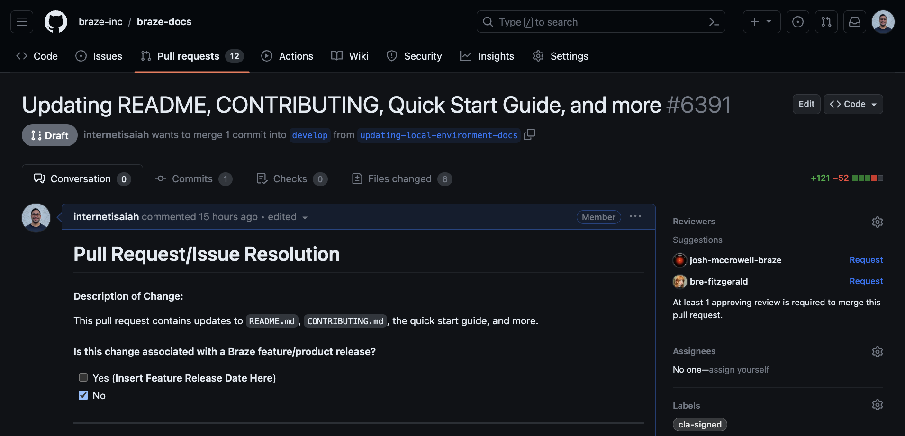
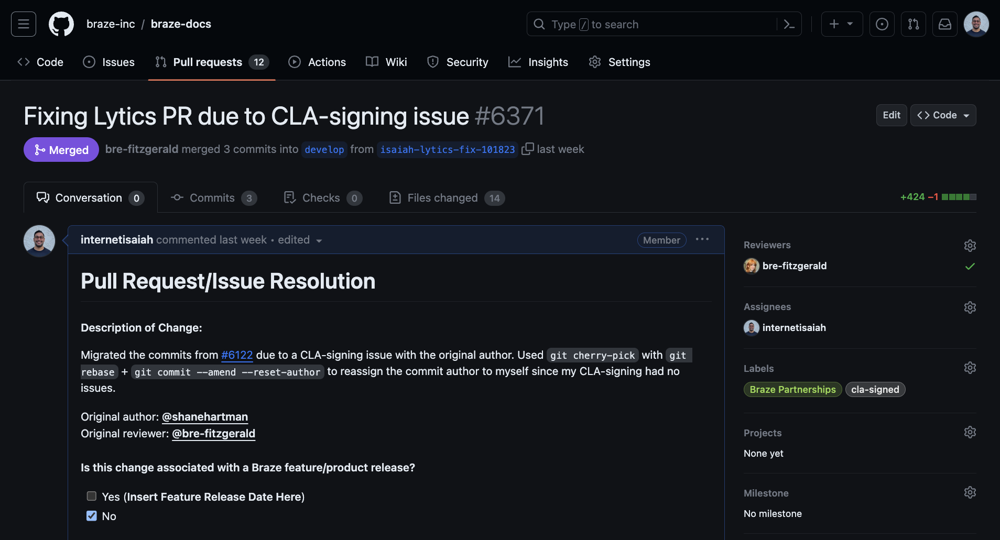

# Contributing to Braze Docs

Thanks for contributing to Braze Docs! Every Tuesday and Thursday we merge community contributions into the `main` branch and deploy them to [Braze Docs](http://www.braze.com/docs). Follow this guide to get your changes merged next!

## Before you start

You'll need to complete the following before contributing:

- [Sign the Contributors License Agreement (CLA)](https://www.braze.com/docs/cla)
- [Review the Code of Conduct](./CODE_OF_CONDUCT.md)
- [Review the Braze style guide](https://docs.google.com/document/u/2/d/e/2PACX-1vTluyDFO3ZEV7V6VvhXE4As_hSFwmnFFdU9g6_TrAYTgH1QmbRoEDDdn5GzKAB9vdBbIdyiFdoaJcNk/pub#h.m6m19guypu81)

## Making changes

For small, single-document changes, you have the option to [edit the page directly in GitHub]().


For complex or multi-document changes, you'll need to [set up your local environment](), then [push your changes from the command-line]().

```bash
$ git push origin my-changes

Enumerating objects: 4, done.
Counting objects: 100% (4/4), done.
Delta compression using up to 10 threads
Compressing objects: 100% (2/2), done.
Writing objects: 100% (3/3), 294 bytes | 294.00 KiB/s, done.
Total 3 (delta 1), reused 1 (delta 0), pack-reused 0
remote: Resolving deltas: 100% (1/1), completed with 1 local object.
remote:
remote: Create a pull request for 'my-branch' on GitHub by visiting:
remote:      https://github.com/braze-inc/braze-docs/pull/new/my-branch
remote:
To github.com:braze-inc/braze-docs.git
 * [new branch]      my-branch -> my-branch
branch 'my-branch' set up to track 'origin/my-branch'.
```

## Creating a pull request

After making your changes, you'll [create a pull request (PR)](). In your PR, you can add a PR summary, check commit history, or view your changes in a site preview.



## Submitting for review

After finalizing your pull request (PR), you'll [submit your PR for review](). Someone at Braze will review your work. If everything looks good, we'll merge your PR into the `develop` branch and your changes will be deployed to [Braze Docs](https://braze.com/docs) on the next Tuesday or Thursday.


