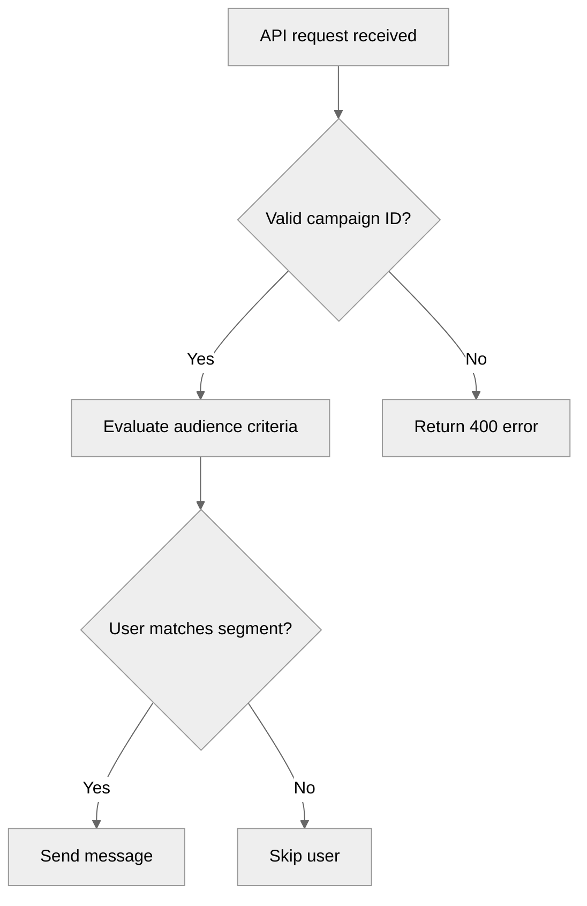

# Contributing Mermaid diagrams

> Mermaid diagrams help visualize complex workflows, system architectures, and process flows in technical documentation. This guide shows you how to create and contribute Mermaid diagrams to the Braze Docs.

## Why use Mermaid diagrams?

[Mermaid](https://mermaid.js.org/intro/) is a JavaScript-based diagramming tool that renders text-based definitions into visual diagrams. It's widely used in technical documentation for the following reasons:

- **Easy to maintain:** Diagrams are defined in plain text, making them simple to update and version control alongside your documentation.
- **Consistent styling:** Mermaid diagrams maintain a uniform look across your documentation.
- **Accessibility:** Text-based diagrams are easier to review in pull requests compared to binary image files.
- **No special tools required:** You don't need design software and can write the diagram code directly in Markdown.

## Prerequisites

Before creating Mermaid diagrams for Braze Docs, you should:

- Have a basic understanding of Markdown syntax.
- Be familiar with the [contribution workflow]({{site.baseurl}}/contributing/your_first_contribution/).
- Review the [Mermaid documentation](https://mermaid.js.org/) for syntax reference.

## Create a Mermaid diagram

### Step 1: Define your diagram type

Mermaid supports several diagram types. The most commonly used in Braze Docs include:

- **Flowcharts:** For visualizing workflows and decision trees
- **Sequence diagrams:** For showing interactions between systems
- **State diagrams:** For illustrating state transitions

For a complete list of supported diagrams, refer to [Mermaid's diagram syntax](https://mermaid.js.org/intro/syntax-reference.html).

### Step 2: Write the diagram code

Create a diagram in Markdown by wrapping your [Mermaid diagram syntax](https://mermaid.js.org/syntax/flowchart.html) in code fences (````). The following snippet displays an example of how you can use Mermaid to create a flowchart. You can reference how the flowchart renders in the **RENDERED** tab. This shows the visual representation of the Mermaid diagram syntax. 



````

````







#### Diagram components

Reference the following list for more information on the components of the Mermaid diagram in the previous section.
- **Configuration block:** Sets the theme to `neutral`
- **Diagram type:** `flowchart TD` creates a top-down flowchart
- **Nodes:** Text in brackets defines diagram elements (use `[]` for rectangles, `{}` for diamonds)
- **Connections:** Arrows (`-->`) show the flow between elements
- **Labels:** Text after `|` adds labels to connections

### Step 3: Test your diagram

Before submitting your contribution:

1. Preview your diagram locally by [setting up your local environment]({{site.baseurl}}/contributing/local_environment/).
2. Verify the diagram renders correctly.
3. Check that the styling matches existing Braze Docs diagrams.
4. Ensure all text is readable and the flow is easy to follow.

You can also test your Mermaid syntax using the [Mermaid Live Editor](https://mermaid.live/).

## Best practices

Follow the best practices in this section when creating and contributing Mermaid diagrams for Braze Docs.

### Diagram structure

Keep your diagrams organized and easy to understand:

- Keep diagrams simple and focused on a single concept or workflow.
- Use clear, concise labels for nodes and connections.
- Choose the appropriate diagram type for your use case.
- Break complex processes into multiple diagrams rather than creating one large diagram.

### Styling

Apply visual consistency throughout your diagrams:

- Use consistent node shapes for similar elements (such as rectangles for processes and diamonds for decisions).
- Apply custom styling sparingly and only when necessary for clarity.

### Accessibility

Ensure your diagrams are accessible to all users:

- Provide descriptive text before or after diagrams to explain the workflow.
- Use meaningful labels that make sense without additional context.
- Ensure color choices (if using custom styling) have sufficient contrast.

## Next steps

Now that you know how to create Mermaid diagrams, you're ready to contribute to Braze Docs! For more information on the contribution process, refer to:

- [Your first contribution]({{site.baseurl}}/contributing/your_first_contribution/)
- [Generating a preview]({{site.baseurl}}/contributing/generating_a_preview/)
- [Content management]({{site.baseurl}}/contributing/content_management/)
