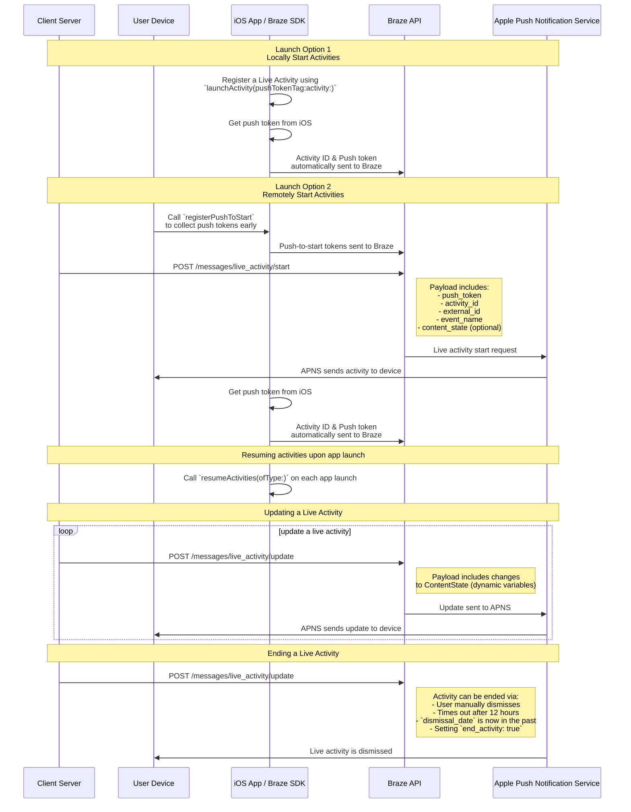

# Live Activities for Swift

> Learn how to implement Live Activities for the Swift Braze SDK. Live Activities are persistent, interactive notifications that are displayed directly on the lock screen, allowing users to get dynamic, real-time updates&#8212;without unlocking their device.

## How it works

{: style="max-width:40%;float:right;margin-left:15px;"}

Live Activities present a combination of static information and dynamic information that you update. For example, you can create a Live Activity that provides a status tracker for a delivery. This Live Activity would have your company's name as static information, as well as a dynamic "Time to delivery" that would be updated as the delivery driver approaches its destination.

As a developer, you can use Braze to manage your Live Activity lifecycles, make calls to the Braze REST API to make Live Activity updates, and have all subscribed devices receive the update as soon as possible. And, because you're managing Live Activities through Braze, you can use them in tandem with your other messaging channels&mdash;push notifications, in-app messages, Content Cards&mdash;to drive adoption.

## Sequence Diagram {#sequence-diagram}









## Implementing a Live Activity

# You'll also need to complete the following:

- Ensure that your project is targeting iOS 16.1 or later.
- Add the `Push Notification` entitlement under **Signing & Capabilities** in your Xcode project.
- Ensure `.p8` keys are used to send notifications. Older files such as a `.p12` or `.pem` are not supported.
- Starting with version 8.2.0 of the Braze Swift SDK, you can [remotely register a Live Activity](#swift_step-2-start-the-activity). To use this feature, iOS 17.2 or later is required.


While Live Activities and push notifications are similar, their system permissions are separate. By default, all Live Activity features are enabled, but users may disable this feature per app.




### Step 1: Create an activity {#create-an-activity}

First, ensure that you have followed [Displaying live data with Live Activities](https://developer.apple.com/documentation/activitykit/displaying-live-data-with-live-activities) in Apple’s documentation to set up Live Activities in your iOS application. As part of this task, make sure you include `NSSupportsLiveActivities` set to `YES` in your `Info.plist`.

Because the exact nature of your Live Activity will be specific to your business case, you will need to set up and initialize the [Activity](https://developer.apple.com/documentation/activitykit/activityattributes) objects. Importantly, you will define:
* `ActivityAttributes`: This protocol defines the static (unchanging) and dynamic (changing) content that will appear in your Live Activity.
* `ActivityAttributes.ContentState`: This type defines the dynamic data that will be updated over the course of the activity.

You will also use SwiftUI to create the UI presentation of the lock screen and Dynamic Island on supported devices. 

Make sure you're familiar with Apple's [prerequisites and limitations](https://developer.apple.com/documentation/activitykit/displaying-live-data-with-live-activities#Understand-constraints) for Live Activities, as these constraints are independent from Braze.


If you expect to send frequent pushes to the same Live Activity, you can avoid being throttled by Apple's budget limit by setting `NSSupportsLiveActivitiesFrequentUpdates` to `YES` in your `Info.plist` file. For more details, refer to the [`Determine the update frequency`](https://developer.apple.com/documentation/activitykit/updating-and-ending-your-live-activity-with-activitykit-push-notifications#Determine-the-update-frequency) section in the ActivityKit documentation.


#### Example

Let's imagine that we want to create a Live Activity to give our users updates for the Superb Owl show, where two competing wildlife rescues are given points for the owls they have in residence. For this example, we have created a struct called `SportsActivityAttributes`, but you may use your own implementation of `ActivityAttributes`.

```swift
#if canImport(ActivityKit)
  import ActivityKit
#endif

@available(iOS 16.1, *)
struct SportsActivityAttributes: ActivityAttributes {
  public struct ContentState: Codable, Hashable {
    var teamOneScore: Int
    var teamTwoScore: Int
  }

  var gameName: String
  var gameNumber: String
}
```

### Step 2: Start the activity {#start-the-activity}

First, choose how you want to register your activity:

- **Remote:** Use the [`registerPushToStart`](<http://braze-inc.github.io/braze-swift-sdk/documentation/brazekit/braze/liveactivities-swift.class/registerpushtostart(fortype:name:)>) method early in your user lifecycle and before the push-to-start token is needed, then start an activity using the [`/messages/live_activity/start`]({{site.baseurl}}/api/endpoints/messaging/live_activity/start) endpoint.
- **Local:** Create an instance of your Live Activity, then use the [`launchActivity`](<https://braze-inc.github.io/braze-swift-sdk/documentation/brazekit/braze/liveactivities-swift.class/launchactivity(pushtokentag:activity:fileid:line:)>) method to create push tokens for Braze to manage.




To remotely register a Live Activity, iOS 17.2 or later is required.


#### Step 2.1: Add BrazeKit to your widget extension

In your Xcode project, select your app name, then **General**. Under **Frameworks and Libraries**, confirm `BrazeKit` is listed.


#### Step 2.2: Add the BrazeLiveActivityAttributes protocol {#brazeActivityAttributes}

In your `ActivityAttributes` implementation, add conformance to the `BrazeLiveActivityAttributes` protocol, then add the `brazeActivityId` property to your attributes model.


iOS will map the `brazeActivityId` property to the corresponding field in your Live Activity push-to-start payload, so it should not be renamed or assigned any other value.


```swift
import BrazeKit

#if canImport(ActivityKit)
  import ActivityKit
#endif

@available(iOS 16.1, *)
// 1. Add the `BrazeLiveActivityAttributes` conformance to your `ActivityAttributes` struct.
struct SportsActivityAttributes: ActivityAttributes, BrazeLiveActivityAttributes {
  public struct ContentState: Codable, Hashable {
    var teamOneScore: Int
    var teamTwoScore: Int
  }

  var gameName: String
  var gameNumber: String

  // 2. Add the `String?` property to represent the activity ID.
  var brazeActivityId: String?
}
```

#### Step 2.3: Register for push-to-start

Next, register the Live Activity type, so Braze can track all push-to-start tokens and Live Activity instances associated with this type.


The iOS operating system only generates push-to-start tokens during the first app install after a device is restarted. To ensure your tokens are reliably registered, call `registerPushToStart` in your `didFinishLaunchingWithOptions` method.


###### Example

In the following example, the `LiveActivityManager` class handles Live Activity objects. Then, the `registerPushToStart` method registers `SportsActivityAttributes`:

```swift
import BrazeKit

#if canImport(ActivityKit)
  import ActivityKit
#endif

class LiveActivityManager {

  @available(iOS 17.2, *)
  func registerActivityType() {
    // This method returns a Swift background task.
    // You may keep a reference to this task if you need to cancel it wherever appropriate, or ignore the return value if you wish.
    let pushToStartObserver: Task = Self.braze?.liveActivities.registerPushToStart(
      forType: Activity<SportsActivityAttributes>.self,
      name: "SportsActivityAttributes"
    )
  }

}
```

#### Step 2.4: Send a push-to-start notification

Send a remote push-to-start notification using the [`/messages/live_activity/start`]({{site.baseurl}}/api/endpoints/messaging/live_activity/start) endpoint.



You can use [Apple's ActivityKit framework](https://developer.apple.com/documentation/activitykit) to get a push token, which the Braze SDK can manage for you. This allows you to update Live Activities through the Braze API, as Braze will send the push token to the Apple Push Notification service (APNs) on the backend.

1. Create an instance of your Live Activity implementation using Apple’s ActivityKit APIs.
2. Set the `pushType` parameter as `.token`. 
3. Pass in the Live Activities `ActivitiesAttributes` and `ContentState` you defined. 
4. Register your activity with your Braze instance by passing it into [`launchActivity(pushTokenTag:activity:)`](https://braze-inc.github.io/braze-swift-sdk/documentation/brazekit/braze/liveactivities-swift.class). The `pushTokenTag` parameter is a custom string you define. It should be unique for each Live Activity you create.

Once you have registered the Live Activity, the Braze SDK will extract and observe changes in the push tokens.

#### Example

For our example, we’ll create class called `LiveActivityManager` as an interface for our Live Activity objects. Then, we'll set the `pushTokenTag` to `"sports-game-2024-03-15"`.

```swift
import BrazeKit

#if canImport(ActivityKit)
  import ActivityKit
#endif

class LiveActivityManager {
  
  @available(iOS 16.2, *)
  func createActivity() {
    let activityAttributes = SportsActivityAttributes(gameName: "Superb Owl", gameNumber: "Game 1")
    let contentState = SportsActivityAttributes.ContentState(teamOneScore: "0", teamTwoScore: "0")
    let activityContent = ActivityContent(state: contentState, staleDate: nil)
    if let activity = try? Activity.request(attributes: activityAttributes,
                                            content: activityContent,
      // Setting your pushType as .token allows the Activity to generate push tokens for the server to watch.
                                            pushType: .token) {
      // Register your Live Activity with Braze using the pushTokenTag.
      // This method returns a Swift background task.
      // You may keep a reference to this task if you need to cancel it wherever appropriate, or ignore the return value if you wish.
      let liveActivityObserver: Task = AppDelegate.braze?.liveActivities.launchActivity(pushTokenTag: "sports-game-2024-03-15",
                                                                                        activity: activity)
    }
  }
  
}
```

Your Live Activity widget would display this initial content to your users. 

{: style="max-width:40%;"}



### Step 3: Resume activity tracking {#resume-activity-tracking}

To ensure Braze tracks your Live Activity upon app launch:

1. Open your `AppDelegate` file.
2. Import the `ActivityKit` module if it’s available.
3. Call [`resumeActivities(ofType:)`](https://braze-inc.github.io/braze-swift-sdk/documentation/brazekit/braze/liveactivities-swift.class/resumeactivities(oftype:)) in `application(_:didFinishLaunchingWithOptions:)` for all `ActivityAttributes` types you have registered in your application.

This allows Braze to resume tasks to track push token updates for all active Live Activities. Note that if a user has explicitly dismissed the Live Activity on their device, it is considered removed, and Braze will no longer track it.

###### Example

```swift
import UIKit
import BrazeKit

#if canImport(ActivityKit)
  import ActivityKit
#endif

@main
class AppDelegate: UIResponder, UIApplicationDelegate {

  static var braze: Braze? = nil

  func application(
    _ application: UIApplication,
    didFinishLaunchingWithOptions launchOptions: [UIApplication.LaunchOptionsKey: Any]?
  ) -> Bool {
    
    if #available(iOS 16.1, *) {
      Self.braze?.liveActivities.resumeActivities(
        ofType: Activity<SportsActivityAttributes>.self
      )
    }

    return true
  }
}
```

### Step 4: Update the activity {#update-the-activity}

{: style="max-width:40%;float:right;margin-left:15px;"}

The [`/messages/live_activity/update`]({{site.baseurl}}/api/endpoints/messaging/live_activity/update) endpoint allows you to update a Live Activity through push notifications passed through the Braze REST API. Use this endpoint to update your Live Activity's `ContentState`.

As you update your `ContentState`, your Live Activity widget will display the new information. Here's what the Superb Owl show might look like at the end of the first half.

See our [`/messages/live_activity/update` endpoint]({{site.baseurl}}/api/endpoints/messaging/live_activity/update) article for full details.

### Step 5: End the activity {#end-the-activity}

When a Live Activity is active, it is shown on both a user's lock screen and Dynamic Island. There are a few different ways for a Live Activity to end and be removed from a user's UI. 

* **User dismissal**: A user can manually dismiss a Live Activity.
* **Time out**: After a default time of 8 hours, iOS will remove the Live Activity from the user's Dynamic Island. After a default time of 12 hours, iOS will remove the Live Activity from the user's lock screen. 
* **Dismissal date**: You can provide a datetime for a Live Activity to be removed from a user's UI prior to time out. This is defined either in the Activity's `ActivityUIDismissalPolicy` or using the `dismissal_date` parameter in requests to the `/messages/live_activity/update` endpoint.
* **End activity**: You can set `end_activity` to `true` in a request to the `/messages/live_activity/update` endpoint to immediately end a Live Activity.

See our [`/messages/live_activity/update` endpoint]({{site.baseurl}}/api/endpoints/messaging/live_activity/update) article for full details.

## Tracking Live Activities

Live Activity events are available in Currents, Snowflake Data Sharing, and Query Builder. The following events can help you understand and monitor the lifecycle of your Live Activities, track token availability, and independently diagnose issues or verify delivery statuses.

- [Live Activity Push To Start Token Change]({{site.baseurl}}/user_guide/data/braze_currents/event_glossary/customer_behavior_events/#live-activity-push-to-start-token-change-events): Captures when a push-to-start (PTS) token is added or updated in Braze, enabling you to track token registrations and availability per user.
- [Live Activity Update Token Change]({{site.baseurl}}/user_guide/data/braze_currents/event_glossary/customer_behavior_events/#live-activity-update-token-change-events): Tracks the addition, update, or removal of Live Activity Update (LAU) tokens.
- [Live Activity Send]({{site.baseurl}}/user_guide/data/braze_currents/event_glossary/message_engagement_events/#live-activity-send-events): Logs each time a Live Activity is started, updated, or ended by Braze.
- [Live Activity Outcome]({{site.baseurl}}/user_guide/data/braze_currents/event_glossary/message_engagement_events/#live-activity-outcome-events): Indicates the final delivery status to Apple Push Notification service (APNs) for every Live Activity sent from Braze.

## Frequently Asked Questions (FAQ) {#faq}

### Functionality and support

#### What platforms support Live Activities?

Currently, Live Activities are a feature specific to iOS and iPadOS. By default, activities launched on an iPhone or iPad will additionally be displayed on any paired watchOS 11+ or macOS 26+ device.

{: style="max-width:60%;"}

The Live Activities article covers the [prerequisites]({{site.baseurl}}/developer_guide/platforms/swift/live_activities/#prerequisites) for managing Live Activities through the Braze Swift SDK.

#### Do React Native apps support Live Activities?

Yes, React Native SDK 3.0.0+ supports Live Activities via the Braze Swift SDK. That is, you need to write React Native iOS code directly on top of the Braze Swift SDK. 

There isn't a React Native-specific JavaScript convenience API for Live Activities because the Live Activities features provided by Apple use languages untranslatable in JavaScript (for example, Swift concurrency, generics, SwiftUI).

#### Does Braze support Live Activities as a campaign or Canvas step?

No, this is not currently supported.

### Push notifications and Live Activities

#### What happens if a push notification is sent while a Live Activity is active? 

{: style="max-width:30%;float:right;margin-left:15px;"}

Live Activities and push notifications occupy different screen real estate and won't conflict on a user's screen.

#### If Live Activities leverage push message functionality, do push notifications need to be enabled to receive Live Activities?

While Live Activities rely on push notifications for updates, they are controlled by different user settings. A user can opt into Live Activities but out of push notifications, and the other way around.

Live Activity update tokens expire after eight hours.

#### Do Live Activities require push primers?

[Push primers]({{site.baseurl}}/user_guide/message_building_by_channel/push/best_practices/push_primer_messages/) are a best practice to prompt your users to opt in to push notifications from your app. However, there is no system prompt to opt into Live Activities. By default, users are opted into Live Activities for an individual app when the user installs that app on iOS 16.1 or later. This permission can be disabled or re-enabled in the device settings on a per-app basis.

### Technical topics and troubleshooting

#### How do I know if Live Activities has errors?

Any Live Activity errors will be logged in the Braze dashboard in the [Message Activity Log]({{site.baseurl}}/user_guide/administrative/app_settings/message_activity_log_tab/), where you can filter by "LiveActivity Errors".

#### After sending a push-to-start notification, why haven't I received my Live Activity?

First, verify that your payload includes all the required fields described in the [`messages/live_activity/start`]({{site.baseurl}}/api/endpoints/messaging/live_activity/start) endpoint. The `activity_attributes` and `content_state` fields should match the properties defined in your project's code. If you're certain that the payload is correct, its possible you may be rate-limited by APNs. This limit is imposed by Apple and not by Braze.

To verify that your push-to-start notification successfully arrived at the device but was not displayed due to rate limits, you can debug your project using the Console app on your Mac. Attach the recording process for your desired device, then filter the logs by `process:liveactivitiesd` in the search bar.

#### After starting my Live Activity with push-to-start, why isn't it receiving new updates?

Verify that you have correctly implemented the instructions described [above](#swift_brazeActivityAttributes). Your `ActivityAttributes` should contain both the `BrazeLiveActivityAttributes` protocol conformance and the `brazeActivityId` property.

After receiving a Live Activity push-to-start notification, double-check that you can see an outgoing network request to the `/push_token_tag` endpoint of your Braze URL and that it contains the correct activity ID under the `"tag"` field.

Finally, make sure the Live Activity attribute type in your update payload matches the exact string and class used in your SDK method call to `registerPushToStart`. Use constants to avoid typos.  

#### I am receiving an Access Denied response when I try to use the `live_activity/update` endpoint. Why?

The API keys you use need to be given the correct permissions to access the different Braze API endpoints. If you are using an API key that you previously created, it's possible that you neglected to update its permissions. Read our [API key security overview]({{site.baseurl}}/api/basics/#rest-api-key-security) for a refresher.

#### Does the `messages/send` endpoint share rate limits with the `messages/live_activity/update` endpoint? 

By default, the rate limit for the `messages/live_activity/update` endpoint is 250,000 requests per hour, per workspace, and across multiple endpoints. See the [API rate limits]({{site.baseurl}}/api/api_limits/) for more information.
