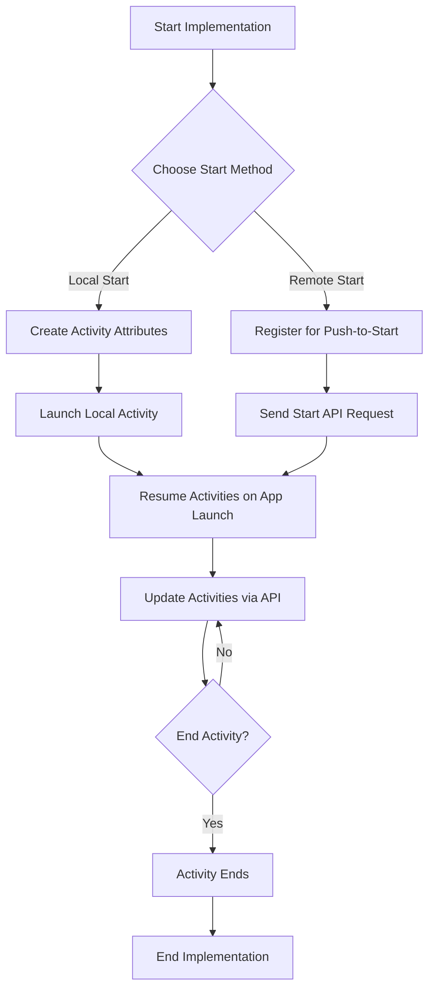

# Live Activities Quick Start Guide

> Live Activities are persistent, interactive notifications displayed on the iOS lock screen and Dynamic Island, allowing users to track real-time information without unlocking their device. This guide provides a streamlined implementation process and solutions to common challenges.

{: style="max-width:40%;float:right;margin-left:15px;"}

## Prerequisites checklist

Before implementing Live Activities, confirm you have:

- [ ] **Braze Swift SDK v5.11.0 or later** (v8.2.0+ for remote registration)
- [ ] **iOS 16.1+** as the minimum deployment target
  - For remote registration: iOS 17.2+ required
- [ ] **Push Notification entitlement** enabled in Xcode
- [ ] **.p8 authentication key** for APNs (**.p12/.pem files not supported**)
- [ ] **`NSSupportsLiveActivities`** set to `YES` in your Info.plist
- [ ] For frequent updates: **`NSSupportsLiveActivitiesFrequentUpdates`** set to `YES` in Info.plist

## Implementation flowchart









## Step 1: Create Activity Attributes

First, define your `ActivityAttributes` class with both static attributes and a `ContentState` for dynamic values:

```swift
import BrazeKit
import ActivityKit

@available(iOS 16.1, *)
struct DeliveryActivityAttributes: ActivityAttributes {
  // Static attributes - don't change during activity lifecycle
  var orderNumber: String
  var restaurantName: String
  
  // Dynamic content that will be updated
  public struct ContentState: Codable, Hashable {
    var status: String
    var estimatedArrival: Date
    var driverLocation: String
  }
}
```


Each ActivityAttributes class must define both static attributes that remain constant and a ContentState struct for values that will be updated.


## Step 2: Choose your launch method

Live Activities can be started locally (from within your app) or remotely (via push notification). Choose the method that best fits your use case.



### Local start implementation

Use this method when you want to start an activity within your app and update it remotely:

1. Create your activity attributes and initial state:

```swift
let attributes = DeliveryActivityAttributes(
  orderNumber: "ABC123",
  restaurantName: "Pizza Palace"
)
let initialState = DeliveryActivityAttributes.ContentState(
  status: "Preparing",
  estimatedArrival: Date().addingTimeInterval(1800),
  driverLocation: "At restaurant"
)
```

2. Request the activity with a push token:

```swift
if let activity = try? Activity.request(
  attributes: attributes,
  content: ActivityContent(state: initialState, staleDate: nil),
  pushType: .token
) {
  // Register with Braze using a unique tag
  AppDelegate.braze?.liveActivities.launchActivity(
    pushTokenTag: "delivery-\(attributes.orderNumber)", 
    activity: activity
  )
}
```



### Remote start implementation

Use this method when you want to start an activity from your server:

1. Add the `BrazeLiveActivityAttributes` protocol to your attributes class:

```swift
@available(iOS 16.1, *)
struct DeliveryActivityAttributes: ActivityAttributes, BrazeLiveActivityAttributes {
  var orderNumber: String
  var restaurantName: String
  
  // Required for remote start
  var brazeActivityId: String?
  
  public struct ContentState: Codable, Hashable {
    var status: String
    var estimatedArrival: Date
    var driverLocation: String
  }
}
```

2. Register for push-to-start in your AppDelegate:

```swift
@available(iOS 17.2, *)
func registerForPushToStart() {
  braze?.liveActivities.registerPushToStart(
    forType: Activity<DeliveryActivityAttributes>.self,
    name: "DeliveryActivity"
  )
}
```

3. Send a remote start request using the Braze API:

```json
POST /messages/live_activity/start
{
  "app_id": "YOUR-APP-ID",
  "activity_id": "delivery-ABC123",
  "activity_attributes_type": "DeliveryActivity",
  "activity_attributes": {
    "orderNumber": "ABC123",
    "restaurantName": "Pizza Palace"
  },
  "content_state": {
    "status": "Preparing",
    "estimatedArrival": "2024-03-25T18:30:00+0000",
    "driverLocation": "At restaurant"
  },
  "external_user_ids": ["user-123"]
}
```



## Step 3: Resume activities on app launch

Always resume activities tracking when your app launches to ensure Braze continues monitoring token changes:

```swift
func application(
  _ application: UIApplication,
  didFinishLaunchingWithOptions launchOptions: [UIApplication.LaunchOptionsKey: Any]?
) -> Bool {
  
  // Initialize Braze
  
  if #available(iOS 16.1, *) {
    braze?.liveActivities.resumeActivities(
      ofType: Activity<DeliveryActivityAttributes>.self
    )
    
    // If you have multiple activity types, resume each one
    braze?.liveActivities.resumeActivities(
      ofType: Activity<OtherActivityAttributes>.self
    )
  }
  
  return true
}
```

## Step 4: Update your Live Activity

Update your Live Activity with new information using the Braze API:

```json
POST /messages/live_activity/update
{
  "app_id": "YOUR-APP-ID",
  "activity_id": "delivery-ABC123",
  "content_state": {
    "status": "On the way",
    "estimatedArrival": "2024-03-25T18:15:00+0000",
    "driverLocation": "2 miles away"
  },
  "notification": {
    "alert": {
      "title": "Your order is on the way!",
      "body": "Delivery arriving in 15 minutes"
    }
  }
}
```


Use the `notification` object to add alert titles and messages when sending important updates. These alerts will be shown on Apple Watch and other paired devices.


## Step 5: End your Live Activity

End your Live Activity when it's no longer relevant:

```json
POST /messages/live_activity/update
{
  "app_id": "YOUR-APP-ID",
  "activity_id": "delivery-ABC123",
  "content_state": {
    "status": "Delivered",
    "estimatedArrival": "2024-03-25T18:15:00+0000",
    "driverLocation": "At your door"
  },
  "end_activity": true
}
```

## Common issues and troubleshooting

### Activity not appearing after push-to-start

If your Live Activity doesn't appear after sending a push-to-start notification:

1. **Verify payload structure**:
   - Check that `activity_attributes_type` matches the name used in `registerPushToStart`
   - Ensure all required fields in `activity_attributes` and `content_state` match your Swift model

2. **Check for rate limiting**:
   - Apple may throttle frequent Live Activity updates
   - Verify receipt using Console app by filtering logs with `process:liveactivitiesd`
   - Enable `NSSupportsLiveActivitiesFrequentUpdates` for high-frequency updates

3. **Confirm device compatibility**:
   - Device must be running iOS 16.1+ (17.2+ for remote start)
   - User must not have disabled Live Activities in settings

### No updates being received

If your Live Activity isn't receiving updates:

1. **Verify activity ID consistency**:
   - Ensure the same `activity_id` is used in both start and update requests
   - For remote start, confirm `brazeActivityId` property exists

2. **Check network requests**:
   - Look for outgoing requests to `/push_token_tag` endpoint
   - Verify the token contains the correct activity ID under the `"tag"` field

3. **API key permissions**:
   - Confirm your API key has both `messages.live_activity.start` and `messages.live_activity.update` permissions

### API rate limiting

By default, Live Activity endpoints have a rate limit of **250,000 requests per hour** per workspace, shared across multiple endpoints. If you exceed this limit:

1. **Implement exponential backoff** for retries
2. **Batch updates** when possible
3. **Prioritize critical updates** over minor changes

## Analytics and metrics tracking

Live Activities provide several metrics in the Braze dashboard:

| Metric | Description | Where to find |
|--------|-------------|--------------|
| Live Activity Starts | Count of activities started | Message Activity Log with filter "LiveActivity" |
| Update Deliveries | Number of updates sent | Message Activity Log |
| Live Activity Errors | Failed starts or updates | Message Activity Log with filter "LiveActivity Errors" |
{: .reset-td-br-1 .reset-td-br-2 .reset-td-br-3}


Live Activities metrics are not available in Campaigns or Canvas steps at this time.


## Important limitations

Keep these platform limitations in mind when implementing Live Activities:

1. **Duration limits**:
   - Activities disappear from Dynamic Island after 8 hours
   - Activities disappear from lock screen after 12 hours
   - Activity update tokens expire after 8 hours

2. **Update frequency**:
   - Without `NSSupportsLiveActivitiesFrequentUpdates`, updates may be throttled
   - Even with frequent updates enabled, excessive updates may still be throttled

3. **User permissions**:
   - Users can disable Live Activities per app in device settings
   - This permission is separate from push notification permissions

4. **Platform support**:
   - iOS 16.1+ only (17.2+ for remote start)
   - Not available on Android or Web
   - React Native support requires native Swift code

## Best practices

To ensure the best user experience with Live Activities:

1. **Keep content concise**:
   - Focus on critical information that benefits from real-time updates
   - Design for both lock screen and Dynamic Island formats

2. **Update strategically**:
   - Only send updates when information materially changes
   - Group minor updates together to avoid throttling

3. **Set appropriate timeframes**:
   - Use `stale_date` to indicate when data is no longer fresh
   - Use `dismissal_date` to proactively end activities when no longer relevant

4. **Respect user attention**:
   - Use Live Activities for genuinely time-sensitive information
   - End activities promptly when they're no longer needed

For more detailed information about Live Activities, see our [comprehensive documentation]({{site.baseurl}}/developer_guide/live_notifications/live_activities/).