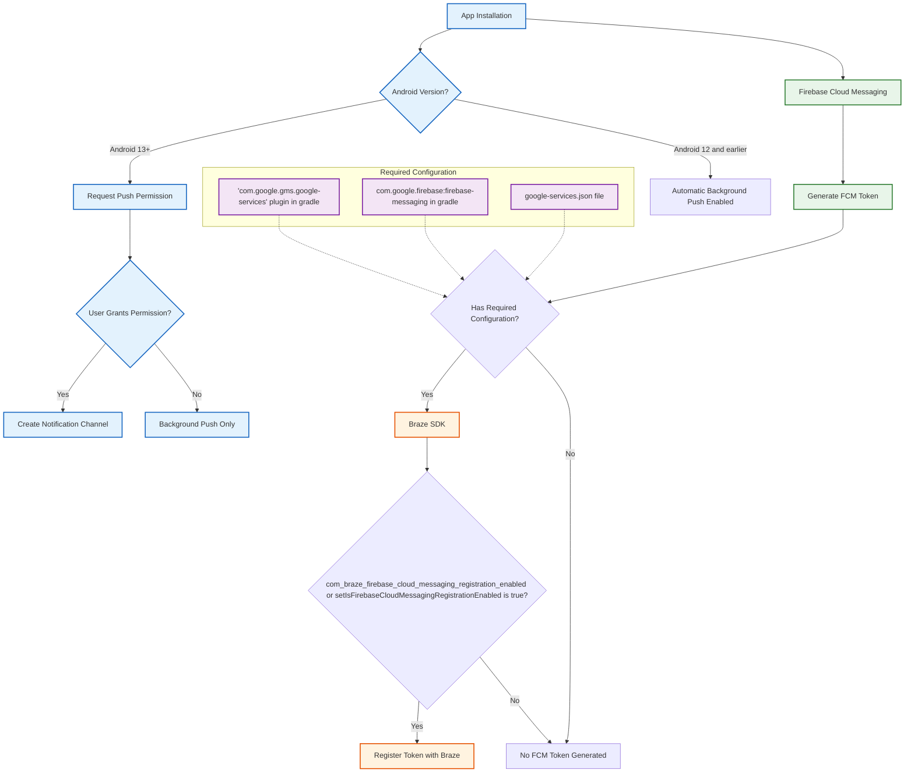

# Customizing push notifications

> Learn how to customize push notifications for the Braze SDK.

```mermaid
---
config:
  theme: mc
---
flowchart TD
%% Permission Flow
A[App Installation] --> B{Android Version?}
B -->|Android 13+| C[Request Push Permission]
B -->|Android 12 and earlier| D[Automatic Background Push Enabled]
    
C --> E{User Grants Permission?}
E -->|Yes| F[Create Notification Channel]
E -->|No| G[Background Push Only]

%% Token Generation Flow
H[Firebase Cloud Messaging] --> I[Generate FCM Token]
I --> L{Has Required Configuration?}
L -->|Yes| J[Braze SDK]
L -->|No| M[No FCM Token Generated]
J --> Q{com_braze_firebase_cloud_messaging_registration_enabled or setIsFirebaseCloudMessagingRegistrationEnabled is true?}
Q -->|Yes| K[Register Token with Braze]
Q -->|No| M

%% Configuration Requirements
subgraph Config[Required Configuration]
    N[google-services.json file]
    O[com.google.firebase:firebase-messaging in gradle]
    P['com.google.gms.google-services' plugin in gradle]
end

%% Connect App Installation to FCM
A --> H

%% Connect Config to Check
N -.-> L
O -.-> L
P -.-> L
    
%% Styling
classDef permissionClass fill:#e3f2fd,stroke:#1565c0,stroke-width:2px
classDef tokenClass fill:#e8f5e9,stroke:#2e7d32,stroke-width:2px
classDef sdkClass fill:#fff3e0,stroke:#e65100,stroke-width:2px
classDef configClass fill:#f3e5f5,stroke:#7b1fa2,stroke-width:2px
    
class A,B,C,E,F,G permissionClass
class H,I tokenClass
class J,K sdkClass
class N,O,P configClass

```














