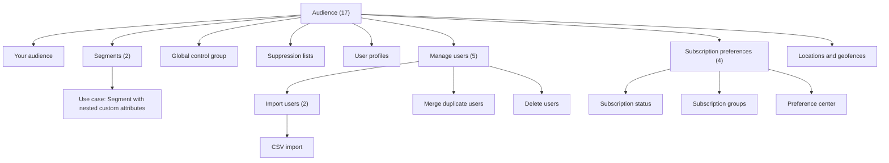

# IA Restructure: Current vs Proposed

## Change Summary

- **Unchanged**: 91 pages
- **Moved**: 256 pages
- **Renamed**: 2 pages
- **Updated**: 5 pages
- **Merged**: 6 pages
- **New**: 23 pages
- **Removed**: 3 pages
- **Total tracked**: 386 entries

## Top-Level Sections: Before and After

### Current

- **Home** (1 pages)
- **Getting started** (17 pages)
- **Administrative** (41 pages)
- **Analytics** (32 pages)
- **Data** (81 pages)
- **Engagement tools** (166 pages)
- **Message building by channel** (225 pages)
- **Personalization & dynamic content** (30 pages)
- **BrazeAI** (59 pages)
- **Privacy portal** (1 pages)

### Proposed

- **Home** (1 entries)
- **Get started** (9 entries)
- **Administer** (40 entries)
- **Data** (65 entries)
- **Audience** (17 entries)
- **Messaging** (93 entries)
- **Channels** (132 entries)
- **Analytics** (25 entries)
- **BrazeAI** (10 entries)

## Current IA Diagram

```mermaid
graph TD
    N1["User Guide (655)"]
    N2["Home"]
    N1 --> N2
    N3["Getting started (17)"]
    N1 --> N3
    N4["Braze overview"]
    N3 --> N4
    N5["Users and segments"]
    N3 --> N5
    N6["Campaigns and Canvases"]
    N3 --> N6
    N7["Workspaces"]
    N3 --> N7
    N8["Integration"]
    N3 --> N8
    N9["SDK overview"]
    N3 --> N9
    N10["Terms to know"]
    N3 --> N10
    N11["Braze Pilot (4)"]
    N3 --> N11
    N12["B2B use cases (5)"]
    N3 --> N12
    N13["Administrative (41)"]
    N1 --> N13
    N14["Access Braze (14)"]
    N13 --> N14
    N15["Settings (23)"]
    N13 --> N15
    N16["Privacy (3)"]
    N13 --> N16
    N17["Analytics (32)"]
    N1 --> N17
    N18["Tracking (5)"]
    N17 --> N18
    N19["Your analytics dashboards (8)"]
    N17 --> N19
    N20["Your reports (14)"]
    N17 --> N20
    N21["Query Builder (4)"]
    N17 --> N21
    N22["Data (81)"]
    N1 --> N22
    N23["Braze Data Platform"]
    N22 --> N23
    N24["Data unification (26)"]
    N22 --> N24
    N25["Data activation (23)"]
    N22 --> N25
    N26["Data distribution (25)"]
    N22 --> N26
    N27["Infrastructure (4)"]
    N22 --> N27
    N28["Technology Partners"]
    N22 --> N28
    N29["Engagement tools (166)"]
    N1 --> N29
    N30["Messaging fundamentals (18)"]
    N29 --> N30
    N31["Segments (20)"]
    N29 --> N31
    N32["Campaigns (34)"]
    N29 --> N32
    N33["Canvas (60)"]
    N29 --> N33
    N34["Templates and media (7)"]
    N29 --> N34
    N35["Locations and geofences (3)"]
    N29 --> N35
    N36["Engagement testing (11)"]
    N29 --> N36
    N37["Landing pages (7)"]
    N29 --> N37
    N38["Feature flags (5)"]
    N29 --> N38
    N39["Message building by channel (225)"]
    N1 --> N39
    N40["Banners (5)"]
    N39 --> N40
    N41["Content Cards (9)"]
    N39 --> N41
    N42["Email (53)"]
    N39 --> N42
    N43["In-app messages (36)"]
    N39 --> N43
    N44["LINE (11)"]
    N39 --> N44
    N45["Push (31)"]
    N39 --> N45
    N46["SMS, MMS, and RCS (40)"]
    N39 --> N46
    N47["Webhooks (7)"]
    N39 --> N47
    N48["WhatsApp (32)"]
    N39 --> N48
    N49["Personalization and dynamic content (30)"]
    N1 --> N49
    N50["Liquid (13)"]
    N49 --> N50
    N51["Connected Content (8)"]
    N49 --> N51
    N52["Deep linking to in-app content"]
    N49 --> N52
    N53["Key-value pairs"]
    N49 --> N53
    N54["Promotion codes (4)"]
    N49 --> N54
    N55["Canvas persistent entry properties"]
    N49 --> N55
    N56["BrazeAI (59)"]
    N1 --> N56
    N57["Decisioning Studio (18)"]
    N56 --> N57
    N58["Agents (3)"]
    N56 --> N58
    N59["Braze MCP server (4)"]
    N56 --> N59
    N60["Content Optimizer"]
    N56 --> N60
    N61["Generative AI (8)"]
    N56 --> N61
    N62["Intelligence Suite (5)"]
    N56 --> N62
    N63["Item recommendations (7)"]
    N56 --> N63
    N64["Operator"]
    N56 --> N64
    N65["Predictive Churn (6)"]
    N56 --> N65
    N66["Predictive Events (5)"]
    N56 --> N66
    N67["Privacy portal"]
    N1 --> N67
```

## Proposed IA Diagram

```mermaid
graph TD
    N1["User Guide (Proposed) (393)"]
    N2["Home"]
    N1 --> N2
    N3["Get started (9)"]
    N1 --> N3
    N4["Users and segments"]
    N3 --> N4
    N5["Campaigns and Canvases"]
    N3 --> N5
    N6["Workspaces"]
    N3 --> N6
    N7["Integrations"]
    N3 --> N7
    N8["SDK overview"]
    N3 --> N8
    N9["Terms to know"]
    N3 --> N9
    N10["Braze Pilot"]
    N3 --> N10
    N11["B2B use cases"]
    N3 --> N11
    N12["Administer (40)"]
    N1 --> N12
    N13["Personal (6)"]
    N12 --> N13
    N14["Global (33)"]
    N12 --> N14
    N15["Data (65)"]
    N1 --> N15
    N16["Unification (21)"]
    N15 --> N16
    N17["Activation (16)"]
    N15 --> N17
    N18["Distribution (22)"]
    N15 --> N18
    N19["Infrastructure (4)"]
    N15 --> N19
    N20["Technology Partners"]
    N15 --> N20
    N21["Audience (17)"]
    N1 --> N21
    N22["Your audience"]
    N21 --> N22
    N23["Segments (2)"]
    N21 --> N23
    N24["Global control group"]
    N21 --> N24
    N25["Suppression lists"]
    N21 --> N25
    N26["User profiles"]
    N21 --> N26
    N27["Manage users (5)"]
    N21 --> N27
    N28["Subscription preferences (4)"]
    N21 --> N28
    N29["Locations and geofences"]
    N21 --> N29
    N30["Messaging (93)"]
    N1 --> N30
    N31["Messaging fundamentals (21)"]
    N30 --> N31
    N32["Canvas"]
    N30 --> N32
    N33["Campaigns (7)"]
    N30 --> N33
    N34["Landing pages (7)"]
    N30 --> N34
    N35["Feature flags (5)"]
    N30 --> N35
    N36["A/B testing (9)"]
    N30 --> N36
    N37["Reusable content (3)"]
    N30 --> N37
    N38["Design and edit (6)"]
    N30 --> N38
    N39["Media library"]
    N30 --> N39
    N40["Templates (18)"]
    N30 --> N40
    N41["Personalize (14)"]
    N30 --> N41
    N42["Channels (132)"]
    N1 --> N42
    N43["Banners (4)"]
    N42 --> N43
    N44["Content Cards (5)"]
    N42 --> N44
    N45["Email (19)"]
    N42 --> N45
    N46["Transactional email (3)"]
    N42 --> N46
    N47["In-app messages (18)"]
    N42 --> N47
    N48["LINE (7)"]
    N42 --> N48
    N49["Live notifications"]
    N42 --> N49
    N50["Push (25)"]
    N42 --> N50
    N51["SMS, MMS, and RCS (13)"]
    N42 --> N51
    N52["Webhooks (6)"]
    N42 --> N52
    N53["WhatsApp (30)"]
    N42 --> N53
    N54["Analytics (25)"]
    N1 --> N54
    N55["Dashboards (7)"]
    N54 --> N55
    N56["Reports (11)"]
    N54 --> N56
    N57["Tracking (5)"]
    N54 --> N57
    N58["Metrics glossary"]
    N54 --> N58
    N59["BrazeAI (10)"]
    N1 --> N59
    N60["Agents"]
    N59 --> N60
    N61["Braze MCP server"]
    N59 --> N61
    N62["Content Optimizer"]
    N59 --> N62
    N63["Decisioning Studio"]
    N59 --> N63
    N64["Generative AI"]
    N59 --> N64
    N65["Intelligence Suite"]
    N59 --> N65
    N66["Item recommendations"]
    N59 --> N66
    N67["Operator"]
    N59 --> N67
    N68["Predictive Suite"]
    N59 --> N68
```

## Section Detail: Most-Changed Areas

The following sections have the most structural changes.

### Proposed: Messaging

```mermaid
graph TD
    N1["Messaging (93)"]
    N2["Messaging fundamentals (21)"]
    N1 --> N2
    N3["Accessibility"]
    N2 --> N3
    N4["Approvals (2)"]
    N2 --> N4
    N5["Messaging rules"]
    N4 --> N5
    N6["Archiving"]
    N2 --> N6
    N7["Conversion Events"]
    N2 --> N7
    N8["Copy across workspaces"]
    N2 --> N8
    N9["Delivery and entry types"]
    N2 --> N9
    N10["Duplicating"]
    N2 --> N10
    N11["Editor blocks"]
    N2 --> N11
    N12["Frequency capping"]
    N2 --> N12
    N13["Know before you send"]
    N2 --> N13
    N14["Localization (3)"]
    N2 --> N14
    N15["Locales in messages"]
    N14 --> N15
    N16["Right-to-left messages"]
    N14 --> N16
    N17["Priority sorter"]
    N2 --> N17
    N18["Product blocks"]
    N2 --> N18
    N19["Rate limiting"]
    N2 --> N19
    N20["Re-eligibility"]
    N2 --> N20
    N21["Statuses"]
    N2 --> N21
    N22["Target users"]
    N2 --> N22
    N23["Canvas"]
    N1 --> N23
    N24["Campaigns (7)"]
    N1 --> N24
    N25["Campaign basics"]
    N24 --> N25
    N26["Schedule your campaign"]
    N24 --> N26
    N27["Manage campaigns"]
    N24 --> N27
    N28["Test campaigns"]
    N24 --> N28
    N29["Ideas and strategies"]
    N24 --> N29
    N30["FAQ"]
    N24 --> N30
    N31["Landing pages (7)"]
    N1 --> N31
    N32["Create landing pages"]
    N31 --> N32
    N33["Customize the URL"]
    N31 --> N33
    N34["Tracking users"]
    N31 --> N34
    N35["Retargeting users"]
    N31 --> N35
    N36["Personalize landing pages"]
    N31 --> N36
    N37["About tracking data"]
    N31 --> N37
    N38["Feature flags (5)"]
    N1 --> N38
    N39["Create feature flags"]
    N38 --> N39
    N40["Feature flags in Canvas"]
    N38 --> N40
    N41["Feature flag experiments"]
    N38 --> N41
    N42["FAQ"]
    N38 --> N42
    N43["A/B testing (9)"]
    N1 --> N43
    N44["Concepts (4)"]
    N43 --> N44
    N45["Random bucket numbers"]
    N44 --> N45
    N46["Conversion correlation"]
    N44 --> N46
    N47["Race conditions"]
    N44 --> N47
    N48["Create tests"]
    N43 --> N48
    N49["Optimizations"]
    N43 --> N49
    N50["Analytics"]
    N43 --> N50
    N51["FAQ"]
    N43 --> N51
    N52["Reusable content (3)"]
    N1 --> N52
    N53["Content Blocks"]
    N52 --> N53
    N54["Product Blocks"]
    N52 --> N54
    N55["Design and edit (6)"]
    N1 --> N55
    N56["Drag-and-drop editor"]
    N55 --> N56
    N57["Email drag-and-drop editor"]
    N55 --> N57
    N58["Email HTML editor"]
    N55 --> N58
    N59["Traditional composers"]
    N55 --> N59
    N60["Image specifications"]
    N55 --> N60
    N61["Media library"]
    N1 --> N61
    N62["Templates (18)"]
    N1 --> N62
    N63["Canvas templates"]
    N62 --> N63
    N64["Email templates"]
    N62 --> N64
    N65["In-app message templates (13)"]
    N62 --> N65
    N66["Custom templates"]
    N65 --> N66
    N67["Color profiles and CSS templates"]
    N65 --> N67
    N68["Braze templates (10)"]
    N65 --> N68
    N69["Managing templates"]
    N62 --> N69
    N70["Content Block library"]
    N62 --> N70
    N71["Personalize (14)"]
    N1 --> N71
    N72["Dashboard tools"]
    N71 --> N72
    N73["Preview personalization"]
    N71 --> N73
    N74["Sources (8)"]
    N71 --> N74
    N75["User profile fields"]
    N74 --> N75
    N76["REST API"]
    N74 --> N76
    N77["Catalog"]
    N74 --> N77
    N78["Promotion codes"]
    N74 --> N78
    N79["Canvas entry properties"]
    N74 --> N79
    N80["Context variables"]
    N74 --> N80
    N81["Key-value pairs"]
    N74 --> N81
    N82["Actions and media URLs"]
    N71 --> N82
    N83["Liquid reference"]
    N71 --> N83
    N84["Connected content reference"]
    N71 --> N84
```

### Proposed: Channels

```mermaid
graph TD
    N1["Channels (132)"]
    N2["Banners (4)"]
    N1 --> N2
    N3["Create a Banner"]
    N2 --> N3
    N4["Reporting"]
    N2 --> N4
    N5["FAQ"]
    N2 --> N5
    N6["Content Cards (5)"]
    N1 --> N6
    N7["Create a Content Card"]
    N6 --> N7
    N8["Creative details"]
    N6 --> N8
    N9["Reporting"]
    N6 --> N9
    N10["Best practices"]
    N6 --> N10
    N11["Email (19)"]
    N1 --> N11
    N12["Email setup"]
    N11 --> N12
    N13["Create an email"]
    N11 --> N13
    N14["Customize (5)"]
    N11 --> N14
    N15["Email global style settings"]
    N14 --> N15
    N16["Custom email footer"]
    N14 --> N16
    N17["AMP for email"]
    N14 --> N17
    N18["Universal links and app links"]
    N14 --> N18
    N19["Templates"]
    N11 --> N19
    N20["Subscriptions"]
    N11 --> N20
    N21["Reporting"]
    N11 --> N21
    N22["Use cases"]
    N11 --> N22
    N23["Best practices (6)"]
    N11 --> N23
    N24["Email guidelines"]
    N23 --> N24
    N25["Email styling"]
    N23 --> N25
    N26["Sunset policies"]
    N23 --> N26
    N27["Apple Mail"]
    N23 --> N27
    N28["Know before you send"]
    N23 --> N28
    N29["FAQ"]
    N11 --> N29
    N30["Transactional email (3)"]
    N1 --> N30
    N31["Create a transactional email"]
    N30 --> N31
    N32["Tracking"]
    N30 --> N32
    N33["In-app messages (18)"]
    N1 --> N33
    N34["Create an in-app message"]
    N33 --> N34
    N35["Message types (7)"]
    N33 --> N35
    N36["Fullscreen"]
    N35 --> N36
    N37["Modal"]
    N35 --> N37
    N38["Slideup"]
    N35 --> N38
    N39["Custom HTML"]
    N35 --> N39
    N40["Email capture form"]
    N35 --> N40
    N41["Simple survey"]
    N35 --> N41
    N42["Customize (5)"]
    N33 --> N42
    N43["Style settings"]
    N42 --> N43
    N44["Dark mode themes"]
    N42 --> N44
    N45["Color profiles and CSS templates"]
    N42 --> N45
    N46["Video in custom HTML"]
    N42 --> N46
    N47["Templates"]
    N33 --> N47
    N48["Reporting"]
    N33 --> N48
    N49["Best practices"]
    N33 --> N49
    N50["FAQ"]
    N33 --> N50
    N51["LINE (7)"]
    N1 --> N51
    N52["LINE setup"]
    N51 --> N52
    N53["Create a LINE message"]
    N51 --> N53
    N54["Message users (3)"]
    N51 --> N54
    N55["User management"]
    N54 --> N55
    N56["Subscription groups"]
    N54 --> N56
    N57["Reporting"]
    N51 --> N57
    N58["Live notifications"]
    N1 --> N58
    N59["Push (25)"]
    N1 --> N59
    N60["Push setup (3)"]
    N59 --> N60
    N61["Push token lifecycle"]
    N60 --> N61
    N62["Push subscription states"]
    N60 --> N62
    N63["Create a push message (5)"]
    N59 --> N63
    N64["Message and image formats"]
    N63 --> N64
    N65["Push action buttons"]
    N63 --> N65
    N66["Push stories"]
    N63 --> N66
    N67["Quick push messages"]
    N63 --> N67
    N68["Platform-specific resources (13)"]
    N59 --> N68
    N69["iOS (5)"]
    N68 --> N69
    N70["Android (6)"]
    N68 --> N70
    N71["Web"]
    N68 --> N71
    N72["Best practices"]
    N59 --> N72
    N73["Troubleshooting"]
    N59 --> N73
    N74["FAQs"]
    N59 --> N74
    N75["SMS, MMS, and RCS (13)"]
    N1 --> N75
    N76["Message setup"]
    N75 --> N76
    N77["Compliance and deliverability"]
    N75 --> N77
    N78["Create an SMS, MMS, or RCS message"]
    N75 --> N78
    N79["Message features and optimization (6)"]
    N75 --> N79
    N80["Link shortening"]
    N79 --> N80
    N81["Custom domains"]
    N79 --> N81
    N82["Keyword processing"]
    N79 --> N82
    N83["User retargeting"]
    N79 --> N83
    N84["Bot click filtering"]
    N79 --> N84
    N85["Billing calculator"]
    N75 --> N85
    N86["Reporting"]
    N75 --> N86
    N87["FAQ"]
    N75 --> N87
    N88["Webhooks (6)"]
    N1 --> N88
    N89["Create a webhook"]
    N88 --> N89
    N90["Templates"]
    N88 --> N90
    N91["Reporting"]
    N88 --> N91
    N92["Use case: Create a Braze-to-Braze webhook"]
    N88 --> N92
    N93["Use case: Create a lead-scoring workflow"]
    N88 --> N93
    N94["WhatsApp (30)"]
    N1 --> N94
    N95["WhatsApp setup (9)"]
    N94 --> N95
    N96["Embedded signup"]
    N95 --> N96
    N97["User phone numbers"]
    N95 --> N97
    N98["Subscription groups"]
    N95 --> N98
    N99["Multiple business accounts"]
    N95 --> N99
    N100["WhatsApp phone numbers (4)"]
    N95 --> N100
    N101["Create a WhatsApp message"]
    N94 --> N101
    N102["Message features and optimization (7)"]
    N94 --> N102
    N103["Optimized delivery"]
    N102 --> N103
    N104["Click tracking"]
    N102 --> N104
    N105["WhatsApp Flows"]
    N102 --> N105
    N106["Product messages"]
    N102 --> N106
    N107["User retargeting"]
    N102 --> N107
    N108["Custom domains"]
    N102 --> N108
    N109["Message processing (5)"]
    N94 --> N109
    N110["Opt-ins and opt-outs"]
    N109 --> N110
    N111["Messaging users"]
    N109 --> N111
    N112["Handling unknown phone numbers"]
    N109 --> N112
    N113["Quality rating and messaging limits"]
    N109 --> N113
    N114["Reporting"]
    N94 --> N114
    N115["Use cases (3)"]
    N94 --> N115
    N116["Ads that click to WhatsApp"]
    N115 --> N116
    N117["WhatsApp and external systems"]
    N115 --> N117
    N118["Best practices"]
    N94 --> N118
    N119["FAQ"]
    N94 --> N119
    N120["Meta resources"]
    N94 --> N120
```

### Proposed: Data

```mermaid
graph TD
    N1["Data (65)"]
    N2["Unification (21)"]
    N1 --> N2
    N3["Cloud Data Ingestion (11)"]
    N2 --> N3
    N4["Best practices"]
    N3 --> N4
    N5["Connected Sources"]
    N3 --> N5
    N6["Data warehouse integrations"]
    N3 --> N6
    N7["File storage integrations"]
    N3 --> N7
    N8["Sync and delete account data"]
    N3 --> N8
    N9["Sync and delete catalog data"]
    N3 --> N9
    N10["Zero-copy personalization"]
    N3 --> N10
    N11["Sync logs and observability"]
    N3 --> N11
    N12["Delete users with CDI"]
    N3 --> N12
    N13["FAQ"]
    N3 --> N13
    N14["Data Transformation"]
    N2 --> N14
    N15["Create a formula"]
    N2 --> N15
    N16["User data (7)"]
    N2 --> N16
    N17["SDK data collection"]
    N16 --> N17
    N18["User profile lifecycle"]
    N16 --> N18
    N19["Anonymous users"]
    N16 --> N19
    N20["Collection use case"]
    N16 --> N20
    N21["Collection best practices"]
    N16 --> N21
    N22["Language codes"]
    N16 --> N22
    N23["Activation (16)"]
    N1 --> N23
    N24["Attributes (5)"]
    N23 --> N24
    N25["Custom attributes"]
    N24 --> N25
    N26["Array of objects"]
    N24 --> N26
    N27["Nested custom attributes"]
    N24 --> N27
    N28["Data types"]
    N24 --> N28
    N29["Events (6)"]
    N23 --> N29
    N30["Custom events"]
    N29 --> N30
    N31["Recommented events (3)"]
    N29 --> N31
    N32["Event naming conventions"]
    N29 --> N32
    N33["Catalogs"]
    N23 --> N33
    N34["Tags"]
    N23 --> N34
    N35["Manage custom data"]
    N23 --> N35
    N36["Blocklist custom data"]
    N23 --> N36
    N37["Distribution (22)"]
    N1 --> N37
    N38["Currents (13)"]
    N37 --> N38
    N39["Set up Currents (3)"]
    N38 --> N39
    N40["Currents event glossary (4)"]
    N38 --> N40
    N41["Use cases (4)"]
    N38 --> N41
    N42["FAQ"]
    N38 --> N42
    N43["Export Braze data (8)"]
    N37 --> N43
    N44["Message archiving"]
    N43 --> N44
    N45["Campaign data"]
    N43 --> N45
    N46["Canvas data"]
    N43 --> N46
    N47["Segment data"]
    N43 --> N47
    N48["Export APIs"]
    N43 --> N48
    N49["Troubleshooting"]
    N43 --> N49
    N50["FAQ"]
    N43 --> N50
    N51["Infrastructure (4)"]
    N1 --> N51
    N52["Data centers"]
    N51 --> N52
    N53["Identifier field-level encryption"]
    N51 --> N53
    N54["Data points"]
    N51 --> N54
    N55["Technology Partners"]
    N1 --> N55
```

### Proposed: Audience

### Proposed: Analytics

```mermaid
graph TD
    N1["Analytics (25)"]
    N2["Dashboards (7)"]
    N1 --> N2
    N3["Dashboard Builder"]
    N2 --> N3
    N4["Home"]
    N2 --> N4
    N5["API usage"]
    N2 --> N5
    N6["Channel performance"]
    N2 --> N6
    N7["Conversions"]
    N2 --> N7
    N8["Deliverability Center"]
    N2 --> N8
    N9["Reports (11)"]
    N1 --> N9
    N10["Configure reporting"]
    N9 --> N10
    N11["Engagement reports"]
    N9 --> N11
    N12["Campaign analytics"]
    N9 --> N12
    N13["Canvas analytics"]
    N9 --> N13
    N14["Report Builder"]
    N9 --> N14
    N15["Query Builder"]
    N9 --> N15
    N16["Retention reports"]
    N9 --> N16
    N17["Funnel reports"]
    N9 --> N17
    N18["Revenue report"]
    N9 --> N18
    N19["Global control group report"]
    N9 --> N19
    N20["Tracking (5)"]
    N1 --> N20
    N21["Open pixel and click tracking"]
    N20 --> N21
    N22["Uninstall tracking"]
    N20 --> N22
    N23["Influence opens"]
    N20 --> N23
    N24["Segment analytics tracking"]
    N20 --> N24
    N25["Metrics glossary"]
    N1 --> N25
```

### Proposed: Administer

```mermaid
graph TD
    N1["Administer (40)"]
    N2["Personal (6)"]
    N1 --> N2
    N3["Accessing your account"]
    N2 --> N3
    N4["The Braze dashboard"]
    N2 --> N4
    N5["Language settings"]
    N2 --> N5
    N6["Product portal"]
    N2 --> N6
    N7["Braze support"]
    N2 --> N7
    N8["Global (33)"]
    N1 --> N8
    N9["User management (6)"]
    N8 --> N9
    N10["Manage Braze users"]
    N9 --> N10
    N11["Permissions"]
    N9 --> N11
    N12["Teams"]
    N9 --> N12
    N13["Automated user provisioning"]
    N9 --> N13
    N14["Internal groups"]
    N9 --> N14
    N15["SAML and single sign-on (6)"]
    N8 --> N15
    N16["SAML SSO setup"]
    N15 --> N16
    N17["SAML Just-in-Time provisioning"]
    N15 --> N17
    N18["Microsoft Entra SSO"]
    N15 --> N18
    N19["Okta"]
    N15 --> N19
    N20["OneLogin"]
    N15 --> N20
    N21["Create and manage workspaces"]
    N8 --> N21
    N22["Workspace settings (12)"]
    N8 --> N22
    N23["APIs and identifiers"]
    N22 --> N23
    N24["Brand guidelines"]
    N22 --> N24
    N25["Email preferences"]
    N22 --> N25
    N26["Logs and alerts (5)"]
    N22 --> N26
    N27["Multi-language settings"]
    N22 --> N27
    N28["Push settings"]
    N22 --> N28
    N29["Tags"]
    N22 --> N29
    N30["Company settings (4)"]
    N8 --> N30
    N31["Contact information"]
    N30 --> N31
    N32["Notification preferences"]
    N30 --> N32
    N33["Security settings"]
    N30 --> N33
    N34["Billing (2)"]
    N8 --> N34
    N35["Message Usage Dashboard"]
    N34 --> N35
    N36["Privacy"]
    N8 --> N36
```

