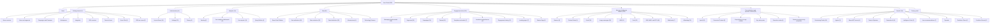

# Current IA Overview

Total pages: 655

```mermaid
graph TD
    N1["User Guide (655)"]
    N2["Home"]
    N1 --> N2
    N3["Getting started (17)"]
    N1 --> N3
    N4["Braze overview"]
    N3 --> N4
    N5["Users and segments"]
    N3 --> N5
    N6["Campaigns and Canvases"]
    N3 --> N6
    N7["Workspaces"]
    N3 --> N7
    N8["Integration"]
    N3 --> N8
    N9["SDK overview"]
    N3 --> N9
    N10["Terms to know"]
    N3 --> N10
    N11["Braze Pilot (4)"]
    N3 --> N11
    N12["B2B use cases (5)"]
    N3 --> N12
    N13["Administrative (41)"]
    N1 --> N13
    N14["Access Braze (14)"]
    N13 --> N14
    N15["Settings (23)"]
    N13 --> N15
    N16["Privacy (3)"]
    N13 --> N16
    N17["Analytics (32)"]
    N1 --> N17
    N18["Tracking (5)"]
    N17 --> N18
    N19["Your analytics dashboards (8)"]
    N17 --> N19
    N20["Your reports (14)"]
    N17 --> N20
    N21["Query Builder (4)"]
    N17 --> N21
    N22["Data (81)"]
    N1 --> N22
    N23["Braze Data Platform"]
    N22 --> N23
    N24["Data unification (26)"]
    N22 --> N24
    N25["Data activation (23)"]
    N22 --> N25
    N26["Data distribution (25)"]
    N22 --> N26
    N27["Infrastructure (4)"]
    N22 --> N27
    N28["Technology Partners"]
    N22 --> N28
    N29["Engagement tools (166)"]
    N1 --> N29
    N30["Messaging fundamentals (18)"]
    N29 --> N30
    N31["Segments (20)"]
    N29 --> N31
    N32["Campaigns (34)"]
    N29 --> N32
    N33["Canvas (60)"]
    N29 --> N33
    N34["Templates and media (7)"]
    N29 --> N34
    N35["Locations and geofences (3)"]
    N29 --> N35
    N36["Engagement testing (11)"]
    N29 --> N36
    N37["Landing pages (7)"]
    N29 --> N37
    N38["Feature flags (5)"]
    N29 --> N38
    N39["Message building by channel (225)"]
    N1 --> N39
    N40["Banners (5)"]
    N39 --> N40
    N41["Content Cards (9)"]
    N39 --> N41
    N42["Email (53)"]
    N39 --> N42
    N43["In-app messages (36)"]
    N39 --> N43
    N44["LINE (11)"]
    N39 --> N44
    N45["Push (31)"]
    N39 --> N45
    N46["SMS, MMS, and RCS (40)"]
    N39 --> N46
    N47["Webhooks (7)"]
    N39 --> N47
    N48["WhatsApp (32)"]
    N39 --> N48
    N49["Personalization and dynamic content (30)"]
    N1 --> N49
    N50["Liquid (13)"]
    N49 --> N50
    N51["Connected Content (8)"]
    N49 --> N51
    N52["Deep linking to in-app content"]
    N49 --> N52
    N53["Key-value pairs"]
    N49 --> N53
    N54["Promotion codes (4)"]
    N49 --> N54
    N55["Canvas persistent entry properties"]
    N49 --> N55
    N56["BrazeAI (59)"]
    N1 --> N56
    N57["Decisioning Studio (18)"]
    N56 --> N57
    N58["Agents (3)"]
    N56 --> N58
    N59["Braze MCP server (4)"]
    N56 --> N59
    N60["Content Optimizer"]
    N56 --> N60
    N61["Generative AI (8)"]
    N56 --> N61
    N62["Intelligence Suite (5)"]
    N56 --> N62
    N63["Item recommendations (7)"]
    N56 --> N63
    N64["Operator"]
    N56 --> N64
    N65["Predictive Churn (6)"]
    N56 --> N65
    N66["Predictive Events (5)"]
    N56 --> N66
    N67["Privacy portal"]
    N1 --> N67
```
