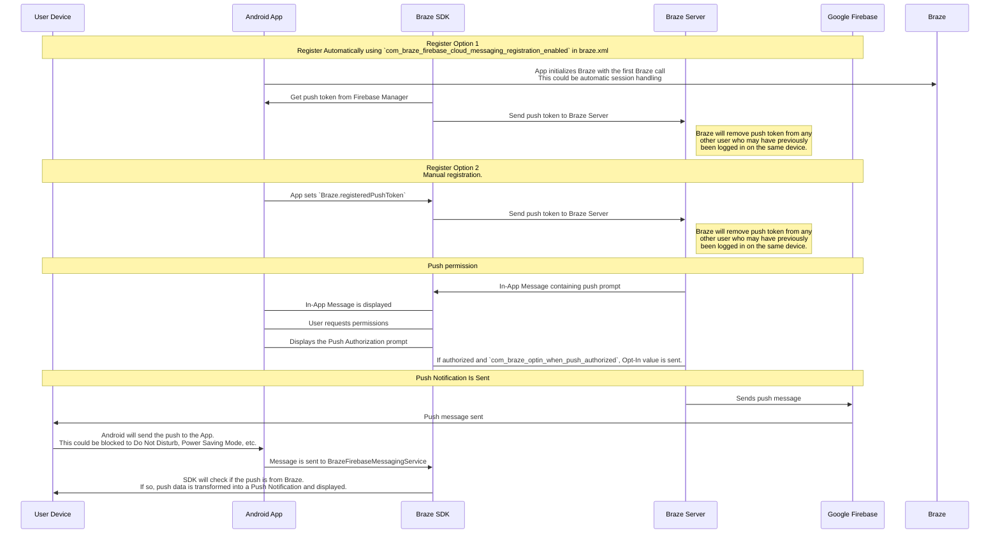

## Understanding the Braze push workflow

The Firebase Cloud Messaging (FCM) service is Google's infrastructure for push notifications sent to Android applications. Here is the simplified structure of how push notifications are enabled for your users' devices and how Braze can send push notifications to them:




### Step 1: Configuring your Google Cloud API key

In developing your app, you'll need to provide the Braze Android SDK with your Firebase sender ID. Additionally, you'll need to provide an API Key for server applications to the Braze dashboard. Braze will use this API key to send messages to your devices. You will also need to check that FCM service is enabled in Google Developer's console. 


A common mistake during this step is using the app identifier API key instead of the REST API key.


### Step 2: Devices register for FCM and provide Braze with push tokens

In typical integrations, the Braze Android SDK will handle registering devices for FCM capability. This will usually happen immediately upon opening the app for the first time. After registration, Braze will be provided with an FCM Registration ID, which is used to send messages to that device specifically. We will store the Registration ID for that user, and that user will become "push registered" if they previously did not have a push token for any of your apps.

### Step 3: Launching a Braze push campaign

When a push campaign is launched, Braze will make requests to FCM to deliver your message. Braze will use the API key copied in the dashboard to authenticate and verify that we can send push notifications to the push tokens provided.

### Step 4: Removing invalid tokens

If FCM informs us that any of the push tokens we were attempting to send a message to are invalid, we remove those tokens from the user profiles they were associated with. If users have no other push tokens, they will no longer show up as "Push Registered" under the **Segments** page.

For more details about FCM, visit [Cloud messaging](https://firebase.google.com/docs/cloud-messaging/).

## Utilizing the push error logs

Braze provides push notification errors within the message activity log. This error log provides a variety of warnings which can be very helpful for identifying why your campaigns aren't working as expected. Clicking on an error message will redirect you to relevant documentation to help you troubleshoot a particular incident.


## Troubleshooting scenarios

### Push isn't sending

Your push messages might not be sending because of the following situations:

- Your credentials exist in the wrong Google Cloud Platform project ID (wrong sender ID).
- Your credentials have the wrong permission scope.
- You uploaded wrong credentials to the wrong Braze workspace (wrong sender ID).

For other issues that may prevent you from sending a push message, refer to [User Guide: Troubleshooting Push Notifications]({{site.baseurl}}/user_guide/message_building_by_channel/push/troubleshooting/).

### No "push registered" users showing in the Braze dashboard (prior to sending messages)

Confirm that your app is correctly configured to allow push notifications. Common failure points to check include:

#### Incorrect sender ID

Check that the correct FCM sender ID is included in the `braze.xml` file. An incorrect sender ID will lead to `MismatchSenderID` errors reported in the dashboard's message activity log.

#### Braze registration not occurring

Since FCM registration is handled outside of Braze, failure to register can only occur in two places:

1. During registration with FCM
2. When passing the FCM-generated push token to Braze

We recommend setting a breakpoint or logging to confirm that the FCM-generated push token is being sent to Braze. If a token is not generated correctly or at all, we recommend consulting the [FCM documentation](https://firebase.google.com/docs/cloud-messaging/android/client).

#### Google Play Services not present

For FCM push to work, Google Play Services must be present on the device. If Google Play Services isn't on a device, push registration will not occur.

**Note:** Google Play Services is not installed on Android emulators without Google APIs installed.

#### Device not connected to the internet

Check that your device has good internet connectivity and isn't sending network traffic through a proxy.

### Tapping push notification doesn't open the app

Check if `com_braze_handle_push_deep_links_automatically` is set to `true` or `false`. To enable Braze to automatically open the app and any deep links when a push notification is tapped, set `com_braze_handle_push_deep_links_automatically` to `true` in your `braze.xml` file.

If `com_braze_handle_push_deep_links_automatically` is set to its default of `false`, you need to use a Braze Push Callback to listen for and handle the push received and opened intents.

### Push notifications bounced

If a push notification isn't delivered, make sure it didn't bounce by looking in the [developer console]({{site.baseurl}}/developer_guide/platforms/android/push_notifications/troubleshooting/#utilizing-the-push-error-logs). The following are descriptions of common errors that may be logged in the developer console:

#### Error: MismatchSenderID

`MismatchSenderID` indicates an authentication failure. Confirm your Firebase sender ID and FCM API key are correct.

#### Error: InvalidRegistration

`InvalidRegistration` can be caused by a malformed push token.

1. Make sure to pass a valid push token to Braze from [Firebase Cloud Messaging](https://firebase.google.com/docs/cloud-messaging/android/client#retrieve-the-current-registration-token).

#### Error: NotRegistered

1. `NotRegistered` typically occurs when an app has been deleted from a device. Braze uses `NotRegistered` internally to signal that an app has been uninstalled from a device.

2. `NotRegistered` may also occur when multiple registrations occur and a second registration invalidates the first token.

### Push notifications sent but not displayed on users' devices

There are a few reasons why this could be occurring:

#### Application was force quit

If you force-quit your application through your system settings, your push notifications will not be sent. Launching the app again will re-enable your device to receive push notifications.

#### BrazeFirebaseMessagingService not registered

The BrazeFirebaseMessagingService must be properly registered in `AndroidManifest.xml` for push notifications to appear:

```xml
<service android:name="com.braze.push.BrazeFirebaseMessagingService"
  android:exported="false">
  <intent-filter>
    <action android:name="com.google.firebase.MESSAGING_EVENT" />
  </intent-filter>
</service>
```

#### Firewall is blocking push

If you are testing push over Wi-Fi, your firewall may be blocking ports necessary for FCM to receive messages. Confirm that ports `5228`, `5229`, and `5230` are open. Additionally, since FCM doesn't specify its IPs, you must also allow your firewall to accept outgoing connections to all IP addresses contained in the IP blocks listed in Google's ASN of `15169`.

#### Custom notification factory returning null

If you have implemented a [custom notification factory]({{site.baseurl}}/developer_guide/platform_integration_guides/android/push_notifications/android/integration/standard_integration/#custom-displaying-notifications), ensure that it is not returning `null`. This will cause notifications not to be displayed.

### "Push registered" users no longer enabled after sending messages

There are a few reasons why this could be happening:

#### Application was uninstalled

Users have uninstalled the application. This will invalidate their FCM push token.

#### Invalid Firebase Cloud Messaging server key

The Firebase Cloud Messaging server key provided in the Braze dashboard is invalid. The sender ID provided should match the one referenced in your app's `braze.xml` file. The server key and sender ID are found here in your Firebase Console:


### Push clicks not logged

Braze logs push clicks automatically, so this scenario should be comparatively rare.

If push clicks are not being logged, it is possible that push click data has not been flushed to our servers yet. Braze throttles the frequency of its flushes based on the strength of the network connection. With a good network connection, push click-data should arrive at the server within a minute in most circumstances.

### Deep links not working

#### Verify deep link configuration

Deep links can be [tested with ADB](https://developer.android.com/training/app-indexing/deep-linking.html#testing-filters). We recommend testing your deep link with the following command:

`adb shell am start -W -a android.intent.action.VIEW -d "THE_DEEP_LINK" THE_PACKAGE_NAME`

If the deep link fails to work, the deep link may be misconfigured. A misconfigured deep link will not work when sent through Braze push.

#### Verify custom handling logic

If the deep link [works correctly with ADB](https://developer.android.com/training/app-indexing/deep-linking.html#testing-filters) but fails to work from Braze push, check whether any [custom push open handling]({{site.baseurl}}/developer_guide/platform_integration_guides/android/push_notifications/android/integration/standard_integration/#android-push-listener-callback) has been implemented. If so, verify that the custom handling code properly handles the incoming deep link.

#### Disable back stack behavior

If the deep link [works correctly with ADB](https://developer.android.com/training/app-indexing/deep-linking.html#testing-filters) but fails to work from Braze push, try disabling [back stack](https://developer.android.com/guide/components/activities/tasks-and-back-stack). To do so, update your **braze.xml** file to include:

```xml
<bool name="com_braze_push_deep_link_back_stack_activity_enabled">false</bool>
```
