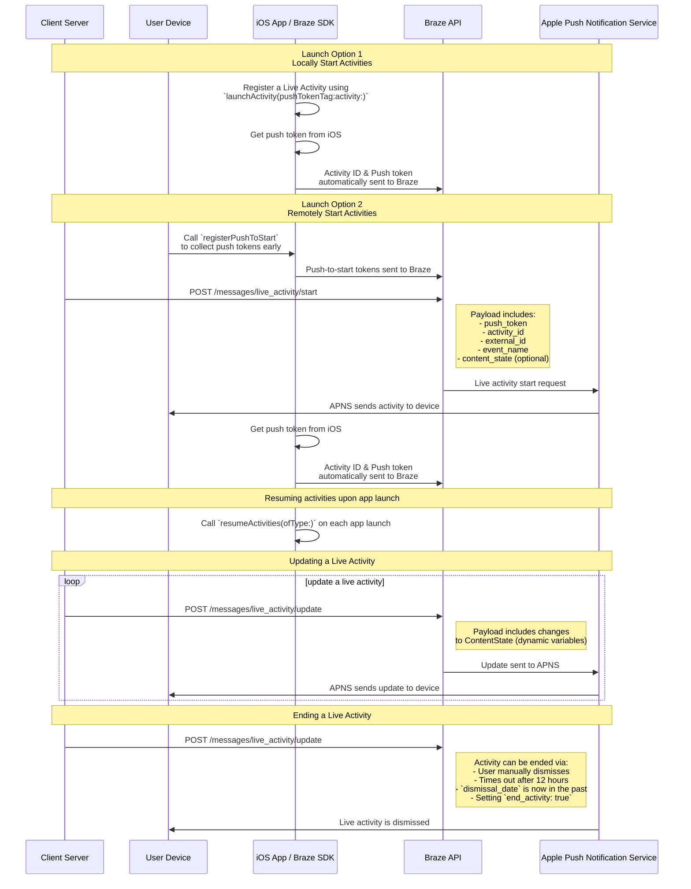

# Live-Aktivitäten für Swift

> Lernen Sie, wie Sie Live-Aktivitäten für das Swift Braze SDK implementieren. Live-Aktivitäten sind persistente, interaktive Benachrichtigungen, die direkt auf dem Sperrbildschirm angezeigt werden und es Nutzern:innen erlauben, dynamische Realtime Updates zu erhalten, ohne ihr Gerät zu entsperren.

## Funktionsweise

{: style="max-width:40%;float:right;margin-left:15px;"}

Live-Aktivitäten stellen eine Kombination aus statischen und dynamischen Informationen dar, die Sie aktualisieren. Sie können zum Beispiel eine Live-Aktivität mit einem Status-Tracker für eine Zustellung erstellen. Diese Live-Aktivität enthält den Namen Ihres Unternehmens als statische Information sowie eine dynamische "Zeit bis zur Lieferung", die aktualisiert wird, wenn sich der Zusteller seinem Ziel nähert.

Als Entwickler können Sie mit Braze Ihre Live-Aktivitäts-Lebenszyklen verwalten, die Braze REST API aufrufen, um Live-Aktivitäts-Updates durchzuführen, und dafür sorgen, dass alle abonnierten Geräte das Update so schnell wie möglich erhalten. Und da Sie die Live-Aktivitäten über Braze verwalten, können Sie sie zusammen mit Ihren anderen Nachrichtenkanälen – Push-Benachrichtigungen, In-App-Nachrichten, Content-Cards – einsetzen, um die Akzeptanz zu steigern.

## Sequenzdiagramm {#sequence-diagram}









## Eine Live-Aktivität implementieren

# Außerdem müssen Sie folgende Angaben machen:

- Stellen Sie sicher, dass Ihr Projekt auf iOS 16.1 oder höher targetiert ist.
- Fügen Sie die Berechtigung `Push Notification` unter **Signing & Capabilities** in Ihrem Xcode-Projekt hinzu.
- Vergewissern Sie sich, dass die Schlüssel von `.p8` zum Senden von Benachrichtigungen verwendet werden. Ältere Dateien wie `.p12` oder `.pem` werden nicht unterstützt.
- Ab Version 8.2.0 des Braze Swift SDK wird die [Remote-Registrierung einer Live-Aktivität](#swift_step-2-start-the-activity) unterstützt. Um dieses Features zu nutzen, ist iOS 17.2 oder höher erforderlich.


Live-Aktivitäten und Push-Benachrichtigungen sind zwar ähnlich, aber ihre Systemberechtigungen sind unterschiedlich. Standardmäßig sind alle Features für Live-Aktivitäten aktiviert, aber die Nutzer können dieses Feature pro App deaktivieren.




### Schritt 1: Eine Aktivität erstellen {#create-an-activity}

Vergewissern Sie sich zunächst, dass Sie in Ihrer iOS-Anwendung Live-Aktivitäten wie unter [Displaying live data with Live Activities](https://developer.apple.com/documentation/activitykit/displaying-live-data-with-live-activities) in der Dokumentation von Apple beschrieben eingerichtet haben. Als Teil dieser Aufgabe stellen Sie sicher, dass Sie `NSSupportsLiveActivities` mit der Einstellung `YES` in Ihr `Info.plist` aufnehmen.

Da die genaue Art Ihrer Live-Aktivität spezifisch für Ihren Geschäftsfall sein wird, müssen Sie die [Aktivitätsobjekte](https://developer.apple.com/documentation/activitykit/activityattributes) einrichten und initialisieren. Insbesondere muss Folgendes definiert werden:
* `ActivityAttributes`: Dieses Protokoll definiert die statischen (unveränderlichen) und die dynamischen (sich ändernden) Inhalte Ihrer Live-Aktivität.
* `ActivityAttributes.ContentState`: Dieser Typ definiert die dynamischen Daten, die im Verlauf der Aktivität aktualisiert werden.

Außerdem verwenden Sie SwiftUI, um die UI-Präsentation des Sperrbildschirms und des Dynamic Island auf unterstützten Geräten zu erstellen. 

Stellen Sie sicher, dass Sie mit den [Voraussetzungen und Einschränkungen](https://developer.apple.com/documentation/activitykit/displaying-live-data-with-live-activities#Understand-constraints) von Apple für Live-Aktivitäten vertraut sind, da diese Einschränkungen unabhängig von Braze sind.


Wenn Sie erwarten, dass Sie häufig Push-Nachrichten an dieselbe Live-Aktivität senden, können Sie vermeiden, dass Sie von Apples Budgetgrenze gedrosselt werden, indem Sie `NSSupportsLiveActivitiesFrequentUpdates` in Ihrer `Info.plist` Datei auf `YES` setzen. Weitere Einzelheiten finden Sie im Abschnitt [`Determine the update frequency`](https://developer.apple.com/documentation/activitykit/updating-and-ending-your-live-activity-with-activitykit-push-notifications#Determine-the-update-frequency) der ActivityKit-Dokumentation.


#### Beispiel

Stellen wir uns vor, wir möchten eine Live-Aktivität erstellen, um unsere Nutzer über die Show Superb Owl auf dem Laufenden zu halten, bei der zwei konkurrierende Tierrettungsorganisationen Punkte für die Eulen erhalten, die sie im Haus haben. Für dieses Beispiel haben wir eine Struktur namens `SportsActivityAttributes` erstellt. Sie können jedoch auch Ihre eigene Implementierung von `ActivityAttributes` verwenden.

```swift
#if canImport(ActivityKit)
  import ActivityKit
#endif

@available(iOS 16.1, *)
struct SportsActivityAttributes: ActivityAttributes {
  public struct ContentState: Codable, Hashable {
    var teamOneScore: Int
    var teamTwoScore: Int
  }

  var gameName: String
  var gameNumber: String
}
```

### Schritt 2: Starten Sie die Aktivität {#start-the-activity}

Wählen Sie zunächst, wie Sie Ihre Aktivität registrieren möchten:

- **Ferngesteuert:** Verwenden Sie die [`registerPushToStart`](<http://braze-inc.github.io/braze-swift-sdk/documentation/brazekit/braze/liveactivities-swift.class/registerpushtostart(fortype:name:)>) Methode zu einem frühen Zeitpunkt im Lebenszyklus Ihres Nutzers und bevor das Push-to-start Token benötigt wird, und starten Sie dann eine Aktivität über den [`/messages/live_activity/start`]({{site.baseurl}}/api/endpoints/messaging/live_activity/start) Endpunkt.
- **Lokalisierung:** Erstellen Sie eine Instanz Ihrer Live-Aktivität und verwenden Sie dann die [`launchActivity`](<https://braze-inc.github.io/braze-swift-sdk/documentation/brazekit/braze/liveactivities-swift.class/launchactivity(pushtokentag:activity:fileid:line:)>) Methode, um Push-Token zu erstellen, die Braze verwalten soll.




Um eine Live-Aktivität remote zu registrieren, ist iOS 17.2 oder höher erforderlich.


#### Schritt 2.1: BrazeKit zu Ihrer Widget-Erweiterung hinzufügen

Wählen Sie im Xcode-Projekt den Namen Ihrer App und dann **Allgemein** aus. Prüfen Sie unter **Frameworks und Bibliotheken**, ob `BrazeKit` aufgeführt ist.


#### Schritt 2.2: Fügen Sie das Protokoll BrazeLiveActivityAttributes hinzu {#brazeActivityAttributes}

Fügen Sie in Ihrer `ActivityAttributes` Implementierung die Konformität mit dem `BrazeLiveActivityAttributes` Protokoll hinzu und fügen Sie dann die Eigenschaft `brazeActivityId` zu Ihrem Attribut-Modell hinzu.


iOS bildet die Eigenschaft `brazeActivityId` auf das entsprechende Feld in Ihrer Push-to-Start-Payload für Live-Aktivitäten ab. Sie sollte also nicht umbenannt oder mit einem anderen Wert versehen werden.


```swift
import BrazeKit

#if canImport(ActivityKit)
  import ActivityKit
#endif

@available(iOS 16.1, *)
// 1. Add the `BrazeLiveActivityAttributes` conformance to your `ActivityAttributes` struct.
struct SportsActivityAttributes: ActivityAttributes, BrazeLiveActivityAttributes {
  public struct ContentState: Codable, Hashable {
    var teamOneScore: Int
    var teamTwoScore: Int
  }

  var gameName: String
  var gameNumber: String

  // 2. Add the `String?` property to represent the activity ID.
  var brazeActivityId: String?
}
```

#### Schritt 2.3: Für Push-to-Start registrieren

Als nächstes registrieren Sie den Typ der Live-Aktivität, damit Braze alle Push-to-Start-Token und Live-Aktivitätsinstanzen, die mit diesem Typ verbunden sind, verfolgen kann.


Das iOS-Betriebssystem erzeugt Push-to-Start-Tokens nur bei der ersten App-Installation nach dem Neustart eines Geräts. Um sicherzustellen, dass Ihre Token zuverlässig registriert sind, rufen Sie `registerPushToStart` in der Methode `didFinishLaunchingWithOptions` auf.


###### Beispiel

Im folgenden Beispiel werden Objekte des Typs "Live-Aktivität" von der Klasse `LiveActivityManager` verarbeitet. Dann erfolgt die Registrierung von `SportActivityAttributes` mit der Methode `registerPushToStart`:

```swift
import BrazeKit

#if canImport(ActivityKit)
  import ActivityKit
#endif

class LiveActivityManager {

  @available(iOS 17.2, *)
  func registerActivityType() {
    // This method returns a Swift background task.
    // You may keep a reference to this task if you need to cancel it wherever appropriate, or ignore the return value if you wish.
    let pushToStartObserver: Task = Self.braze?.liveActivities.registerPushToStart(
      forType: Activity<SportsActivityAttributes>.self,
      name: "SportsActivityAttributes"
    )
  }

}
```

#### Schritt 2.4: Push-to-Start-Benachrichtigung senden

Senden Sie remote eine Push-to-Start-Benachrichtigung über den Endpunkt [`/messages/live_activity/start`]({{site.baseurl}}/api/endpoints/messaging/live_activity/start).



Sie können [Apples ActivityKit Framework](https://developer.apple.com/documentation/activitykit) verwenden, um ein Push-Token zu erhalten, das das Braze SDK für Sie verwalten kann. Damit können Sie Live-Aktivitäten über die Braze API aktualisieren, da Braze das Push-Token an den Apple Push Notification Service (APNs) im Backend sendet.

1. Erstellen Sie eine Instanz Ihrer Live Activity-Implementierung unter Verwendung der ActivityKit-APIs von Apple.
2. Stellen Sie den Parameter `pushType` auf `.token` ein. 
3. Geben Sie die von Ihnen definierten Live-Aktivitäten `ActivitiesAttributes` und `ContentState` ein. 
4. Registrieren Sie Ihre Aktivität bei der Braze-Instanz, indem Sie sie in [`launchActivity(pushTokenTag:activity:)`](https://braze-inc.github.io/braze-swift-sdk/documentation/brazekit/braze/liveactivities-swift.class) übergeben. Der Parameter `pushTokenTag` ist eine von Ihnen definierte Zeichenkette. Sie sollte für jede Live-Aktivität, die Sie erstellen, eindeutig sein.

Sobald Sie die Live-Aktivität registriert haben, extrahiert und beobachtet das Braze SDK Änderungen an den Push-Tokens.

#### Beispiel

Für unser Beispiel erstellen wir eine Klasse namens `LiveActivityManager` als Schnittstelle für unsere Live Activity-Objekte. Dann setzen wir die `pushTokenTag` auf `"sports-game-2024-03-15"`.

```swift
import BrazeKit

#if canImport(ActivityKit)
  import ActivityKit
#endif

class LiveActivityManager {
  
  @available(iOS 16.2, *)
  func createActivity() {
    let activityAttributes = SportsActivityAttributes(gameName: "Superb Owl", gameNumber: "Game 1")
    let contentState = SportsActivityAttributes.ContentState(teamOneScore: "0", teamTwoScore: "0")
    let activityContent = ActivityContent(state: contentState, staleDate: nil)
    if let activity = try? Activity.request(attributes: activityAttributes,
                                            content: activityContent,
      // Setting your pushType as .token allows the Activity to generate push tokens for the server to watch.
                                            pushType: .token) {
      // Register your Live Activity with Braze using the pushTokenTag.
      // This method returns a Swift background task.
      // You may keep a reference to this task if you need to cancel it wherever appropriate, or ignore the return value if you wish.
      let liveActivityObserver: Task = AppDelegate.braze?.liveActivities.launchActivity(pushTokenTag: "sports-game-2024-03-15",
                                                                                        activity: activity)
    }
  }
  
}
```

Ihr Live-Aktivitäts-Widget zeigt Ihren Nutzern diese ersten Inhalte an. 

{: style="max-width:40%;"}



### Schritt 3: Tracking der Lebenslaufaktivitäten {#resume-activity-tracking}

So stellen Sie sicher, dass Braze Ihre Live-Aktivitäten beim Start der App verfolgt:

1. Öffnen Sie Ihre `AppDelegate` Datei.
2. Importieren Sie das Modul `ActivityKit`, wenn es verfügbar ist.
3. Rufen Sie [`resumeActivities(ofType:)`](https://braze-inc.github.io/braze-swift-sdk/documentation/brazekit/braze/liveactivities-swift.class/resumeactivities(oftype:))`ActivityAttributes` in `application(_:didFinishLaunchingWithOptions:)` für alle Typen auf, die Sie in Ihrer Anwendung registriert haben.

Dadurch kann Braze die Aufgaben zur Verfolgung von Push-Token-Aktualisierungen für alle aktiven Live-Aktivitäten wieder aufnehmen. Beachten Sie, dass die Live-Aktivität als entfernt gilt, wenn ein Benutzer sie explizit von seinem Gerät entfernt hat, und dass Braze sie dann nicht mehr verfolgt.

###### Beispiel

```swift
import UIKit
import BrazeKit

#if canImport(ActivityKit)
  import ActivityKit
#endif

@main
class AppDelegate: UIResponder, UIApplicationDelegate {

  static var braze: Braze? = nil

  func application(
    _ application: UIApplication,
    didFinishLaunchingWithOptions launchOptions: [UIApplication.LaunchOptionsKey: Any]?
  ) -> Bool {
    
    if #available(iOS 16.1, *) {
      Self.braze?.liveActivities.resumeActivities(
        ofType: Activity<SportsActivityAttributes>.self
      )
    }

    return true
  }
}
```

### Schritt 4: Aktualisieren Sie die Aktivität {#update-the-activity}

{: style="max-width:40%;float:right;margin-left:15px;"}

Über den Endpunkt [`/messages/live_activity/update`]({{site.baseurl}}/api/endpoints/messaging/live_activity/update) können Sie eine Live-Aktivität durch Push-Benachrichtigungen aktualisieren, die über die Braze REST API übermittelt werden. Verwenden Sie diesen Endpunkt, um den `ContentState` Ihrer Live-Aktivität zu aktualisieren.

Durch die Aktualisierung von `ContentState` werden im Widget "Live-Aktivität" die neuen Informationen angezeigt. So könnte die Superb Owl Show am Ende der ersten Hälfte aussehen.

Ausführliche Informationen finden Sie in unserem Artikel [`/messages/live_activity/update` endpoint]({{site.baseurl}}/api/endpoints/messaging/live_activity/update).

### Schritt 5: Beenden Sie die Aktivität {#end-the-activity}

Wenn eine Live-Aktivität aktiv ist, wird sie sowohl auf dem Sperrbildschirm des Nutzers als auch in der Dynamic Island angezeigt. Es gibt verschiedene Möglichkeiten, eine Live-Aktivität zu beenden und aus der UI eines Nutzers zu entfernen. 

* **Ausblendung durch den Nutzer**: Ein Benutzer kann eine Live-Aktivität manuell beenden.
* **Timeout**: Nach einer Standardzeit von 8 Stunden entfernt iOS die Live-Aktivität aus der Dynamic Island des Nutzers. Nach einer Standardzeit von 12 Stunden entfernt iOS die Live-Aktivität vom Sperrbildschirm des Nutzers. 
* **Ausblendungsdatum**: Sie können ein Datum angeben, zu dem eine Live-Aktivität vor Ablauf der Zeit aus der Benutzeroberfläche entfernt werden soll. Dieses wird entweder in der `ActivityUIDismissalPolicy` der Aktivität oder über den Parameter `dismissal_date` in Anfragen an den Endpunkt `/messages/live_activity/update` definiert.
* **Beenden der Aktivität**: Sie können `end_activity` in einer Anfrage an den Endpunkt `/messages/live_activity/update` auf `true` setzen, um eine Live-Aktivität sofort zu beenden.

Ausführliche Informationen finden Sie in unserem Artikel [`/messages/live_activity/update` endpoint]({{site.baseurl}}/api/endpoints/messaging/live_activity/update).

## Häufig gestellte Fragen (FAQ) {#faq}

### Funktionalität und Unterstützung

#### Welche Plattformen unterstützen Live-Aktivitäten?

Live-Aktivitäten sind derzeit nur unter iOS als Feature verfügbar. Der Artikel "Live-Aktivitäten" beschreibt die [Voraussetzungen]({{site.baseurl}}/developer_guide/platforms/swift/live_activities/#prerequisites) für die Verwaltung von Live-Aktivitäten über das Braze Swift SDK.

#### Unterstützen React Native-Anwendungen Live-Aktivitäten?

Ja, React Native SDK 3.0.0+ unterstützt Live-Aktivitäten über das Braze Swift SDK. Das bedeutet, dass Sie React Native iOS Code direkt an den Anfang des Braze Swift SDK schreiben müssen. 

Es gibt keine React Native-spezifische JavaScript-API für Live-Aktivitäten, da die von Apple bereitgestellten Features für Live-Aktivitäten Sprachen verwenden, die nicht in JavaScript übersetzbar sind (z. B. Swift Concurrency, Generics, SwiftUI).

#### Unterstützt Braze Live-Aktivitäten als eine Kampagne oder einen Canvas-Schritt?

Nein, dies wird derzeit nicht unterstützt.

### Push-Benachrichtigungen und Live-Aktivitäten

#### Was passiert, wenn während einer aktiven Live-Aktivität eine Push-Benachrichtigung gesendet wird? 

{: style="max-width:30%;float:right;margin-left:15px;"}

Live-Aktivitäten und Push-Benachrichtigungen belegen unterschiedlichen Platz auf dem Bildschirm und stehen nicht im Konflikt mit dem Bildschirm des Benutzers.

#### Wenn Live-Aktivitäten die Push-Nachrichtenfunktion nutzen, müssen dann Push-Benachrichtigungen aktiviert sein, um Live-Aktivitäten zu empfangen?

Während Live-Aktivitäten auf Push-Benachrichtigungen für Aktualisierungen angewiesen sind, werden diese durch unterschiedliche Benutzereinstellungen gesteuert. Nutzer haben die Möglichkeit, sich für Live-Aktivitäten anzumelden und für Push-Benachrichtigungen abzumelden und umgekehrt.

Live Activity Update-Token verfallen nach acht Stunden.

#### Sind für Live-Aktivitäten Push-Primer erforderlich?

[Push-Benachrichtigungen]({{site.baseurl}}/user_guide/message_building_by_channel/push/best_practices/push_primer_messages/) sind eine bewährte Methode, um Ihre Benutzer aufzufordern, sich für Push-Benachrichtigungen von Ihrer App zu entscheiden. Es gibt jedoch keine Systemaufforderung, um sich für Live-Aktivitäten anzumelden. Nutzer werden standardmäßig für eine einzelne App für Live-Aktivitäten angemeldet, wenn die betreffende App unter iOS 16.1 oder höher installiert wird. Diese Berechtigung kann in den Geräteeinstellungen für jede App einzeln deaktiviert oder wieder aktiviert werden.

### Technische Themen und Fehlerbehebung

#### Wie erkenne ich, ob Live Activities Fehler aufweist?

Fehler in Bezug auf Live-Aktivitäten werden im Braze-Dashboard im [Nachrichten-Aktivitätsprotokoll]({{site.baseurl}}/user_guide/administrative/app_settings/message_activity_log_tab/) protokolliert, das Sie nach "LiveActivity-Fehlern" filtern können.

#### Warum habe ich nach dem Senden einer Push-to-Start-Benachrichtigung meine Live-Aktivität nicht erhalten?

Überprüfen Sie zunächst, ob die Nutzlast alle erforderlichen Felder enthält, die im Endpunkt [`messages/live_activity/start`]({{site.baseurl}}/api/endpoints/messaging/live_activity/start) beschrieben sind. Die Felder `activity_attributes` und `content_state` sollten mit den im Code Ihres Projekts definierten Eigenschaften übereinstimmen. Ist die Nutzlast korrekt, kann es sein, dass ein Rate-Limit durch APNs vorliegt. Dieses Limit wird von Apple festgelegt und nicht von Braze.

Um zu überprüfen, ob Ihre Push-to-Start-Benachrichtigung erfolgreich auf dem Gerät angekommen ist, aber aufgrund von Ratenbeschränkungen nicht angezeigt wurde, können Sie Ihr Projekt mit der Konsolen-App auf Ihrem Mac debuggen. Hängen Sie den Aufzeichnungsprozess für Ihr gewünschtes Gerät an und filtern Sie dann die Protokolle nach `process:liveactivitiesd` in der Suchleiste.

#### Warum empfängt meine Live Activity nach dem Start mit Push-to-Start keine neuen Updates?

Überprüfen Sie, ob Sie die [oben](#swift_brazeActivityAttributes) beschriebenen Anweisungen korrekt umgesetzt haben. Ihre `ActivityAttributes` sollte sowohl die `BrazeLiveActivityAttributes` Protokollkonformität als auch die Eigenschaft `brazeActivityId` enthalten.

Nachdem Sie eine Push-Benachrichtigung über eine Live-Aktivität erhalten haben, überprüfen Sie, ob Sie eine ausgehende Netzwerkanfrage an den Endpunkt `/push_token_tag` Ihrer Braze-URL sehen können und ob diese die korrekte Aktivitäts-ID unter dem Feld `"tag"` enthält.

#### Ich erhalte die Antwort "Zugriff verweigert", wenn ich versuche, den Endpunkt `live_activity/update` zu verwenden. Und warum?

Die API-Schlüssel, die Sie verwenden, müssen mit den richtigen Berechtigungen für den Zugriff auf die verschiedenen Braze-API-Endpunkte ausgestattet sein. Wenn Sie einen zuvor erstellten API-Schlüssel verwenden, haben Sie möglicherweise versäumt, dessen Berechtigungen zu aktualisieren. Ausführlichere Informationen finden Sie in unserer [Übersicht zur Sicherheit von API-Schlüsseln]({{site.baseurl}}/api/basics/#rest-api-key-security).

#### Hat der Endpunkt `messages/send` die gleichen Tarifgrenzen wie der Endpunkt `messages/live_activity/update`? 

Standardmäßig liegt das Rate-Limit für den Endpunkt `messages/live_activity/update` bei 250.000 Anfragen pro Stunde und Workspace und über mehrere Endpunkte hinweg. Weitere Informationen finden Sie in den [API-Tarifgrenzen]({{site.baseurl}}/api/api_limits/).
