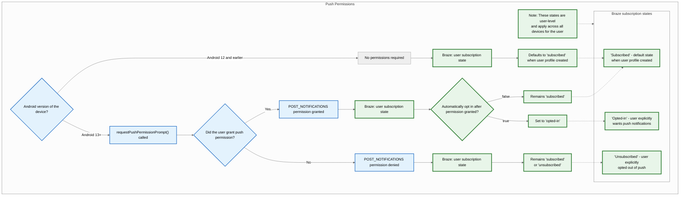
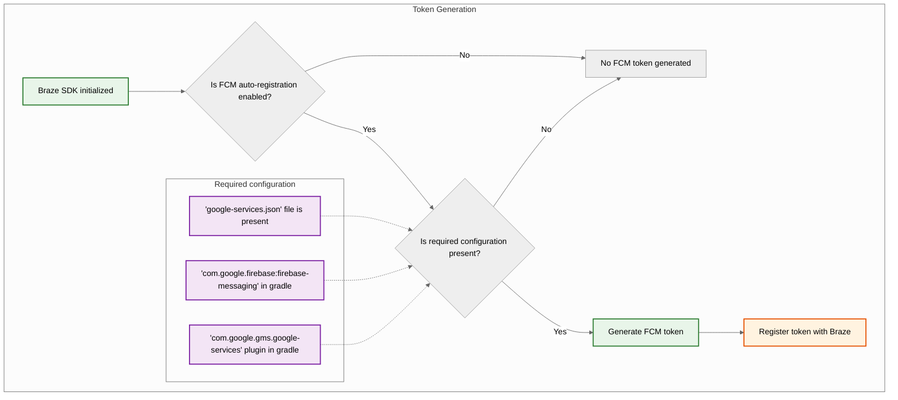
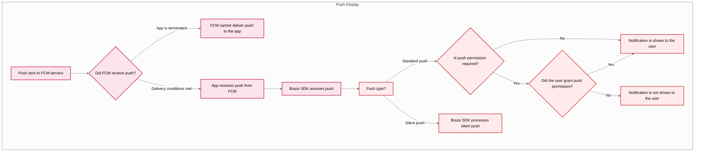



## Eingebaute Features

Die folgenden Features sind in das Braze Android SDK integriert. Um andere Features für Push-Benachrichtigungen zu nutzen, müssen Sie für Ihre App [Push-Benachrichtigungen einrichten](#android_setting-up-push-notifications).

|Feature|Beschreibung|
|-------|-----------|
|Push-Storys|Android Push-Stories sind standardmäßig in das Braze Android SDK integriert. Weitere Informationen finden Sie unter [Push-Storys]({{site.baseurl}}/user_guide/message_building_by_channel/push/advanced_push_options/push_stories/).|
|Push Primer|Push-Benachrichtigungskampagnen ermutigen Ihre Nutzer:innen, Push-Benachrichtigungen auf ihrem Gerät für Ihre App zu aktivieren. Dies kann ohne SDK-Anpassung mit unserem [No Code Push Primer]({{site.baseurl}}/user_guide/message_building_by_channel/push/best_practices/push_primer_messages/) geschehen.|
{: .reset-td-br-1 .reset-td-br-2 role="presentation"}

## Über den Lebenszyklus der Push-Benachrichtigung {#push-notification-lifecycle}

Das folgende Flussdiagramm zeigt, wie Braze den Lebenszyklus der Push-Benachrichtigung handhabt, z. B. die Aufforderung zur Erteilung von Genehmigungen, die Generierung von Token und die Zustellung von Nachrichten.















## Push-Benachrichtigungen einrichten


Ein Beispiel für eine App, die FCM mit dem Braze Android SDK verwendet, finden Sie unter [Braze: Beispiel-App für Firebase Push](https://github.com/braze-inc/braze-android-sdk/tree/master/samples/firebase-push).


### Rate-Limits

Die Firebase Cloud Messaging (FCM) API hat ein standardmäßiges Rate-Limit von 600.000 Anfragen pro Minute. Wenn Sie dieses Limit erreichen, wird Braze es in einigen Minuten automatisch erneut versuchen. Um eine Erhöhung anzufordern, wenden Sie sich an den [Firebase Support](https://firebase.google.com/support).

### Schritt 1: Fügen Sie Firebase zu Ihrem Projekt hinzu

Fügen Sie zunächst Firebase zu Ihrem Android-Projekt hinzu. Eine schrittweise Anleitung finden Sie in der [Firebase-Einrichtungsanleitung](https://firebase.google.com/docs/android/setup) von Google.

### Schritt 2: Fügen Sie Cloud Messaging zu Ihren Abhängigkeiten hinzu

Als Nächstes fügen Sie die Cloud Messaging Bibliothek zu Ihren Projektabhängigkeiten hinzu. Öffnen Sie in Ihrem Android-Projekt `build.gradle` und fügen Sie die folgende Zeile zum `dependencies`-Block hinzu.

```gradle
implementation "google.firebase:firebase-messaging:+"
```

Ihre Abhängigkeiten sollten in etwa wie folgt aussehen:

```gradle
dependencies {
  implementation project(':android-sdk-ui')
  implementation "com.google.firebase:firebase-messaging:+"
}
```

### Schritt 3: Firebase Cloud Messaging API aktivieren

Wählen Sie in Google Cloud das Projekt aus, das Ihre Android-App verwendet, und aktivieren Sie dann die [Firebase Cloud Messaging API](https://console.cloud.google.com/apis/library/fcm.googleapis.com).

{: style="max-width:80%;"}

### Schritt 4: Ein Dienst-Konto erstellen {#service-account}

Als nächstes erstellen Sie ein neues Dienst-Konto, damit Braze bei der Registrierung von FCM-Tokens autorisierte API-Aufrufe tätigen kann. Gehen Sie in Google Cloud zu **Servicekonten** und wählen Sie dann Ihr Projekt aus. Auf der Seite **Serviceleistungen; Dienste** wählen Sie **Servicekonto erstellen**.


Geben Sie einen Namen, eine ID und eine Beschreibung für das Dienstkonto ein und wählen Sie **Erstellen und fortfahren**.


Suchen Sie im Feld **Rolle** nach **Firebase Cloud Messaging API Admin** und wählen Sie es in der Liste der Rollen aus. Für einen restriktiveren Zugriff erstellen Sie eine [angepasste Rolle](https://cloud.google.com/iam/docs/creating-custom-roles) mit der Berechtigung `cloudmessaging.messages.create` und wählen diese dann aus der Liste aus. Wenn Sie fertig sind, wählen Sie **Fertig**.


Stellen Sie sicher, dass Sie **Firebase Cloud Messaging _API_ Admin** auswählen, nicht **Firebase Cloud Messaging Admin**.



### Schritt 5: JSON-Zugangsdaten generieren {#json}

Als nächstes generieren Sie JSON-Zugangsdaten für Ihr FCM Dienst-Konto. Gehen Sie in Google Cloud IAM & Admin auf **Dienstkonten** und wählen Sie Ihr Projekt aus. Suchen Sie das FCM Dienst-Konto [, das Sie zuvor erstellt haben](#android_service-account), und wählen Sie dann <i class="fa-solid fa-ellipsis-vertical"></i> **Aktionen** > Schlüssel verwalten.


Wählen Sie **Schlüssel hinzufügen** > **Neuen Schlüssel erstellen**.


Wählen Sie **JSON** und wählen Sie dann **Erstellen**. Wenn Sie Ihr Dienstkonto mit einer anderen Google Cloud Projekt ID als Ihrer FCM Projekt ID erstellt haben, müssen Sie den der `project_id` zugewiesenen Wert in Ihrer JSON-Datei manuell aktualisieren.

Merken Sie sich, wo Sie den Schlüssel heruntergeladen haben - Sie brauchen ihn im nächsten Schritt.

{: style="max-width:65%;"}


Private Keys können ein Sicherheitsrisiko darstellen, wenn sie kompromittiert werden. Speichern Sie Ihre JSON-Zugangsdaten vorerst an einem sicheren Standort - Sie werden Ihren Schlüssel löschen, nachdem Sie ihn auf Braze hochgeladen haben.


### Schritt 6: Laden Sie Ihre JSON Zugangsdaten zu Braze hoch

Als nächstes laden Sie Ihre JSON-Zugangsdaten auf Ihr Braze-Dashboard hoch. Wählen Sie in Braze <i class="fa-solid fa-gear"></i> **Einstellungen** > **App-Einstellungen**.


Wählen Sie in den **Einstellungen für Push-Benachrichtigungen** Ihrer Android App **Firebase** aus, wählen Sie dann **JSON-Datei hochladen** und laden Sie die Zugangsdaten hoch, [die Sie zuvor generiert haben](#android_json). Wenn Sie fertig sind, wählen Sie **Speichern**.



Private Keys können ein Sicherheitsrisiko darstellen, wenn sie kompromittiert werden. Jetzt, nachdem Ihr Schlüssel auf Braze hochgeladen wurde, löschen Sie die Datei, [die Sie zuvor erzeugt haben](#android_json).


### Schritt 7: Automatische Token-Registrierung einrichten

Wenn einer Ihrer Nutzer:innen für Push-Benachrichtigungen opt-in ist, muss Ihre App ein FCM Token auf seinem Gerät generieren, bevor Sie ihm Push-Benachrichtigungen senden können. Mit dem Braze SDK können Sie die automatische FCM Token-Registrierung für das Gerät jedes Nutzers:innen in den Braze-Konfigurationsdateien Ihres Projekts aktivieren.

Gehen Sie zunächst zur Firebase-Konsole, öffnen Sie Ihr Projekt und wählen Sie dann <i class="fa-solid fa-gear"></i> **Einstellungen** > **Projekteinstellungen**.


Wählen Sie **Cloud Messaging** und kopieren Sie dann unter **Firebase Cloud Messaging API (V1)** die Nummer in das Feld **Absender-ID**.


Als nächstes öffnen Sie Ihr Android Studio Projekt und verwenden Ihre Firebase Sender ID, um die automatische Registrierung von FCM Token in Ihrem `braze.xml` oder `BrazeConfig` zu aktivieren.



Um die automatische FCM Token-Registrierung zu konfigurieren, fügen Sie die folgenden Zeilen in Ihre `braze.xml`-Datei ein:

```xml
<bool translatable="false" name="com_braze_firebase_cloud_messaging_registration_enabled">true</bool>
<string translatable="false" name="com_braze_firebase_cloud_messaging_sender_id">FIREBASE_SENDER_ID</string>
```

Ersetzen Sie `FIREBASE_SENDER_ID` durch den Wert, den Sie aus den Einstellungen Ihres Firebase-Projekts kopiert haben. Ihre `braze.xml` sollte etwa so aussehen wie die folgende:

```xml
<?xml version="1.0" encoding="utf-8"?>
<resources>
  <string translatable="false" name="com_braze_api_key">12345ABC-6789-DEFG-0123-HIJK456789LM</string>
  <bool translatable="false" name="com_braze_firebase_cloud_messaging_registration_enabled">true</bool>
<string translatable="false" name="com_braze_firebase_cloud_messaging_sender_id">603679405392</string>
</resources>
```



Um die automatische FCM Token-Registrierung zu konfigurieren, fügen Sie die folgenden Zeilen in `BrazeConfig` ein:



```java
.setIsFirebaseCloudMessagingRegistrationEnabled(true)
.setFirebaseCloudMessagingSenderIdKey("FIREBASE_SENDER_ID")
```


```kotlin
.setIsFirebaseCloudMessagingRegistrationEnabled(true)
.setFirebaseCloudMessagingSenderIdKey("FIREBASE_SENDER_ID")
```



Ersetzen Sie `FIREBASE_SENDER_ID` durch den Wert, den Sie aus den Einstellungen Ihres Firebase-Projekts kopiert haben. Ihre `BrazeConfig` sollte etwa so aussehen wie die folgende:



```java
BrazeConfig brazeConfig = new BrazeConfig.Builder()
  .setApiKey("12345ABC-6789-DEFG-0123-HIJK456789LM")
  .setCustomEndpoint("sdk.iad-01.braze.com")
  .setSessionTimeout(60)
  .setHandlePushDeepLinksAutomatically(true)
  .setGreatNetworkDataFlushInterval(10)
  .setIsFirebaseCloudMessagingRegistrationEnabled(true)
  .setFirebaseCloudMessagingSenderIdKey("603679405392")
  .build();
Braze.configure(this, brazeConfig);
```


```kotlin
val brazeConfig = BrazeConfig.Builder()
  .setApiKey("12345ABC-6789-DEFG-0123-HIJK456789LM")
  .setCustomEndpoint("sdk.iad-01.braze.com")
  .setSessionTimeout(60)
  .setHandlePushDeepLinksAutomatically(true)
  .setGreatNetworkDataFlushInterval(10)
  .setIsFirebaseCloudMessagingRegistrationEnabled(true)
  .setFirebaseCloudMessagingSenderIdKey("603679405392")
  .build()
Braze.configure(this, brazeConfig)
```




Wenn Sie FCM Token stattdessen manuell registrieren möchten, können Sie [`Braze.setRegisteredPushToken()`](https://braze-inc.github.io/braze-android-sdk/kdoc/braze-android-sdk/com.braze/-braze/registered-push-token.html) in die [`onCreate()`](https://developer.android.com/reference/android/app/Application.html#onCreate())-Methode Ihrer App.




### Schritt 8: Entfernen Sie automatische Anfragen in Ihrer Anwendungsklasse

Um zu verhindern, dass Braze jedes Mal, wenn Sie stille Push-Benachrichtigungen senden, unnötige Netzwerkanfragen auslöst, entfernen Sie alle automatischen Netzwerkanfragen, die in der Methode `onCreate()` der Klasse `Application` konfiguriert sind. Weitere Informationen finden Sie unter [Android Developer Reference: Application](https://developer.android.com/reference/android/app/Application).

## Anzeigen von Benachrichtigungen

### Schritt 1: Registrieren Sie den Braze Firebase Messaging Dienst

Sie können entweder einen neuen, bestehenden oder einen nicht von Braze stammenden Firebase Messaging Dienst erstellen. Wählen Sie, was am besten zu Ihren speziellen Bedürfnissen passt.



Braze enthält einen Dienst, der Push-Empfang und Öffnung von Absichten verarbeitet. Unsere Klasse `BrazeFirebaseMessagingService` muss in Ihrem `AndroidManifest.xml` registriert werden:

```xml
<service android:name="com.braze.push.BrazeFirebaseMessagingService"
  android:exported="false">
  <intent-filter>
    <action android:name="com.google.firebase.MESSAGING_EVENT" />
  </intent-filter>
</service>
```

Unser Code für Benachrichtigungen verwendet auch `BrazeFirebaseMessagingService`, um das Tracking von Öffnungen und Klicks zu steuern. Dieser Dienst muss in `AndroidManifest.xml` registriert sein, um korrekt zu funktionieren. Denken Sie auch daran, dass Braze den Benachrichtigungen aus unserem System einen eindeutigen Schlüssel voranstellt, so dass wir nur Benachrichtigungen wiedergeben, die von unseren Systemen gesendet werden. Sie können zusätzliche Dienste separat registrieren, um die von anderen FCM Diensten gesendeten Benachrichtigungen anzuzeigen. Siehe [`AndroidManifest.xml`](https://github.com/braze-inc/braze-android-sdk/blob/master/samples/firebase-push/src/main/AndroidManifest.xml) in der Firebase Push Beispiel App.


Vor Braze SDK 3.1.1 wurde `AppboyFcmReceiver` verwendet, um FCM Push zu verarbeiten. Die Klasse `AppboyFcmReceiver` sollte aus Ihrem Manifest entfernt und durch die vorangehende Integration ersetzt werden.




Wenn Sie bereits einen Firebase Messaging-Dienst registriert haben, können Sie [`RemoteMessage`](https://firebase.google.com/docs/reference/android/com/google/firebase/messaging/RemoteMessage)-Objekte an Braze über [`BrazeFirebaseMessagingService.handleBrazeRemoteMessage()`](https://braze-inc.github.io/braze-android-sdk/kdoc/braze-android-sdk/com.braze.push/-braze-firebase-messaging-service/-companion/handle-braze-remote-message.html) übergeben. Diese Methode zeigt nur dann eine Benachrichtigung an, wenn das [`RemoteMessage`](https://firebase.google.com/docs/reference/android/com/google/firebase/messaging/RemoteMessage) Objekt von Braze stammt, andernfalls wird es sicher ignoriert.




```java
public class MyFirebaseMessagingService extends FirebaseMessagingService {
  @Override
  public void onMessageReceived(RemoteMessage remoteMessage) {
    super.onMessageReceived(remoteMessage);
    if (BrazeFirebaseMessagingService.handleBrazeRemoteMessage(this, remoteMessage)) {
      // This Remote Message originated from Braze and a push notification was displayed.
      // No further action is needed.
    } else {
      // This Remote Message did not originate from Braze.
      // No action was taken and you can safely pass this Remote Message to other handlers.
    }
  }
}
```




```kotlin
class MyFirebaseMessagingService : FirebaseMessagingService() {
  override fun onMessageReceived(remoteMessage: RemoteMessage?) {
    super.onMessageReceived(remoteMessage)
    if (BrazeFirebaseMessagingService.handleBrazeRemoteMessage(this, remoteMessage)) {
      // This Remote Message originated from Braze and a push notification was displayed.
      // No further action is needed.
    } else {
      // This Remote Message did not originate from Braze.
      // No action was taken and you can safely pass this Remote Message to other handlers.
    }
  }
}
```






Wenn Sie einen anderen Firebase-Messaging-Dienst haben, den Sie verwenden möchten, können Sie auch einen Fallback-Dienst angeben, der aufgerufen wird, wenn Ihre Anwendung einen Push erhält, der nicht von Braze stammt.

Geben Sie in Ihrem `braze.xml` an:

```xml
<bool name="com_braze_fallback_firebase_cloud_messaging_service_enabled">true</bool>
<string name="com_braze_fallback_firebase_cloud_messaging_service_classpath">com.company.OurFirebaseMessagingService</string>
```

oder stellen Sie die [Laufzeitkonfiguration]({{site.baseurl}}/developer_guide/sdk_initalization/?sdktab=android) ein:




```java
BrazeConfig brazeConfig = new BrazeConfig.Builder()
        .setFallbackFirebaseMessagingServiceEnabled(true)
        .setFallbackFirebaseMessagingServiceClasspath("com.company.OurFirebaseMessagingService")
        .build();
Braze.configure(this, brazeConfig);
```




```kotlin
val brazeConfig = BrazeConfig.Builder()
        .setFallbackFirebaseMessagingServiceEnabled(true)
        .setFallbackFirebaseMessagingServiceClasspath("com.company.OurFirebaseMessagingService")
        .build()
Braze.configure(this, brazeConfig)
```






### Schritt 2: Kleine Symbole an die Designrichtlinien anpassen

Allgemeine Informationen über Android-Benachrichtigungssymbole finden Sie in der [Übersicht über die Benachrichtigungen](https://developer.android.com/guide/topics/ui/notifiers/notifications).

Ab Android N sollten Sie kleine Benachrichtigungssymbole, die Farbe enthalten, aktualisieren oder entfernen. Das Android-System (nicht das Braze SDK) ignoriert alle Nicht-Alpha- und Transparenzkanäle in Aktionssymbolen und dem kleinen Benachrichtigungssymbol. Mit anderen Worten: Android wandelt alle Teile Ihres kleinen Benachrichtigungssymbols in einfarbig um, mit Ausnahme der transparenten Bereiche.

So erstellen Sie ein kleines Benachrichtigungssymbol-Asset, das korrekt angezeigt wird:
- Entfernen Sie alle Farben mit Ausnahme von Weiß aus dem Bild.
- Alle anderen nicht-weißen Bereiche des Assets sollten transparent sein.


Ein häufiges Symptom für ein ungeeignetes Asset ist das kleine Benachrichtigungssymbol, das als einfarbiges Quadrat dargestellt wird. Das liegt daran, dass das Android-System keine transparenten Bereiche in den kleinen Benachrichtigungssymbolen finden kann.


Die nachfolgend abgebildeten großen und kleinen Symbole sind Beispiele für richtig gestaltete Symbole:


### Schritt 3: Benachrichtigungssymbole konfigurieren {#configure-icons}

#### Festlegen von Symbolen in braze.xml

Braze ermöglicht es Ihnen, Ihre Benachrichtigungssymbole zu konfigurieren, indem Sie zeichenbare Ressourcen in Ihrer `braze.xml` angeben:

```xml
<drawable name="com_braze_push_small_notification_icon">REPLACE_WITH_YOUR_ICON</drawable>
<drawable name="com_braze_push_large_notification_icon">REPLACE_WITH_YOUR_ICON</drawable>
```

Die Einstellung eines kleinen Benachrichtigungssymbols ist erforderlich. **Wenn Sie dies nicht tun, verwendet Braze standardmäßig das Anwendungssymbol als kleines Benachrichtigungssymbol, was nicht optimal aussehen kann.**

Die Einstellung eines großen Benachrichtigungssymbols ist optional, wird aber empfohlen.

#### Festlegen der Akzentfarbe des Symbols

Die Akzentfarbe des Benachrichtigungssymbols kann in Ihrem `braze.xml` überschrieben werden. Wenn die Farbe nicht angegeben wird, ist die Standardfarbe das gleiche Grau, das Lollipop für Systembenachrichtigungen verwendet.

```xml
<integer name="com_braze_default_notification_accent_color">0xFFf33e3e</integer>
```

Optional können Sie auch eine Farbreferenzierung verwenden:

```xml
<color name="com_braze_default_notification_accent_color">@color/my_color_here</color>
```

### Schritt 4: Deeplinks hinzufügen

#### Enablement der automatischen Öffnung von Deeplinks

Um Braze zu ermöglichen, Ihre App und alle Deeplinks automatisch zu öffnen, wenn auf eine Push-Benachrichtigung geklickt wird, setzen Sie `com_braze_handle_push_deep_links_automatically` auf `true`, und zwar in Ihrer `braze.xml`:

```xml
<bool name="com_braze_handle_push_deep_links_automatically">true</bool>
```

Dieses Flag kann auch über die [Laufzeitkonfiguration]({{site.baseurl}}/developer_guide/sdk_initalization/?sdktab=android) gesetzt werden:




```java
BrazeConfig brazeConfig = new BrazeConfig.Builder()
        .setHandlePushDeepLinksAutomatically(true)
        .build();
Braze.configure(this, brazeConfig);
```




```kotlin
val brazeConfig = BrazeConfig.Builder()
        .setHandlePushDeepLinksAutomatically(true)
        .build()
Braze.configure(this, brazeConfig)
```




Wenn Sie Deeplinks anpassen möchten, müssen Sie einen Push-Callback erstellen, der auf empfangene Push-Nachrichten und geöffnete Absichten von Braze wartet. Weitere Informationen finden Sie unter [Verwendung eines Callbacks für Push-Ereignisse]({{site.baseurl}}/developer_guide/push_notifications/customization#android_using-a-callback-for-push-events).

#### Erstellenvon angepassten Deeplinks

Befolgen Sie die Anweisungen in der [Dokumentation für Android-Entwickler](http://developer.android.com/training/app-indexing/deep-linking.html):in zum Thema Deeplinks setzen, wenn Sie Ihrer App noch keine Deeplinks hinzugefügt haben. Weitere Informationen zu Deeplinks finden Sie in unserem [FAQ-Artikel]({{site.baseurl}}/user_guide/personalization_and_dynamic_content/deep_linking_to_in-app_content/#what-is-deep-linking).

#### Hinzufügen von Deeplinks

Das Braze-Dashboard unterstützt das Setzen von Deeplinks oder Internet-URLs in Push-Benachrichtigungs-Kampagnen und Canvase, die geöffnet werden, wenn die Benachrichtigung angeklickt wird.


#### Anpassen des Back-Stack-Verhaltens

Standardmäßig platziert das Android SDK die Hauptaktivität Ihrer Host App im Back Stack, wenn Push-Deeplinks gefolgt wird. Braze erlaubt es Ihnen, eine angepasste Aktivität so einzustellen, dass sie sich im Back Stack anstelle der Hauptaktivität des Launchers öffnet, oder den Back Stack ganz zu deaktivieren.

Um zum Beispiel eine Aktivität namens `YourMainActivity` als Back Stack-Aktivität festzulegen, verwenden Sie die [Laufzeitkonfiguration]({{site.baseurl}}/developer_guide/sdk_initalization/?sdktab=android):




```java
BrazeConfig brazeConfig = new BrazeConfig.Builder()
        .setPushDeepLinkBackStackActivityEnabled(true)
        .setPushDeepLinkBackStackActivityClass(YourMainActivity.class)
        .build();
Braze.configure(this, brazeConfig);
```




```kotlin
val brazeConfig = BrazeConfig.Builder()
        .setPushDeepLinkBackStackActivityEnabled(true)
        .setPushDeepLinkBackStackActivityClass(YourMainActivity.class)
        .build()
Braze.configure(this, brazeConfig)
```




Sehen Sie sich die entsprechende Konfiguration für Ihr `braze.xml` an. Beachten Sie, dass der Klassenname derselbe sein muss wie der von `Class.forName()` zurückgegebene.

```xml
<bool name="com_braze_push_deep_link_back_stack_activity_enabled">true</bool>
<string name="com_braze_push_deep_link_back_stack_activity_class_name">your.package.name.YourMainActivity</string>
```

### Schritt 5: Benachrichtigungskanäle definieren

Das Braze Android SDK unterstützt [Android-Benachrichtigungskanäle](https://developer.android.com/preview/features/notification-channels.html). Wenn eine Braze-Benachrichtigung keine ID für einen Benachrichtigungskanal enthält oder eine Braze-Benachrichtigung eine ungültige ID für den Kanal enthält, zeigt Braze die Benachrichtigung mit dem im SDK definierten Standard-Benachrichtigungskanal an. Nutzer:innen von Braze verwenden [Android Benachrichtigungskanäle]({{site.baseurl}}/user_guide/message_building_by_channel/push/android/notification_channels/) innerhalb der Plattform, um Benachrichtigungen zu gruppieren.

Um den Nutzernamen des standardmäßigen Braze-Benachrichtigungskanals festzulegen, verwenden Sie [`BrazeConfig.setDefaultNotificationChannelName()`](https://braze-inc.github.io/braze-android-sdk/kdoc/braze-android-sdk/com.braze.configuration/-braze-config/-builder/set-default-notification-channel-name.html).

Um die Nutzerbeschreibung des standardmäßigen Braze-Benachrichtigungskanals festzulegen, verwenden Sie [`BrazeConfig.setDefaultNotificationChannelDescription()`](https://braze-inc.github.io/braze-android-sdk/kdoc/braze-android-sdk/com.braze.configuration/-braze-config/-builder/set-default-notification-channel-description.html).

Aktualisieren Sie alle API Kampagnen mit dem [Android Push-Objekt-Parameter]({{site.baseurl}}/api/objects_filters/messaging/android_object/), um das Feld `notification_channel` aufzunehmen. Wenn dieses Feld nicht angegeben wird, sendet Braze die Nutzdaten der Benachrichtigung mit der ID des [Dashboard-Fallback-Kanals]({{site.baseurl}}/user_guide/message_building_by_channel/push/android/notification_channels/#dashboard-fallback-channel).

Außer dem Standard-Benachrichtigungskanal wird Braze keine weiteren Kanäle erstellen. Alle anderen Kanäle müssen programmatisch von der Host-App definiert und dann in das Braze-Dashboard eingegeben werden.

Der Standard-Name und die Beschreibung des Kanals können auch unter `braze.xml` konfiguriert werden.

```xml
<string name="com_braze_default_notification_channel_name">Your channel name</string>
<string name="com_braze_default_notification_channel_description">Your channel description</string>
```

### Schritt 6: Anzeige von Benachrichtigungen und Analytics testen

#### Anzeige testen

Jetzt sollten Sie die von Braze gesendeten Benachrichtigungen sehen können. Um dies zu testen, gehen Sie auf die Seite **Kampagnen** in Ihrem Braze-Dashboard und erstellen Sie eine Kampagne **mit Push-Benachrichtigung**. Wählen Sie **Android Push** und gestalten Sie Ihre Nachricht. Klicken Sie dann auf das Augensymbol im Composer, um den Test-Sender zu erhalten. Geben Sie die ID oder die E-Mail Adresse Ihres aktuellen Nutzers ein und klicken Sie auf **Test senden**. Der Push sollte auf Ihrem Gerät angezeigt werden.


Für Probleme im Zusammenhang mit der Push-Anzeige lesen Sie bitte unsere [Anleitung zur Fehlerbehebung]({{site.baseurl}}/developer_guide/push_notifications/troubleshooting/?sdktab=android).

#### Analytics testen

Zu diesem Zeitpunkt sollten Sie auch Analytics für die Öffnungen von Push-Benachrichtigungen protokollieren. Wenn Sie auf die Benachrichtigung klicken, wenn sie eintrifft, sollte sich die Zahl der **direkten Öffnungen** auf der Ergebnisseite Ihrer Kampagne um 1 erhöhen. In unserem Artikel [über Push-Berichte]({{site.baseurl}}/user_guide/message_building_by_channel/push/push_reporting/) finden Sie eine ausführliche Beschreibung von Push Analytics.

Für Probleme im Zusammenhang mit Push Analytics lesen Sie bitte unsere [Anleitung zur Fehlerbehebung]({{site.baseurl}}/developer_guide/push_notifications/troubleshooting/?sdktab=android).

#### Testen von der Kommandozeile aus

Wenn Sie In-App- und Push-Benachrichtigungen über die Schnittstelle der Befehlszeile testen möchten, können Sie über cURL und die [Messaging API]({{site.baseurl}}/api/endpoints/messaging/) eine einzelne Nachricht über das Terminal senden. Sie müssen die folgenden Felder durch die richtigen Werte für Ihren Testfall ersetzen:

- `YOUR_API_KEY` (Gehen Sie zu **Einstellungen** > **API-Schlüssel**.)
- `YOUR_EXTERNAL_USER_ID` (Suchen Sie auf der Seite **Benutzer suchen** nach einem Profil).
- `YOUR_KEY1` (optional)
- `YOUR_VALUE1` (optional)

```bash
curl -X POST -H "Content-Type: application/json" -H "Authorization: Bearer {YOUR_API_KEY}" -d '{
  "external_user_ids":["YOUR_EXTERNAL_USER_ID"],
  "messages": {
    "android_push": {
      "title":"Test push title",
      "alert":"Test push",
      "extra": {
        "YOUR_KEY1":"YOUR_VALUE1"
      }
    }  
  }
}' https://rest.iad-01.braze.com/messages/send
```

Dieses Beispiel verwendet die Instanz `US-01`. Wenn Sie nicht in dieser Instanz sind, ersetzen Sie den Endpunkt `US-01` durch [Ihren Endpunkt]({{site.baseurl}}/api/basics/#endpoints).

## Push-Benachrichtigungen zur Konversation

{: style="float:right;max-width:35%;margin-left:15px;border: 0;"}

Die [People and Conversation Initiative](https://developer.android.com/guide/topics/ui/conversations) ist eine mehrjährige Android-Initiative, die darauf abzielt, Menschen und Gespräche in den Systemoberflächen des Smartphones hervorzuheben. Diese Priorität beruht auf der Tatsache, dass die Kommunikation und Interaktion mit anderen Menschen für die Mehrheit der Android Nutzer:innen über alle Bevölkerungsschichten hinweg immer noch der am meisten geschätzte und wichtigste Funktionsbereich ist.

### Voraussetzungen

- Dieser Benachrichtigungstyp erfordert das Braze Android SDK v15.0.0+ und Android 11+ Geräte. 
- Bei nicht unterstützten Geräten oder SDKs wird auf eine standardmäßige Push-Benachrichtigung zurückgegriffen.

Dieses Feature ist nur über die Braze REST API verfügbar. Weitere Informationen finden Sie im [Android Push-Objekt]({{site.baseurl}}/api/objects_filters/messaging/android_object#android-conversation-push-object).

## FCM-Quote überschritten Fehler

Wenn Ihr Limit für Firebase Cloud Messaging (FCM) überschritten wird, gibt Google die Fehlermeldung "Quote überschritten" aus. Der Standardgrenzwert für FCM liegt bei 600.000 Anfragen pro Minute. Braze wiederholt den Versand gemäß den von Google empfohlenen Best Practices. Eine große Anzahl dieser Fehler kann jedoch die Sendezeit um mehrere Minuten verlängern. Um mögliche Auswirkungen abzumildern, sendet Braze Ihnen eine Warnung, dass das Rate-Limits überschritten wird und welche Schritte Sie unternehmen können, um die Fehler zu vermeiden.

Um Ihr aktuelles Limit zu überprüfen, gehen Sie zu Ihrer **Google Cloud Console** > **APIs & Dienste** > **Firebase Cloud Messaging API** > **Quoten & Systemlimits**, oder besuchen Sie die [Seite FCM API Quotas](https://console.cloud.google.com/apis/api/fcm.googleapis.com/quotas).

### Bewährte Praktiken

Wir empfehlen diese bewährten Verfahren, um die Fehlerquote niedrig zu halten.

#### Anfrage zur Erhöhung eines Rate-Limits bei FCM

Um eine Erhöhung des Rate-Limits bei FCM anzufordern, können Sie sich direkt an den [Firebase Support](https://firebase.google.com/support) wenden oder wie folgt vorgehen:

1. Gehen Sie zur [Seite FCM API Quotas](https://console.cloud.google.com/apis/api/fcm.googleapis.com/quotas).
2. Suchen Sie die Quote für die **Sendeanfragen pro Minute**.
3. Wählen Sie **Quote bearbeiten**. 
4. Geben Sie einen neuen Wert ein und senden Sie Ihre Anfrage ab.

#### Anfrage für globales Rate-Limiting über Braze

Um einen Workspace-weiten Grenzwert für Android Push-Benachrichtigungen festzulegen, wenden Sie sich an den [Braze Support]({{site.baseurl}}/help/support#access-the-support-portal).