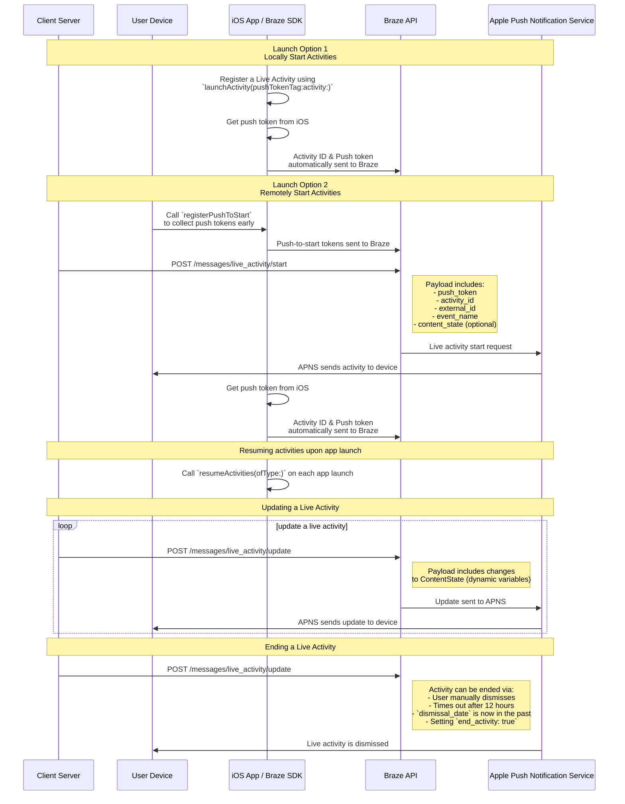

# Actividades en vivo para Swift

> Aprende a implementar Actividades en vivo para el SDK Braze de Swift. Las Actividades en vivo son notificaciones persistentes e interactivas que se muestran directamente en la pantalla de bloqueo, permitiendo a los usuarios obtener actualizaciones dinámicas en tiempo real, sin desbloquear su dispositivo.

## Cómo funciona

{: style="max-width:40%;float:right;margin-left:15px;"}

Las Actividades en vivo presentan una combinación de información estática e información dinámica que tú actualizas. Por ejemplo, puedes crear una Actividad en vivo que ofrezca un seguimiento del estado de una entrega. Esta Actividad en vivo tendría el nombre de tu empresa como información estática, así como un "Tiempo de entrega" dinámico que se actualizaría a medida que el conductor de la entrega se acercara a su destino.

Como desarrollador, puedes utilizar Braze para gestionar tus ciclos de vida de Actividad en vivo, hacer llamadas a la API REST de Braze para realizar actualizaciones de Actividad en vivo y hacer que todos los dispositivos suscritos reciban la actualización lo antes posible. Y, como gestionas las Actividades en vivo a través de Braze, puedes utilizarlas en tándem con tus otros canales de mensajería -notificaciones push, mensajes dentro de la aplicación, tarjetas de contenido- para impulsar la adopción.

## Diagrama de secuencia {#sequence-diagram}









## Realización de una actividad en vivo

# También tendrás que completar lo siguiente:

- Asegúrate de que tu proyecto está orientado a iOS 16.1 o posterior.
- Añade el derecho `Push Notification` en **Firma y capacidades** en tu proyecto Xcode.
- Asegúrate de que se utilizan las claves `.p8` para enviar notificaciones. Los archivos antiguos como `.p12` o `.pem` no son compatibles.
- A partir de la versión 8.2.0 del SDK Swift de Braze, puedes [registrar remotamente una Actividad en vivo](#swift_step-2-start-the-activity). Para utilizar esta característica, se necesita iOS 17.2 o posterior.


Aunque las Actividades en vivo y las notificaciones push son similares, sus permisos de sistema son distintos. Por defecto, todas las características de la Actividad en vivo están habilitadas, pero los usuarios pueden deshabilitar esta característica por aplicación.




### Paso 1: Crea una actividad {#create-an-activity}

En primer lugar, asegúrate de que has seguido [Mostrar datos en vivo con Actividades en vivo](https://developer.apple.com/documentation/activitykit/displaying-live-data-with-live-activities) en la documentación de Apple para configurar Actividades en vivo en tu aplicación iOS. Como parte de esta tarea, asegúrate de incluir `NSSupportsLiveActivities` configurado como `YES` en tu `Info.plist`.

Dado que la naturaleza exacta de tu Actividad en vivo será específica de tu caso empresarial, tendrás que configurar e inicializar los objetos de [la Actividad](https://developer.apple.com/documentation/activitykit/activityattributes). Es importante que definas lo siguiente:
* `ActivityAttributes`: Este protocolo define el contenido estático (invariable) y dinámico (cambiante) que aparecerá en tu Actividad en vivo.
* `ActivityAttributes.ContentState`: Este tipo define los datos dinámicos que se actualizarán en el transcurso de la actividad.

También utilizarás SwiftUI para crear la presentación de la interfaz de usuario de la pantalla de bloqueo y la Isla Dinámica en los dispositivos compatibles. 

Asegúrate de que conoces [los requisitos previos y las limitaciones](https://developer.apple.com/documentation/activitykit/displaying-live-data-with-live-activities#Understand-constraints) de Apple para las Actividades en vivo, ya que estas limitaciones son independientes de Braze.


Si esperas enviar push frecuentes a la misma Actividad en vivo, puedes evitar que el límite de presupuesto de Apple te limite configurando `NSSupportsLiveActivitiesFrequentUpdates` en `YES` en tu archivo `Info.plist`. Para más detalles, consulta la sección [`Determine the update frequency`](https://developer.apple.com/documentation/activitykit/updating-and-ending-your-live-activity-with-activitykit-push-notifications#Determine-the-update-frequency) de la documentación de ActivityKit.


#### Ejemplo

Imaginemos que queremos crear una Actividad en vivo para ofrecer a nuestros usuarios actualizaciones sobre el espectáculo Búho Soberbio, en el que dos rescates de animales salvajes que compiten entre sí reciben puntos por los búhos que tienen en residencia. Para este ejemplo, hemos creado una estructura llamada `SportsActivityAttributes`, pero puedes utilizar tu propia implementación de `ActivityAttributes`.

```swift
#if canImport(ActivityKit)
  import ActivityKit
#endif

@available(iOS 16.1, *)
struct SportsActivityAttributes: ActivityAttributes {
  public struct ContentState: Codable, Hashable {
    var teamOneScore: Int
    var teamTwoScore: Int
  }

  var gameName: String
  var gameNumber: String
}
```

### Paso 2: Inicia la actividad {#start-the-activity}

Primero, elige cómo quieres registrar tu actividad:

- **A distancia:** Utiliza el método [`registerPushToStart`](<http://braze-inc.github.io/braze-swift-sdk/documentation/brazekit/braze/liveactivities-swift.class/registerpushtostart(fortype:name:)>) al principio del ciclo de vida del usuario y antes de que se necesite el token push-to-start, entonces inicia una actividad utilizando el método [`/messages/live_activity/start`]({{site.baseurl}}/api/endpoints/messaging/live_activity/start) punto final.
- **Localización:** Crea una instancia de tu Actividad en vivo y utiliza el método [`launchActivity`](<https://braze-inc.github.io/braze-swift-sdk/documentation/brazekit/braze/liveactivities-swift.class/launchactivity(pushtokentag:activity:fileid:line:)>) para crear tokens de notificaciones push para que los administre Braze.




Para registrar a distancia una Actividad en vivo, se necesita iOS 17.2 o posterior.


#### Paso 2.1: Añade BrazeKit a tu extensión de widget

En tu proyecto de Xcode, selecciona el nombre de tu aplicación y luego **General**. En **Marcos y Bibliotecas**, confirma que `BrazeKit` está en la lista.


#### Paso 2.2: Añade el protocolo BrazeLiveActivityAttributes {#brazeActivityAttributes}

En tu implementación de `ActivityAttributes`, añade la conformidad con el protocolo `BrazeLiveActivityAttributes`, y luego añade la propiedad `brazeActivityId` a tu modelo de atributos.


iOS mapeará la propiedad `brazeActivityId` al campo correspondiente de tu carga útil push-to-start de la Actividad en vivo, por lo que no debe renombrarse ni asignársele ningún otro valor.


```swift
import BrazeKit

#if canImport(ActivityKit)
  import ActivityKit
#endif

@available(iOS 16.1, *)
// 1. Add the `BrazeLiveActivityAttributes` conformance to your `ActivityAttributes` struct.
struct SportsActivityAttributes: ActivityAttributes, BrazeLiveActivityAttributes {
  public struct ContentState: Codable, Hashable {
    var teamOneScore: Int
    var teamTwoScore: Int
  }

  var gameName: String
  var gameNumber: String

  // 2. Add the `String?` property to represent the activity ID.
  var brazeActivityId: String?
}
```

#### Paso 2.3: Registro para push-to-start

A continuación, registra el tipo de Actividad en vivo, para que Braze pueda hacer un seguimiento de todos los tokens de notificaciones push y de las instancias de Actividad en vivo asociadas a este tipo.


El sistema operativo iOS sólo genera tokens de notificaciones push durante la primera instalación de una aplicación después de reiniciar un dispositivo. Para asegurarte de que tus tokens se registran de forma fiable, llama a `registerPushToStart` en tu método `didFinishLaunchingWithOptions`.


###### Ejemplo

En el siguiente ejemplo, la clase `LiveActivityManager` maneja objetos de Actividad en vivo. A continuación, el método `registerPushToStart` registra `SportActivityAttributes`:

```swift
import BrazeKit

#if canImport(ActivityKit)
  import ActivityKit
#endif

class LiveActivityManager {

  @available(iOS 17.2, *)
  func registerActivityType() {
    // This method returns a Swift background task.
    // You may keep a reference to this task if you need to cancel it wherever appropriate, or ignore the return value if you wish.
    let pushToStartObserver: Task = Self.braze?.liveActivities.registerPushToStart(
      forType: Activity<SportsActivityAttributes>.self,
      name: "SportsActivityAttributes"
    )
  }

}
```

#### Paso 2.4: Enviar una notificación push de inicio

Envía una notificación push-to-start remota utilizando el punto final [`/messages/live_activity/start`]({{site.baseurl}}/api/endpoints/messaging/live_activity/start).



Puedes utilizar [el marco ActivityKit de Apple](https://developer.apple.com/documentation/activitykit) para obtener un token de notificaciones push, que el SDK de Braze puede administrar por ti. Esto te permite actualizar Actividades en vivo a través de la API de Braze, ya que Braze enviará el token de notificaciones push al servicio de notificaciones push de Apple (APN) en el backend.

1. Crea una instancia de tu implementación de Actividad en vivo utilizando las API ActivityKit de Apple.
2. Configura el parámetro `pushType` como `.token`. 
3. Introduce las Actividades en vivo `ActivitiesAttributes` y `ContentState` que hayas definido. 
4. Registra tu actividad en tu instancia de Braze pasándola a [`launchActivity(pushTokenTag:activity:)`](https://braze-inc.github.io/braze-swift-sdk/documentation/brazekit/braze/liveactivities-swift.class). El parámetro `pushTokenTag` es una cadena personalizada que tú defines. Debe ser único para cada Actividad en vivo que crees.

Una vez que hayas registrado la Actividad en vivo, el SDK de Braze extraerá y observará los cambios en los tokens de notificaciones push.

#### Ejemplo

Para nuestro ejemplo, crearemos una clase llamada `LiveActivityManager` como interfaz para nuestros objetos de Actividad en vivo. A continuación, configuraremos `pushTokenTag` en `"sports-game-2024-03-15"`.

```swift
import BrazeKit

#if canImport(ActivityKit)
  import ActivityKit
#endif

class LiveActivityManager {
  
  @available(iOS 16.2, *)
  func createActivity() {
    let activityAttributes = SportsActivityAttributes(gameName: "Superb Owl", gameNumber: "Game 1")
    let contentState = SportsActivityAttributes.ContentState(teamOneScore: "0", teamTwoScore: "0")
    let activityContent = ActivityContent(state: contentState, staleDate: nil)
    if let activity = try? Activity.request(attributes: activityAttributes,
                                            content: activityContent,
      // Setting your pushType as .token allows the Activity to generate push tokens for the server to watch.
                                            pushType: .token) {
      // Register your Live Activity with Braze using the pushTokenTag.
      // This method returns a Swift background task.
      // You may keep a reference to this task if you need to cancel it wherever appropriate, or ignore the return value if you wish.
      let liveActivityObserver: Task = AppDelegate.braze?.liveActivities.launchActivity(pushTokenTag: "sports-game-2024-03-15",
                                                                                        activity: activity)
    }
  }
  
}
```

Tu widget de Actividad en vivo mostraría este contenido inicial a tus usuarios. 

{: style="max-width:40%;"}



### Paso 3: Seguimiento de la actividad del currículum {#resume-activity-tracking}

Para garantizar que Braze realiza un seguimiento de tu Actividad en vivo al iniciar la aplicación:

1. Abre tu archivo `AppDelegate`.
2. Importa el módulo `ActivityKit` si está disponible.
3. Llama a [`resumeActivities(ofType:)`](https://braze-inc.github.io/braze-swift-sdk/documentation/brazekit/braze/liveactivities-swift.class/resumeactivities(oftype:)) en `application(_:didFinishLaunchingWithOptions:)` para todos los tipos de `ActivityAttributes` que hayas registrado en tu aplicación.

Esto permite a Braze reanudar las tareas de seguimiento de las actualizaciones de token de notificaciones push de todas las Actividades en vivo activas. Ten en cuenta que si un usuario ha rechazado explícitamente la Actividad en vivo en su dispositivo, se considera eliminada, y Braze dejará de seguirla.

###### Ejemplo

```swift
import UIKit
import BrazeKit

#if canImport(ActivityKit)
  import ActivityKit
#endif

@main
class AppDelegate: UIResponder, UIApplicationDelegate {

  static var braze: Braze? = nil

  func application(
    _ application: UIApplication,
    didFinishLaunchingWithOptions launchOptions: [UIApplication.LaunchOptionsKey: Any]?
  ) -> Bool {
    
    if #available(iOS 16.1, *) {
      Self.braze?.liveActivities.resumeActivities(
        ofType: Activity<SportsActivityAttributes>.self
      )
    }

    return true
  }
}
```

### Paso 4: Actualiza la actividad {#update-the-activity}

{: style="max-width:40%;float:right;margin-left:15px;"}

El punto final [`/messages/live_activity/update`]({{site.baseurl}}/api/endpoints/messaging/live_activity/update) te permite actualizar una Actividad en vivo mediante notificaciones push pasadas a través de la API REST de Braze. Utiliza este punto final para actualizar la `ContentState` de tu Actividad en vivo.

A medida que actualices tu `ContentState`, tu widget de Actividad en vivo mostrará la nueva información. Este es el aspecto que podría tener el espectáculo de la Lechuza Soberbia al final del primer tiempo.

Consulta nuestro artículo [sobre el punto final en`/messages/live_activity/update` ]({{site.baseurl}}/api/endpoints/messaging/live_activity/update) para conocer todos los detalles.

### Paso 5: Finaliza la actividad {#end-the-activity}

Cuando una Actividad en vivo está activa, se muestra tanto en la pantalla de bloqueo del usuario como en la Isla Dinámica. Hay varias formas de que una Actividad en vivo termine y se elimine de la interfaz de usuario. 

* **Descarte de usuario**: Un usuario puede descartar manualmente una Actividad en vivo.
* **Tiempo muerto**: Tras un tiempo predeterminado de 8 horas, iOS eliminará la Actividad en vivo de la Isla dinámica del usuario. Tras un tiempo predeterminado de 12 horas, iOS eliminará la Actividad en vivo de la pantalla de bloqueo del usuario. 
* **Fecha de descarte**: Puedes indicar una fecha y hora para que una Actividad en vivo se elimine de la interfaz de usuario antes de que se agote el tiempo de espera. Esto se define en el `ActivityUIDismissalPolicy` de la Actividad o utilizando el parámetro `dismissal_date` en las solicitudes al punto final `/messages/live_activity/update`.
* **Actividad de punto a punto**: Puedes establecer `end_activity` en `true` en una solicitud al punto final `/messages/live_activity/update` para finalizar inmediatamente una Actividad en vivo.

Consulta nuestro artículo [sobre el punto final en`/messages/live_activity/update` ]({{site.baseurl}}/api/endpoints/messaging/live_activity/update) para conocer todos los detalles.

## Preguntas más frecuentes (FAQ) {#faq}

### Funcionalidad y soporte

#### ¿Qué plataformas admiten Actividades en vivo?

Las Actividades en vivo son actualmente una característica específica de iOS. El artículo Actividades en vivo cubre los [requisitos previos]({{site.baseurl}}/developer_guide/platforms/swift/live_activities/#prerequisites) para gestionar Actividades en vivo a través del SDK Swift de Braze.

#### ¿Son compatibles las aplicaciones React Native con las actividades en vivo?

Sí, a partir de la versión 3.0.0+ del SDK React Native se admiten Actividades en vivo a través del SDK Swift de Braze. Es decir, tienes que escribir código React Native de iOS directamente sobre el SDK Swift de Braze. 

No existe una API de conveniencia JavaScript específica de React Native para las Actividades en vivo porque las características de las Actividades en vivo proporcionadas por Apple utilizan lenguajes intraducibles en JavaScript (por ejemplo, concurrencia Swift, genéricos, SwiftUI).

#### ¿Admite Braze Actividades en vivo como campaña o paso en Canvas?

No, actualmente no es posible.

### Notificaciones push y actividades en vivo

#### ¿Qué ocurre si se envía una notificación push mientras está activa una Actividad en vivo? 

{: style="max-width:30%;float:right;margin-left:15px;"}

Las Actividades en vivo y las notificaciones push ocupan un espacio de pantalla diferente y no entrarán en conflicto en la pantalla de un usuario.

#### Si las Actividades en vivo aprovechan la funcionalidad de los mensajes push, ¿es necesario habilitar las notificaciones push para recibir Actividades en vivo?

Aunque las Actividades en vivo se basan en notificaciones push para las actualizaciones, están controladas por diferentes configuraciones de usuario. Un usuario puede optar por las Actividades en vivo pero no por las notificaciones push, y al revés.

Los tokens de actualización de Actividad en vivo caducan a las ocho horas.

#### ¿Las actividades en vivo requieren push primers?

[Los cebadores push]({{site.baseurl}}/user_guide/message_building_by_channel/push/best_practices/push_primer_messages/) son una buena práctica para pedir a tus usuarios que acepten las notificaciones push de tu aplicación. Sin embargo, no hay ninguna indicación del sistema para participar en las Actividades en vivo. Por defecto, los usuarios son incluidos en las Actividades en vivo para una aplicación individual cuando el usuario instala esa aplicación en iOS 16.1 o posterior. Este permiso puede habilitarse o deshabilitarse en la configuración del dispositivo para cada aplicación.

### Temas técnicos y solución de problemas

#### ¿Cómo sé si las Actividades en vivo tienen errores?

Cualquier error de Actividad en vivo se registrará en el panel de Braze, en el [Registro de actividad de mensajes]({{site.baseurl}}/user_guide/administrative/app_settings/message_activity_log_tab/), donde puedes filtrar por "Errores de Actividad en vivo".

#### Después de enviar una notificación push, ¿por qué no he recibido mi Actividad en vivo?

En primer lugar, comprueba que tu carga útil incluye todos los campos obligatorios descritos en el punto final [`messages/live_activity/start`]({{site.baseurl}}/api/endpoints/messaging/live_activity/start) punto final. Los campos `activity_attributes` y `content_state` deben coincidir con las propiedades definidas en el código de tu proyecto. Si estás seguro de que la carga útil es correcta, es posible que tengas una tasa limitada por APN. Este límite lo impone Apple y no Braze.

Para verificar que tu notificación push ha llegado correctamente al dispositivo pero no se ha mostrado debido a los límites de tasa, puedes depurar tu proyecto utilizando la aplicación Consola de tu Mac. Adjunta el proceso de grabación del dispositivo que desees y, a continuación, filtra los registros por `process:liveactivitiesd` en la barra de búsqueda.

#### Después de iniciar mi Actividad en vivo con push-to-start, ¿por qué no recibe nuevas actualizaciones?

Comprueba que has aplicado correctamente las instrucciones descritas [anteriormente](#swift_brazeActivityAttributes). Tu `ActivityAttributes` debe contener tanto la conformidad con el protocolo `BrazeLiveActivityAttributes` como la propiedad `brazeActivityId`.

Tras recibir una notificación push de actividad en vivo, comprueba que puedes ver una solicitud de red saliente al punto final `/push_token_tag` de tu URL Braze y que contiene el ID de actividad correcto en el campo `"tag"`.

#### Recibo una respuesta de acceso denegado cuando intento utilizar el punto final `live_activity/update`. ¿Por qué?

Las claves de API que utilices deben tener los permisos correctos para acceder a los distintos puntos finales de la API Braze. Si estás utilizando una clave de API que creaste anteriormente, es posible que hayas olvidado actualizar sus permisos. Lee nuestro [resumen de seguridad de la clave de API]({{site.baseurl}}/api/basics/#rest-api-key-security) para refrescarte la memoria.

#### ¿Comparte el punto final `messages/send` límites de velocidad con el punto final `messages/live_activity/update`? 

De manera predeterminada, el límite de velocidad para el punto final `messages/live_activity/update` es de 250 000 solicitudes por hora, por espacio de trabajo y a través de múltiples puntos finales. Para más información, consulta los [límites de velocidad de la API]({{site.baseurl}}/api/api_limits/).
