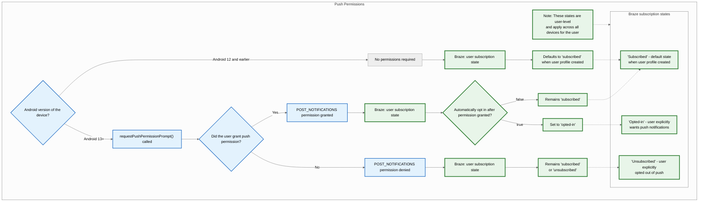
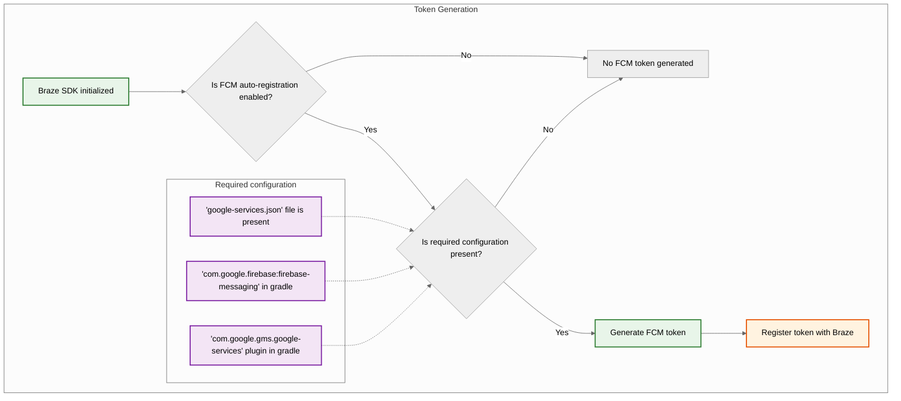
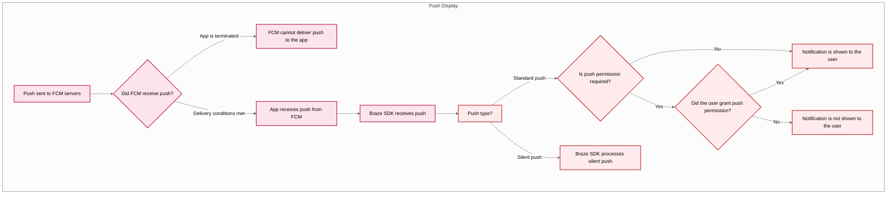



## Características incorporadas

Las siguientes características están integradas en el SDK para Android de Braze. Para utilizar cualquier otra característica de las notificaciones push, tendrás que [configurar las notificaciones push](#android_setting-up-push-notifications) de tu aplicación.

|Característica|Descripción|
|-------|-----------|
|Historias push|Las historias push de Android están predeterminadas en el SDK de Android Braze. Para saber más, consulta [Historias push]({{site.baseurl}}/user_guide/message_building_by_channel/push/advanced_push_options/push_stories/).|
|Push primers|Las campañas push primer animan a tus usuarios a habilitar las notificaciones push de tu aplicación en sus dispositivos. Esto puede hacerse sin necesidad de personalizar el SDK utilizando nuestro [primer push sin código]({{site.baseurl}}/user_guide/message_building_by_channel/push/best_practices/push_primer_messages/).|
{: .reset-td-br-1 .reset-td-br-2 role="presentation"}

## Acerca del ciclo de vida de las notificaciones push {#push-notification-lifecycle}

El siguiente diagrama de flujo muestra cómo Braze gestiona el ciclo de vida de las notificaciones push, como las solicitudes de permiso, la generación de token y la entrega de mensajes.















## Configuración de las notificaciones push


Para ver una aplicación de ejemplo que utiliza FCM con el SDK de Android Braze, consulta [Braze: Aplicación de ejemplo de push Firebase](https://github.com/braze-inc/braze-android-sdk/tree/master/samples/firebase-push).


### Límites de tarifa

La API de Firebase Cloud Messaging (FCM) tiene un límite de velocidad predeterminado de 600 000 solicitudes por minuto. Si alcanzas este límite, Braze lo volverá a intentar automáticamente en unos minutos. Para solicitar un aumento, ponte en contacto con [el servicio de asistencia de Firebase](https://firebase.google.com/support).

### Paso 1: Añade Firebase a tu proyecto

Primero, añade Firebase a tu proyecto de Android. Para obtener instrucciones paso a paso, consulta la [guía de configuración de Firebase](https://firebase.google.com/docs/android/setup) de Google.

### Paso 2: Añade Mensajería en la Nube a tus dependencias

A continuación, añade la biblioteca Cloud Messaging a las dependencias de tu proyecto. En tu proyecto Android, abre `build.gradle`, y añade la siguiente línea a tu bloque `dependencies`.

```gradle
implementation "google.firebase:firebase-messaging:+"
```

Tus dependencias deben tener un aspecto similar al siguiente:

```gradle
dependencies {
  implementation project(':android-sdk-ui')
  implementation "com.google.firebase:firebase-messaging:+"
}
```

### Paso 3: Habilitar la API de mensajería en la nube de Firebase

En Google Cloud, selecciona el proyecto que utiliza tu aplicación Android y, a continuación, habilita la [API de mensajería de Firebase Cloud](https://console.cloud.google.com/apis/library/fcm.googleapis.com).

{: style="max-width:80%;"}

### Paso 4: Crear una cuenta de servicio {#service-account}

A continuación, crea una nueva cuenta de servicio, para que Braze pueda realizar llamadas autorizadas a la API al registrar tokens de FCM. En Google Cloud, ve a **Service Accounts (Cuentas de servicio)** y elige tu proyecto. En la página **Cuentas de servicio**, selecciona **Crear cuenta de servicio**.


Introduce un nombre de cuenta de servicio, un ID y una descripción, luego selecciona **Crear y continuar**.


En el campo **Rol**, busca y selecciona **Administrador de la API de mensajería en la nube de Firebase** en la lista de roles. Para un acceso más restrictivo, crea un [rol personalizado](https://cloud.google.com/iam/docs/creating-custom-roles) con el permiso `cloudmessaging.messages.create` y, en su lugar, elígelo de la lista. Cuando hayas terminado, selecciona **Hecho**.


Asegúrate de seleccionar **Firebase Cloud Messaging _API_ Admin**, no **Firebase Cloud Messaging Admin**.



### Paso 5: Generar credenciales JSON {#json}

A continuación, genera las credenciales JSON de tu cuenta del servicio FCM. En Google Cloud IAM & Admin, ve a **Service Accounts (Cuentas de servicio)** y elige tu proyecto. Localiza la cuenta de servicio FCM [que creaste anteriormente](#android_service-account) y, a continuación, selecciona <i class="fa-solid fa-ellipsis-vertical"></i> **Acciones** > **Gestionar claves**.


Selecciona **Añadir clave** > **Crear nueva clave**.


Elige **JSON** y selecciona **Crear**. Si creaste tu cuenta de servicio utilizando un ID de proyecto de Google Cloud distinto del ID de tu proyecto de FCM, tendrás que actualizar manualmente el valor asignado a `project_id` en tu archivo JSON.

Asegúrate de recordar dónde descargaste la clave: la necesitarás en el siguiente paso.

{: style="max-width:65%;"}


Las claves privadas pueden suponer un riesgo para la seguridad si se ponen en peligro. Guarda tus credenciales JSON en una ubicación segura por ahora: eliminarás tu clave después de subirla a Braze.


### Paso 6: Sube tus credenciales JSON a Braze

A continuación, carga tus credenciales JSON en tu panel de Braze. En Braze, selecciona <i class="fa-solid fa-gear"></i> **Configuración** > Configuración de la aplicación **.**


En la **configuración de notificaciones push** de tu aplicación Android, elige **Firebase**, luego selecciona **Cargar archivo JSON** y carga las credenciales [que generaste anteriormente](#android_json). Cuando hayas terminado, selecciona **Guardar**.



Las claves privadas pueden suponer un riesgo para la seguridad si se ponen en peligro. Ahora que tu clave está cargada en Braze, borra el archivo [que generaste anteriormente](#android_json).


### Paso 7: Configurar el registro automático de tokens

Cuando uno de tus usuarios opta por recibir notificaciones push, tu aplicación necesita generar un token de FCM en su dispositivo antes de que puedas enviarle notificaciones push. Con el SDK de Braze, puedes habilitar el registro automático del token FCM para cada dispositivo de usuario en los archivos de configuración Braze de tu proyecto.

Primero, ve a la Consola Firebase, abre tu proyecto y selecciona <i class="fa-solid fa-gear"></i> **Configuración** > **Configuración del proyecto**.


Selecciona **Mensajería en la nube** y, a continuación, en **API de mensajería en la nube de Firebase (V1)**, copia el número en el campo **ID del remitente**.


A continuación, abre tu proyecto de Android Studio y utiliza tu ID de remitente de Firebase para habilitar el registro automático del token de FCM en tu `braze.xml` o `BrazeConfig`.



Para configurar el registro automático de tokens de FCM, añade las siguientes líneas a tu archivo `braze.xml`:

```xml
<bool translatable="false" name="com_braze_firebase_cloud_messaging_registration_enabled">true</bool>
<string translatable="false" name="com_braze_firebase_cloud_messaging_sender_id">FIREBASE_SENDER_ID</string>
```

Sustituye `FIREBASE_SENDER_ID` por el valor que copiaste de la configuración de tu proyecto Firebase. Tu `braze.xml` debe tener un aspecto similar al siguiente:

```xml
<?xml version="1.0" encoding="utf-8"?>
<resources>
  <string translatable="false" name="com_braze_api_key">12345ABC-6789-DEFG-0123-HIJK456789LM</string>
  <bool translatable="false" name="com_braze_firebase_cloud_messaging_registration_enabled">true</bool>
<string translatable="false" name="com_braze_firebase_cloud_messaging_sender_id">603679405392</string>
</resources>
```



Para configurar el registro automático de tokens de FCM, añade las siguientes líneas a tu `BrazeConfig`:



```java
.setIsFirebaseCloudMessagingRegistrationEnabled(true)
.setFirebaseCloudMessagingSenderIdKey("FIREBASE_SENDER_ID")
```


```kotlin
.setIsFirebaseCloudMessagingRegistrationEnabled(true)
.setFirebaseCloudMessagingSenderIdKey("FIREBASE_SENDER_ID")
```



Sustituye `FIREBASE_SENDER_ID` por el valor que copiaste de la configuración de tu proyecto Firebase. Tu `BrazeConfig` debe tener un aspecto similar al siguiente:



```java
BrazeConfig brazeConfig = new BrazeConfig.Builder()
  .setApiKey("12345ABC-6789-DEFG-0123-HIJK456789LM")
  .setCustomEndpoint("sdk.iad-01.braze.com")
  .setSessionTimeout(60)
  .setHandlePushDeepLinksAutomatically(true)
  .setGreatNetworkDataFlushInterval(10)
  .setIsFirebaseCloudMessagingRegistrationEnabled(true)
  .setFirebaseCloudMessagingSenderIdKey("603679405392")
  .build();
Braze.configure(this, brazeConfig);
```


```kotlin
val brazeConfig = BrazeConfig.Builder()
  .setApiKey("12345ABC-6789-DEFG-0123-HIJK456789LM")
  .setCustomEndpoint("sdk.iad-01.braze.com")
  .setSessionTimeout(60)
  .setHandlePushDeepLinksAutomatically(true)
  .setGreatNetworkDataFlushInterval(10)
  .setIsFirebaseCloudMessagingRegistrationEnabled(true)
  .setFirebaseCloudMessagingSenderIdKey("603679405392")
  .build()
Braze.configure(this, brazeConfig)
```




Si quieres registrar manualmente los tokens de FCM, puedes llamar a [`Braze.setRegisteredPushToken()`](https://braze-inc.github.io/braze-android-sdk/kdoc/braze-android-sdk/com.braze/-braze/registered-push-token.html) dentro del método [`onCreate()`](https://developer.android.com/reference/android/app/Application.html#onCreate()) de tu aplicación.




### Paso 8: Elimina las solicitudes automáticas en tu clase de aplicación

Para evitar que Braze desencadene solicitudes de red innecesarias cada vez que envíes notificaciones push silenciosas, elimina cualquier solicitud de red automática configurada en el método `onCreate()` de tu clase `Application`. Para más información, consulta [Referencia para desarrolladores de Android: Aplicación](https://developer.android.com/reference/android/app/Application).

## Mostrar notificaciones

### Paso 1: Registrar el servicio de mensajería Firebase de Braze

Puedes crear un servicio de mensajería Firebase nuevo, existente o que no sea de Braze. Elige el que mejor se adapte a tus necesidades específicas.



Braze incluye un servicio para gestionar la recepción push y las intenciones abiertas. Nuestra clase `BrazeFirebaseMessagingService` deberá registrarse en tu `AndroidManifest.xml`:

```xml
<service android:name="com.braze.push.BrazeFirebaseMessagingService"
  android:exported="false">
  <intent-filter>
    <action android:name="com.google.firebase.MESSAGING_EVENT" />
  </intent-filter>
</service>
```

Nuestro código de notificación también utiliza `BrazeFirebaseMessagingService` para gestionar el seguimiento de las acciones de apertura y clic. Este servicio debe estar registrado en `AndroidManifest.xml` para funcionar correctamente. Además, recuerda que Braze antepone una clave única a las notificaciones procedentes de nuestro sistema, de modo que sólo reproduzcamos las notificaciones enviadas desde nuestros sistemas. Puedes registrar servicios adicionales por separado para recibir notificaciones enviadas desde otros servicios de FCM. Consulta [`AndroidManifest.xml`](https://github.com/braze-inc/braze-android-sdk/blob/master/samples/firebase-push/src/main/AndroidManifest.xml) en el ejemplo de aplicación push de Firebase.


Antes del SDK de Braze 3.1.1, se utilizaba `AppboyFcmReceiver` para gestionar el push de FCM. La clase `AppboyFcmReceiver` debe eliminarse de tu manifiesto y sustituirse por la integración anterior.




Si ya tienes registrado un servicio de mensajería Firebase, puedes pasar [`RemoteMessage`](https://firebase.google.com/docs/reference/android/com/google/firebase/messaging/RemoteMessage) objetos a Braze a través de [`BrazeFirebaseMessagingService.handleBrazeRemoteMessage()`](https://braze-inc.github.io/braze-android-sdk/kdoc/braze-android-sdk/com.braze.push/-braze-firebase-messaging-service/-companion/handle-braze-remote-message.html). Este método sólo mostrará una notificación si el objeto [`RemoteMessage`](https://firebase.google.com/docs/reference/android/com/google/firebase/messaging/RemoteMessage) objeto procede de Braze y lo ignorará de forma segura en caso contrario.




```java
public class MyFirebaseMessagingService extends FirebaseMessagingService {
  @Override
  public void onMessageReceived(RemoteMessage remoteMessage) {
    super.onMessageReceived(remoteMessage);
    if (BrazeFirebaseMessagingService.handleBrazeRemoteMessage(this, remoteMessage)) {
      // This Remote Message originated from Braze and a push notification was displayed.
      // No further action is needed.
    } else {
      // This Remote Message did not originate from Braze.
      // No action was taken and you can safely pass this Remote Message to other handlers.
    }
  }
}
```




```kotlin
class MyFirebaseMessagingService : FirebaseMessagingService() {
  override fun onMessageReceived(remoteMessage: RemoteMessage?) {
    super.onMessageReceived(remoteMessage)
    if (BrazeFirebaseMessagingService.handleBrazeRemoteMessage(this, remoteMessage)) {
      // This Remote Message originated from Braze and a push notification was displayed.
      // No further action is needed.
    } else {
      // This Remote Message did not originate from Braze.
      // No action was taken and you can safely pass this Remote Message to other handlers.
    }
  }
}
```






Si tienes otro servicio de mensajería Firebase que también te gustaría utilizar, también puedes especificar un servicio de mensajería Firebase alternativo al que llamar si tu aplicación recibe un push que no procede de Braze.

En tu `braze.xml`, especifica:

```xml
<bool name="com_braze_fallback_firebase_cloud_messaging_service_enabled">true</bool>
<string name="com_braze_fallback_firebase_cloud_messaging_service_classpath">com.company.OurFirebaseMessagingService</string>
```

o mediante la [configuración en tiempo de ejecución:]({{site.baseurl}}/developer_guide/sdk_initalization/?sdktab=android)




```java
BrazeConfig brazeConfig = new BrazeConfig.Builder()
        .setFallbackFirebaseMessagingServiceEnabled(true)
        .setFallbackFirebaseMessagingServiceClasspath("com.company.OurFirebaseMessagingService")
        .build();
Braze.configure(this, brazeConfig);
```




```kotlin
val brazeConfig = BrazeConfig.Builder()
        .setFallbackFirebaseMessagingServiceEnabled(true)
        .setFallbackFirebaseMessagingServiceClasspath("com.company.OurFirebaseMessagingService")
        .build()
Braze.configure(this, brazeConfig)
```






### Paso 2: Ajustar los iconos pequeños a las directrices de diseño

Para obtener información general sobre los iconos de notificación de Android, visita el [resumen de Notificaciones](https://developer.android.com/guide/topics/ui/notifiers/notifications).

A partir de Android N, debes actualizar o eliminar los activos de los iconos de notificación pequeños que impliquen color. El sistema Android (no el SDK de Braze) ignora todos los canales no alfa y de transparencia en los iconos de acción y en el icono pequeño de notificación. En otras palabras, Android convertirá todas las partes de tu pequeño icono de notificación en monocromo, excepto las regiones transparentes.

Para crear un activo de icono pequeño de notificación que se muestre correctamente:
- Elimina todos los colores de la imagen excepto el blanco.
- Todas las demás regiones no blancas del activo deben ser transparentes.


Un síntoma común de un activo incorrecto es que el pequeño icono de notificación se muestre como un cuadrado monocromo sólido. Esto se debe a que el sistema Android no puede encontrar ninguna región transparente en el activo del icono pequeño de notificación.


Los siguientes íconos grandes y pequeños son ejemplos de íconos correctamente diseñados:


### Paso 3: Configurar iconos de notificación {#configure-icons}

#### Especificar íconos en braze.xml

Braze te permite configurar tus iconos de notificación especificando recursos dibujables en tu `braze.xml`:

```xml
<drawable name="com_braze_push_small_notification_icon">REPLACE_WITH_YOUR_ICON</drawable>
<drawable name="com_braze_push_large_notification_icon">REPLACE_WITH_YOUR_ICON</drawable>
```

Es necesario configurar un pequeño icono de notificación. **Si no estableces ninguno, Braze utilizará por defecto el icono de la aplicación como icono pequeño de notificación, lo que puede parecer poco óptimo.**

Configurar un icono de notificación grande es opcional pero recomendable.

#### Especificar el color de acento del icono

El color de acento del icono de notificación se puede anular en tu `braze.xml`. Si no se especifica el color, el color predeterminado es el mismo gris que Lollipop utiliza para las notificaciones del sistema.

```xml
<integer name="com_braze_default_notification_accent_color">0xFFf33e3e</integer>
```

También puedes utilizar opcionalmente una referencia de color:

```xml
<color name="com_braze_default_notification_accent_color">@color/my_color_here</color>
```

### Paso 4: Añadir vínculos profundos

#### Habilitación de la apertura automática de vínculos profundos

Para habilitar Braze para que abra automáticamente tu aplicación y cualquier vínculo profundo cuando se haga clic en una notificación push, configura `com_braze_handle_push_deep_links_automatically` en `true`, en tu `braze.xml`:

```xml
<bool name="com_braze_handle_push_deep_links_automatically">true</bool>
```

Esta bandera también se puede establecer mediante [la configuración en tiempo de ejecución]({{site.baseurl}}/developer_guide/sdk_initalization/?sdktab=android):




```java
BrazeConfig brazeConfig = new BrazeConfig.Builder()
        .setHandlePushDeepLinksAutomatically(true)
        .build();
Braze.configure(this, brazeConfig);
```




```kotlin
val brazeConfig = BrazeConfig.Builder()
        .setHandlePushDeepLinksAutomatically(true)
        .build()
Braze.configure(this, brazeConfig)
```




Si quieres gestionar de forma personalizada los vínculos profundos, tendrás que crear una devolución de llamada push que escuche las intenciones push recibidas y abiertas de Braze. Para más información, consulta [Utilizar una devolución de llamada para eventos push]({{site.baseurl}}/developer_guide/push_notifications/customization#android_using-a-callback-for-push-events).

#### Crear vínculos profundos personalizados

Sigue las instrucciones de la [documentación para desarrolladores de](http://developer.android.com/training/app-indexing/deep-linking.html) Android sobre vinculación en profundidad si aún no has añadido vínculos en profundidad a tu aplicación. Para saber más sobre qué son los vínculos profundos, consulta nuestro [artículo de Preguntas frecuentes]({{site.baseurl}}/user_guide/personalization_and_dynamic_content/deep_linking_to_in-app_content/#what-is-deep-linking).

#### Añadir vínculos profundos

El panel de Braze admite la configuración de vínculos profundos o URL de Web en campañas de notificaciones push y Lienzos que se abrirán cuando se haga clic en la notificación.


#### Personalizar el comportamiento de la pila de actividades

El SDK de Android, de forma predeterminada, colocará la actividad principal iniciadora de tu aplicación anfitriona en la pila de actividades cuando se sigan vínculos profundos push. Braze te permite configurar una actividad personalizada para que se abra en la pila de actividades en lugar de tu actividad principal iniciadora o desactivar por completo la pila de actividades.

Por ejemplo, para establecer una actividad llamada `YourMainActivity` como actividad de la pila trasera mediante la [configuración en tiempo de ejecución]({{site.baseurl}}/developer_guide/sdk_initalization/?sdktab=android):




```java
BrazeConfig brazeConfig = new BrazeConfig.Builder()
        .setPushDeepLinkBackStackActivityEnabled(true)
        .setPushDeepLinkBackStackActivityClass(YourMainActivity.class)
        .build();
Braze.configure(this, brazeConfig);
```




```kotlin
val brazeConfig = BrazeConfig.Builder()
        .setPushDeepLinkBackStackActivityEnabled(true)
        .setPushDeepLinkBackStackActivityClass(YourMainActivity.class)
        .build()
Braze.configure(this, brazeConfig)
```




Consulta la configuración equivalente para tu `braze.xml`. Nota que el nombre de la clase debe ser el mismo que devuelve `Class.forName()`.

```xml
<bool name="com_braze_push_deep_link_back_stack_activity_enabled">true</bool>
<string name="com_braze_push_deep_link_back_stack_activity_class_name">your.package.name.YourMainActivity</string>
```

### Paso 5: Definir canales de notificación

El SDK para Android de Braze es compatible con [los canales de notificación de Android](https://developer.android.com/preview/features/notification-channels.html). Si una notificación Braze no contiene el ID de un canal de notificación o que una notificación Braze contiene un ID de canal no válido, Braze mostrará la notificación con el canal de notificación predeterminado definido en el SDK. Los usuarios de Braze utilizan [los canales de notificación de Android]({{site.baseurl}}/user_guide/message_building_by_channel/push/android/notification_channels/) dentro de la plataforma para agrupar notificaciones.

Para configurar el nombre de usuario del canal de notificación predeterminado de Braze, utiliza [`BrazeConfig.setDefaultNotificationChannelName()`](https://braze-inc.github.io/braze-android-sdk/kdoc/braze-android-sdk/com.braze.configuration/-braze-config/-builder/set-default-notification-channel-name.html).

Para configurar la descripción orientada al usuario del canal de notificación predeterminado de Braze, utiliza [`BrazeConfig.setDefaultNotificationChannelDescription()`](https://braze-inc.github.io/braze-android-sdk/kdoc/braze-android-sdk/com.braze.configuration/-braze-config/-builder/set-default-notification-channel-description.html).

Actualiza cualquier campaña de la API con el parámetro de [objeto push de Android]({{site.baseurl}}/api/objects_filters/messaging/android_object/) para incluir el campo `notification_channel`. Si no se especifica este campo, Braze enviará la carga útil de la notificación con el ID del canal [alternativo del panel]({{site.baseurl}}/user_guide/message_building_by_channel/push/android/notification_channels/#dashboard-fallback-channel).

Aparte del canal de notificación predeterminado, Braze no creará ningún canal. Todos los demás canales deben ser definidos mediante programación por la aplicación anfitriona y luego introducidos en el panel de Braze.

El nombre y la descripción predeterminados del canal también se pueden configurar en `braze.xml`.

```xml
<string name="com_braze_default_notification_channel_name">Your channel name</string>
<string name="com_braze_default_notification_channel_description">Your channel description</string>
```

### Paso 6: Visualización y análisis de las notificaciones de las pruebas

#### Pantalla de pruebas

En este punto, deberías poder ver las notificaciones enviadas desde Braze. Para probarlo, ve a la página **Campañas** de tu panel de Braze y crea una campaña de **Notificación push**. Elige **Android Push** y diseña tu mensaje. A continuación, haz clic en el icono del ojo en el compositor para obtener el remitente de la prueba. Introduce el ID de usuario o la dirección de correo electrónico de tu usuario actual y haz clic en **Enviar prueba**. Deberías ver aparecer el push en tu dispositivo.


Para problemas relacionados con la visualización push, consulta nuestra [guía de solución de problemas]({{site.baseurl}}/developer_guide/push_notifications/troubleshooting/?sdktab=android).

#### Análisis de pruebas

En este punto, también deberías tener un registro de análisis de las aperturas de notificaciones push. Si haces clic en la notificación cuando llegue, las **Direct Opens** de la página de resultados de tu campaña aumentarán en 1. Consulta nuestro artículo [sobre los informes push]({{site.baseurl}}/user_guide/message_building_by_channel/push/push_reporting/) para obtener más información sobre los análisis push.

Para problemas relacionados con los análisis push, consulta nuestra [guía de solución de problemas]({{site.baseurl}}/developer_guide/push_notifications/troubleshooting/?sdktab=android).

#### Pruebas desde la línea de comandos

Si quieres probar las notificaciones dentro de la aplicación y las notificaciones push a través de la interfaz de línea de comandos, puedes enviar una única notificación a través del terminal mediante cURL y la [API de mensajería]({{site.baseurl}}/api/endpoints/messaging/). Tendrás que sustituir los siguientes campos por los valores correctos para tu caso de prueba:

- `YOUR_API_KEY` (Ve a **Configuración** > **Claves de API**).
- `YOUR_EXTERNAL_USER_ID` (Busca un perfil en la página **Buscar usuarios** ).
- `YOUR_KEY1` (opcional)
- `YOUR_VALUE1` (opcional)

```bash
curl -X POST -H "Content-Type: application/json" -H "Authorization: Bearer {YOUR_API_KEY}" -d '{
  "external_user_ids":["YOUR_EXTERNAL_USER_ID"],
  "messages": {
    "android_push": {
      "title":"Test push title",
      "alert":"Test push",
      "extra": {
        "YOUR_KEY1":"YOUR_VALUE1"
      }
    }  
  }
}' https://rest.iad-01.braze.com/messages/send
```

Este ejemplo utiliza la instancia `US-01`. Si no estás en esta instancia, sustituye el punto final `US-01` por [tu punto final]({{site.baseurl}}/api/basics/#endpoints).

## Notificaciones push de conversación

{: style="float:right;max-width:35%;margin-left:15px;border: 0;"}

La [iniciativa de personas y conversaciones](https://developer.android.com/guide/topics/ui/conversations) es una iniciativa plurianual de Android que pretende elevar las personas y las conversaciones en las superficies del sistema del teléfono. Esta prioridad se basa en el hecho de que la comunicación y la interacción con otras personas sigue siendo el área funcional más valorada e importante para la mayoría de los usuarios de Android de todos los grupos demográficos.

### Requisitos de uso

- Este tipo de notificación requiere la versión 15.0.0 en adelante del SDK de Braze para Android y dispositivos Android a partir de la versión 11. 
- Los dispositivos o SDK no compatibles recibirán como alternativa una notificación push estándar.

Esta característica sólo está disponible a través de la API REST de Braze. Consulta el [objeto push de Android]({{site.baseurl}}/api/objects_filters/messaging/android_object#android-conversation-push-object) para más información.

## Errores de cuota FCM superada

Cuando se supera tu límite para la mensajería en la nube de Firebase (FCM), Google devuelve errores de "cuota superada". El límite predeterminado para FCM es de 600.000 peticiones por minuto. Braze reintenta el envío según las mejores prácticas recomendadas por Google. Sin embargo, un gran volumen de estos errores puede prolongar el tiempo de envío varios minutos. Para mitigar el posible impacto, Braze te enviará una alerta de que se está superando el límite de velocidad y las medidas que puedes tomar para evitar los errores.

Para comprobar tu límite actual, ve a tu **Consola de Google Cloud** > **APIs y servicios** > **API de mensajería en la nube de Firebase** > **Cuotas y límites del sistema**, o visita [la página Cuotas de la API de FCM](https://console.cloud.google.com/apis/api/fcm.googleapis.com/quotas).

### Buenas prácticas

Recomendamos estas buenas prácticas para mantener bajos estos volúmenes de errores.

#### Solicitar a FCM un aumento del límite de velocidad

Para solicitar un aumento del límite de velocidad a FCM, puedes ponerte en contacto directamente con [el soporte de Firebase](https://firebase.google.com/support) o hacer lo siguiente:

1. Ve a [la página Cuotas de la API de FCM](https://console.cloud.google.com/apis/api/fcm.googleapis.com/quotas).
2. Localiza la cuota de **Enviar solicitudes por minuto**.
3. Selecciona **Editar Cuota**. 
4. Introduce un nuevo valor y envía tu solicitud.

#### Solicitar límite de velocidad global a través de Braze

Para aplicar un límite en todo el espacio de trabajo para las notificaciones push de Android, ponte en contacto con [el soporte de Braze]({{site.baseurl}}/help/support#access-the-support-portal).