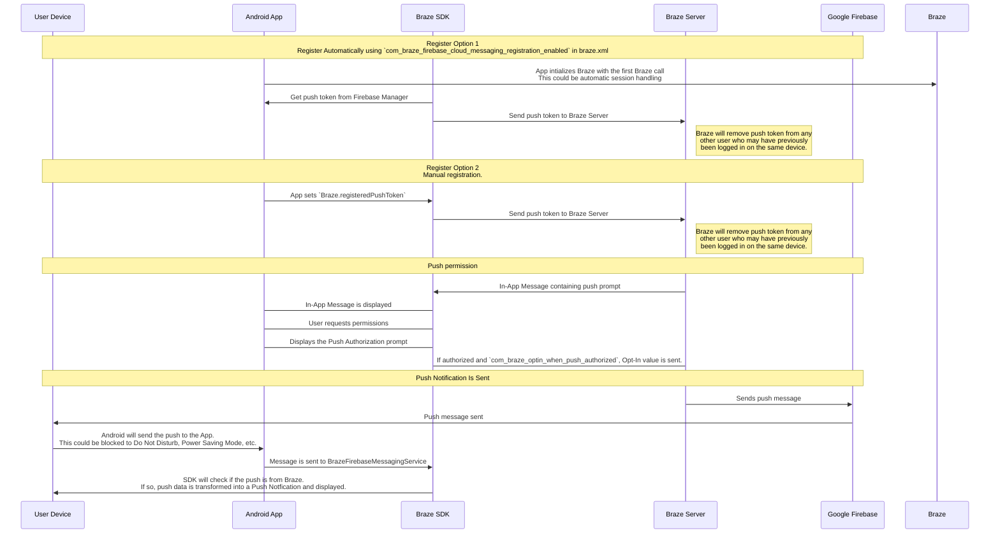

## Comprender el flujo de trabajo push de Braze

El servicio de mensajería en la nube de Firebase (FCM) es la infraestructura de Google para las notificaciones push enviadas a las aplicaciones de Android. Esta es la estructura simplificada de cómo se habilitan las notificaciones push para los dispositivos de tus usuarios y cómo Braze puede enviarles notificaciones push:




### Paso 1: Configurar tu clave de API de Google Cloud

Al desarrollar tu aplicación, tendrás que proporcionar al SDK de Android de Braze tu ID de remitente de Firebase. Además, tendrás que proporcionar al panel de Braze una clave de API para aplicaciones de servidor. Braze utilizará esta clave de API para enviar mensajes a tus dispositivos. También tendrás que comprobar que el servicio FCM está habilitado en la consola del desarrollador de Google. 


Un error común durante este paso es utilizar la clave de API identificadora de la aplicación en lugar de la clave de API REST.


### Paso 2: Los dispositivos se registran en el FCM y proporcionan a Braze tokens de notificaciones push

En las integraciones típicas, el SDK para Android de Braze se encargará de registrar los dispositivos para la función FCM. Esto suele ocurrir inmediatamente después de abrir la aplicación por primera vez. Tras el registro, Braze recibirá un ID de registro de FCM, que se utiliza para enviar mensajes a ese dispositivo en concreto. Almacenaremos el ID de registro de ese usuario, y ese usuario se convertirá en "registrado push" si antes no tenía un token de notificaciones push para ninguna de tus aplicaciones.

### Paso 3: Lanzamiento de una campaña push Braze

Cuando se lance una campaña push, Braze hará solicitudes a FCM para que entregue tu mensaje. Braze utilizará la clave de API copiada en el panel para autenticar y verificar que podemos enviar notificaciones push a los tokens de notificaciones push proporcionados.

### Paso 4: Eliminar tokens no válidos

Si FCM nos informa de que alguno de los tokens de notificaciones push a los que intentábamos enviar un mensaje no es válido, eliminamos esos tokens de los perfiles de usuario a los que estaban asociados. Si los usuarios no tienen otros tokens de notificaciones push, ya no aparecerán como "Registrados push" en la página **Segmentos**.

Para más detalles sobre FCM, visita [Mensajería en la nube](https://firebase.google.com/docs/cloud-messaging/).

## Utilizar los registros de errores push

Braze proporciona errores de notificación push dentro del registro de actividad de mensajes. Este registro de errores proporciona una serie de advertencias que pueden ser muy útiles para identificar por qué tus campañas no funcionan como esperabas. Si haces clic en un mensaje de error, se te redirigirá a la documentación pertinente para ayudarte a solucionar una incidencia concreta.


## Escenarios de solución de problemas

### Push no está enviando

Puede que tus mensajes push no se envíen debido a las siguientes situaciones:

- Tus credenciales existen en un ID de proyecto de Google Cloud Platform incorrecto (ID de remitente incorrecto).
- Tus credenciales tienen un ámbito de permiso incorrecto.
- Has cargado credenciales erróneas en el espacio de trabajo Braze equivocado (ID de remitente erróneo).

Para otros problemas que puedan impedirte enviar un mensaje push, consulta la Guía del usuario de [: Solución de problemas de las notificaciones push]({{site.baseurl}}/user_guide/message_building_by_channel/push/troubleshooting/).

### No se muestran los usuarios "registrados push" en el panel de Braze (antes de enviar mensajes)

Confirma que tu aplicación está correctamente configurada para permitir notificaciones push. Los puntos de fallo habituales que hay que comprobar incluyen lo siguiente:

#### ID de remitente incorrecto

Comprueba que el ID de remitente del FCM correcto está incluido en el archivo `braze.xml`. Un ID de remitente incorrecto dará lugar a errores de `MismatchSenderID` en el registro de actividad de mensajes del panel.

#### No se produce el registro de Braze

Dado que el registro de FCM se gestiona fuera de Braze, el fallo en el registro sólo puede producirse en dos lugares:

1. Durante el registro en la FCM
2. Al pasar el token de notificaciones push generado por FCM a Braze

Recomendamos establecer un punto de interrupción o de registro para confirmar que el token de notificaciones push generado por FCM se envía a Braze. Si un token no se genera correctamente o no se genera en absoluto, te recomendamos que consultes la [documentación de FCM](https://firebase.google.com/docs/cloud-messaging/android/client).

#### Los servicios de Google Play no están presentes

Para que FCM push funcione, Google Play Services debe estar presente en el dispositivo. Si Google Play Services no está en un dispositivo, no se producirá el registro push.

**Nota:** Los servicios de Google Play no se instalan en emuladores de Android que no tengan instaladas las API de Google.

#### Dispositivo no conectado a Internet

Comprueba que tu dispositivo tiene una buena conexión a Internet y que no está enviando tráfico de red a través de un proxy.

### Al tocar la notificación push no se abre la aplicación

Comprueba si `com_braze_handle_push_deep_links_automatically` está configurado como `true` o `false`. Para habilitar Braze para que abra automáticamente la aplicación y cualquier vínculo profundo al tocar una notificación push, configura `com_braze_handle_push_deep_links_automatically` en `true` en tu archivo `braze.xml`.

Si `com_braze_handle_push_deep_links_automatically` está predeterminado a `false`, tienes que utilizar una devolución de llamada Push Braze para escuchar y gestionar las intenciones push recibidas y abiertas.

### Notificaciones push rebotadas

Si no se entrega una notificación push, asegúrate de que no ha rebotado consultando la [consola para desarrolladores]({{site.baseurl}}/developer_guide/platforms/android/push_notifications/troubleshooting/#utilizing-the-push-error-logs). A continuación se describen errores comunes que pueden registrarse en la consola para desarrolladores:

#### Error: MismatchSenderID

`MismatchSenderID` indica un fallo de autenticación. Confirma que tu ID de remitente de Firebase y tu clave de API de FCM son correctos.

#### Error: InvalidRegistration

`InvalidRegistration` puede deberse a un token de notificaciones push mal formado.

1. Asegúrate de pasar un token de notificaciones push válido a Braze desde [Firebase Cloud Messaging](https://firebase.google.com/docs/cloud-messaging/android/client#retrieve-the-current-registration-token).

#### Error: NoRegistrado

1. `NotRegistered` suele ocurrir cuando se elimina una aplicación de un dispositivo. Braze utiliza `NotRegistered` internamente para indicar que se ha desinstalado una aplicación de un dispositivo.

2. `NotRegistered` También puede ocurrir cuando se producen varios registros y un segundo registro invalida el primer token.

### Notificaciones push enviadas pero no mostradas en los dispositivos de los usuarios

Hay algunas razones por las que esto podría estar ocurriendo:

#### Se forzó la salida de la aplicación

Si fuerzas la salida de tu aplicación a través de la configuración del sistema, no se enviarán tus notificaciones push. Si vuelves a iniciar la aplicación, tu dispositivo volverá a estar habilitado para recibir notificaciones push.

#### BrazeFirebaseMessagingService no registrado

El servicio BrazeFirebaseMessagingService debe estar correctamente registrado en `AndroidManifest.xml` para que aparezcan las notificaciones push:

```xml
<service android:name="com.braze.push.BrazeFirebaseMessagingService"
  android:exported="false">
  <intent-filter>
    <action android:name="com.google.firebase.MESSAGING_EVENT" />
  </intent-filter>
</service>
```

#### El cortafuegos bloquea el push

Si estás probando el push a través de Wi-Fi, puede que tu cortafuegos esté bloqueando los puertos necesarios para que FCM reciba mensajes. Confirma que los puertos `5228`, `5229` y `5230` están abiertos. Además, como el FCM no especifica sus IP, también debes permitir que tu cortafuegos acepte conexiones salientes a todas las direcciones IP contenidas en los bloques IP enumerados en el ASN de Google de `15169`.

#### Fábrica de notificaciones personalizada que devuelve null

Si has implementado una [fábrica de notificaciones personalizada]({{site.baseurl}}/developer_guide/platform_integration_guides/android/push_notifications/android/integration/standard_integration/#custom-displaying-notifications), asegúrate de que no devuelve `null`. Esto hará que no se muestren las notificaciones.

### Los usuarios "registrados por push" ya no están habilitados después de enviar mensajes

Hay varias razones por las que esto puede estar ocurriendo:

#### Se ha desinstalado la aplicación

Los usuarios han desinstalado la aplicación. Esto invalidará su token de notificaciones push de FCM.

#### Clave inválida del servidor de mensajería en la nube Firebase

La clave del servidor de mensajería en la nube de Firebase proporcionada en el panel de Braze no es válida. El ID de remitente proporcionado debe coincidir con el indicado en el archivo `braze.xml` de tu aplicación. La clave del servidor y el ID del remitente se encuentran aquí, en tu Consola Firebase:


### Los clics push no se registran

Braze registra automáticamente los clics push, por lo que esta situación debería ser relativamente rara.

Si no se registran los clics push, es posible que los datos de los clics push aún no se hayan enviado a nuestros servidores. Braze regula la frecuencia de sus descargas en función de la potencia de la conexión a la red. Con una buena conexión de red, los datos push-clic deberían llegar al servidor en menos de un minuto en la mayoría de los casos.

### Los deep links no funcionan

#### Verificar la configuración del vínculo profundo

Los vínculos en profundidad pueden [probarse con el ADB](https://developer.android.com/training/app-indexing/deep-linking.html#testing-filters). Te recomendamos que pruebes tu vínculo profundo con el siguiente comando:

`adb shell am start -W -a android.intent.action.VIEW -d "THE_DEEP_LINK" THE_PACKAGE_NAME`

Si el vínculo profundo no funciona, es posible que esté mal configurado. Un vínculo profundo mal configurado no funcionará cuando se envíe a través de notificaciones push de Braze.

#### Verificar la lógica de manipulación personalizada

Si el vínculo profundo [funciona correctamente con ADB](https://developer.android.com/training/app-indexing/deep-linking.html#testing-filters) pero no funciona desde Braze push, comprueba si se ha implementado alguna [gestión personalizada de apertura de push]({{site.baseurl}}/developer_guide/platform_integration_guides/android/push_notifications/android/integration/standard_integration/#android-push-listener-callback). Si es así, comprueba que el código de gestión personalizado gestiona correctamente el vínculo profundo entrante.

#### Desactivar el comportamiento del back stack

Si el vínculo profundo [funciona correctamente con ADB](https://developer.android.com/training/app-indexing/deep-linking.html#testing-filters) pero no funciona desde Braze push, prueba a desactivar [el back stack](https://developer.android.com/guide/components/activities/tasks-and-back-stack). Para ello, actualiza tu archivo **braze.xml** para incluir:

```xml
<bool name="com_braze_push_deep_link_back_stack_activity_enabled">false</bool>
```
