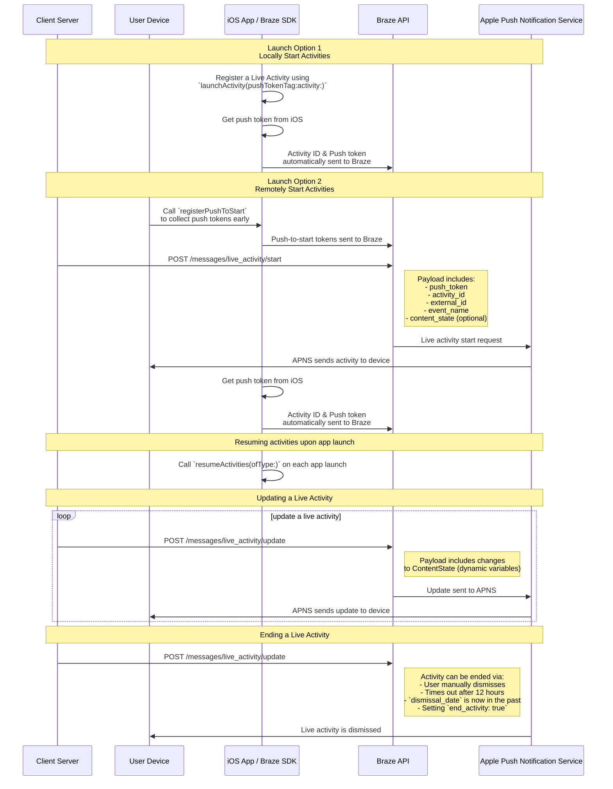

# Activités en ligne/instantanées pour Swift

> Découvrez comment mettre en œuvre des activités en ligne/en production/instantanée pour le SDK Swift Braze. Les activités en direct sont des notifications persistantes et interactives qui s'affichent directement sur l'écran de verrouillage, permettant aux utilisateurs d'obtenir des mises à jour dynamiques en temps réel, sans déverrouiller leur appareil.

## Fonctionnement

{: style="max-width:40%;float:right;margin-left:15px;"}

Les activités en direct présentent une combinaison d’informations statiques et dynamiques que vous mettez à jour. Par exemple, vous pouvez créer une activité en direct qui fournit un suivi de statut pour une livraison. Cette activité en direct comporterait le nom de votre entreprise comme information statique, ainsi qu’un « délai de livraison » dynamique qui serait mis à jour à mesure que le livreur approche de sa destination.

En tant que développeur, vous pouvez utiliser Braze pour gérer les cycles de vie de vos activités en direct, faire des appels à l'API REST de Braze pour effectuer des mises à jour des activités en direct, et faire en sorte que tous les appareils abonnés reçoivent la mise à jour dès que possible. De plus, comme vous gérez les activités en direct via Braze, vous pouvez les utiliser en tandem avec vos autres canaux d'envoi de messages (notifications push, messages in-app, cartes de contenu) pour favoriser l'adoption.

## Diagramme de séquence {#sequence-diagram}









## Mise en œuvre d’une activité en direct

# Vous devrez également effectuer les opérations suivantes :

- Assurez-vous que votre projet cible iOS 16.1 ou une version ultérieure.
- Ajoutez le droit `Push Notification` sous **Signing & Capabilities** dans votre projet Xcode.
- Assurez-vous que les clés `.p8` sont utilisées pour envoyer des notifications. Les fichiers plus anciens tels que `.p12` ou `.pem` ne sont pas pris en charge.
- À partir de la version 8.2.0 du SDK Swift Braze, vous pouvez [enregistrer à distance une activité en direct](#swift_step-2-start-the-activity). Pour utiliser cette fonctionnalité, vous devez disposer d'iOS 17.2 ou d'une version ultérieure.


Si les activités en direct et les notifications push sont similaires, leurs autorisations système sont distinctes. Par défaut, toutes les fonctionnalités de l'activité en direct sont activées, mais les utilisateurs peuvent désactiver cette fonctionnalité par application.




### Étape 1 : Créer une activité {#create-an-activity}

Tout d'abord, assurez-vous d'avoir suivi [Afficher des données en ligne/instantanées avec les activités en direct](https://developer.apple.com/documentation/activitykit/displaying-live-data-with-live-activities) dans la documentation d'Apple pour configurer les activités en direct dans votre application iOS. Dans le cadre de cette tâche, assurez-vous d’inclure `NSSupportsLiveActivities` défini sur `YES` dans votre `Info.plist`.

Comme la nature exacte de votre activité en ligne/instantanée sera spécifique à votre cas d'entreprise, vous devrez configurer et initialiser les objets de [l'activité.](https://developer.apple.com/documentation/activitykit/activityattributes)  Plus important encore, vous définirez :
* `ActivityAttributes` : Ce protocole définit le contenu statique (ne changeant pas) et dynamique (changeant) qui apparaîtra dans votre activité en direct.
* `ActivityAttributes.ContentState` : Ce type définit les données dynamiques qui seront mises à jour au cours de l'activité.

Vous utiliserez également SwiftUI pour créer l’interface utilisateur de la présentation de l’écran de verrouillage et Dynamic Island sur les appareils pris en charge. 

Assurez-vous de bien connaître les [conditions préalables et les limites](https://developer.apple.com/documentation/activitykit/displaying-live-data-with-live-activities#Understand-constraints) d’Apple pour les activités en direct, car ces contraintes sont indépendantes de Braze.


Si vous prévoyez d’envoyer des notifications push fréquentes vers la même activité en direct, vous pouvez éviter d’être limité par la limite budgétaire d’Apple en définissant `NSSupportsLiveActivitiesFrequentUpdates` sur `YES` dans votre fichier `Info.plist`. Pour plus de détails, reportez-vous à la section [`Determine the update frequency`](https://developer.apple.com/documentation/activitykit/updating-and-ending-your-live-activity-with-activitykit-push-notifications#Determine-the-update-frequency) dans la documentation ActivityKit.


#### Exemple

Imaginons que nous voulions créer une activité en direct pour donner à nos utilisateurs des mises à jour sur le spectacle Superb Owl, où deux équipes concurrentes de sauvetage d’animaux sauvages reçoivent des points pour les hiboux dont ils s’occupent. Dans cet exemple, nous avons créé une structure appelée `SportsActivityAttributes`, mais vous pouvez utiliser votre propre mise en œuvre d’`ActivityAttributes`.

```swift
#if canImport(ActivityKit)
  import ActivityKit
#endif

@available(iOS 16.1, *)
struct SportsActivityAttributes: ActivityAttributes {
  public struct ContentState: Codable, Hashable {
    var teamOneScore: Int
    var teamTwoScore: Int
  }

  var gameName: String
  var gameNumber: String
}
```

### Étape 2 : Démarrer l'activité {#start-the-activity}

Tout d'abord, choisissez le mode d'enregistrement de votre activité :

- **A distance :** Utilisez la méthode [`registerPushToStart`](<http://braze-inc.github.io/braze-swift-sdk/documentation/brazekit/braze/liveactivities-swift.class/registerpushtostart(fortype:name:)>) au début du cycle de vie de l'utilisateur et avant que le jeton "push-to-start" ne soit nécessaire, puis démarrez une activité à l'aide du point de terminaison [`/messages/live_activity/start`]({{site.baseurl}}/api/endpoints/messaging/live_activity/start) endpoint.
- **Localement :** Créez une instance de votre activité en direct, puis utilisez la méthode [`launchActivity`](<https://braze-inc.github.io/braze-swift-sdk/documentation/brazekit/braze/liveactivities-swift.class/launchactivity(pushtokentag:activity:fileid:line:)>) pour créer des jetons de notifications push à gérer par Braze.




Pour enregistrer à distance une activité en direct, vous devez disposer d'iOS 17.2 ou d'une version ultérieure.


#### Étape 2.1 : Ajoutez BrazeKit à votre extension de widget

Dans votre projet Xcode, sélectionnez le nom de votre application, puis **Général**. Sous **Infrastructures et bibliothèques**, vérifiez que `BrazeKit` est inclus dans la liste.


#### Étape 2.2 : Ajouter le protocole BrazeLiveActivityAttributes {#brazeActivityAttributes}

Dans votre implémentation de `ActivityAttributes`, ajoutez la conformité au protocole `BrazeLiveActivityAttributes`, puis ajoutez la propriété `brazeActivityId` à votre modèle d'attributs.


iOS mappera la propriété `brazeActivityId` au champ correspondant dans votre charge utile push-to-start de Live Activity, elle ne doit donc pas être renommée ou se voir attribuer une autre valeur.


```swift
import BrazeKit

#if canImport(ActivityKit)
  import ActivityKit
#endif

@available(iOS 16.1, *)
// 1. Add the `BrazeLiveActivityAttributes` conformance to your `ActivityAttributes` struct.
struct SportsActivityAttributes: ActivityAttributes, BrazeLiveActivityAttributes {
  public struct ContentState: Codable, Hashable {
    var teamOneScore: Int
    var teamTwoScore: Int
  }

  var gameName: String
  var gameNumber: String

  // 2. Add the `String?` property to represent the activity ID.
  var brazeActivityId: String?
}
```

#### Étape 2.3 : S'inscrire à la fonctionnalité Push to Start

Ensuite, enregistrez le type d'activité en direct, afin que Braze puisse assurer le suivi de tous les jetons push-to-start et des instances d'activité en direct associés à ce type.


Le système d'exploitation iOS ne génère des jetons push-to-start que lors de la première installation d'appli après le redémarrage d'un appareil. Pour vous assurer que vos jetons sont enregistrés de manière fiable, appelez `registerPushToStart` dans votre méthode `didFinishLaunchingWithOptions`.


###### Exemple

Dans l'exemple suivant, la classe `LiveActivityManager` gère des objets de type activité en direct. Ensuite, la méthode `registerPushToStart` enregistre `SportActivityAttributes`:

```swift
import BrazeKit

#if canImport(ActivityKit)
  import ActivityKit
#endif

class LiveActivityManager {

  @available(iOS 17.2, *)
  func registerActivityType() {
    // This method returns a Swift background task.
    // You may keep a reference to this task if you need to cancel it wherever appropriate, or ignore the return value if you wish.
    let pushToStartObserver: Task = Self.braze?.liveActivities.registerPushToStart(
      forType: Activity<SportsActivityAttributes>.self,
      name: "SportsActivityAttributes"
    )
  }

}
```

#### Étape 2.4 : Envoyer une notification push-to-start

Envoyez une notification push-to-start à distance à l'aide du endpoint [`/messages/live_activity/start`]({{site.baseurl}}/api/endpoints/messaging/live_activity/start).



Vous pouvez utiliser [le framework ActivityKit d'Apple](https://developer.apple.com/documentation/activitykit) pour obtenir un jeton de notification push que le SDK Braze peut gérer pour vous. Cela vous permet de mettre à jour les activités en direct via l’API Braze, car Braze enverra le jeton de notification push au service de notification push d’Apple (APN) sur le back-end.

1. Créez une instance de votre implémentation d’activité en direct à l’aide des API ActivityKit d’Apple.
2. Définissez le paramètre `pushType` sur `.token`. 
3. Transmettez les `ActivitiesAttributes` et le `ContentState` des activités en direct que vous avez définis. 
4. Enregistrez votre activité auprès de votre instance Braze en la passant dans la commande [`launchActivity(pushTokenTag:activity:)`](https://braze-inc.github.io/braze-swift-sdk/documentation/brazekit/braze/liveactivities-swift.class). Le paramètre `pushTokenTag` est une chaîne de caractères personnalisée que vous définissez. Elle doit être unique pour chaque activité en direct que vous créez.

Une fois que vous avez enregistré l’activité en direct, le SDK Braze extrait et observe les changements dans les jetons de notification push.

#### Exemple

Pour notre exemple, nous allons créer une classe appelée `LiveActivityManager` qui servira d'interface pour nos objets d'activité en direct. Ensuite, nous définirons le `pushTokenTag` sur `"sports-game-2024-03-15"`.

```swift
import BrazeKit

#if canImport(ActivityKit)
  import ActivityKit
#endif

class LiveActivityManager {
  
  @available(iOS 16.2, *)
  func createActivity() {
    let activityAttributes = SportsActivityAttributes(gameName: "Superb Owl", gameNumber: "Game 1")
    let contentState = SportsActivityAttributes.ContentState(teamOneScore: "0", teamTwoScore: "0")
    let activityContent = ActivityContent(state: contentState, staleDate: nil)
    if let activity = try? Activity.request(attributes: activityAttributes,
                                            content: activityContent,
      // Setting your pushType as .token allows the Activity to generate push tokens for the server to watch.
                                            pushType: .token) {
      // Register your Live Activity with Braze using the pushTokenTag.
      // This method returns a Swift background task.
      // You may keep a reference to this task if you need to cancel it wherever appropriate, or ignore the return value if you wish.
      let liveActivityObserver: Task = AppDelegate.braze?.liveActivities.launchActivity(pushTokenTag: "sports-game-2024-03-15",
                                                                                        activity: activity)
    }
  }
  
}
```

Votre gadget Activité en direct affichera ce contenu initial à vos utilisateurs. 

{: style="max-width:40%;"}



### Étape 3 : Suivi de l'activité du CV {#resume-activity-tracking}

Pour que Braze suive votre activité en direct dès le lancement de l'application :

1. Ouvrez votre fichier `AppDelegate`.
2. Importez le module `ActivityKit` s’il est disponible.
3. Appelez [`resumeActivities(ofType:)`](https://braze-inc.github.io/braze-swift-sdk/documentation/brazekit/braze/liveactivities-swift.class/resumeactivities(oftype:)) à `application(_:didFinishLaunchingWithOptions:)` pour tous les types de `ActivityAttributes` que vous avez enregistrés dans votre application.

Cela permet à Braze de reprendre les tâches pour suivre les mises à jour des jetons de notification push pour toutes les activités en direct actives. Notez que si un utilisateur a explicitement rejeté l’activité en direct sur son appareil, elle est considérée comme supprimée et Braze ne la suivra plus.

###### Exemple

```swift
import UIKit
import BrazeKit

#if canImport(ActivityKit)
  import ActivityKit
#endif

@main
class AppDelegate: UIResponder, UIApplicationDelegate {

  static var braze: Braze? = nil

  func application(
    _ application: UIApplication,
    didFinishLaunchingWithOptions launchOptions: [UIApplication.LaunchOptionsKey: Any]?
  ) -> Bool {
    
    if #available(iOS 16.1, *) {
      Self.braze?.liveActivities.resumeActivities(
        ofType: Activity<SportsActivityAttributes>.self
      )
    }

    return true
  }
}
```

### Étape 4 : Mettre à jour l'activité {#update-the-activity}

{: style="max-width:40%;float:right;margin-left:15px;"}

Le point de terminaison [`/messages/live_activity/update`]({{site.baseurl}}/api/endpoints/messaging/live_activity/update) vous permet de mettre à jour une activité en direct par le biais de notifications push transmises par l'API REST de Braze. Utilisez cet endpoint pour mettre à jour le `ContentState` de votre activité en direct.

Lorsque vous mettez à jour votre `ContentState`, votre gadget Activité en direct affiche les nouvelles informations. Voici à quoi pourrait ressembler le spectacle Superb Owl à la fin de la première partie.

Pour plus de détails, consultez notre article sur le [point de terminaison`/messages/live_activity/update` ]({{site.baseurl}}/api/endpoints/messaging/live_activity/update).

### Étape 5 : Fin de l'activité {#end-the-activity}

Lorsqu’une activité en direct est active, elle s’affiche à la fois sur l’écran de verrouillage d’un utilisateur et sur Dynamic Island. Il existe plusieurs façons de mettre fin à une activité en direct et de la supprimer de l’interface utilisateur d’un utilisateur. 

* **Fermeture par l'utilisateur** : Un utilisateur peut fermer manuellement une activité en direct.
* **Expiration** : Après une durée par défaut de 8 heures, iOS supprimera l’activité en direct de la Dynamic Island de l’utilisateur. Après une durée par défaut de 12 heures, iOS supprimera l’activité en direct de l’écran de verrouillage de l’utilisateur. 
* **Date de suppression** : Vous pouvez fournir une date et une heure pour qu’une activité en direct soit supprimée de l’interface utilisateur d’un utilisateur avant le délai d’expiration. Ceci est défini soit dans l’`ActivityUIDismissalPolicy` de l’activité, soit à l’aide du paramètre `dismissal_date` dans les requêtes adressées à l’endpoint `/messages/live_activity/update`.
* **Fin de l'activité** : Vous pouvez définir `end_activity` sur `true` dans une requête à l’endpoint `/messages/live_activity/update` pour mettre immédiatement fin à une activité en direct.

Pour plus de détails, consultez notre article sur le [point de terminaison`/messages/live_activity/update` ]({{site.baseurl}}/api/endpoints/messaging/live_activity/update).

## Foire aux questions (FAQ) {#faq}

### Fonctionnalité et support

#### Quelles plateformes prennent en charge les activités en direct ?

Les activités en direct sont actuellement une fonctionnalité spécifique à iOS. L’article Activités en direct couvre les [conditions préalables]({{site.baseurl}}/developer_guide/platforms/swift/live_activities/#prerequisites) à la gestion des activités en direct via le SDK Swift de Braze.

#### Les applications React Native prennent-elles en charge les activités en direct ?

Oui, le SDK React Native 3.0.0+ prend en charge les activités en direct via le SDK Swift Braze. Autrement dit, vous devez écrire du code iOS React Native directement au-dessus du SDK Swift de Braze. 

Il n'existe pas d'API de commodité JavaScript spécifique à React Native pour les activités en direct, car les fonctionnalités des activités en direct fournies par Apple utilisent des langages intraduisibles en JavaScript (par exemple, la concurrence Swift, les génériques, SwiftUI).

#### Braze prend-il en charge les activités en direct en tant que campagne ou étape de Canvas ?

Non, cela n’est pas pris en charge actuellement.

### Notifications push et activités en direct

#### Que se passe-t-il si une notification push est envoyée alors qu’une activité en direct est active ? 

{: style="max-width:30%;float:right;margin-left:15px;"}

Les activités en direct et les notifications push occupent différents écrans et n'entrent pas en conflit sur l'écran d'un utilisateur.

#### Si les activités en direct exploitent la fonctionnalité de message de notification push, les notifications push doivent-elles être activées pour recevoir les activités en direct ?

Bien que les activités en direct reposent sur des notifications push pour les mises à jour, elles sont contrôlées par différents paramètres utilisateur. Un utilisateur peut choisir d'être abonné aux activités en direct mais pas aux notifications push, et inversement.

Les jetons de mise à jour de l'activité en ligne/instantanée expirent au bout de huit heures.

#### Les activités en direct nécessitent-elles des amorces de notification push ?

Les [amorces de notification push]({{site.baseurl}}/user_guide/message_building_by_channel/push/best_practices/push_primer_messages/) constituent une bonne pratique pour inviter vos utilisateurs à s’abonner aux notifications push de votre application. Cependant, il n’y a pas de demande de la part du système pour s’abonner aux activités en direct. Par défaut, les utilisateurs sont abonnés aux activités en direct pour une app individuelle lorsque l'utilisateur installe cette app sur iOS 16.1 ou une version ultérieure. Cette autorisation peut être désactivée ou réactivée dans les paramètres de l'appareil, application par application.

### Sujets techniques et résolution des problèmes

#### Comment puis-je savoir si les activités en ligne/instantanées ont des erreurs ?

Toute erreur d'activité en direct sera consignée dans le tableau de bord de Braze dans le [journal des activités liées aux messages]({{site.baseurl}}/user_guide/administrative/app_settings/message_activity_log_tab/), où vous pouvez filtrer par « erreurs d'activités en direct ».

#### Après avoir envoyé une notification push/instantanée, pourquoi n'ai-je pas reçu mon activité en direct ?

Tout d'abord, vérifiez que votre charge utile comprend tous les champs obligatoires décrits dans le point de terminaison [`messages/live_activity/start`]({{site.baseurl}}/api/endpoints/messaging/live_activity/start) endpoint. Les champs `activity_attributes` et `content_state` doivent correspondre aux propriétés définies dans le code de votre projet. Si vous êtes certain que la charge utile est correcte, il est possible que votre débit soit limité par les APN. Cette limite est imposée par Apple et non par Braze.

Pour vérifier que votre notification push-to-start est bien arrivée à l'appareil mais qu'elle n'a pas été affichée en raison des limites de débit, vous pouvez déboguer votre projet à l'aide de l'application Console sur votre Mac. Joignez le processus d'enregistrement de l'appareil souhaité, puis filtrez les journaux par `process:liveactivitiesd` dans la barre de recherche.

#### Après avoir démarré mon activité en ligne/en production/instantanée avec push-to-start, pourquoi ne reçoit-elle pas de nouvelles mises à jour ?

Vérifiez que vous avez correctement mis en œuvre les instructions décrites [ci-dessus](#swift_brazeActivityAttributes). Votre site `ActivityAttributes` doit contenir à la fois la conformité au protocole `BrazeLiveActivityAttributes` et la propriété `brazeActivityId`.

Après avoir reçu une notification push-to-start de Live Activity, vérifiez que vous pouvez voir une requête réseau sortante vers l'endpoint `/push_token_tag` de votre URL Braze et qu'elle contient le bon ID d'activité dans le champ `"tag"`.

#### Je reçois une réponse « Accès refusé » lorsque j’essaie d’utiliser l’endpoint `live_activity/update`. Pourquoi ?

Les clés API que vous utilisez doivent disposer des autorisations appropriées pour accéder aux différents endpoints de l’API Braze. Si vous utilisez une clé API que vous avez précédemment créée, il est possible que vous ayez omis de mettre à jour ses autorisations. Pour revoir ces points, lisez notre [aperçu de la sécurité des clés API]({{site.baseurl}}/api/basics/#rest-api-key-security).

#### Est-ce que l’endpoint `messages/send` partage les limites de débit avec l’endpoint `messages/live_activity/update` ? 

Par défaut, la limite de débit pour l'endpoint `messages/live_activity/update` est de 250 000 requêtes par heure, par espace de travail et sur plusieurs endpoints. Pour plus d'informations, consultez les [limites de débit de l'API]({{site.baseurl}}/api/api_limits/).
