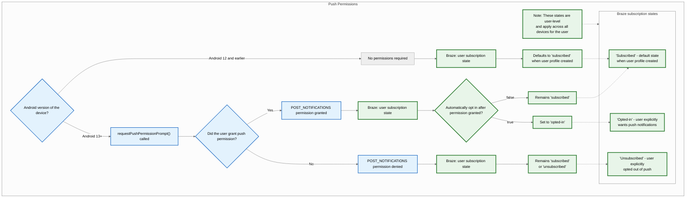
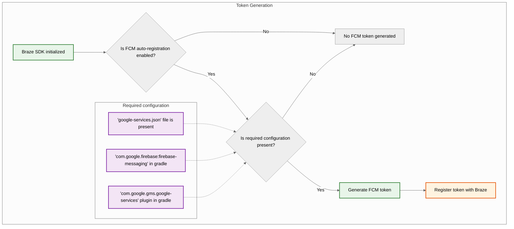
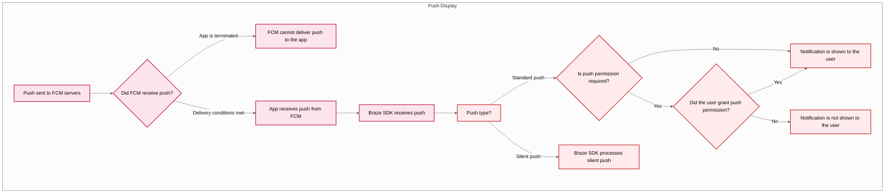



## Fonctionnalités créées

Les fonctionnalités suivantes sont créées dans le SDK Android de Braze. Pour utiliser toute autre fonctionnalité de notification push, vous devrez [configurer les notifications push](#android_setting-up-push-notifications) pour votre application.

|Fonctionnalité|Description|
|-------|-----------|
|Contenu push|Les contenus push d'Android sont créés par défaut dans le SDK Android de Braze. Pour en savoir plus, consultez la rubrique [Contenus push.]({{site.baseurl}}/user_guide/message_building_by_channel/push/advanced_push_options/push_stories/)|
|Amorces de notifications push|Les campagnes d'amorces de notifications push encouragent vos utilisateurs à activer les notifications push sur leur appareil pour votre appli. Ceci peut se faire sans personnalisation du SDK, grâce à notre [amorce de notifications push sans code]({{site.baseurl}}/user_guide/message_building_by_channel/push/best_practices/push_primer_messages/).|
{: .reset-td-br-1 .reset-td-br-2 role="presentation"}

## À propos du cycle de vie des notifications push {#push-notification-lifecycle}

L'organigramme suivant montre comment Braze gère le cycle de vie des notifications push, notamment les demandes d'autorisation, la génération de jetons et l'envoi/distribution des messages.















## Mise en place des notifications push


Pour découvrir un exemple d'application utilisant la FCM avec le SDK Android de Braze, consultez le site [Braze : Exemple d'application Firebase Push](https://github.com/braze-inc/braze-android-sdk/tree/master/samples/firebase-push).


### Limites de débit

L'API Firebase Cloud Messaging (FCM) présente une limite de débit par défaut de 600 000 requêtes par minute. Si vous atteignez cette limite, Braze réessaiera automatiquement dans quelques minutes. Pour demander une augmentation, contactez le [service d'assistance de Firebase.](https://firebase.google.com/support)

### Étape 1 : Ajoutez Firebase à votre projet

Tout d'abord, ajoutez Firebase à votre projet Android. Pour obtenir des instructions pas à pas, consultez le [guide de configuration de Firebase](https://firebase.google.com/docs/android/setup) de Google.

### Étape 2 : Ajoutez Cloud Messaging à vos dépendances

Ensuite, ajoutez la bibliothèque Cloud Messaging aux dépendances de votre projet. Dans votre projet Android, ouvrez `build.gradle`, puis ajoutez la ligne suivante à votre bloc `dependencies`.

```gradle
implementation "google.firebase:firebase-messaging:+"
```

Vos dépendances devraient ressembler à ce qui suit :

```gradle
dependencies {
  implementation project(':android-sdk-ui')
  implementation "com.google.firebase:firebase-messaging:+"
}
```

### Étape 3 : Activez l'API d'envoi de messages de Firebase Cloud.

Dans Google Cloud, sélectionnez le projet utilisé par votre application Android, puis activez l'[API Firebase Cloud Messaging](https://console.cloud.google.com/apis/library/fcm.googleapis.com).

{: style="max-width:80%;"}

### Étape 4 : Créer un compte de service {#service-account}

Ensuite, créez un nouveau compte de service, afin que Braze puisse effectuer des appels API autorisés lors de l'enregistrement des jetons FCM. Dans Google Cloud, sélectionnez **Service Accounts (Comptes de service)**, puis choisissez votre projet. Sur la page **Comptes de service**, sélectionnez **Créer un compte de service**.


Saisissez un nom de compte de service, un ID et une description, puis sélectionnez **Create and continue (Créer et continuer)**.


Dans le champ **Rôle**, recherchez et sélectionnez **Firebase Cloud Messaging API Admin** dans la liste des rôles. Pour un accès plus restrictif, créez un [rôle personnalisé](https://cloud.google.com/iam/docs/creating-custom-roles) avec l'autorisation `cloudmessaging.messages.create`, puis choisissez-le dans la liste. Lorsque vous avez terminé, sélectionnez **Terminé**.


Veillez à sélectionner **Firebase Cloud Messaging _API_ Admin**, et non **Admin Firebase Cloud Messaging**.



### Étape 5 : Générer des identifiants JSON {#json}

Ensuite, générez les identifiants JSON pour votre compte de service FCM. Dans Google Cloud IAM & Admin, sélectionnez **Service Accounts (Comptes de service)**, puis choisissez votre projet. Recherchez le compte de service FCM [que vous avez créé précédemment](#android_service-account), puis sélectionnez <i class="fa-solid fa-ellipsis-vertical"></i> **Actions** > **Manage Keys (Gérer les clés)**.


Sélectionnez **Ajouter une clé** > **Créer une nouvelle clé**.


Choisissez **JSON**, puis sélectionnez **Create (Créer)**. Si vous avez créé votre compte de service en utilisant un ID de projet Google Cloud différent de votre ID de projet FCM, vous devrez mettre à jour manuellement la valeur attribuée à l'adresse `project_id` dans votre fichier JSON.

N'oubliez pas l'endroit où vous avez téléchargé la clé : vous en aurez besoin à l'étape suivante.

{: style="max-width:65%;"}


Les clés privées peuvent présenter un risque de sécurité si elles sont compromises. Conservez vos identifiants JSON dans un emplacement/localisation sécurisé pour l'instant : vous supprimerez votre clé après l'avoir téléchargée sur Braze.


### Étape 6 : Téléchargez vos informations d'identification JSON vers Braze.

Ensuite, chargez vos identifiants JSON dans votre tableau de bord de Braze. Dans Braze, sélectionnez <i class="fa-solid fa-gear"></i> **Paramètres** > **Paramètres des applications**.


Sous les **paramètres de notifications push** de votre application Android, choisissez **Firebase**, puis sélectionnez **Charger un fichier JSON** et chargez les identifiants [que vous avez générés précédemment](#android_json). Lorsque vous avez terminé, sélectionnez **Enregistrer.**



Les clés privées peuvent présenter un risque de sécurité si elles sont compromises. Maintenant que votre clé est téléchargée sur Braze, supprimez le fichier [que vous avez généré précédemment](#android_json).


### Étape 7 : Configurer l'enregistrement automatique des jetons

Lorsqu'un de vos utilisateurs opte pour les notifications push, votre application doit générer un jeton FCM sur son appareil avant que vous puissiez lui envoyer des notifications push. Avec le SDK Braze, vous pouvez activer l'enregistrement automatique des jetons FCM pour l'appareil de chaque utilisateur dans les fichiers de configuration Braze de votre projet.

Tout d'abord, accédez à la console Firebase, ouvrez votre projet, puis sélectionnez <i class="fa-solid fa-gear"></i> **Paramètres** > **Paramètres du projet**.


Sélectionnez **Cloud Messaging**, puis sous **API Firebase Cloud Messaging (V1)**, copiez le numéro dans le champ **ID de l'expéditeur**.


Ensuite, ouvrez votre projet Android Studio et utilisez votre ID d’expéditeur Firebase pour activer l'enregistrement automatique des jetons FCM au sein de votre `braze.xml` ou `BrazeConfig`.



Pour configurer l'enregistrement automatique des jetons FCM, ajoutez les lignes suivantes à votre fichier `braze.xml`:

```xml
<bool translatable="false" name="com_braze_firebase_cloud_messaging_registration_enabled">true</bool>
<string translatable="false" name="com_braze_firebase_cloud_messaging_sender_id">FIREBASE_SENDER_ID</string>
```

Remplacez `FIREBASE_SENDER_ID` par la valeur que vous avez copiée dans les paramètres de votre projet Firebase. Votre site `braze.xml` devrait ressembler à ce qui suit :

```xml
<?xml version="1.0" encoding="utf-8"?>
<resources>
  <string translatable="false" name="com_braze_api_key">12345ABC-6789-DEFG-0123-HIJK456789LM</string>
  <bool translatable="false" name="com_braze_firebase_cloud_messaging_registration_enabled">true</bool>
<string translatable="false" name="com_braze_firebase_cloud_messaging_sender_id">603679405392</string>
</resources>
```



Pour configurer l'enregistrement automatique des jetons FCM, ajoutez les lignes suivantes à votre `BrazeConfig` :



```java
.setIsFirebaseCloudMessagingRegistrationEnabled(true)
.setFirebaseCloudMessagingSenderIdKey("FIREBASE_SENDER_ID")
```


```kotlin
.setIsFirebaseCloudMessagingRegistrationEnabled(true)
.setFirebaseCloudMessagingSenderIdKey("FIREBASE_SENDER_ID")
```



Remplacez `FIREBASE_SENDER_ID` par la valeur que vous avez copiée dans les paramètres de votre projet Firebase. Votre site `BrazeConfig` devrait ressembler à ce qui suit :



```java
BrazeConfig brazeConfig = new BrazeConfig.Builder()
  .setApiKey("12345ABC-6789-DEFG-0123-HIJK456789LM")
  .setCustomEndpoint("sdk.iad-01.braze.com")
  .setSessionTimeout(60)
  .setHandlePushDeepLinksAutomatically(true)
  .setGreatNetworkDataFlushInterval(10)
  .setIsFirebaseCloudMessagingRegistrationEnabled(true)
  .setFirebaseCloudMessagingSenderIdKey("603679405392")
  .build();
Braze.configure(this, brazeConfig);
```


```kotlin
val brazeConfig = BrazeConfig.Builder()
  .setApiKey("12345ABC-6789-DEFG-0123-HIJK456789LM")
  .setCustomEndpoint("sdk.iad-01.braze.com")
  .setSessionTimeout(60)
  .setHandlePushDeepLinksAutomatically(true)
  .setGreatNetworkDataFlushInterval(10)
  .setIsFirebaseCloudMessagingRegistrationEnabled(true)
  .setFirebaseCloudMessagingSenderIdKey("603679405392")
  .build()
Braze.configure(this, brazeConfig)
```




Si vous souhaitez enregistrer manuellement des jetons FCM, vous pouvez appeler [`Braze.setRegisteredPushToken()`](https://braze-inc.github.io/braze-android-sdk/kdoc/braze-android-sdk/com.braze/-braze/registered-push-token.html) dans la méthode [`onCreate()`](https://developer.android.com/reference/android/app/Application.html#onCreate()) de votre application.




### Étape 8 : Supprimez les demandes automatiques dans votre classe d'application

Pour éviter que Braze ne déclenche des requêtes réseau inutiles à chaque fois que vous envoyez des notifications push silencieuses, supprimez toutes les requêtes réseau automatiques configurées dans la méthode `onCreate()` de votre classe `Application`. Pour plus d'informations, consultez [Référence pour les développeurs Android : Application](https://developer.android.com/reference/android/app/Application).

## Affichage des notifications

### Étape 1 : Enregistrer le service de messagerie de Firebase de Braze

Vous pouvez créer un service d'envoi de messages Firebase nouveau, existant ou non Braze. Choisissez celui qui répond le mieux à vos besoins spécifiques.



Braze comprend un service pour gérer la réception de notifications push et les intentions d’ouverture. Notre classe `BrazeFirebaseMessagingService` doit être enregistrée dans votre `AndroidManifest.xml` :

```xml
<service android:name="com.braze.push.BrazeFirebaseMessagingService"
  android:exported="false">
  <intent-filter>
    <action android:name="com.google.firebase.MESSAGING_EVENT" />
  </intent-filter>
</service>
```

Notre code de notification utilise également `BrazeFirebaseMessagingService` pour gérer le suivi des ouvertures et des clics. Ce service doit être enregistré dans le `AndroidManifest.xml` pour fonctionner correctement. N'oubliez pas non plus que Braze préfixe les notifications provenant de notre système avec une clé unique afin de ne rendre que les notifications envoyées depuis nos systèmes. Vous pouvez enregistrer des services supplémentaires séparément pour afficher les notifications envoyées par d’autres services FCM. Voir [`AndroidManifest.xml`](https://github.com/braze-inc/braze-android-sdk/blob/master/samples/firebase-push/src/main/AndroidManifest.xml) dans l'exemple d'application Firebase push.


Avant le SDK Braze version 3.1.1, `AppboyFcmReceiver` était utilisé pour gérer les notifications push FCM. La classe `AppboyFcmReceiver` doit être retirée de votre manifeste et remplacée par l’intégration précédente.




Si vous avez déjà enregistré un service d'envoi de messages Firebase, vous pouvez passer des [`RemoteMessage`](https://firebase.google.com/docs/reference/android/com/google/firebase/messaging/RemoteMessage) à Braze par l'intermédiaire de [`BrazeFirebaseMessagingService.handleBrazeRemoteMessage()`](https://braze-inc.github.io/braze-android-sdk/kdoc/braze-android-sdk/com.braze.push/-braze-firebase-messaging-service/-companion/handle-braze-remote-message.html). Cette méthode n'affichera une notification que si l'objet [`RemoteMessage`](https://firebase.google.com/docs/reference/android/com/google/firebase/messaging/RemoteMessage) provient de Braze et l'ignorera si ce n'est pas le cas.




```java
public class MyFirebaseMessagingService extends FirebaseMessagingService {
  @Override
  public void onMessageReceived(RemoteMessage remoteMessage) {
    super.onMessageReceived(remoteMessage);
    if (BrazeFirebaseMessagingService.handleBrazeRemoteMessage(this, remoteMessage)) {
      // This Remote Message originated from Braze and a push notification was displayed.
      // No further action is needed.
    } else {
      // This Remote Message did not originate from Braze.
      // No action was taken and you can safely pass this Remote Message to other handlers.
    }
  }
}
```




```kotlin
class MyFirebaseMessagingService : FirebaseMessagingService() {
  override fun onMessageReceived(remoteMessage: RemoteMessage?) {
    super.onMessageReceived(remoteMessage)
    if (BrazeFirebaseMessagingService.handleBrazeRemoteMessage(this, remoteMessage)) {
      // This Remote Message originated from Braze and a push notification was displayed.
      // No further action is needed.
    } else {
      // This Remote Message did not originate from Braze.
      // No action was taken and you can safely pass this Remote Message to other handlers.
    }
  }
}
```






Si vous souhaitez également utiliser un autre service de messagerie Firebase, vous pouvez également spécifier un service de messagerie Firebase de repli à appeler si votre application reçoit une notification push qui ne provient pas de Braze.

Dans votre `braze.xml`, précisez :

```xml
<bool name="com_braze_fallback_firebase_cloud_messaging_service_enabled">true</bool>
<string name="com_braze_fallback_firebase_cloud_messaging_service_classpath">com.company.OurFirebaseMessagingService</string>
```

ou par le biais de la [configuration de l'exécution :]({{site.baseurl}}/developer_guide/sdk_initalization/?sdktab=android)




```java
BrazeConfig brazeConfig = new BrazeConfig.Builder()
        .setFallbackFirebaseMessagingServiceEnabled(true)
        .setFallbackFirebaseMessagingServiceClasspath("com.company.OurFirebaseMessagingService")
        .build();
Braze.configure(this, brazeConfig);
```




```kotlin
val brazeConfig = BrazeConfig.Builder()
        .setFallbackFirebaseMessagingServiceEnabled(true)
        .setFallbackFirebaseMessagingServiceClasspath("com.company.OurFirebaseMessagingService")
        .build()
Braze.configure(this, brazeConfig)
```






### Étape 2 : Conformer les petites icônes aux lignes directrices en matière de conception

Pour des informations générales sur les icônes de notification Android, consultez l'[aperçu des notifications.](https://developer.android.com/guide/topics/ui/notifiers/notifications)

À partir de Android N, vous devez mettre à jour ou supprimer les objets de petites icônes de notification qui impliquent une couleur. Le système Android (et non le SDK Braze) ignore tous les canaux non alpha et de transparence dans les icônes d’action et les petites icônes de notification. En d’autres termes, Android convertit toutes les parties de votre petite icône de notification en monochrome, sauf pour les zones transparentes.

Pour créer une ressource de petite icône de notification qui s'affiche correctement :
- Supprimez toutes les couleurs de l’image sauf le blanc.
- Toutes les parties non blanches de l’objet doivent être transparentes.


Un symptôme commun d’un objet inapproprié est que la petite icône de notification s’affiche comme un carré monochrome solide. Cela est dû au système Android qui ne parvient pas à trouver de zone transparente dans l’objet de petite icône de notification.


Les grandes et petites icônes suivantes sont des exemples d’icônes correctement conçues :


### Étape 3 : Configurer les icônes de notification {#configure-icons}

#### Spécifier des icônes dans braze.xml

Braze vous permet de configurer vos icônes de notification en spécifiant des ressources dessinées dans votre `braze.xml` :

```xml
<drawable name="com_braze_push_small_notification_icon">REPLACE_WITH_YOUR_ICON</drawable>
<drawable name="com_braze_push_large_notification_icon">REPLACE_WITH_YOUR_ICON</drawable>
```

Il est nécessaire de définir une petite icône de notification. **Si vous n’en définissez pas, Braze utilisera par défaut l’icône de l’application comme petite icône de notification, ce qui n’est pas forcément idéal.**

Définir une grande icône de notification est facultatif, mais recommandé.

#### Spécifier la couleur d'accentuation de l'icône

La couleur d'accentuation de l'icône de notification peut être modifiée dans votre `braze.xml`. Si la couleur n'est pas spécifiée, la couleur par défaut est le même gris que celui utilisé par Lollipop pour les notifications du système.

```xml
<integer name="com_braze_default_notification_accent_color">0xFFf33e3e</integer>
```

Vous pouvez également utiliser une référence de couleur :

```xml
<color name="com_braze_default_notification_accent_color">@color/my_color_here</color>
```

### Étape 4 : Ajouter des liens profonds

#### Activer l’ouverture automatique du lien profond

Pour permettre à Braze d’ouvrir automatiquement votre application et les liens profonds lorsqu’une notification push est cliquée, définissez `com_braze_handle_push_deep_links_automatically` sur `true` dans votre fichier `braze.xml` :

```xml
<bool name="com_braze_handle_push_deep_links_automatically">true</bool>
```

Cet indicateur peut également être défini par la [configuration de l'exécution :]({{site.baseurl}}/developer_guide/sdk_initalization/?sdktab=android)




```java
BrazeConfig brazeConfig = new BrazeConfig.Builder()
        .setHandlePushDeepLinksAutomatically(true)
        .build();
Braze.configure(this, brazeConfig);
```




```kotlin
val brazeConfig = BrazeConfig.Builder()
        .setHandlePushDeepLinksAutomatically(true)
        .build()
Braze.configure(this, brazeConfig)
```




Si vous souhaitez gérer de manière personnalisée les liens profonds, vous devrez créer un rappel de poussée qui écoute les poussées reçues et les intentions d'ouverture de Braze. Pour plus d'informations, voir [Utilisation d'un rappel pour les événements "push"]({{site.baseurl}}/developer_guide/push_notifications/customization#android_using-a-callback-for-push-events).

#### Création de liens profonds personnalisés

Si vous n'avez pas encore ajouté de liens profonds à votre application, suivez les instructions figurant dans la [documentation destinée aux développeurs Android](http://developer.android.com/training/app-indexing/deep-linking.html) sur la création de liens profonds. Pour en savoir plus sur les liens profonds, consultez notre [article de FAQ]({{site.baseurl}}/user_guide/personalization_and_dynamic_content/deep_linking_to_in-app_content/#what-is-deep-linking).

#### Ajouter des liens profonds

Le tableau de bord de Braze prend en charge la mise en place de liens profonds ou d’URL Web dans les campagnes de notifications push et des Canvas qui seront ouverts lorsque la notification est cliquée.


#### Personnaliser le comportement de la pile arrière

Par défaut, le SDK Android place l’activité du lanceur principal de votre application hôte dans la pile arrière lorsqu’il suit des liens profonds de notification push. Braze vous permet de définir qu’une activité personnalisée s’ouvre dans la pile arrière à la place de votre activité de lanceur principal ou de désactiver complètement la pile arrière.

Par exemple, pour définir une activité appelée `YourMainActivity` comme activité de la pile arrière à l'aide de la [configuration d'exécution]({{site.baseurl}}/developer_guide/sdk_initalization/?sdktab=android):




```java
BrazeConfig brazeConfig = new BrazeConfig.Builder()
        .setPushDeepLinkBackStackActivityEnabled(true)
        .setPushDeepLinkBackStackActivityClass(YourMainActivity.class)
        .build();
Braze.configure(this, brazeConfig);
```




```kotlin
val brazeConfig = BrazeConfig.Builder()
        .setPushDeepLinkBackStackActivityEnabled(true)
        .setPushDeepLinkBackStackActivityClass(YourMainActivity.class)
        .build()
Braze.configure(this, brazeConfig)
```




Consultez la configuration équivalente pour votre `braze.xml`. Notez que le nom de la classe doit être identique à celui renvoyé par `Class.forName()`.

```xml
<bool name="com_braze_push_deep_link_back_stack_activity_enabled">true</bool>
<string name="com_braze_push_deep_link_back_stack_activity_class_name">your.package.name.YourMainActivity</string>
```

### Étape 5 : Définir les canaux de notification

Le SDK Android de Braze prend en charge les [canaux de notification Android](https://developer.android.com/preview/features/notification-channels.html). Si une notification Braze ne contient pas d’ID pour un canal de notification ou qu’une notification Braze contient un ID de canal non valide, Braze affichera la notification avec le canal de notification par défaut défini dans le SDK. Les utilisateurs de Braze utilisent les [canaux de notification Android]({{site.baseurl}}/user_guide/message_building_by_channel/push/android/notification_channels/) au sein de la plateforme pour regrouper les notifications.

Pour définir le nom du canal de notification par défaut de Braze auquel l'utilisateur est confronté, procédez comme suit [`BrazeConfig.setDefaultNotificationChannelName()`](https://braze-inc.github.io/braze-android-sdk/kdoc/braze-android-sdk/com.braze.configuration/-braze-config/-builder/set-default-notification-channel-name.html).

Pour définir la description du canal de notification par défaut de Braze à laquelle l'utilisateur est confronté, utilisez la commande [`BrazeConfig.setDefaultNotificationChannelDescription()`](https://braze-inc.github.io/braze-android-sdk/kdoc/braze-android-sdk/com.braze.configuration/-braze-config/-builder/set-default-notification-channel-description.html).

Mettez à jour toutes les campagnes API avec le paramètre [Android push object]({{site.baseurl}}/api/objects_filters/messaging/android_object/) pour inclure le champ `notification_channel`. Si ce champ n'est pas spécifié, Braze enverra la charge utile de notification avec l'ID du canal de [repli du tableau de bord]({{site.baseurl}}/user_guide/message_building_by_channel/push/android/notification_channels/#dashboard-fallback-channel).

En dehors du canal de notification par défaut, Braze ne crée aucun canal. Tous les autres canaux doivent être définis par programmation par l’application hôte, puis entrés dans le tableau de bord de Braze.

Le nom et la description par défaut du canal peuvent également être configurés dans `braze.xml`.

```xml
<string name="com_braze_default_notification_channel_name">Your channel name</string>
<string name="com_braze_default_notification_channel_description">Your channel description</string>
```

### Étape 6 : Tester l’affichage et l’analyse des notifications

#### Tester l’affichage

À ce stade, vous devriez pouvoir voir les notifications envoyées par Braze. Pour tester cela, rendez-vous sur la page **Campagnes de** votre tableau de bord Braze et créez une campagne de **notification push.**  Choisissez **Android Push** et concevez votre message. Cliquez ensuite sur l’icône « Œil » dans le composeur pour obtenir l’expéditeur de test. Saisissez l'ID ou l'adresse e-mail de votre utilisateur actuel et cliquez sur **Envoyer le test.** Vous devriez voir la notification push s’afficher sur votre appareil.


Pour les problèmes liés à l'affichage push, consultez notre [guide de résolution des problèmes.]({{site.baseurl}}/developer_guide/push_notifications/troubleshooting/?sdktab=android)

#### Tester l’analyse

À ce stade, vous devez également disposer d’un enregistrement de l’analyse pour les ouvertures de notifications push. En cliquant sur la notification lorsqu'elle arrive, le nombre d'**ouvertures directes** sur la page des résultats de votre campagne devrait augmenter de 1. Consultez notre article sur [les rapports push]({{site.baseurl}}/user_guide/message_building_by_channel/push/push_reporting/) pour en savoir plus sur les analyses/analytiques push.

Pour les problèmes liés à l'analyse/analytique push, consultez notre [guide de résolution des problèmes.]({{site.baseurl}}/developer_guide/push_notifications/troubleshooting/?sdktab=android)

#### Tester depuis la ligne de commande

Si vous souhaitez tester les notifications in-app et push via l'interface de ligne de commande, vous pouvez envoyer une seule notification par le biais du terminal via cURL et l ['API de messages.]({{site.baseurl}}/api/endpoints/messaging/) Vous devrez remplacer les champs suivants par les valeurs correctes pour votre cas de test :

- `YOUR_API_KEY` (Allez dans **Paramètres** > **Clés API**.)
- `YOUR_EXTERNAL_USER_ID` ( Recherchez un profil utilisateur sur la page **Recherche d'utilisateurs**).
- `YOUR_KEY1` (facultatif)
- `YOUR_VALUE1` (facultatif)

```bash
curl -X POST -H "Content-Type: application/json" -H "Authorization: Bearer {YOUR_API_KEY}" -d '{
  "external_user_ids":["YOUR_EXTERNAL_USER_ID"],
  "messages": {
    "android_push": {
      "title":"Test push title",
      "alert":"Test push",
      "extra": {
        "YOUR_KEY1":"YOUR_VALUE1"
      }
    }  
  }
}' https://rest.iad-01.braze.com/messages/send
```

Cet exemple utilise l’instance `US-01`. Si vous n'êtes pas sur cette instance, remplacez l'endpoint `US-01` par [votre endpoint]({{site.baseurl}}/api/basics/#endpoints).

## Notifications push de la conversion

{: style="float:right;max-width:35%;margin-left:15px;border: 0;"}

L’[initiative des personnes et des conversations](https://developer.android.com/guide/topics/ui/conversations) est une initiative Android pluriannuelle qui vise à améliorer la prise en compte des personnes et des conversations dans les surfaces du système du téléphone. Cette priorité est basée sur le fait que la communication et l’interaction avec d’autres personnes restent la zone fonctionnelle la plus valorisée et la plus importante pour la majorité des utilisateurs d’Android dans toutes les tranches démographiques.

### Exigences d’utilisation

- Ce type de notification nécessite le SDK Braze pour Android v15.0.0 et ultérieures et des appareils Android 11 et ultérieurs. 
- Les appareils ou les SDK non pris en charge reprennent une notification push standard.

Cette fonctionnalité est uniquement disponible sur l’API REST de Braze. Voir l'[objet push d'Android]({{site.baseurl}}/api/objects_filters/messaging/android_object#android-conversation-push-object) pour plus d'informations.

## Erreurs de dépassement de quota du FCM

Lorsque votre limite pour Firebase Cloud Messaging (FCM) est dépassée, Google renvoie des erreurs de type "quota dépassé". La limite par défaut du FCM est de 600 000 requêtes par minute. Braze retente l'envoi conformément aux meilleures pratiques recommandées par Google. Cependant, un grand nombre de ces erreurs peut prolonger le temps d'envoi de plusieurs minutes. Pour atténuer l'impact potentiel, Braze vous enverra une alerte indiquant que la limite de débit est dépassée et les mesures que vous pouvez prendre pour éviter les erreurs.

Pour vérifier votre limite actuelle, accédez à votre **Google Cloud Console** > **API et services** > **Firebase Cloud Messaging API** > **Quotas et limites du système**, ou consultez la [page Quotas de l'API FCM](https://console.cloud.google.com/apis/api/fcm.googleapis.com/quotas).

### Bonnes pratiques

Nous vous recommandons les meilleures pratiques suivantes pour limiter le nombre d'erreurs.

#### Demande d'augmentation de la limite de débit auprès de la FCM

Pour demander une augmentation de la limite de débit au FCM, vous pouvez contacter directement le [service d'assistance de Firebase](https://firebase.google.com/support) ou procéder comme suit :

1. Allez à la [page Quotas de l'API du FCM](https://console.cloud.google.com/apis/api/fcm.googleapis.com/quotas).
2. Emplacement/localisation du quota d'**envoi de requêtes par minute**.
3. Sélectionnez **Modifier le quota**. 
4. Saisissez une nouvelle valeur et soumettez votre demande.

#### Demander une limite de débit globale via Braze

Pour appliquer une limite à l'échelle de l'espace de travail pour les notifications push Android, contactez le [support Braze]({{site.baseurl}}/help/support#access-the-support-portal).