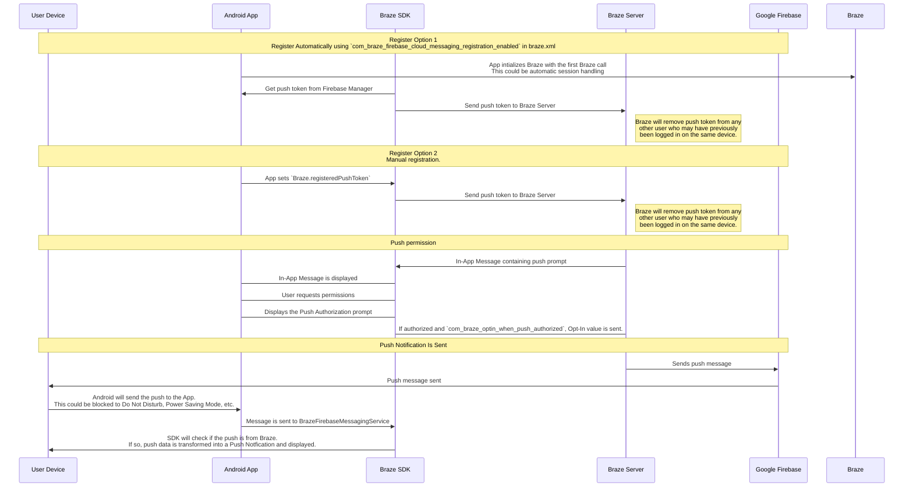

## Comprendre le processus de poussée de Braze

Le service Firebase Cloud Messaging (FCM) est l’infrastructure Google pour les notifications push envoyées aux applications Android. Voici la structure simplifiée de la manière dont les notifications push sont activées pour les appareils de vos utilisateurs et la façon dont Braze peut leur envoyer des notifications push :




### Étape 1 : Configurer votre clé API Google Cloud

Pour développer votre application, vous devrez fournir votre ID d’expéditeur Firebase au SDK Braze pour Android. De plus, vous devez fournir une clé API pour les applications serveur au tableau de bord de Braze. Braze utilisera cette clé API pour envoyer des messages à vos appareils. Vous devrez également vous assurer que le service FCM est activé dans la console de développement de Google. 


Une erreur courante pendant cette étape est d’utiliser la clé API d’identification de l’application plutôt que la clé API REST.


### Étape 2 : Les appareils s’inscrivent au FCM et fournissent à Braze des jetons de notification push

Dans les intégrations typiques, le SDK Braze pour Android traitera l’enregistrement des appareils pour la capacité FCM. Cela se produira généralement immédiatement après l’ouverture de l’application pour la première fois. Après l’inscription, Braze recevra un ID d’enregistrement FCM, utilisé pour envoyer des messages spécifiquement à cet appareil. Nous stockerons l’ID d’enregistrement pour cet utilisateur et il deviendra « push registered » (enregistré pour les notifications push) s’il n’avait pas au préalable de jeton de notification push pour l’une de vos applications.

### Étape 3 : Lancer une campagne de notifications push Braze

Lorsqu’une campagne de notifications push est lancée, Braze fera des requêtes à FCM pour transmettre votre message. Braze utilisera la clé API copiée dans le tableau de bord pour authentifier et vérifier que nous pouvons envoyer des notifications push aux jetons de notification push fournis.

### Étape 4 : Supprimer les jetons non valides

Si FCM nous informe que certains des jetons de notification push auxquels nous tentions d’envoyer un message ne sont pas valides, nous supprimons ces jetons des profils utilisateur auxquels ils sont associés. Si des utilisateurs n’ont pas d’autres jetons de notification push, ils ne s’afficheront plus en tant que « Push Registered » (Enregistré pour les notifications push) dans la page **Segments**.

Pour plus d’informations sur FCM, consultez [Messagerie cloud](https://firebase.google.com/docs/cloud-messaging/).

## Utiliser les journaux d’erreur de notification push

Braze fournit des erreurs de notification push dans le journal des activités de message. Ce journal d’erreurs fournit de nombreux avertissements qui peuvent être très utiles pour identifier les raisons pour lesquelles vos campagnes ne fonctionnent pas comme prévu. Cliquer sur un message d’erreur vous redirigera vers la documentation pertinente pour vous aider à résoudre un incident particulier.


## Scénarios de résolution des problèmes

### Les notifications push ne sont pas envoyées

Il se peut que vos messages push ne soient pas envoyés en raison des situations suivantes :

- Vos identifiants existent dans le mauvais ID de projet de Google Cloud Platform (ID d'expéditeur incorrect).
- Vos informations d'identification n'ont pas la bonne portée de permission.
- Vous avez téléchargé des informations d'identification erronées dans le mauvais espace de travail de Braze (mauvais ID de l'expéditeur).

Pour d'autres problèmes susceptibles de vous empêcher d'envoyer un message push, reportez-vous à [User Guide : Résolution des problèmes des notifications push]({{site.baseurl}}/user_guide/message_building_by_channel/push/troubleshooting/).

### Aucun utilisateur « Push Registered » (Enregistré pour les notifications push) ne s’affiche dans le tableau de bord de Braze (avant l’envoi de messages)

Confirmez que votre app est correctement configurée pour autoriser les notifications push. Les points de défaillance fréquents à vérifier comprennent :

#### ID d’expéditeur incorrect

Vérifiez que l'ID correct d'expéditeur FCM figure dans le fichier `braze.xml`. Un ID d’expéditeur incorrect va entraîner le signalement d’erreurs `MismatchSenderID` dans le journal des activités de message du tableau de bord.

#### L’enregistrement Braze ne se fait pas

Puisque l’enregistrement FCM est géré en dehors de Braze, une erreur d’enregistrement ne peut se produire que dans deux endroits :

1. Lors de l’enregistrement avec FCM
2. Lors de la transmission du jeton de notification push généré par FCM à Braze

Nous recommandons de définir un point de rupture ou une journalisation pour garantir que le jeton de notification push généré par FCM est envoyé à Braze. Si un jeton n’est pas généré correctement ou pas du tout, nous recommandons de consulter la [documentation FCM](https://firebase.google.com/docs/cloud-messaging/android/client).

#### Les services Google Play ne sont pas présents

Pour que la notification push FCM fonctionne, les services Google Play doivent être présents sur l’appareil. Si les services Google Play ne sont pas présents sur un appareil, l’enregistrement de la notification push ne sera pas effectué.

**Remarque :** Les services Google Play ne sont pas installés sur les émulateurs Android qui n’ont pas les API Google installées.

#### L’appareil n’est pas connecté à Internet

Vérifiez que votre appareil dispose d'une bonne connectivité internet et qu'il n'envoie pas le trafic réseau par l'intermédiaire d'un proxy.

### Appuyer sur une notification push n’ouvre pas l’application

Vérifiez si `com_braze_handle_push_deep_links_automatically` est défini sur `true` ou `false`. Pour permettre à Braze d’ouvrir automatiquement l’application et les liens profonds lorsqu’une notification push est touchée, définissez `com_braze_handle_push_deep_links_automatically` sur `true` dans votre fichier `braze.xml`.

Si `com_braze_handle_push_deep_links_automatically` est défini sur sa valeur par défaut de `false`, vous devez créer une Fonction de rappel de notification push Braze pour écouter et gérer les notifications push reçues et les intentions ouvertes.

### Rebonds de notifications push

Si une notification push n’est pas transmise, consultez la [console de développement]({{site.baseurl}}/developer_guide/platforms/android/push_notifications/troubleshooting/#utilizing-the-push-error-logs) pour vous assurer qu'elle n'a pas été rejetée. Vous trouverez ci-dessous une description des erreurs fréquentes susceptibles d'être consignées dans la console de développement :

#### Erreur : MismatchSenderID

`MismatchSenderID` indique une défaillance de l’authentification. Vérifiez que votre ID d’expéditeur Firebase et la clé API FCM sont corrects.

#### Erreur : InvalidRegistration

`InvalidRegistration` peut être causé par un jeton de notification push déficient.

1. Veillez à transmettre un jeton de poussée valide à Braze depuis [Firebase Cloud Messaging](https://firebase.google.com/docs/cloud-messaging/android/client#retrieve-the-current-registration-token).

#### Erreur : NotRegistered

1. `NotRegistered` se produit généralement lorsqu’une application a été supprimée d’un appareil. Braze utilise `NotRegistered` en interne pour signaler qu’une application a été désinstallée d’un appareil.

2. `NotRegistered` peut également se produire lorsque plusieurs enregistrements se produisent et qu’un deuxième enregistrement invalide le premier jeton.

### Les notifications push sont envoyées mais ne sont pas affichées sur les appareils des utilisateurs

Il y a plusieurs raisons pour lesquelles cela pourrait se produire :

#### L’application a été forcée à s’arrêter

Si vous forcez votre application à quitter via les paramètres système, vos notifications push ne seront pas envoyées. Lancer à nouveau l’application permettra de permettre à nouveau à votre appareil de recevoir des notifications push.

#### BrazeFirebaseMessagingService n’est pas enregistré

BrazeFirebaseMessagingService doit être correctement enregistré dans `AndroidManifest.xml` pour que les notifications push s’affichent :

```xml
<service android:name="com.braze.push.BrazeFirebaseMessagingService"
  android:exported="false">
  <intent-filter>
    <action android:name="com.google.firebase.MESSAGING_EVENT" />
  </intent-filter>
</service>
```

#### Le pare-feu bloque la notification push

Si vous testez la notification push par Wi-Fi, votre pare-feu peut bloquer les ports nécessaires pour que FCM reçoive les messages. Vérifiez que les ports `5228`, `5229` et `5230` sont ouverts. En outre, puisque FCM ne spécifie pas ses IP, vous devez également autoriser votre pare-feu à accepter les connexions sortantes vers toutes les adresses IP contenues dans les blocs IP répertoriés dans l’ASN de Google de `15169`.

#### La fabrique de notification personnalisée renvoie null

Si vous avez mis en place une [fabrique de notifications personnalisée]({{site.baseurl}}/developer_guide/platform_integration_guides/android/push_notifications/android/integration/standard_integration/#custom-displaying-notifications), assurez-vous qu'elle ne renvoie pas `null`. Ceci empêcherait l’affichage des notifications.

### Les utilisateurs « Push Registered » (Enregistré pour les notifications push) ne sont plus activés après l’envoi de messages

Il y a plusieurs raisons pour lesquelles cela pourrait se produire :

#### L’application a été désinstallée

Les utilisateurs ont désinstallé l’application. Cela invalidera leur jeton de notification push FCM.

#### Clé du serveur Firebase Cloud Messaging non valide

La clé du serveur Firebase Cloud Messaging fournie dans le tableau de bord de Braze n’est pas valide. L’ID d’expéditeur fourni doit correspondre à celui référencé dans le fichier `braze.xml` de votre application. La clé du serveur et l’ID d’expéditeur sont disponibles ici dans votre console Firebase :

.

### Les clics de notification push ne sont pas enregistrés

Braze enregistre les clics de notification push automatiquement, ce scénario doit donc être relativement rare.

Si les clics push ne sont pas enregistrés, il est possible que les données des clics push n'aient pas encore été transférées vers nos serveurs. Braze restreint la fréquence de ses transmissions en fonction de la solidité de la connexion réseau. Avec une bonne connexion réseau, les données de clics de notification push doivent arriver au serveur dans la minute, dans la plupart des cas.

### Les liens profonds ne fonctionnent pas

#### Vérifiez la configuration du lien profond

Les liens profonds peuvent être [testés avec ADB](https://developer.android.com/training/app-indexing/deep-linking.html#testing-filters). Nous vous recommandons de tester votre lien profond avec la commande suivante :

`adb shell am start -W -a android.intent.action.VIEW -d "THE_DEEP_LINK" THE_PACKAGE_NAME`

Si le lien profond n’arrive pas à fonctionner, il peut être mal configuré. Un lien profond mal configuré ne fonctionnera pas lorsque vous l’enverrez par le biais de la notification push de Braze.

#### Vérifiez la logique de gestion personnalisée

Si le lien profond [fonctionne correctement avec ADB](https://developer.android.com/training/app-indexing/deep-linking.html#testing-filters) mais ne fonctionne pas à partir de Braze push, vérifiez si une création de liens profonds [personnalisée]({{site.baseurl}}/developer_guide/platform_integration_guides/android/push_notifications/android/integration/standard_integration/#android-push-listener-callback) a été mise en œuvre. Si oui, vérifiez que le code de gestion personnalisé gère correctement le lien profond entrant.

#### Désactiver le comportement de la pile arrière

Si le lien profond [fonctionne correctement avec ADB](https://developer.android.com/training/app-indexing/deep-linking.html#testing-filters) mais ne fonctionne pas à partir de Braze push, essayez de désactiver la [pile arrière.](https://developer.android.com/guide/components/activities/tasks-and-back-stack) Pour ce faire, mettez à jour votre fichier **braze.xml** pour y inclure :

```xml
<bool name="com_braze_push_deep_link_back_stack_activity_enabled">false</bool>
```
