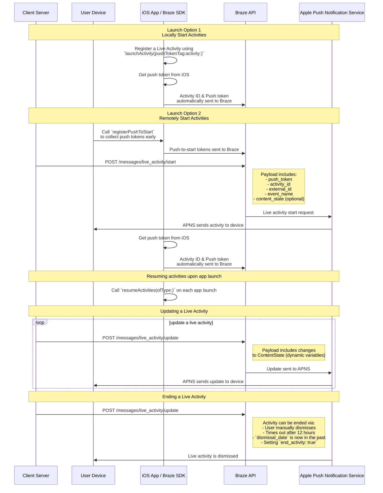

# SWIFT のライブアクティビティ

> Swift Braze SDK 用にライブアクティビティを実装する方法について説明します。ライブ・アクティビティは、ロック画面に直接表示される永続的でインタラクティブな通知で、ユーザーはデバイスのロックを解除することなく、ダイナミックなリアルタイム更新を得ることができる。

## CDI の仕組み

{: style="max-width:40%;float:right;margin-left:15px;"}

ライブアクティビティは、静的情報と、更新された動的情報を組み合わせて表示します。たとえば、配達のステータス追跡機能を提供するライブアクティビティを作成できます。このライブアクティビティには、あなたの会社の名前が静的情報として含まれ、さらに、配達ドライバーが目的地に近づくにつれて更新される「配達までの時間」が動的情報として含まれます。

開発者は Braze を使用して、ライブアクティビティのライフサイクルを管理し、Braze REST API を呼び出してライブアクティビティの更新を行い、登録済みのすべてのデバイスが可能な限り早く更新を受信できるようにすることができます。また、Braze でライブアクティビティを管理しているため、プッシュ通知、アプリ内メッセージ、コンテンツカードなど、その他のメッセージングチャネルとそれらを連携させて使用することで、採用を促進できます。

## シーケンス図 {#sequence-diagram}









## ライブアクティビティの実装

# また、以下を完了する必要がある：

- プロジェクトがiOS 16.1以降をターゲットにしていることを確認する。
- Xcodeプロジェクトの**Signing& Capabilitiesの**下に、`Push Notification` エンタイトルメントを追加する。
- 通知の送信に `.p8` キーが使用されていることを確認します。`.p12` や`.pem` などの古いファイルはサポートされません。
- Braze Swift SDK のバージョン8.2.0以降は、[ライブアクティビティをリモートで登録](#swift_step-2-start-the-activity)できます。この機能を使用するには、iOS 17.2 以降が必要です。


ライブアクティビティとプッシュ通知は似ていますが、システムパーミッションは別個のものです。デフォルトでは、すべてのライブアクティビティの機能が有効になっていますが、ユーザーはアプリごとにこの機能を無効にすることができます。




### ステップ1:アクティビティを作成する {#create-an-activity}

まず、Apple のドキュメントの[ライブアクティビティでライブデータを表示する](https://developer.apple.com/documentation/activitykit/displaying-live-data-with-live-activities)手順に従い、iOS アプリケーションにライブアクティビティをセットアップします。このタスクの一部として、`YES` に設定した `NSSupportsLiveActivities` を `Info.plist` に含めます。

Live Activity の正確な性質はビジネスケースに固有であるため、[Activity](https://developer.apple.com/documentation/activitykit/activityattributes) オブジェクトを設定して初期化する必要があります。以下を定義することが重要です。
* `ActivityAttributes`:このプロトコルは、ライブアクティビティに表示される静的 (不変) コンテンツと動的 (可変) コンテンツを定義します。
* `ActivityAttributes.ContentState`:この型は、アクティビティの進行に伴って更新される動的データを定義します。

また、SwiftUI を使用して、サポートされているデバイスでロック画面とダイナミックアイランドの UI 表示を作成します。 

ライブアクティビティに関する Apple の[前提条件と制限](https://developer.apple.com/documentation/activitykit/displaying-live-data-with-live-activities#Understand-constraints)をよく理解してください。これらの制約は、Braze の制約とは異なります。


同じライブアクティビティに頻繁にプッシュを送信する場合は、`Info.plist` ファイルで `NSSupportsLiveActivitiesFrequentUpdates` を `YES` に設定することで、Apple の予算制限で抑制されるのを回避できます。詳細については、ActivityKit ドキュメントの[`Determine the update frequency`](https://developer.apple.com/documentation/activitykit/updating-and-ending-your-live-activity-with-activitykit-push-notifications#Determine-the-update-frequency)のセクションを参照してください。


#### 例

競争している2つの野生動物救助チームに、居住地に生息するフクロウに対してポイントが与えられる Superb Owl ショーの更新をユーザーに提供するライブアクティビティを作成すると想定してみましょう。この例では、`SportsActivityAttributes` という構造体を作成しましたが、`ActivityAttributes` の独自の実装を使用できます。

```swift
#if canImport(ActivityKit)
  import ActivityKit
#endif

@available(iOS 16.1, *)
struct SportsActivityAttributes: ActivityAttributes {
  public struct ContentState: Codable, Hashable {
    var teamOneScore: Int
    var teamTwoScore: Int
  }

  var gameName: String
  var gameNumber: String
}
```

### ステップ2: アクティビティを開始する {#start-the-activity}

まず、アクティビティの登録方法を選択します。

- **リモート:**を使用する。 [`registerPushToStart`](<http://braze-inc.github.io/braze-swift-sdk/documentation/brazekit/braze/liveactivities-swift.class/registerpushtostart(fortype:name:)>)メソッドをユーザー・ライフサイクルの早い段階で使用し、プッシュ・トゥ・スタート・トークンが必要になる前に、エンドポイントを使用してアクティビティを開始する。 [`/messages/live_activity/start`]({{site.baseurl}}/api/endpoints/messaging/live_activity/start)エンドポイントを使用してアクティビティを開始する。
- **ローカル:**Live Activity のインスタンスを作成し、[`launchActivity`](<https://braze-inc.github.io/braze-swift-sdk/documentation/brazekit/braze/liveactivities-swift.class/launchactivity(pushtokentag:activity:fileid:line:)>) メソッドを使用して、管理するBrazeのプッシュトークンs を作成します。




ライブアクティビティをリモートで登録するには、iOS 17.2以降が必要です。


#### ステップ 2.1:BrazeKit をウィジェット拡張に追加する

Xコードプロジェクトで、アプリの名前を選択し、**一般**を選択します。[**フレームワークとライブラリ**] の下に `BrazeKit` がリストされていることを確認します。


#### ステップ 2.2:BrazeLiveActivityAttributes プロトコルを追加する {#brazeActivityAttributes}

`ActivityAttributes` の実装において、`BrazeLiveActivityAttributes` プロトコルへの適合性を追加し、`brazeActivityId` プロパティをアトリビューション・モデルに追加する。


iOSは、`brazeActivityId` プロパティをライブアクティビティの push-to-start ペイロードの対応するフィールドにマップするため、名前を変更したり、他の値を割り当てたりすることはできません。


```swift
import BrazeKit

#if canImport(ActivityKit)
  import ActivityKit
#endif

@available(iOS 16.1, *)
// 1. Add the `BrazeLiveActivityAttributes` conformance to your `ActivityAttributes` struct.
struct SportsActivityAttributes: ActivityAttributes, BrazeLiveActivityAttributes {
  public struct ContentState: Codable, Hashable {
    var teamOneScore: Int
    var teamTwoScore: Int
  }

  var gameName: String
  var gameNumber: String

  // 2. Add the `String?` property to represent the activity ID.
  var brazeActivityId: String?
}
```

#### ステップ 2.3:push-to-start の登録

次にライブアクティビティのタイプを登録し、そのタイプに関連付けられたすべての push-to-start トークンとライブアクティビティインスタンスを Braze が追跡できるようにします。


iOS オペレーティングシステムは、デバイスが再起動した後、最初のアプリのインストール中にのみ push-to-start トークンを生成します。トークンが確実に登録されていることを確認するには、`registerPushToStart` を`didFinishLaunchingWithOptions` メソッドで呼び出します。


###### 例

次の例では、`LiveActivityManager` クラスがLive Activity オブジェクトを処理します。次に、`registerPushToStart` メソッドが `SportsActivityAttributes` を登録します。

```swift
import BrazeKit

#if canImport(ActivityKit)
  import ActivityKit
#endif

class LiveActivityManager {

  @available(iOS 17.2, *)
  func registerActivityType() {
    // This method returns a Swift background task.
    // You may keep a reference to this task if you need to cancel it wherever appropriate, or ignore the return value if you wish.
    let pushToStartObserver: Task = Self.braze?.liveActivities.registerPushToStart(
      forType: Activity<SportsActivityAttributes>.self,
      name: "SportsActivityAttributes"
    )
  }

}
```

#### ステップ2.4: プッシュ・トゥ・スタート通知を送信する

[`/messages/live_activity/start`]({{site.baseurl}}/api/endpoints/messaging/live_activity/start) エンドポイントを使用してリモートのpush-to-start 通知を送信します。



[Apple のActivityKit フレームワーク](https://developer.apple.com/documentation/activitykit) を使用して、Braze SDKが管理できるプッシュトークンを取得できます。これにより、Braze がバックエンドのApple プッシュ通知サービス(APN) にプッシュトークンを送信するため、Braze API を使用してライブアクティビティを更新できます。

1. Apple のActivityKit API を使用して、Live Activity 実装のインスタンスを作成します。
2. `pushType` パラメータを`.token` として設定します。 
3. 定義したライブアクティビティの `ActivitiesAttributes` と `ContentState` を渡します。 
4. Brazeインスタンスにアクティビティを登録するには、[`launchActivity(pushTokenTag:activity:)`](https://braze-inc.github.io/braze-swift-sdk/documentation/brazekit/braze/liveactivities-swift.class) に渡します。`pushTokenTag` パラメータは、定義するカスタム文字列です。作成するLive Activity ごとに一意である必要があります。

ライブアクティビティを登録すると、Braze SDKはプッシュトークンs の変化を抽出して観察します。

#### 例

たとえば、ライブアクティビティオブジェクトのインターフェイスとして`LiveActivityManager` というクラスを作成します。次に、`pushTokenTag` を`"sports-game-2024-03-15"` に設定します。

```swift
import BrazeKit

#if canImport(ActivityKit)
  import ActivityKit
#endif

class LiveActivityManager {
  
  @available(iOS 16.2, *)
  func createActivity() {
    let activityAttributes = SportsActivityAttributes(gameName: "Superb Owl", gameNumber: "Game 1")
    let contentState = SportsActivityAttributes.ContentState(teamOneScore: "0", teamTwoScore: "0")
    let activityContent = ActivityContent(state: contentState, staleDate: nil)
    if let activity = try? Activity.request(attributes: activityAttributes,
                                            content: activityContent,
      // Setting your pushType as .token allows the Activity to generate push tokens for the server to watch.
                                            pushType: .token) {
      // Register your Live Activity with Braze using the pushTokenTag.
      // This method returns a Swift background task.
      // You may keep a reference to this task if you need to cancel it wherever appropriate, or ignore the return value if you wish.
      let liveActivityObserver: Task = AppDelegate.braze?.liveActivities.launchActivity(pushTokenTag: "sports-game-2024-03-15",
                                                                                        activity: activity)
    }
  }
  
}
```

ライブアクティビティウィジェットによって、この最初の内容がユーザーに表示されます。 

{: style="max-width:40%;"}



### ステップ 3:アクティビティトラッキングを再開する {#resume-activity-tracking}

Braze がアプリ起動時にライブアクティビティを追跡できるようにするには、次のようにします。

1. `AppDelegate` ファイルを開きます。
2. 使用可能な場合は、`ActivityKit` モジュールをインポートします。
3. アプリケーションで登録したすべての `ActivityAttributes` タイプについて、`application(_:didFinishLaunchingWithOptions:)` で [`resumeActivities(ofType:)`](https://braze-inc.github.io/braze-swift-sdk/documentation/brazekit/braze/liveactivities-swift.class/resumeactivities(oftype:)) を呼び出します。

これにより、Brazeは、すべての有効なライブアクティビティのプッシュトークン 更新を追跡するタスクを再開できます。ユーザーがデバイス上のライブアクティビティを明示的に削除した場合、削除されたと見なされ、Brazeはそれを追跡できなくなることに注意してください。

###### 例

```swift
import UIKit
import BrazeKit

#if canImport(ActivityKit)
  import ActivityKit
#endif

@main
class AppDelegate: UIResponder, UIApplicationDelegate {

  static var braze: Braze? = nil

  func application(
    _ application: UIApplication,
    didFinishLaunchingWithOptions launchOptions: [UIApplication.LaunchOptionsKey: Any]?
  ) -> Bool {
    
    if #available(iOS 16.1, *) {
      Self.braze?.liveActivities.resumeActivities(
        ofType: Activity<SportsActivityAttributes>.self
      )
    }

    return true
  }
}
```

### ステップ4:アクティビティを更新する {#update-the-activity}

{: style="max-width:40%;float:right;margin-left:15px;"}

[`/messages/live_activity/update`]({{site.baseurl}}/api/endpoints/messaging/live_activity/update) エンドポイントを使用すると、Braze REST API を介して渡されたプッシュ通知を介してライブアクティビティを更新できます。このエンドポイントを使用して、Live Activity の`ContentState` を更新します。

`ContentState` を更新すると、ライブアクティビティのウィジェットに新しい情報が表示されます。前半終了時に、Superb Owl ショーがどのように見えるかを以下に示します。

詳細については、[`/messages/live_activity/update`エンドポイント]({{site.baseurl}}/api/endpoints/messaging/live_activity/update)の記事を参照してください。

### ステップ 5: アクティビティを終了する {#end-the-activity}

ライブアクティビティが有効な場合、ユーザーのロック画面とダイナミックアイランドの両方に表示されます。ライブアクティビティを終了し、ユーザーの UI から削除する方法はいくつかあります。 

* **ユーザーによる却下**:ユーザーは手動でライブアクティビティを削除できます。
* **タイムアウト**:デフォルトである8時間が経過すると、iOS はユーザーのダイナミックアイランドからライブアクティビティを削除します。デフォルトである12時間が経過すると、iOS はユーザーのロック画面からライブアクティビティを削除します。 
* **却下日**:タイムアウトする前に、ユーザーのユーザーインターフェイスからライブアクティビティを削除する日時を指定できます。これは、アクティビティの `ActivityUIDismissalPolicy` で定義するか、`/messages/live_activity/update` エンドポイントへのリクエストで `dismissal_date` パラメータを使用して定義します。
* **アクティビティの終了**:`/messages/live_activity/update` エンドポイントへのリクエストで `end_activity` を `true` に設定すると、すぐにライブアクティビティを終了できます。

詳細については、[`/messages/live_activity/update`エンドポイント]({{site.baseurl}}/api/endpoints/messaging/live_activity/update)の記事を参照してください。

## トラッキング、ライブ活動の追跡

ライブ・アクティビティ・イベントは、Currents、Snowflake Data Sharing、Query Builderで利用できる。以下のイベントは、ライブ・アクティビティのライフサイクルの把握と監視、トークンの可用性の追跡、問題の診断や配信ステータスの独立系の検証に役立つ。

- [ライブ・アクティビティ プッシュ・トゥ・スタート トークン・チェンジ]({{site.baseurl}}/user_guide/data/braze_currents/event_glossary/customer_behavior_events/#live-activity-push-to-start-token-change-events)：プッシュ・トゥ・スタート（PTS）トークンがBrazeに追加または更新されたタイミングをトラッキング追跡し、ユーザーごとのトークンの登録と利用可能性を追跡できる。
- [ライブ・アクティビティ更新トークン変更]({{site.baseurl}}/user_guide/data/braze_currents/event_glossary/customer_behavior_events/#live-activity-update-token-change-events)：ライブ・アクティビティ・アップデート（LAU）トークンの追加、更新、削除をトラッキング追跡する。
- [ライブ・アクティビティを送る]({{site.baseurl}}/user_guide/data/braze_currents/event_glossary/message_engagement_events/#live-activity-send-events)：Brazeによってライブアクティビティが開始、更新、終了されるたびにログを記録する。
- [ライブ活動の成果]({{site.baseurl}}/user_guide/data/braze_currents/event_glossary/message_engagement_events/#live-activity-outcome-events)：Brazeから送信されるすべてのLive Activityについて、Appleプッシュ通知サービス（APN）への最終的な配信ステータスを示す。

## よくある質問 (FAQ) {#faq}

### 機能性とサポート

#### ライブアクティビティをサポートしているプラットフォームは？

現在、ライブ・アクティビティはiOSとiPadOS特有の機能である。デフォルトでは、iPhoneまたはiPadで起動したアクティビティは、ペアリングされたwatchOS 11+またはMacOS 26+デバイスにも表示される。

{: style="max-width:60%;"}

ライブアクティビティの記事では、Braze Swift SDK を使用してライブアクティビティを管理するための[前提条件]({{site.baseurl}}/developer_guide/platforms/swift/live_activities/#prerequisites)について説明しています。

#### React Nativeアプリはライブ・アクティビティをサポートしているか？

はい、React Native SDK 3.0.0 以降は、Braze Swift SDK 経由でライブアクティビティをサポートしています。つまり、Braze Swift SDK の上に直接 React Native iOS のコードを記述する必要があります。 

Apple が提供するライブアクティビティ機能は、JavaScript では翻訳不可能な言語 (例えば、Swift Concurrency、generics、SwiftUI) を使用しているため、ライブアクティビティ用の React Native 固有のJavaScript の便利な API は存在しません。

#### Brazeはキャンペーンやキャンバスのステップとしてのライブ活動をサポートしているか？

いや、これは現在サポートされていない。

### プッシュ通知とライブ活動

#### ライブ・アクティビティがアクティブな状態でプッシュ通知が送信された場合はどうなるのか？ 

{: style="max-width:30%;float:right;margin-left:15px;"}

ライブアクティビティとプッシュ通知は、異なる画面領域を占有するため、ユーザーの画面上で競合することはありません。

#### ライブ・アクティビティがプッシュ・メッセージ機能を活用する場合、ライブ・アクティビティを受信するためにプッシュ通知を有効にする必要があるか？

ライブアクティビティはプッシュ通知に依存して更新を行いますが、それらは異なるユーザー設定によってコントロールされています。ユーザーはライブアクティビティにオプトインできますが、プッシュ通知はオプトアウトでき、その逆も可能です。

ライブアクティビティ更新トークンは8 時間後に期限切れになります。

#### ライブアクティビティにはプッシュプライマーが必要ですか？

[プッシュプライマーは]({{site.baseurl}}/user_guide/message_building_by_channel/push/best_practices/push_primer_messages/)、ユーザーにアプリからのプッシュ通知をオプトインするよう促すベストプラクティスです。しかし、ライブアクティビティにオプトインするためのシステムプロンプトはありません。デフォルトでは、ユーザーが iOS 16.1 以降にアプリをインストールすると、個々のアプリのライブアクティビティにオプトインされます。この権限は、アプリごとにデバイス設定で無効化または再有効化することができます。

### 技術的な話題とトラブルシューティング

#### ライブアクティビティにエラーがあるかどうかを知るには？

ライブアクティビティエラーは、Braze ダッシュボードの[メッセージアクティビティログ]({{site.baseurl}}/user_guide/administrative/app_settings/message_activity_log_tab/)に記録されます。ここでは、「LiveActivity Errors」でフィルターできます。

#### Push-to-start 通知を送信した後、Live Activity を受信していないのはなぜですか?

まず、[`messages/live_activity/start`]({{site.baseurl}}/api/endpoints/messaging/live_activity/start) エンドポイントで説明されているすべての必須フィールドがペイロードに含まれていることを確認します。`activity_attributes` および `content_state` フィールドは、プロジェクトのコードで定義されているプロパティと一致する必要があります。ペイロードが正しいことが確かな場合は、APN によってレート制限されている可能性があります。この制限は、Braze ではなく Apple によって課されます。

プッシュ・トゥ・スタート通知がデバイスに正常に届いたが、レート制限のために表示されなかったことを確認するには、Macのコンソール・アプリを使用してプロジェクトをデバッグします。目的のデバイスの録音プロセスをアタッチし、検索バーの`process:liveactivitiesd` でログをフィルタリングします。

#### Push-to-Start でライブアクティビティを開始した後、新しい更新を受信しないのはなぜですか。

[上記](#swift_brazeActivityAttributes)の手順が正しく実行されていることを確認します。`ActivityAttributes` には、`BrazeLiveActivityAttributes` プロトコル適合性と`brazeActivityId` プロパティの両方が含まれていなければなりません。

ライブアクティビティの Push-to-Start 通知を受信したら、Braze URL の `/push_token_tag` エンドポイントへの送信ネットワーク要求が表示され、`"tag"` フィールドの下に正しいアクティビティ ID が含まれていることを再確認します。

最後に、更新ペイロードのライブ・アクティビティ属性タイプが、SDKメソッド呼び出しで使用されている正確な文字列とクラスと一致していることを確認し、`registerPushToStart` 。タイプミスを避けるために定数を使用する。  

#### `live_activity/update` エンドポイントを使おうとすると、アクセス拒否応答が表示されます。なぜでしょう？

使用するAPIキーには、さまざまなBraze APIエンドポイントにアクセスするための適切なパーミッションを与える必要がある。以前に作成したAPIキーを使用している場合、その権限の更新を怠っている可能性がある。[API キーセキュリティの概要]({{site.baseurl}}/api/basics/#rest-api-key-security)を読んで再確認してください。

#### `messages/send` エンドポイントは、`messages/live_activity/update` エンドポイントとレート制限を共有しているか？ 

デフォルトでは、`messages/live_activity/update` エンドポイントのレート制限は、ワークスペースごとに、複数のエンドポイントにわたって、1時間あたり250,000リクエストです。詳細については、[APIレート制限]({{site.baseurl}}/api/api_limits/)を参照してください。
