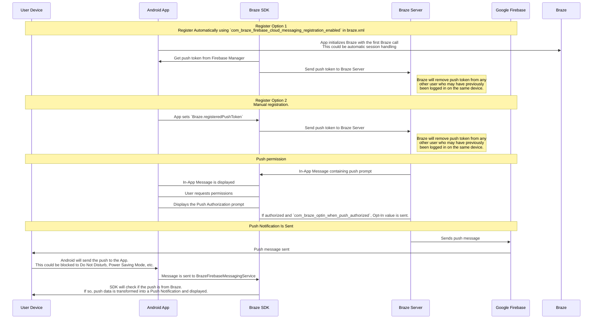

## Brazeのプッシュワークフローを理解する

Firebase Cloud Messaging (FCM) サービスは、Android アプリケーションに送信されるプッシュ通知のための Google のインフラストラクチャです。ユーザーのデバイスに対してプッシュ通知を有効にする方法と、Braze がユーザーにプッシュ通知を送信する方法の簡単な構造を次に示します。




### ステップ 1:Google Cloud APIキーを構成する

アプリの開発では、Firebase 送信者 ID を Braze Android SDK に提供する必要があります。また、サーバーアプリケーションの API キーを Braze ダッシュボードに提供する必要があります。Braze はこの API キーを使用してデバイスにメッセージを送信します。Google Developer のコンソールで FCM サービスが有効になっていることも確認する必要があります。 


このステップでよくある間違いは、REST API キーの代わりにアプリ識別子の API キーを使用することです。


### ステップ 2:デバイスが FCM に登録して Braze にプッシュトークンを提供する

一般的な統合では、Braze Android SDK が FCM 機能のデバイス登録を処理します。これは通常、アプリを初めて開いた後すぐに行われます。登録後、Braze に FCM 登録 ID が提供されます。この ID は、そのデバイスにメッセージを送信するために使用されます。ユーザーの登録 ID が保存され、そのユーザーが以前にアプリのプッシュトークンを持っていなかった場合は、ユーザーが「プッシュ登録」されます。

### ステップ 3:Braze プッシュキャンペーンを開始する

プッシュキャンペーンが開始されると、Braze は FCM にメッセージの配信リクエストを行います。Braze は、ダッシュボードにコピーされた API キーを使用して認証を行い、提供されたプッシュトークンにプッシュ通知を送信できることを確認します。

### ステップ 4:無効なトークンを削除する

メッセージを送信しようとしたプッシュトークンのいずれかが無効であると FCM から通知された場合は、関連付けられていたユーザープロファイルからそれらのトークンを削除します。ユーザーが他にプッシュトークンを持っていない場合は、[**セグメント**] ページの下に「プッシュ登録済み」として表示されなくなります。

FCM の詳細については、[クラウドメッセージング](https://firebase.google.com/docs/cloud-messaging/)を参照してください。

## プッシュエラーログの活用

Braze は、プッシュ通知エラーをメッセージアクティビティログに出力します。このエラーログは、キャンペーンが期待どおりに機能していない理由を特定するのに非常に役立つさまざまな警告を提供します。エラーメッセージをクリックすると、特定のインシデントのトラブルシューティングに役立つ関連ドキュメントにリダイレクトされます。


## トラブルシューティングのシナリオ

### プッシュが送信されない

次の状況により、プッシュメッセージが送信されない可能性があります。

- 間違った Google Cloud Platform プロジェクト ID (間違った送信者 ID) の認証情報が存在します。
- 認証情報の権限スコープが間違っています。
- 間違った認証情報を間違った Braze ワークスペース (間違った送信者 ID) にアップロードしました。

プッシュメッセージの送信を妨げるその他の問題については、[ユーザーガイドを参照のこと：プッシュ通知のトラブルシューティング]({{site.baseurl}}/user_guide/message_building_by_channel/push/troubleshooting/).

### Braze ダッシュボードに「プッシュ登録された」ユーザーが表示されない (メッセージ送信前)

アプリがプッシュ通知を許可するように正しく構成されていることを確認してください。チェックすべき一般的な障害点は次のとおりです。

#### 送信者 ID が正しくない

正しい FCM 送信者 ID が `braze.xml` ファイルに含まれていることを確認してください。送信者 ID が正しくないと、ダッシュボードのメッセージアクティビティログに `MismatchSenderID` エラーが報告されます。

#### Braze 登録が行われない

FCM 登録は Braze の外部で処理されるため、登録の失敗は次の 2 つのタイミングでのみ起こります。

1. FCM への登録中
2. FCM で生成されたプッシュトークンを Braze に渡すとき

ブレークポイントを設定するか、ログを記録して、FCM で生成されたプッシュトークンが Braze に送信されていることを確認してください。トークンが正しく生成されない場合、またはまったく生成されない場合は、[FCM ドキュメント](https://firebase.google.com/docs/cloud-messaging/android/client)を参照することをお勧めします。

#### Google Play 開発者サービスが存在しない

FCM プッシュが正しく機能するためには、Google Play 開発者サービスがデバイス上に存在する必要があります。Google Play 開発者サービスがデバイス上にない場合、プッシュ登録は行われません。

**注:**Google API がインストールされていない Android エミュレーターには、Google Play 開発者サービスはインストールされません。

#### デバイスがインターネットに接続されていない

デバイスのインターネット接続が良好で、プロキシ経由でネットワークトラフィックを送信していないことを確認してください。

### プッシュ通知をタップしてもアプリが開かない

`com_braze_handle_push_deep_links_automatically` が `true` または `false` に設定されているかどうか確認します。プッシュ通知がタップされたときに Braze がアプリとディープリンクを自動的に開くようにするには、`braze.xml` ファイルで `com_braze_handle_push_deep_links_automatically` を `true` に設定します。

`com_braze_handle_push_deep_links_automatically` がデフォルトの `false` に設定されている場合は、Braze プッシュコールバックを使用して、プッシュの受信および開封インテントをリッスンし、処理する必要があります

### プッシュ通知がバウンスされる

プッシュ通知が配信されない場合は、[開発者コンソール]({{site.baseurl}}/developer_guide/platforms/android/push_notifications/troubleshooting/#utilizing-the-push-error-logs)を見て、通知がバウンスされていないことを確認してください。以下は、開発者コンソールに記録される可能性のある一般的なエラーの説明です。

#### エラー:MismatchSenderID

`MismatchSenderID` は認証が失敗したことを示します。Firebase 送信者 ID と FCM API キーが正しいことを確認してください。

#### エラー:InvalidRegistration

`InvalidRegistration` は、不正な形式のプッシュトークンが原因で発生する可能性があります。

1. [[Firebase Cloud Messaging](https://firebase.google.com/docs/cloud-messaging/android/client#retrieve-the-current-registration-token)] からの有効なプッシュトークンを Braze に渡すようにしてください。

#### エラー:NotRegistered

1. `NotRegistered` は通常、アプリがデバイスから削除されたときに発生します。Braze はアプリがデバイスからアンインストールされたことを通知するために、内部で `NotRegistered` を使用します。

2. `NotRegistered` は、複数の登録が行われ、2 番目の登録によって最初のトークンが無効になった場合にも発生する可能性があります。

### プッシュ通知は送信されるが、ユーザーのデバイスに表示されない

この問題が発生する理由はいくつか考えられます。

#### アプリケーションが強制終了された

システム設定からアプリケーションを強制終了すると、プッシュ通知は送信されません。アプリを再度起動すると、デバイスがプッシュ通知を受信できるようになります。

#### BrazeFirebaseMessagingService が登録されていない

プッシュ通知を表示するには、BrazeFirebaseMessagingService が `AndroidManifest.xml` に適切に登録されている必要があります。

```xml
<service android:name="com.braze.push.BrazeFirebaseMessagingService"
  android:exported="false">
  <intent-filter>
    <action android:name="com.google.firebase.MESSAGING_EVENT" />
  </intent-filter>
</service>
```

#### ファイアウォールがプッシュをブロックしている

Wi-Fi 経由でプッシュをテストしている場合は、FCM がメッセージを受信するために必要なポートがファイアウォールによってブロックされている可能性があります。ポート `5228`、`5229`、`5230` が開いていることを確認します。また、FCM は IP を指定しないため、Google の `15169` の ASN に記載された IP ブロックに含まれるすべての IP アドレスへの発信接続をファイアウォールが受け入れることも許可する必要があります。

#### カスタム通知ファクトリーが null を返す

[[カスタム通知ファクトリー]({{site.baseurl}}/developer_guide/platform_integration_guides/android/push_notifications/android/integration/standard_integration/#custom-displaying-notifications)] を実装している場合は、`null` を返していないことを確認します。null が返されると、通知が表示されなくなります。

### 「プッシュ登録済み」ユーザーがメッセージ送信後に有効でなくなる

この問題が発生する理由はいくつか考えられます。

#### アプリケーションがアンインストールされた

ユーザーがアプリケーションをアンインストールしました。これにより、FCM プッシュトークンが無効になります。

#### 無効な Firebase Cloud Messaging サーバーキー

Braze ダッシュボードで提供された Firebase Cloud Messaging サーバーキーが無効です。提供された送信者 ID は、アプリの `braze.xml` ファイルで参照されている送信者 ID と一致する必要があります。サーバーキーと送信者 ID は、Firebase コンソールの次の場所にあります。

![Firebase プラットフォームの [設定]、[クラウドメッセージング] にサーバー ID とサーバーキーが表示されます。]( "FirebaseServerKey")

### プッシュクリックが記録されない

Braze はプッシュクリックを自動的に記録するため、このシナリオは比較的まれです。

プッシュクリックがログに記録されない場合は、プッシュクリックデータがまだサーバーにフラッシュされていない可能性があります。Braze は、ネットワーク接続の強度に基づいてフラッシュの頻度を調整します。ネットワーク接続が良好であれば、ほとんどの状況でプッシュクリックデータが 1 分以内にサーバーに到着します。

### ディープリンクが機能しない

#### ディープリンク構成を確認する

ディープリンクは、[[ADBでテスト](https://developer.android.com/training/app-indexing/deep-linking.html#testing-filters)] することができます。次のコマンドを使用してディープリンクをテストすることをお勧めします。

`adb shell am start -W -a android.intent.action.VIEW -d "THE_DEEP_LINK" THE_PACKAGE_NAME`

ディープリンクが機能しない場合は、ディープリンクの構成が正しくない可能性があります。構成が正しくないディープリンクは、Braze プッシュ経由で送信されると正しく機能しません。

#### カスタム処理ロジックを検証する

ディープリンクが [[ADB では正しく動作する](https://developer.android.com/training/app-indexing/deep-linking.html#testing-filters)] が、Braze プッシュからは機能しない場合は、[[カスタムプッシュ開封処理]({{site.baseurl}}/developer_guide/platform_integration_guides/android/push_notifications/android/integration/standard_integration/#android-push-listener-callback)] が実装されているかどうかを確認します。実装されている場合は、カスタム処理コードが受信ディープリンクを適切に処理していることを確認してください。

#### バックスタック動作を無効にする

ディープリンクが [[ADB では正しく動作する](https://developer.android.com/training/app-indexing/deep-linking.html#testing-filters)] が、Braze プッシュでは機能しない場合は、[[バックスタック](https://developer.android.com/guide/components/activities/tasks-and-back-stack)] を無効にしてみてください。そのためには、**braze.xml** を更新して以下を含めます。

```xml
<bool name="com_braze_push_deep_link_back_stack_activity_enabled">false</bool>
```
