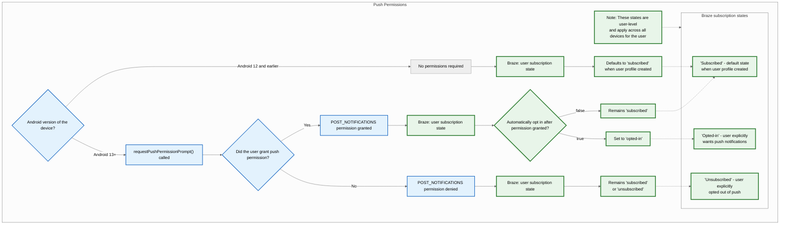
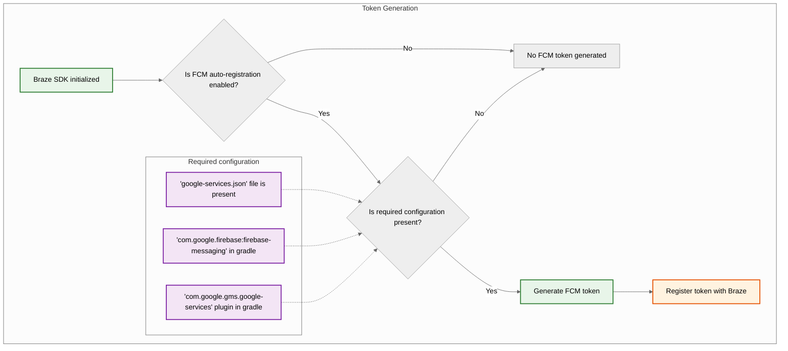
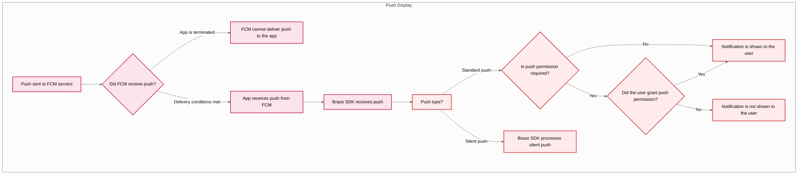



## 内蔵機能

以下の機能がBraze Android SDKに組み込まれている。その他のプッシュ通知機能を使うには、アプリの[プッシュ通知を設定する](#android_setting-up-push-notifications)必要がある。

|機能|説明|
|-------|-----------|
|プッシュ通知ストーリー|Androidプッシュストーリーは、デフォルトでBraze Android SDKに組み込まれている。詳しくは[プッシュストーリーを]({{site.baseurl}}/user_guide/message_building_by_channel/push/advanced_push_options/push_stories/)参照のこと。|
|プッシュプライマー|プッシュプライマーキャンペーンでは、アプリのデバイスでプッシュ通知を有効にするようにユーザーに促します。これは、[ノーコードプッシュプライマー]({{site.baseurl}}/user_guide/message_building_by_channel/push/best_practices/push_primer_messages/)を使用して、SDK のカスタマイズなしで行うことができます。|
{: .reset-td-br-1 .reset-td-br-2 role="presentation"}

## プッシュ通知のライフサイクルについて {#push-notification-lifecycle}

次のフローチャートは、Brazeが権限プロンプト、トークン生成、メッセージ配信などのプッシュ通知のライフサイクルをどのように処理しているかを示している。















## プッシュ通知の設定


FCMをBraze Android SDKで使用したサンプルアプリを確認するには、[Brazeを参照のこと：Firebase Push サンプル アプリ](https://github.com/braze-inc/braze-android-sdk/tree/master/samples/firebase-push).


### レート制限

Firebase Cloud Messaging (FCM) API には、1分当たりに600,000リクエストというデフォルトのレート制限があります。この制限に達した場合、Brazeは数分後に自動的に再試行します。増加をリクエストするには、[Firebaseサポート](https://firebase.google.com/support)に連絡してください。

### ステップ 1: Firebase をプロジェクトに追加する

最初に、FirebaseをAndroidプロジェクトに追加します。手順については、Googleの[Firebaseセットアップガイド](https://firebase.google.com/docs/android/setup)を参照してください。

### ステップ 2:Cloud Messaging を依存関係に追加する

次に、Cloud Messaging ライブラリをプロジェクトの依存関係に追加します。Android プロジェクトで `build.gradle` を開き、`dependencies` ブロックに次の行を追加します。

```gradle
implementation "google.firebase:firebase-messaging:+"
```

依存関係は次のようになります。

```gradle
dependencies {
  implementation project(':android-sdk-ui')
  implementation "com.google.firebase:firebase-messaging:+"
}
```

### ステップ3:Firebase Cloud Messaging API を有効にする

Google Cloud で、Android アプリが使用しているプロジェクトを選択し、[Firebase Cloud Messaging API](https://console.cloud.google.com/apis/library/fcm.googleapis.com) を有効にします。

({: style="max-width:80%;"})

### ステップ 4: サービスアカウントを作成する

次に、新しいサービスアカウントを作成し、FCM トークンの登録時に Braze が許可された API 呼び出しを行えるようにします。Google Cloud で、[**サービスアカウント**] に移動し、プロジェクトを選択します。[**サービスアカウント**] ページで [**サービスアカウントの作成**] を選択します。

()

サービスアカウント名、ID、説明を入力して、[**作成して続行**] を選択します。

![[サービスアカウントの詳細] のフォーム。]()()

[**ロール**] フィールドで、ロールのリストから [**Firebase Cloud Messaging API 管理者**] を見つけて選択します。アクセスをより制限する場合は、`cloudmessaging.messages.create` 権限を持つ[カスタムロール](https://cloud.google.com/iam/docs/creating-custom-roles)を作成し、代わりにリストからそれを選択します。[**完了**] を選択します。


[**Firebase Cloud Messaging 管理者**] ではなく、[**Firebase Cloud Messaging _API_ 管理者**] を選択してください。


![[Firebase Cloud Messaging API 管理者] がロールとして選択されている、「このサービスアカウントにプロジェクトへのアクセス権を付与」するためのフォーム。]()()

### ステップ 5: {#json}JSON 認証情報を生成します{#json}。

次に、FCM サービスアカウントの JSON 認証情報を生成します。Google Cloud IAM & Admin で、[&サービスアカウント&] に移動し、プロジェクトを選択します。[先ほど作成した](#android_service-account) FCM サービスアカウントを見つけて、<i class="fa-solid fa-ellipsis-vertical"></i>[**アクション**] > [**キーの管理**] を選択します。

![[アクション] メニューが開いた状態の、プロジェクトのサービスアカウントホームページ。]()()

[**キーの追加**] > [**新しいキーを作成**] を選択します。

![[キーを追加] メニューが開いた状態の選択されたサービスアカウント。]()()

[**JSON**] を選択し、[**作成**] を選択します。FCM プロジェクト ID とは異なる Google Cloud のプロジェクト ID を使用してサービスアカウントを作成した場合は、JSON ファイルで `project_id` に割り当てられた値を手動で更新する必要があります。

キーをどこにダウンロードしたかを覚えておいてください。次のステップで必要になります。

({: style="max-width:65%;"})


秘密キーが漏洩した場合は、セキュリティリスクが生じる可能性があります。JSON の認証情報は安全な場所に保存しておいてください。キーは Braze にアップロードした後で削除します。


### ステップ 6:JSON の認証情報を Braze にアップロードする

次に、JSON 認証情報を Braze ダッシュボードにアップロードします。Braze で、<i class="fa-solid fa-gear"></i>[**設定**] > [**アプリの設定**] を選択します。

![[アプリ設定] が強調表示された状態で Braze で [設定] メニューが開いています。]()()

Android アプリの [**プッシュ通知設定**] で [**Firebase**] を選択し、[**JSON ファイルのアップロード**] を選択して、[先ほど生成した](#android_json)認証情報をアップロードします。完了したら、[**保存**] を選択します。

()


秘密キーが漏洩した場合は、セキュリティリスクが生じる可能性があります。キーが Braze にアップロードされたので、[先に生成した](#android_json)ファイルを削除します。


### ステップ 7:トークンの自動登録を設定する

ユーザーの 1 人がプッシュ通知をオプトインした場合、アプリはそのユーザーにプッシュ通知を送信する前に、ユーザーのデバイス上で FCM トークンを生成する必要があります。Braze SDK を使用すると、プロジェクトの Braze 構成ファイルで各ユーザーのデバイスで FCM トークンの自動登録を有効にすることができます。

まず Firebase Console に移動し、プロジェクトを開いて、<i class="fa-solid fa-gear"></i>[**設定**] > [**プロジェクト設定**] を選択します。

![[設定] メニューが開いた状態の Firebase プロジェクト。]()()

[**Cloud Messaging**] を選択し、[**Firebase Cloud Messaging API (V1)**] で [**送信者 ID**] フィールドの数字をコピーします。

![[送信者 ID] が強調表示されている Firebase プロジェクトの「Cloud Messaging」ページ。]()()

次に、Android Studio プロジェクトを開き、Firebase 送信者 ID を使用して、`braze.xml` または `BrazeConfig` 内で FCM トークンの自動登録を有効にします。



FCM トークンの自動登録を設定するには、`braze.xml` ファイルに以下の行を追加します。

```xml
<bool translatable="false" name="com_braze_firebase_cloud_messaging_registration_enabled">true</bool>
<string translatable="false" name="com_braze_firebase_cloud_messaging_sender_id">FIREBASE_SENDER_ID</string>
```

`FIREBASE_SENDER_ID` を Firebase プロジェクトの設定からコピーした値に置き換えます。`braze.xml` は次のようになります。

```xml
<?xml version="1.0" encoding="utf-8"?>
<resources>
  <string translatable="false" name="com_braze_api_key">12345ABC-6789-DEFG-0123-HIJK456789LM</string>
  <bool translatable="false" name="com_braze_firebase_cloud_messaging_registration_enabled">true</bool>
<string translatable="false" name="com_braze_firebase_cloud_messaging_sender_id">603679405392</string>
</resources>
```



自動FCMトークン登録を構成するには、次の行を`BrazeConfig`に追加します:



```java
.setIsFirebaseCloudMessagingRegistrationEnabled(true)
.setFirebaseCloudMessagingSenderIdKey("FIREBASE_SENDER_ID")
```


```kotlin
.setIsFirebaseCloudMessagingRegistrationEnabled(true)
.setFirebaseCloudMessagingSenderIdKey("FIREBASE_SENDER_ID")
```



`FIREBASE_SENDER_ID` を Firebase プロジェクトの設定からコピーした値に置き換えます。`BrazeConfig` は次のようになります。



```java
BrazeConfig brazeConfig = new BrazeConfig.Builder()
  .setApiKey("12345ABC-6789-DEFG-0123-HIJK456789LM")
  .setCustomEndpoint("sdk.iad-01.braze.com")
  .setSessionTimeout(60)
  .setHandlePushDeepLinksAutomatically(true)
  .setGreatNetworkDataFlushInterval(10)
  .setIsFirebaseCloudMessagingRegistrationEnabled(true)
  .setFirebaseCloudMessagingSenderIdKey("603679405392")
  .build();
Braze.configure(this, brazeConfig);
```


```kotlin
val brazeConfig = BrazeConfig.Builder()
  .setApiKey("12345ABC-6789-DEFG-0123-HIJK456789LM")
  .setCustomEndpoint("sdk.iad-01.braze.com")
  .setSessionTimeout(60)
  .setHandlePushDeepLinksAutomatically(true)
  .setGreatNetworkDataFlushInterval(10)
  .setIsFirebaseCloudMessagingRegistrationEnabled(true)
  .setFirebaseCloudMessagingSenderIdKey("603679405392")
  .build()
Braze.configure(this, brazeConfig)
```




代わりに FCM トークンを手動で登録する場合は、アプリの [`onCreate()`](https://developer.android.com/reference/android/app/Application.html#onCreate()) メソッド内で [`Braze.setRegisteredPushToken()`](https://braze-inc.github.io/braze-android-sdk/kdoc/braze-android-sdk/com.braze/-braze/registered-push-token.html) を呼び出すことができます。




### ステップ 8アプリケーションクラスの自動リクエストを削除する

サイレントプッシュ通知を送信するたびにBrazeが不要なネットワークリクエストをトリガーするのを防ぐには、`Application` クラスの`onCreate()` メソッドで設定されている自動ネットワークリクエストをすべて削除する。詳細については、[Android 開発者リファレンス:アプリケーション](https://developer.android.com/reference/android/app/Application)を参照してください。

## 通知を表示する

### ステップ 1: Braze Firebase メッセージングサービスを登録する

新規、既存、またはBraze以外のFirebaseメッセージングサービスを作成することができる。特定のニーズに最も適したものを選択する。



Braze には、プッシュ受信インテントと開封インテントを処理するサービスが含まれています。`BrazeFirebaseMessagingService` クラスは `AndroidManifest.xml` に登録する必要があります。

```xml
<service android:name="com.braze.push.BrazeFirebaseMessagingService"
  android:exported="false">
  <intent-filter>
    <action android:name="com.google.firebase.MESSAGING_EVENT" />
  </intent-filter>
</service>
```

通知コードでは、`BrazeFirebaseMessagingService` を使用して、オープンアクションとクリックアクションのトラッキングも処理します。このサービスが正しく機能するには、`AndroidManifest.xml` に登録する必要があります。また、Brazeはシステムからの通知に固有のキーを付けているため、システムから送信された通知のみを表示することができます。他の FCM サービスから送信される通知を表示するために、追加のサービスを個別に登録することもできます。Firebase プッシュサンプルアプリの[](https://github.com/braze-inc/braze-android-sdk/blob/master/samples/firebase-push/src/main/AndroidManifest.xml)`[](https://github.com/braze-inc/braze-android-sdk/blob/master/samples/firebase-push/src/main/AndroidManifest.xml)`AndroidManifest.xml` を参照してください。


Braze SDK 3.1.1 より前では、FCM プッシュを処理するために `AppboyFcmReceiver` が使用されていました。マニフェストから `AppboyFcmReceiver` クラスを削除し、前述の統合に置き換える必要があります。




Firebase Messaging Service がすでに登録されている場合は、[`RemoteMessage`](https://firebase.google.com/docs/reference/android/com/google/firebase/messaging/RemoteMessage) オブジェクトを[`BrazeFirebaseMessagingService.handleBrazeRemoteMessage()`](https://braze-inc.github.io/braze-android-sdk/kdoc/braze-android-sdk/com.braze.push/-braze-firebase-messaging-service/-companion/handle-braze-remote-message.html) 経由でBraze に渡すことができます。このメソッドは [`RemoteMessage`](https://firebase.google.com/docs/reference/android/com/google/firebase/messaging/RemoteMessage) オブジェクトが Braze から発信された場合にのみ通知を表示し、そうでない場合は無視します。




```java
public class MyFirebaseMessagingService extends FirebaseMessagingService {
  @Override
  public void onMessageReceived(RemoteMessage remoteMessage) {
    super.onMessageReceived(remoteMessage);
    if (BrazeFirebaseMessagingService.handleBrazeRemoteMessage(this, remoteMessage)) {
      // This Remote Message originated from Braze and a push notification was displayed.
      // No further action is needed.
    } else {
      // This Remote Message did not originate from Braze.
      // No action was taken and you can safely pass this Remote Message to other handlers.
    }
  }
}
```




```kotlin
class MyFirebaseMessagingService : FirebaseMessagingService() {
  override fun onMessageReceived(remoteMessage: RemoteMessage?) {
    super.onMessageReceived(remoteMessage)
    if (BrazeFirebaseMessagingService.handleBrazeRemoteMessage(this, remoteMessage)) {
      // This Remote Message originated from Braze and a push notification was displayed.
      // No further action is needed.
    } else {
      // This Remote Message did not originate from Braze.
      // No action was taken and you can safely pass this Remote Message to other handlers.
    }
  }
}
```






使用したい別の Firebase メッセージングサービスがある場合は、アプリケーションが Braze からではないプッシュを受信した場合に呼び出すフォールバック Firebase メッセージングサービスを指定することもできます。

`braze.xml` で次のように指定します。

```xml
<bool name="com_braze_fallback_firebase_cloud_messaging_service_enabled">true</bool>
<string name="com_braze_fallback_firebase_cloud_messaging_service_classpath">com.company.OurFirebaseMessagingService</string>
```

または、[ランタイム設定で設定します:]({{site.baseurl}}/developer_guide/sdk_initalization/?sdktab=android)




```java
BrazeConfig brazeConfig = new BrazeConfig.Builder()
        .setFallbackFirebaseMessagingServiceEnabled(true)
        .setFallbackFirebaseMessagingServiceClasspath("com.company.OurFirebaseMessagingService")
        .build();
Braze.configure(this, brazeConfig);
```




```kotlin
val brazeConfig = BrazeConfig.Builder()
        .setFallbackFirebaseMessagingServiceEnabled(true)
        .setFallbackFirebaseMessagingServiceClasspath("com.company.OurFirebaseMessagingService")
        .build()
Braze.configure(this, brazeConfig)
```






### ステップ 2:小さなアイコンをデザインガイドラインに準拠させる

Android 通知アイコンの一般的な情報については、[通知の概要](https://developer.android.com/guide/topics/ui/notifiers/notifications) をご覧ください。

Android N 以降、色を使った小さな通知アイコンアセットは更新または削除する必要があります。Android システム (Braze SDK ではない) は、アクションアイコンと小さな通知アイコンの非アルファチャネルと透明チャネルをすべて無視します。つまり、Android は小さな通知アイコンの透明領域を除くすべての部分をモノクロに変換します。

適切に表示される通知用スモールアイコンアセットを作成する：
- 画像から白以外のすべての色を削除します。
- アセットの他のすべての非白色領域は透明である必要があります。


不適切なアセットでよく見られる問題の 1 つは、小さな通知アイコンが単色の正方形としてレンダリングされることです。これは、Android システムが小さな通知アイコンアセットで透明領域を見つけられないことが原因です。


次の図の大小アイコンは、適切にデザインされたアイコンの例です。


### ステップ 3: 通知アイコンを設定する

#### braze.xmlでアイコンを指定する

Braze では、`braze.xml` 内で描画可能なリソースを指定することで、通知アイコンを設定できます。

```xml
<drawable name="com_braze_push_small_notification_icon">REPLACE_WITH_YOUR_ICON</drawable>
<drawable name="com_braze_push_large_notification_icon">REPLACE_WITH_YOUR_ICON</drawable>
```

小さな通知アイコンの設定は必須です。**設定しない場合、Braze はデフォルトで小さな通知アイコンとしてアプリケーションアイコンを使用しますが、これは最適に表示されない可能性があります。**

大きな通知アイコンの設定は任意ですが、推奨されます。

#### アイコンのアクセントカラーの指定

通知アイコンのアクセントカラーは、`braze.xml` でオーバーライドできます。色を指定しない場合、デフォルトの色は Lollipop がシステム通知に使用するのと同じグレーになります。

```xml
<integer name="com_braze_default_notification_accent_color">0xFFf33e3e</integer>
```

オプションでカラーリファレンスを使用することもできます。

```xml
<color name="com_braze_default_notification_accent_color">@color/my_color_here</color>
```

### ステップ4: ディープリンクを追加する

#### ディープリンクの自動オープンを有効にする

プッシュ通知がクリックされたときに Braze がアプリとディープリンクを自動的に開くようにするには、`braze.xml` で `com_braze_handle_push_deep_links_automatically` を `true` に設定します。

```xml
<bool name="com_braze_handle_push_deep_links_automatically">true</bool>
```

このフラグは、[実行時設定]({{site.baseurl}}/developer_guide/sdk_initalization/?sdktab=android) で設定することもできます。




```java
BrazeConfig brazeConfig = new BrazeConfig.Builder()
        .setHandlePushDeepLinksAutomatically(true)
        .build();
Braze.configure(this, brazeConfig);
```




```kotlin
val brazeConfig = BrazeConfig.Builder()
        .setHandlePushDeepLinksAutomatically(true)
        .build()
Braze.configure(this, brazeConfig)
```




ディープリンクをカスタムで処理する場合は、Braze からのプッシュ受信およびオープンインテントをリッスンするプッシュコールバックを作成する必要があります。詳しくは、[プッシュ・イベントにコールバックを使うを]({{site.baseurl}}/developer_guide/push_notifications/customization#android_using-a-callback-for-push-events)参照のこと。

#### カスタムディープリンクの作成

すでにアプリにディープリンクを追加していない場合は、ディープリンクに関する[Android 開発者ドキュメント[](http://developer.android.com/training/app-indexing/deep-linking.html)]内の指示に従ってください。ディープリンクの詳細については、[FAQ の記事を]({{site.baseurl}}/user_guide/personalization_and_dynamic_content/deep_linking_to_in-app_content/#what-is-deep-linking)参照してください。

#### ディープリンクの追加

Braze ダッシュボードは、通知がクリックされたときに開くプッシュ通知キャンペーンとキャンバスでのディープリンクまたは Web URL の設定をサポートしています。


#### バックスタックの動作のカスタマイズ

Android SDK のデフォルトでは、プッシュのディープリンクを辿ると、ホストアプリのメインのランチャーアクティビティがバックスタックに配置されます。Braze では、メインのランチャーアクティビティの代わりにバックスタックで開くカスタムアクティビティを設定したり、バックスタックを完全に無効にしたりすることができます。

たとえば、[ランタイム設定]({{site.baseurl}}/developer_guide/sdk_initalization/?sdktab=android) を使用して、`YourMainActivity` というアクティビティをバックスタックアクティビティとして設定するには、次のようにします。




```java
BrazeConfig brazeConfig = new BrazeConfig.Builder()
        .setPushDeepLinkBackStackActivityEnabled(true)
        .setPushDeepLinkBackStackActivityClass(YourMainActivity.class)
        .build();
Braze.configure(this, brazeConfig);
```




```kotlin
val brazeConfig = BrazeConfig.Builder()
        .setPushDeepLinkBackStackActivityEnabled(true)
        .setPushDeepLinkBackStackActivityClass(YourMainActivity.class)
        .build()
Braze.configure(this, brazeConfig)
```




`braze.xml` の同等の設定を参照してください。クラス名は `Class.forName()` で返されるものと同じでなければならないことに注意してください。

```xml
<bool name="com_braze_push_deep_link_back_stack_activity_enabled">true</bool>
<string name="com_braze_push_deep_link_back_stack_activity_class_name">your.package.name.YourMainActivity</string>
```

### ステップ5:通知チャネルを定義する

Braze Android SDK は[Android 通知チャネル](https://developer.android.com/preview/features/notification-channels.html) をサポートしています。Braze の通知に通知チャネルの ID が含まれていない場合、または Braze の通知に無効なチャネル ID が含まれている場合、Braze は SDK で定義されているデフォルトの通知チャネルで通知を表示します。Braze ユーザーは、プラットフォーム内で[Android 通知チャネル]({{site.baseurl}}/user_guide/message_building_by_channel/push/android/notification_channels/) を使用して通知をグループ化します。

デフォルトの Braze 通知チャネルのユーザー向けの名前を設定するには、[`BrazeConfig.setDefaultNotificationChannelName()`](https://braze-inc.github.io/braze-android-sdk/kdoc/braze-android-sdk/com.braze.configuration/-braze-config/-builder/set-default-notification-channel-name.html) を使用します。

デフォルトの Braze 通知チャネルのユーザー向けの説明を設定するには、[`BrazeConfig.setDefaultNotificationChannelDescription()`](https://braze-inc.github.io/braze-android-sdk/kdoc/braze-android-sdk/com.braze.configuration/-braze-config/-builder/set-default-notification-channel-description.html) を使用します。

[Android push object]({{site.baseurl}}/api/objects_filters/messaging/android_object/) パラメータを使用してAPI キャンペーンを更新し、`notification_channel` フィールドを含めます。このフィールドが指定されていない場合、Braze は[ダッシュボードフォールバック]({{site.baseurl}}/user_guide/message_building_by_channel/push/android/notification_channels/#dashboard-fallback-channel) チャネルID を持つ通知ペイロードを送信します。

デフォルトの通知チャネル以外、Braze はチャネルを作成しません。他のすべてのチャネルは、ホストアプリでプログラムで定義してから、Braze ダッシュボードに入力する必要があります。

デフォルトのチャネル名と説明も `braze.xml` で設定できます。

```xml
<string name="com_braze_default_notification_channel_name">Your channel name</string>
<string name="com_braze_default_notification_channel_description">Your channel description</string>
```

### ステップ 6:通知の表示と分析をテストする

#### 表示のテスト

この時点で、Braze から送信された通知を表示できるはずです。これをテストするには、Braze ダッシュボードの [**キャンペーン**] ページにアクセスし、**プッシュ通知**キャンペーンを作成します。[**Android プッシュ**] を選択し、メッセージをデザインします。次に、作成画面で目のアイコンをクリックしてテスト送信者を取得します。現在のユーザーのユーザー ID またはメールアドレスを入力し、[**テストを送信**] をクリックします。デバイスにプッシュが表示されます。


プッシュ表示に関する問題については、[トラブルシューティングガイド]({{site.baseurl}}/developer_guide/push_notifications/troubleshooting/?sdktab=android)を参照してください。

#### 分析のテスト

この時点で、プッシュ通知の開封に関する分析ログも届いているはずです。届いた通知をクリックすると、キャンペーン結果ページの [**直接開封数**] の値が 1 増えます。プッシュ分析の内訳については、[プッシュレポート]({{site.baseurl}}/user_guide/message_building_by_channel/push/push_reporting/)の記事をご覧ください。

プッシュアナリティクスに関する問題については、[トラブルシューティングガイド]({{site.baseurl}}/developer_guide/push_notifications/troubleshooting/?sdktab=android)を参照してください。

#### コマンドラインからのテスト

コマンドラインインターフェイスを介してアプリ内通知とプッシュ通知をテストする場合は、cURL と[メッセージAPI]({{site.baseurl}}/api/endpoints/messaging/) を介して端末から単一の通知を送信できます。次のフィールドをテストケースの正しい値に置き換える必要があります。

- `YOUR_API_KEY` ([**設定**] > [**API キー**]に移動)
- `YOUR_EXTERNAL_USER_ID` ([**ユーザーを検索**] ページでプロファイルを検索)
- `YOUR_KEY1` (省略可能)
- `YOUR_VALUE1` (省略可能)

```bash
curl -X POST -H "Content-Type: application/json" -H "Authorization: Bearer {YOUR_API_KEY}" -d '{
  "external_user_ids":["YOUR_EXTERNAL_USER_ID"],
  "messages": {
    "android_push": {
      "title":"Test push title",
      "alert":"Test push",
      "extra": {
        "YOUR_KEY1":"YOUR_VALUE1"
      }
    }  
  }
}' https://rest.iad-01.braze.com/messages/send
```

この例では、`US-01` インスタンスを使用しています。このインスタンスを使用していない場合は、`US-01` エンドポイントを [[自分のエンドポイント]({{site.baseurl}}/api/basics/#endpoints)] に置き換えてください。

## 会話のプッシュ通知

{: style="float:right;max-width:35%;margin-left:15px;border: 0;"}

[人と会話のイニシアチブ](https://developer.android.com/guide/topics/ui/conversations)は、スマートフォンのシステム上で人との会話を向上させることを目的とした、複数年にわたる Android の取り組みです。人との会話を優先する理由は、他のユーザーとのコミュニケーションや対話が、あらゆるユーザー層にわたる大多数のユーザーにとって、依然として最も価値のある重要な機能分野であるからです。

### 使用要件

- この通知タイプには、Braze Android SDK v15.0.0 以降と Android 11 以降が搭載されたデバイスが必要です。 
- サポートされていないデバイスや SDK は、標準のプッシュ通知にフォールバックします。

この機能は、Braze REST API 経由でのみ利用できます。詳細については、[Android プッシュオブジェクト]({{site.baseurl}}/api/objects_filters/messaging/android_object#android-conversation-push-object)を参照してください。

## FCMクォータ超過エラー

Firebase Cloud Messaging (FCM) の制限を超過すると、Google は「クォータ超過」エラーを返します。FCM のデフォルトの制限は、1分あたり 600,000 リクエストです。Brazeは、Googleが推奨するベストプラクティスに従って送信を再試行する。しかし、このようなエラーが大量に発生すると、送信時間が数分長くなることがある。潜在的な影響を軽減するために、Braze はレート制限を超えていることを示すアラートと、エラーを防ぐために実行できるステップをユーザーに送信します。

現在の制限を確認するには、**Google Cloud Console**>**API& Services**>**Firebase Cloud Messaging API**>**Quotas& System Limitsに**アクセスするか、[FCM API Quotasページに](https://console.cloud.google.com/apis/api/fcm.googleapis.com/quotas)アクセスする。

### ベストプラクティス

このようなエラーの発生を抑えるために、以下のベストプラクティスを推奨する。

#### FCMにレート制限の引き上げを要請する。

FCMにレート制限の引き上げを要求するには、[Firebaseサポートに](https://firebase.google.com/support)直接連絡するか、次のようにする：

1. [FCM API Quotasのページに](https://console.cloud.google.com/apis/api/fcm.googleapis.com/quotas)行く。
2. **1分あたりの送信要求**クォータを見つける。
3. **クォータの編集を**選択する。 
4. 新しい値を入力し、リクエストを送信する。

#### Braze経由でグローバルレート制限をリクエストする

Androidプッシュ通知のワークスペース全体の制限を適用するには、[Brazeサポートに]({{site.baseurl}}/help/support#access-the-support-portal)連絡する。