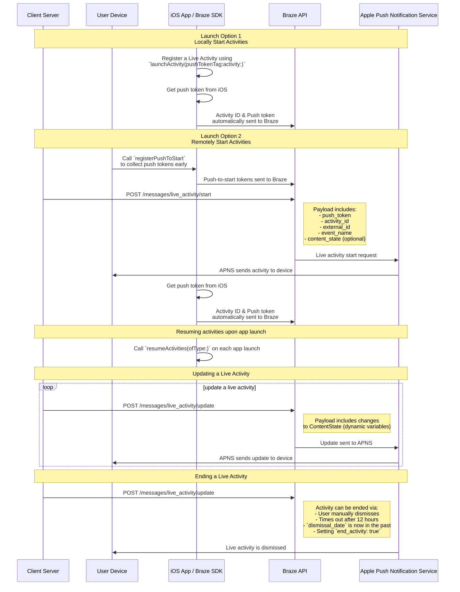

# 스위프트의 라이브 활동

> 스위프트 브레이즈 SDK의 라이브 활동을 구현하는 방법을 알아보세요. 실시간 활동은 잠금 화면에 바로 표시되는 지속적인 대화형 알림으로, 사용자는 디바이스를 잠금 해제하지 않고도 동적인 실시간 업데이트를 받을 수 있습니다.

## How it works

{: style="max-width:40%;float:right;margin-left:15px;"}

실시간 활동은 정적 정보와 업데이트하는 동적 정보의 조합으로 표시됩니다. 예를 들어 배송 상태 추적기를 제공하는 라이브 활동을 만들 수 있습니다. 이 라이브 활동에는 회사 이름이 정적 정보로 표시되며, 배송 기사가 목적지에 가까워질수록 업데이트되는 동적 '배송 시간'이 표시됩니다.

개발자는 Braze를 사용하여 라이브 활동 생애주기를 관리하고 Braze REST API를 호출하여 라이브 활동을 업데이트하며 가입한 모든 기기가 가능한 한 빨리 업데이트를 받도록 할 수 있습니다. 또한 Braze를 통해 라이브 활동을 관리하기 때문에 다른 메시징 채널(푸시 알림, 인앱 메시지, 콘텐츠 카드)과 함께 사용하여 채택을 유도할 수 있습니다.

## 시퀀스 다이어그램 {#sequence-diagram}









## 라이브 활동 구현

# 또한 다음을 완료해야 합니다:

- 프로젝트가 iOS 16.1 이상을 대상으로 하는지 확인하세요.
- Xcode 프로젝트의 **서명 및 기능** 아래에 `Push Notification` 권한을 추가합니다.
- `.p8` 키가 알림을 보내는 데 사용되는지 확인합니다. `.p12` 또는 `.pem` 같은 이전 파일은 지원되지 않습니다.
- Braze Swift SDK 버전 8.2.0부터 [라이브 활동을 원격으로 등록](#swift_step-2-start-the-activity)할 수 있습니다. 이 기능을 사용하려면 iOS 17.2 이상이 필요합니다.


라이브 활동과 푸시 알림은 비슷하지만 시스템 권한은 서로 다릅니다. 기본적으로 모든 라이브 활동 기능은 활성화되어 있지만, 사용자는 앱별로 이 기능을 비활성화할 수 있습니다.




### 1단계: 활동 만들기 {#create-an-activity}

먼저, iOS 애플리케이션에서 라이브 활동을 설정하려면 Apple 설명서의 [라이브 활동으로 라이브 데이터 표시](https://developer.apple.com/documentation/activitykit/displaying-live-data-with-live-activities)를 따라야 합니다. 이 작업의 일환으로 `Info.plist`에서 `YES`로 설정된 `NSSupportsLiveActivities`를 포함해야 합니다.

라이브 활동의 정확한 성격은 비즈니스 사례에 따라 다르므로 [활동](https://developer.apple.com/documentation/activitykit/activityattributes) 개체를 설정하고 초기화해야 합니다. 또한 다음을 정의해야 합니다.
* `ActivityAttributes`: 이 프로토콜은 라이브 활동에 표시되는 정적(변경되지 않음) 및 동적(변경됨) 콘텐츠를 정의합니다.
* `ActivityAttributes.ContentState`: 이 유형은 활동이 진행되는 동안 업데이트될 동적 데이터를 정의합니다.

또한 SwiftUI를 사용하여 지원되는 기기에서 잠금 화면과 Dynamic Island의 UI 프레젠테이션을 생성할 수 있습니다. 

이러한 제약 조건은 Braze와는 별개이므로 라이브 활동에 대한 Apple의 [전제 조건 및 제한](https://developer.apple.com/documentation/activitykit/displaying-live-data-with-live-activities#Understand-constraints) 사항을 숙지하고 있어야 합니다.


동일한 라이브 활동에 푸시를 자주 보낼 예정인 경우 `Info.plist` 파일에서 `NSSupportsLiveActivitiesFrequentUpdates` 을 `YES` 으로 설정하면 Apple의 예산 한도에 의해 제한되는 것을 방지할 수 있습니다. 자세한 내용은 ActivityKit 설명서의 [`Determine the update frequency`](https://developer.apple.com/documentation/activitykit/updating-and-ending-your-live-activity-with-activitykit-push-notifications#Determine-the-update-frequency) 섹션을 참조하세요.


#### 예시

Superb Owl 프로그램에 대한 사용자 업데이트를 제공하는 라이브 활동을 생성한다고 가정합니다. 이 프로그램에서는 서로 경쟁하는 두 명의 야생동물 구조대원에게 각자 데리고 있는 올빼미에 대한 점수를 부여합니다. 이 예제에서는 `SportsActivityAttributes`라는 구조를 생성했지만 `ActivityAttributes`를 직접 구현하여 사용할 수 있습니다.

```swift
#if canImport(ActivityKit)
  import ActivityKit
#endif

@available(iOS 16.1, *)
struct SportsActivityAttributes: ActivityAttributes {
  public struct ContentState: Codable, Hashable {
    var teamOneScore: Int
    var teamTwoScore: Int
  }

  var gameName: String
  var gameNumber: String
}
```

### 2단계: 활동 시작 {#start-the-activity}

먼저, 활동을 등록하는 방법을 선택합니다:

- **원격:** 사용 [`registerPushToStart`](<http://braze-inc.github.io/braze-swift-sdk/documentation/brazekit/braze/liveactivities-swift.class/registerpushtostart(fortype:name:)>) 메서드를 사용하여 사용자 라이프사이클 초기에 푸시-투-스타트 토큰이 필요하기 전에 활동을 시작한 다음 [`/messages/live_activity/start`]({{site.baseurl}}/api/endpoints/messaging/live_activity/start) 엔드포인트를 사용하여 활동을 시작하세요.
- **로컬:** 라이브 활동의 인스턴스를 생성한 다음, 브레이즈가 관리할 푸시 토큰을 생성하려면 [`launchActivity`](<https://braze-inc.github.io/braze-swift-sdk/documentation/brazekit/braze/liveactivities-swift.class/launchactivity(pushtokentag:activity:fileid:line:)>) 메서드를 사용하여 Braze가 관리할 푸시 토큰을 생성합니다.




라이브 활동을 원격으로 등록하려면 iOS 17.2 이상이 필요합니다.


#### 2.1단계: 위젯 확장에 BrazeKit 추가하기

Xcode 프로젝트에서 앱 이름을 선택한 다음, **일반**을 선택합니다. **프레임워크 및 라이브러리에서** `BrazeKit` 가 나열되어 있는지 확인합니다.


#### 2.2 단계: BrazeLiveActivityAttributes 프로토콜을 추가합니다. {#brazeActivityAttributes}

`ActivityAttributes` 구현에서 `BrazeLiveActivityAttributes` 프로토콜에 준수를 추가한 다음 속성 모델에 `brazeActivityId` 속성을 추가합니다.


iOS는 `brazeActivityId` 속성을 라이브 활동 푸시 투 스타트 페이로드의 해당 필드에 매핑하므로 이름을 변경하거나 다른 값을 할당해서는 안 됩니다.


```swift
import BrazeKit

#if canImport(ActivityKit)
  import ActivityKit
#endif

@available(iOS 16.1, *)
// 1. Add the `BrazeLiveActivityAttributes` conformance to your `ActivityAttributes` struct.
struct SportsActivityAttributes: ActivityAttributes, BrazeLiveActivityAttributes {
  public struct ContentState: Codable, Hashable {
    var teamOneScore: Int
    var teamTwoScore: Int
  }

  var gameName: String
  var gameNumber: String

  // 2. Add the `String?` property to represent the activity ID.
  var brazeActivityId: String?
}
```

#### 2.3 단계: 푸시하여 시작 등록

다음으로, 라이브 활동 유형을 등록하여 Braze가 이 유형과 관련된 모든 푸시하여 시작 토큰과 라이브 활동 인스턴스를 추적할 수 있도록 합니다.


iOS 운영 체제는 기기를 재시작한 후 처음 앱을 설치할 때만 푸시하여 시작 토큰을 생성합니다. 토큰이 안정적으로 등록되었는지 확인하려면 `didFinishLaunchingWithOptions` 메서드에서 `registerPushToStart`를 호출합니다.


###### 예시

다음 예제에서 `LiveActivityManager` 클래스는 라이브 활동 오브젝트를 처리합니다. 그런 다음, `registerPushToStart` 메서드에서 `SportActivityAttributes`를 등록합니다.

```swift
import BrazeKit

#if canImport(ActivityKit)
  import ActivityKit
#endif

class LiveActivityManager {

  @available(iOS 17.2, *)
  func registerActivityType() {
    // This method returns a Swift background task.
    // You may keep a reference to this task if you need to cancel it wherever appropriate, or ignore the return value if you wish.
    let pushToStartObserver: Task = Self.braze?.liveActivities.registerPushToStart(
      forType: Activity<SportsActivityAttributes>.self,
      name: "SportsActivityAttributes"
    )
  }

}
```

#### 2.4단계: 푸시 시작 알림 보내기

[`/messages/live_activity/start`]({{site.baseurl}}/api/endpoints/messaging/live_activity/start) 엔드포인트를 사용하여 원격 푸시하여 시작 알림을 보냅니다.



[Apple의 ActivityKit 프레임워크](https://developer.apple.com/documentation/activitykit)를 사용하여 푸시 토큰을 받을 수 있으며, Braze SDK가 이를 관리할 수 있습니다. 이렇게 하면 Braze가 푸시 토큰을 백엔드의 Apple 푸시 알림 서비스(APN)로 전송하므로 Braze API를 통해 라이브 활동을 업데이트할 수 있습니다.

1. Apple의 ActivityKit API를 사용하여 라이브 활동 구현의 인스턴스를 생성합니다.
2. `pushType` 매개 변수를 `.token` 으로 설정합니다. 
3. 정의한 라이브 활동 `ActivitiesAttributes` 및 `ContentState`를 전달합니다. 
4. [`launchActivity(pushTokenTag:activity:)`](https://braze-inc.github.io/braze-swift-sdk/documentation/brazekit/braze/liveactivities-swift.class)에 전달하여 Braze 인스턴스에 활동을 등록합니다. `pushTokenTag` 매개 변수는 사용자가 정의하는 사용자 지정 문자열입니다. 생성하는 각 라이브 활동에서 고유해야 합니다.

라이브 활동을 등록한 후 Braze SDK가 푸시 토큰의 변경 사항을 추출하고 관찰합니다.

#### 예시

이 예제에서는 라이브 활동 오브젝트에 대한 인터페이스로 `LiveActivityManager` 클래스를 생성합니다. 그런 다음, `pushTokenTag`를 `"sports-game-2024-03-15"`로 설정합니다.

```swift
import BrazeKit

#if canImport(ActivityKit)
  import ActivityKit
#endif

class LiveActivityManager {
  
  @available(iOS 16.2, *)
  func createActivity() {
    let activityAttributes = SportsActivityAttributes(gameName: "Superb Owl", gameNumber: "Game 1")
    let contentState = SportsActivityAttributes.ContentState(teamOneScore: "0", teamTwoScore: "0")
    let activityContent = ActivityContent(state: contentState, staleDate: nil)
    if let activity = try? Activity.request(attributes: activityAttributes,
                                            content: activityContent,
      // Setting your pushType as .token allows the Activity to generate push tokens for the server to watch.
                                            pushType: .token) {
      // Register your Live Activity with Braze using the pushTokenTag.
      // This method returns a Swift background task.
      // You may keep a reference to this task if you need to cancel it wherever appropriate, or ignore the return value if you wish.
      let liveActivityObserver: Task = AppDelegate.braze?.liveActivities.launchActivity(pushTokenTag: "sports-game-2024-03-15",
                                                                                        activity: activity)
    }
  }
  
}
```

라이브 활동 위젯은 이 초기 콘텐츠를 사용자에게 표시합니다. 

{: style="max-width:40%;"}



### 3단계: 활동 추적 재개 {#resume-activity-tracking}

앱 실행 시 Braze가 라이브 활동을 추적하게 하려면 다음을 수행합니다.

1. `AppDelegate` 파일을 엽니다.
2. `ActivityKit` 모듈을 사용할 수 있는 경우 가져옵니다.
3. 전화 [`resumeActivities(ofType:)`](https://braze-inc.github.io/braze-swift-sdk/documentation/brazekit/braze/liveactivities-swift.class/resumeactivities(oftype:)) 에서 `application(_:didFinishLaunchingWithOptions:)` 으로 전화하여 신청서에 등록한 모든 `ActivityAttributes` 유형에 대해 문의하세요.

이를 통해 Braze는 모든 활성 라이브 활동에 대한 푸시 토큰 업데이트를 추적하는 작업을 재개할 수 있습니다. 사용자가 자신의 기기에서 라이브 활동을 명시적으로 삭제한 경우, 해당 활동은 제거된 것으로 간주되며 Braze는 더 이상 해당 활동을 추적하지 않습니다.

###### 예시

```swift
import UIKit
import BrazeKit

#if canImport(ActivityKit)
  import ActivityKit
#endif

@main
class AppDelegate: UIResponder, UIApplicationDelegate {

  static var braze: Braze? = nil

  func application(
    _ application: UIApplication,
    didFinishLaunchingWithOptions launchOptions: [UIApplication.LaunchOptionsKey: Any]?
  ) -> Bool {
    
    if #available(iOS 16.1, *) {
      Self.braze?.liveActivities.resumeActivities(
        ofType: Activity<SportsActivityAttributes>.self
      )
    }

    return true
  }
}
```

### 4단계: 활동 업데이트 {#update-the-activity}

{: style="max-width:40%;float:right;margin-left:15px;"}

[`/messages/live_activity/update`]({{site.baseurl}}/api/endpoints/messaging/live_activity/update) 엔드포인트에서는 Braze REST API를 통해 전달되는 푸시 알림으로 라이브 활동을 업데이트할 수 있습니다. 이 엔드포인트를 사용하여 라이브 활동의 `ContentState` 을 업데이트합니다.

`ContentState` 을 업데이트하면 실시간 활동 위젯에 새 정보가 표시됩니다. 다음은 전반전이 끝난 후 Superb Owl 프로그램의 현황입니다.

자세한 내용은 [`/messages/live_activity/update` 엔드포인트]({{site.baseurl}}/api/endpoints/messaging/live_activity/update) 문서를 참조하세요.

### 5단계: 활동 종료 {#end-the-activity}

라이브 활동이 활성화되면 사용자의 잠금 화면과 Dynamic Island에 모두 표시됩니다. 라이브 활동을 종료하고 사용자 UI에서 제거하는 몇 가지 방법이 있습니다. 

* **사용자 해고**: 사용자는 수동으로 실시간 활동을 해제할 수 있습니다.
* **제한 시간**: 기본 시간(8시간)이 지나면 iOS는 사용자의 Dynamic Island에서 라이브 활동을 제거합니다. 기본 시간(12시간)이 지나면 iOS는 사용자의 잠금 화면에서 라이브 활동을 제거합니다. 
* **해제 날짜**: 제한 시간 이전에 사용자의 UI에서 라이브 활동을 제거할 날짜 및 시간을 지정할 수 있습니다. 활동의 `/messages/live_activity/update` 엔드포인트에 대한 요청에서 `dismissal_date` 매개변수를 사용하거나 활동의 `ActivityUIDismissalPolicy`에서 정의합니다.
* **활동 종료**: `/messages/live_activity/update` 엔드포인트에 대한 요청에서 `end_activity`를 `true`로 설정하여 라이브 활동을 즉시 종료할 수 있습니다.

자세한 내용은 [`/messages/live_activity/update` 엔드포인트]({{site.baseurl}}/api/endpoints/messaging/live_activity/update) 문서를 참조하세요.

## 자주 묻는 질문(FAQ) {#faq}

### 기능 및 지원

#### 어떤 플랫폼에서 라이브 활동을 지원하나요?

라이브 활동은 현재 iOS에만 적용되는 기능입니다. 라이브 활동 문서에서는 Braze Swift SDK를 통해 라이브 활동을 관리하기 위한 [전제 조건]({{site.baseurl}}/developer_guide/platforms/swift/live_activities/#prerequisites)을 다룹니다.

#### React Native 앱이 라이브 활동을 지원하나요?

예. React Native SDK 3.0.0 이상에서 Braze Swift SDK를 통해 라이브 활동을 지원합니다. 즉, Braze Swift SDK에 직접 React Native iOS 코드를 작성해야 합니다. 

Apple에서 제공하는 라이브 활동 기능은 JavaScript로 변환할 수 없는 언어(예: Swift 동시성, 제네릭, SwiftUI)를 사용하기 때문에 라이브 활동을 위한 React Native 전용 JavaScript 편의 API가 없습니다.

#### Braze는 캠페인 또는 캔버스 단계로 라이브 활동을 지원하나요?

아니요, 현재 이 기능은 지원되지 않습니다.

### 푸시 알림 및 실시간 활동

#### 실시간 활동이 활성화되어 있는 동안 푸시 알림이 전송되면 어떻게 되나요? 

{: style="max-width:30%;float:right;margin-left:15px;"}

실시간 활동과 푸시 알림은 서로 다른 화면 공간을 차지하며 사용자 화면에서 충돌하지 않습니다.

#### 라이브 활동이 푸시 메시지 기능을 활용하는 경우, 라이브 활동을 수신하려면 푸시 알림을 사용 설정해야 하나요?

라이브 활동은 푸시 알림을 통해 업데이트를 받지만, 다른 사용자 설정에 의해 제어됩니다. 사용자는 라이브 활동을 옵트인할 수 있지만 푸시 알림을 옵트아웃할 수 있습니다. 반대의 경우도 마찬가지입니다.

실시간 활동 업데이트 토큰은 8시간 후에 만료됩니다.

#### 라이브 활동에 푸시 프라이머가 필요한가요?

[푸시 프라이머]({{site.baseurl}}/user_guide/message_building_by_channel/push/best_practices/push_primer_messages/)는 사용자가 앱에서 푸시 알림을 옵트인하라는 프롬프트를 표시하는 모범 사례입니다. 그러나 라이브 활동을 선택하라는 시스템 프롬프트는 표시되지 않습니다. 기본적으로 사용자는 iOS 16.1 이상에서 해당 앱을 설치할 때 개별 앱의 실시간 활동에 옵트인합니다. 이 권한은 앱별로 디바이스 설정에서 비활성화하거나 다시 활성화할 수 있습니다.

### 기술 주제 및 문제 해결

#### 실시간 활동에 오류가 있는지 어떻게 알 수 있나요?

모든 라이브 활동 오류는 Braze 대시보드의 [메시지 활동 로그]({{site.baseurl}}/user_guide/administrative/app_settings/message_activity_log_tab/)에 기록됩니다. 이는 'LiveActivity 오류'를 기준으로 필터링할 수 있습니다.

#### 푸시 시작 알림을 보낸 후에도 내 실시간 활동을 받지 못한 이유는 무엇인가요?

먼저 페이로드에 엔드포인트에 설명된 모든 필수 필드가 포함되어 있는지 확인합니다. [`messages/live_activity/start`]({{site.baseurl}}/api/endpoints/messaging/live_activity/start) 엔드포인트에 설명된 모든 필수 필드가 포함되어 있는지 확인합니다. `activity_attributes` 및 `content_state` 필드는 프로젝트 코드에 정의된 속성과 일치해야 합니다. 페이로드가 정확하다고 확신하는 경우, APN에 의해 속도 제한이 적용될 수 있습니다. 이 제한은 Braze가 아닌 Apple에서 부과합니다.

푸시 투 스타트 알림이 장치에 성공적으로 도착했지만 속도 제한으로 인해 표시되지 않았는지 확인하려면 Mac의 콘솔 앱을 사용하여 프로젝트를 디버그할 수 있습니다. 원하는 디바이스의 기록 프로세스를 첨부한 다음 검색창에서 `process:liveactivitiesd` 으로 로그를 필터링합니다.

#### 푸시 투 스타트로 라이브 활동을 시작한 후 새 업데이트가 수신되지 않는 이유는 무엇인가요?

[위에서](#swift_brazeActivityAttributes) 설명한 지침을 올바르게 구현했는지 확인합니다. `ActivityAttributes` 에는 `BrazeLiveActivityAttributes` 프로토콜 준수와 `brazeActivityId` 속성이 모두 포함되어야 합니다.

라이브 활동 푸시-투-스타트 알림을 받은 후, Braze URL의 `/push_token_tag` 엔드포인트로 나가는 네트워크 요청이 표시되는지, `"tag"` 필드 아래에 올바른 활동 ID가 포함되어 있는지 다시 한 번 확인합니다.

#### `live_activity/update` 엔드포인트를 사용하려고 할 때 액세스 거부됨 응답을 받습니다. 왜인가요?

사용하는 API 키에 올바른 권한을 부여해야 다양한 Braze API 엔드포인트에 액세스할 수 있습니다. 이전에 생성한 API 키를 사용하는 경우 해당 권한을 업데이트하지 않았을 수 있습니다. [API 키 보안 개요]({{site.baseurl}}/api/basics/#rest-api-key-security)를 다시 한 번 살펴보세요.

#### `messages/send` 엔드포인트는 `messages/live_activity/update` 엔드포인트와 공유 비율을 제한하나요? 

기본적으로 `messages/live_activity/update` 엔드포인트의 사용량 제한은 여러 엔드포인트에 걸쳐 워크스페이스당 매시간 250,000건의 요청입니다. 자세한 내용은 [API 요금 한도를]({{site.baseurl}}/api/api_limits/) 참조하세요.
