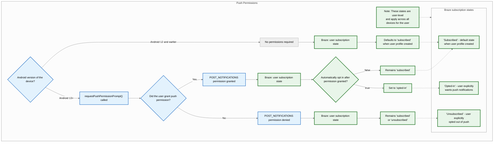
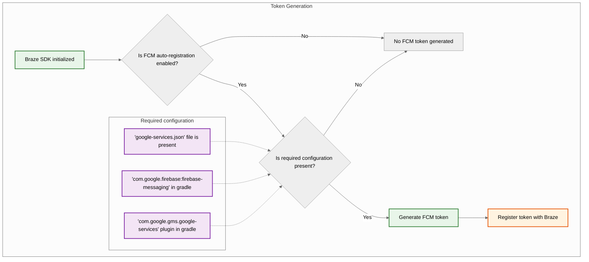
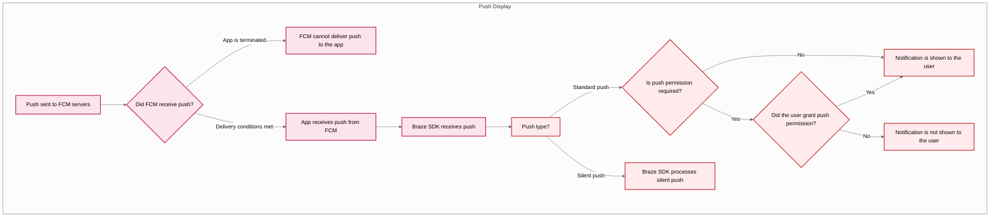



## 기본 제공 기능

Braze 소프트웨어 개발 키트에는 다음 기능이 구축되어 있습니다. 다른 푸시 알림 기능을 사용하려면 앱에 [푸시 알림을 설정해야](#android_setting-up-push-notifications) 합니다.

|Feature|설명|
|-------|-----------|
|푸시 스토리|Android 푸시 스토리는 기본값으로 Braze Android 소프트웨어 개발 키트에 구축되어 있습니다. 자세히 알아보려면 [푸시 스토리를]({{site.baseurl}}/user_guide/message_building_by_channel/push/advanced_push_options/push_stories/) 참조하세요.|
|푸시 프라이머|푸시 프라이머 캠페인은 사용자가 기기에서 앱에 대한 푸시 알림을 활성화할 것을 권장합니다. [노코드 푸시 프라이머]({{site.baseurl}}/user_guide/message_building_by_channel/push/best_practices/push_primer_messages/)를 사용하면 SDK 사용자 지정 없이도 이 작업을 수행할 수 있습니다.|
{: .reset-td-br-1 .reset-td-br-2 role="presentation"}

## 푸시 알림 수명 주기 정보 {#push-notification-lifecycle}

다음 순서도는 권한 프롬프트, 토큰 생성 및 메시지 전달과 같은 푸시 알림 수명 주기를 Braze가 처리하는 방법을 보여줍니다.















## 푸시 알림 설정하기


FCM을 사용하는 샘플 앱과 Braze Android 소프트웨어 개발 키트를 확인하려면 [Braze를 참조하세요: Firebase 푸시 샘플 앱](https://github.com/braze-inc/braze-android-sdk/tree/master/samples/firebase-push).


### Rate limits

Firebase 클라우드 메시징(FCM) API의 기본 사용량 제한은 분당 600,000건의 요청입니다. 이 제한에 도달하면 Braze는 몇 분 후에 자동으로 다시 시도합니다. 증액을 요청하려면 [Firebase 지원팀에](https://firebase.google.com/support) 문의하세요.

### 1단계: 프로젝트에 Firebase 추가

먼저, Android 프로젝트에 Firebase를 추가합니다. 단계별 지침은 Google의 [Firebase 설정 가이드를](https://firebase.google.com/docs/android/setup) 참조하세요.

### 2단계: 종속성에 클라우드 메시징 추가

다음으로 프로젝트 종속성에 클라우드 메시징 라이브러리를 추가합니다. Android 프로젝트에서 `build.gradle` 을 열고 `dependencies` 블록에 다음 줄을 추가합니다.

```gradle
implementation "google.firebase:firebase-messaging:+"
```

종속성은 다음과 비슷합니다.

```gradle
dependencies {
  implementation project(':android-sdk-ui')
  implementation "com.google.firebase:firebase-messaging:+"
}
```

### 3단계: Firebase 클라우드 메시징 API 활성화

Google Cloud에서 Android 앱이 사용 중인 프로젝트를 선택한 다음, [Firebase 클라우드 메시징 API](https://console.cloud.google.com/apis/library/fcm.googleapis.com)를 활성화합니다.

{: style="max-width:80%;"}

### 4단계: 서비스 계정 만들기 {#service-account}

다음으로 Braze가 FCM 토큰을 등록할 때 승인된 API 호출을 할 수 있도록 새 서비스 계정을 생성합니다. Google Cloud에서 **서비스 계정으로** 이동한 다음 프로젝트를 선택합니다. **서비스 계정** 페이지에서 **서비스 계정 생성**을 선택합니다.


서비스 계정 이름, ID, 설명을 입력한 다음, **생성 후 계속**을 선택합니다.


**역할** 필드의 역할 목록에서 **Firebase Cloud 메시징 API 관리자를** 찾아 선택합니다. 보다 제한적인 액세스를 원하면 `cloudmessaging.messages.create` 권한으로 [커스텀 역할](https://cloud.google.com/iam/docs/creating-custom-roles)을 생성한 다음, 목록에서 해당 역할을 선택합니다. 완료했으면 **완료**를 선택합니다.


**Firebase 클라우드 메시징 관리자**가 아닌 **Firebase 클라우드 메시징 _API_ 관리자**를 선택해야 합니다.



### 5단계: JSON 자격 증명 생성하기 {#json}

다음으로 FCM 서비스 계정에 대한 JSON 자격 증명을 생성합니다. Google Cloud IAM 및 관리자에서 **서비스 계정**으로 이동한 다음, 프로젝트를 선택합니다. [이전에 만든](#android_service-account) FCM 서비스 계정을 찾은 다음, <i class="fa-solid fa-ellipsis-vertical"></i> **작업** > **키 관리**를 선택합니다.


**키 추가** > **새 키 생성**을 선택합니다.


**JSON**을 선택한 다음, **생성**을 선택합니다. FCM 프로젝트 ID 이외의 Google Cloud 프로젝트 ID를 사용하여 서비스 계정을 생성한 경우, JSON 파일에서 `project_id`에 할당된 값을 수동으로 업데이트해야 합니다.

키를 다운로드한 위치를 기억해야 합니다. 다음 단계에 필요합니다.

{: style="max-width:65%;"}


비공개 키는 손상될 경우 보안 위험을 초래할 수 있습니다. 지금은 JSON 자격 증명을 보안 위치에 보관하고, Braze에 업로드한 후에 키를 삭제합니다.


### 6단계: Braze에 JSON 자격 증명 업로드하기

다음으로, Braze 대시보드에 JSON 자격 증명을 업로드합니다. Braze에서 <i class="fa-solid fa-gear"></i> **설정** > **앱 설정을** 선택합니다.


Android 앱의 **푸시 알림 설정**에서 **Firebase**를 선택한 다음, **JSON 파일 업로드**를 선택하고 [앞서 생성](#android_json)한 자격 증명을 업로드합니다. 완료했으면 **저장을** 선택합니다.



비공개 키는 손상될 경우 보안 위험을 초래할 수 있습니다. 키가 Braze에 업로드되었으므로 [이전에 생성](#android_json)한 파일을 삭제합니다.


### 7단계: 자동 토큰 등록 설정

사용자 중 한 명이 푸시 알림을 옵트인하면 앱에서 해당 사용자의 기기에서 FCM 토큰을 생성해야 푸시 알림을 보낼 수 있습니다. Braze SDK를 사용하면 프로젝트의 Braze 구성 파일에서 각 사용자의 기기에 대한 FCM 토큰 자동 등록을 활성화할 수 있습니다.

먼저 Firebase 콘솔로 이동하여 프로젝트를 연 다음, <i class="fa-solid fa-gear"></i> **설정** > **프로젝트 설정**을 선택합니다.


**클라우드 메시징**을 선택하고 **Firebase 클라우드 메시징 API(V1)**에서 **발신자 ID** 필드의 숫자를 복사합니다.


그런 다음, Android Studio 프로젝트를 열고 Firebase 발신자 ID를 사용하여 `braze.xml` 또는 `BrazeConfig`에서 FCM 토큰 자동 등록을 활성화합니다.



FCM 토큰 자동 등록을 구성하려면 `braze.xml` 파일에 다음 줄을 추가합니다:

```xml
<bool translatable="false" name="com_braze_firebase_cloud_messaging_registration_enabled">true</bool>
<string translatable="false" name="com_braze_firebase_cloud_messaging_sender_id">FIREBASE_SENDER_ID</string>
```

`FIREBASE_SENDER_ID`를 Firebase 프로젝트 설정에서 복사한 값으로 바꿉니다. `braze.xml`은 다음과 비슷합니다.

```xml
<?xml version="1.0" encoding="utf-8"?>
<resources>
  <string translatable="false" name="com_braze_api_key">12345ABC-6789-DEFG-0123-HIJK456789LM</string>
  <bool translatable="false" name="com_braze_firebase_cloud_messaging_registration_enabled">true</bool>
<string translatable="false" name="com_braze_firebase_cloud_messaging_sender_id">603679405392</string>
</resources>
```



FCM 토큰 자동 등록을 구성하려면 `BrazeConfig` 에 다음 줄을 추가합니다:



```java
.setIsFirebaseCloudMessagingRegistrationEnabled(true)
.setFirebaseCloudMessagingSenderIdKey("FIREBASE_SENDER_ID")
```


```kotlin
.setIsFirebaseCloudMessagingRegistrationEnabled(true)
.setFirebaseCloudMessagingSenderIdKey("FIREBASE_SENDER_ID")
```



`FIREBASE_SENDER_ID`를 Firebase 프로젝트 설정에서 복사한 값으로 바꿉니다. `BrazeConfig`은 다음과 비슷합니다.



```java
BrazeConfig brazeConfig = new BrazeConfig.Builder()
  .setApiKey("12345ABC-6789-DEFG-0123-HIJK456789LM")
  .setCustomEndpoint("sdk.iad-01.braze.com")
  .setSessionTimeout(60)
  .setHandlePushDeepLinksAutomatically(true)
  .setGreatNetworkDataFlushInterval(10)
  .setIsFirebaseCloudMessagingRegistrationEnabled(true)
  .setFirebaseCloudMessagingSenderIdKey("603679405392")
  .build();
Braze.configure(this, brazeConfig);
```


```kotlin
val brazeConfig = BrazeConfig.Builder()
  .setApiKey("12345ABC-6789-DEFG-0123-HIJK456789LM")
  .setCustomEndpoint("sdk.iad-01.braze.com")
  .setSessionTimeout(60)
  .setHandlePushDeepLinksAutomatically(true)
  .setGreatNetworkDataFlushInterval(10)
  .setIsFirebaseCloudMessagingRegistrationEnabled(true)
  .setFirebaseCloudMessagingSenderIdKey("603679405392")
  .build()
Braze.configure(this, brazeConfig)
```




대신 FCM 토큰을 수동으로 등록하려면 앱 내에서 [`Braze.setRegisteredPushToken()`](https://braze-inc.github.io/braze-android-sdk/kdoc/braze-android-sdk/com.braze/-braze/registered-push-token.html) 앱의 [`onCreate()`](https://developer.android.com/reference/android/app/Application.html#onCreate()) 메서드를 호출하면 됩니다.




### 8단계: 애플리케이션 클래스에서 자동 요청 제거

무음 푸시 알림을 보낼 때마다 Braze가 불필요한 네트워크 요청을 트리거하지 않도록 하려면 `Application` 클래스의 `onCreate()` 메서드에 구성된 모든 자동 네트워크 요청을 제거합니다. 자세한 내용은 [Android 개발자 참조를 참조하십시오: 애플리케이션](https://developer.android.com/reference/android/app/Application).

## 알림 표시

### 1단계: Braze Firebase 메시징 서비스 등록

새 서비스, 기존 서비스 또는 Braze 이외의 메시징 서비스를 만들 수 있습니다. 특정 요구 사항에 가장 적합한 것을 선택하세요.



Braze에는 푸시 수신 및 공개 의도를 처리하는 서비스가 포함되어 있습니다. `BrazeFirebaseMessagingService` 클래스는 `AndroidManifest.xml`에 등록되어야 합니다.

```xml
<service android:name="com.braze.push.BrazeFirebaseMessagingService"
  android:exported="false">
  <intent-filter>
    <action android:name="com.google.firebase.MESSAGING_EVENT" />
  </intent-filter>
</service>
```

또한 알림 코드는 `BrazeFirebaseMessagingService` 를 사용하여 열기 및 클릭 동작 추적을 처리합니다. 이 서비스가 제대로 작동하려면 `AndroidManifest.xml` 에 등록해야 합니다. 또한 Braze는 시스템에서 보낸 알림만 렌더링하도록 시스템의 알림에 고유한 키를 접두사로 추가합니다. 추가 서비스를 별도로 등록하여 다른 FCM 서비스에서 전송되는 알림을 표시할 수 있습니다. 참조 [`AndroidManifest.xml`](https://github.com/braze-inc/braze-android-sdk/blob/master/samples/firebase-push/src/main/AndroidManifest.xml) 를 참조하세요.


Braze SDK 3.1.1 이전에는 `AppboyFcmReceiver`를 사용하여 FCM 푸시를 처리했습니다. `AppboyFcmReceiver` 클래스는 매니페스트에서 제거하고 이전 통합으로 대체해야 합니다.




이미 Firebase 메시징 서비스가 등록되어 있는 경우, 다음을 통해 [`RemoteMessage`](https://firebase.google.com/docs/reference/android/com/google/firebase/messaging/RemoteMessage) 객체를 Braze에 전달할 수 있습니다. [`BrazeFirebaseMessagingService.handleBrazeRemoteMessage()`](https://braze-inc.github.io/braze-android-sdk/kdoc/braze-android-sdk/com.braze.push/-braze-firebase-messaging-service/-companion/handle-braze-remote-message.html). 이 메서드는 객체가 [`RemoteMessage`](https://firebase.google.com/docs/reference/android/com/google/firebase/messaging/RemoteMessage) 객체가 Braze에서 발생한 경우에만 알림을 표시하고 그렇지 않은 경우 안전하게 무시합니다.




```java
public class MyFirebaseMessagingService extends FirebaseMessagingService {
  @Override
  public void onMessageReceived(RemoteMessage remoteMessage) {
    super.onMessageReceived(remoteMessage);
    if (BrazeFirebaseMessagingService.handleBrazeRemoteMessage(this, remoteMessage)) {
      // This Remote Message originated from Braze and a push notification was displayed.
      // No further action is needed.
    } else {
      // This Remote Message did not originate from Braze.
      // No action was taken and you can safely pass this Remote Message to other handlers.
    }
  }
}
```




```kotlin
class MyFirebaseMessagingService : FirebaseMessagingService() {
  override fun onMessageReceived(remoteMessage: RemoteMessage?) {
    super.onMessageReceived(remoteMessage)
    if (BrazeFirebaseMessagingService.handleBrazeRemoteMessage(this, remoteMessage)) {
      // This Remote Message originated from Braze and a push notification was displayed.
      // No further action is needed.
    } else {
      // This Remote Message did not originate from Braze.
      // No action was taken and you can safely pass this Remote Message to other handlers.
    }
  }
}
```






또한 사용하려는 다른 Firebase 메시징 서비스가 있는 경우, 애플리케이션이 Braze가 아닌 푸시를 수신할 경우 호출할 대체 Firebase 메시징 서비스를 지정할 수 있습니다.

`braze.xml`에서 다음을 지정합니다.

```xml
<bool name="com_braze_fallback_firebase_cloud_messaging_service_enabled">true</bool>
<string name="com_braze_fallback_firebase_cloud_messaging_service_classpath">com.company.OurFirebaseMessagingService</string>
```

또는 [런타임 구성]({{site.baseurl}}/developer_guide/sdk_initalization/?sdktab=android)을 통해 설정합니다.




```java
BrazeConfig brazeConfig = new BrazeConfig.Builder()
        .setFallbackFirebaseMessagingServiceEnabled(true)
        .setFallbackFirebaseMessagingServiceClasspath("com.company.OurFirebaseMessagingService")
        .build();
Braze.configure(this, brazeConfig);
```




```kotlin
val brazeConfig = BrazeConfig.Builder()
        .setFallbackFirebaseMessagingServiceEnabled(true)
        .setFallbackFirebaseMessagingServiceClasspath("com.company.OurFirebaseMessagingService")
        .build()
Braze.configure(this, brazeConfig)
```






### 2단계: 작은 아이콘을 디자인 가이드라인에 따르기

Android 알림 아이콘에 대한 일반적인 정보는 [알림 개요를](https://developer.android.com/guide/topics/ui/notifiers/notifications) 참조하세요.

Android N부터는 색상이 포함된 작은 알림 아이콘 에셋을 업데이트하거나 제거해야 합니다. Android 시스템(Braze SDK가 아님)은 작업 아이콘과 작은 알림 아이콘에서 알파 및 투명도가 아닌 모든 채널을 무시합니다. 즉, Android는 투명한 영역을 제외한 작은 알림 아이콘의 모든 부분을 흑백으로 변환합니다.

제대로 표시되는 알림 작은 아이콘 자산을 만들려면 다음과 같이 하세요:
- 이미지에서 흰색을 제외한 모든 색상을 제거합니다.
- 자산의 흰색이 아닌 다른 모든 영역은 투명해야 합니다.


부적절한 자산의 일반적인 증상은 작은 알림 아이콘이 단색 흑백 사각형으로 렌더링되는 것입니다. 이는 Android 시스템에서 알림 작은 아이콘 에셋에서 투명한 영역을 찾을 수 없기 때문입니다.


다음에 표시된 큰 아이콘 및 작은 아이콘은 적절하게 디자인된 아이콘 예제입니다.


### 3단계: 알림 아이콘 구성 {#configure-icons}

#### braze.xml에서 아이콘 지정

Braze를 사용하면 `braze.xml` 에서 그리기 가능한 리소스를 지정하여 알림 아이콘을 구성할 수 있습니다:

```xml
<drawable name="com_braze_push_small_notification_icon">REPLACE_WITH_YOUR_ICON</drawable>
<drawable name="com_braze_push_large_notification_icon">REPLACE_WITH_YOUR_ICON</drawable>
```

작은 알림 아이콘을 설정해야 합니다. **설정하지 않으면 Braze는 기본적으로 애플리케이션 아이콘을 작은 알림 아이콘으로 사용하게 되며, 이는 최선이 아닌 것처럼 보일 수 있습니다.**

큰 알림 아이콘을 설정하는 것은 선택 사항이지만 권장됩니다.

#### 아이콘 강조 색상 지정

알림 아이콘 강조 색상은 `braze.xml` 에서 재정의할 수 있습니다. 색상을 지정하지 않으면 기본 색상은 Lollipop이 시스템 알림에 사용하는 것과 동일한 회색입니다.

```xml
<integer name="com_braze_default_notification_accent_color">0xFFf33e3e</integer>
```

선택적으로 색상 참조를 사용할 수도 있습니다:

```xml
<color name="com_braze_default_notification_accent_color">@color/my_color_here</color>
```

### 4단계: 딥링크 추가

#### 자동 딥링크 열기 활성화

푸시 알림을 클릭할 때 Braze가 앱과 딥링크를 자동으로 열도록 설정하려면 `braze.xml`에서 `com_braze_handle_push_deep_links_automatically`를 `true`로 설정합니다.

```xml
<bool name="com_braze_handle_push_deep_links_automatically">true</bool>
```

이 플래그는 [런타임 구성을]({{site.baseurl}}/developer_guide/sdk_initalization/?sdktab=android) 통해서도 설정할 수 있습니다:




```java
BrazeConfig brazeConfig = new BrazeConfig.Builder()
        .setHandlePushDeepLinksAutomatically(true)
        .build();
Braze.configure(this, brazeConfig);
```




```kotlin
val brazeConfig = BrazeConfig.Builder()
        .setHandlePushDeepLinksAutomatically(true)
        .build()
Braze.configure(this, brazeConfig)
```




딥링크의 커스텀 처리를 설정하려면 Braze에서 푸시를 수신하고 여는 의도를 수신 대기하는 푸시 콜백을 만들어야 합니다. 자세한 내용은 [푸시 이벤트에 콜백 사용하기를]({{site.baseurl}}/developer_guide/push_notifications/customization#android_using-a-callback-for-push-events) 참조하세요.

#### 사용자 지정 딥링크 만들기

앱에 딥링킹을 아직 추가하지 않은 경우 [Android 개발자 설명서에](http://developer.android.com/training/app-indexing/deep-linking.html) 있는 딥링킹에 대한 지침을 따르세요. 딥링크 개념에 대한 자세한 내용은 [FAQ 문서]({{site.baseurl}}/user_guide/personalization_and_dynamic_content/deep_linking_to_in-app_content/#what-is-deep-linking)를 참조하세요.

#### 딥링크 추가하기

Braze 대시보드는 푸시 알림 캠페인과 캔버스에서 알림을 클릭할 때 열 딥링크 또는 웹 URL 설정을 지원합니다.


#### 백 스택 동작 사용자 지정

기본적으로 Android SDK는 푸시 딥링크를 따라갈 때 호스트 앱의 기본 런처 활동을 백 스택에 배치합니다. Braze를 사용하면 기본 런처 활동 대신 백 스택에서 열리도록 커스텀 활동을 설정하거나 백 스택을 완전히 비활성화할 수 있습니다.

예를 들어 [런타임 구성을]({{site.baseurl}}/developer_guide/sdk_initalization/?sdktab=android) 사용하여 `YourMainActivity` 이라는 활동을 백스택 활동으로 설정합니다:




```java
BrazeConfig brazeConfig = new BrazeConfig.Builder()
        .setPushDeepLinkBackStackActivityEnabled(true)
        .setPushDeepLinkBackStackActivityClass(YourMainActivity.class)
        .build();
Braze.configure(this, brazeConfig);
```




```kotlin
val brazeConfig = BrazeConfig.Builder()
        .setPushDeepLinkBackStackActivityEnabled(true)
        .setPushDeepLinkBackStackActivityClass(YourMainActivity.class)
        .build()
Braze.configure(this, brazeConfig)
```




`braze.xml`에 해당하는 구성을 참조하세요. 클래스 이름은 `Class.forName()`에서 반환한 것과 동일해야 합니다.

```xml
<bool name="com_braze_push_deep_link_back_stack_activity_enabled">true</bool>
<string name="com_braze_push_deep_link_back_stack_activity_class_name">your.package.name.YourMainActivity</string>
```

### 5단계: 알림 채널 정의

Braze 안드로이드 SDK는 [안드로이드 알림 채널을](https://developer.android.com/preview/features/notification-channels.html) 지원합니다. Braze 알림에 알림 채널의 ID가 포함되어 있지 않거나 Braze 알림에 유효하지 않은 채널 ID가 포함되어 있는 경우, Braze는 SDK에 정의된 기본 알림 채널로 알림을 표시합니다. Braze 사용자는 플랫폼 내에서 [Android 알림 채널을]({{site.baseurl}}/user_guide/message_building_by_channel/push/android/notification_channels/) 사용하여 알림을 그룹화할 수 있습니다.

기본 Braze 알림 채널의 사용자 대면 이름을 설정하려면 [`BrazeConfig.setDefaultNotificationChannelName()`](https://braze-inc.github.io/braze-android-sdk/kdoc/braze-android-sdk/com.braze.configuration/-braze-config/-builder/set-default-notification-channel-name.html).

기본 Braze 알림 채널의 사용자 대면 설명을 설정하려면 [`BrazeConfig.setDefaultNotificationChannelDescription()`](https://braze-inc.github.io/braze-android-sdk/kdoc/braze-android-sdk/com.braze.configuration/-braze-config/-builder/set-default-notification-channel-description.html).

`notification_channel` 필드를 포함하도록 [Android 푸시 개체]({{site.baseurl}}/api/objects_filters/messaging/android_object/) 매개변수를 사용하여 모든 API 캠페인을 업데이트합니다. 이 필드를 지정하지 않으면 Braze는 [대시보드 폴백]({{site.baseurl}}/user_guide/message_building_by_channel/push/android/notification_channels/#dashboard-fallback-channel) 채널 ID와 함께 알림 페이로드를 전송합니다.

기본 알림 채널 외에는 Braze에서 어떠한 채널도 생성하지 않습니다. 다른 모든 채널은 호스트 앱에서 프로그래밍 방식으로 정의한 다음, Braze 대시보드에 입력해야 합니다.

기본 채널 이름과 설명은 `braze.xml` 에서도 구성할 수 있습니다.

```xml
<string name="com_braze_default_notification_channel_name">Your channel name</string>
<string name="com_braze_default_notification_channel_description">Your channel description</string>
```

### 6단계: 테스트 알림 표시 및 분석

#### 디스플레이 테스트

이 시점에서 Braze에서 보낸 알림을 볼 수 있을 것입니다. 이를 테스트하려면 Braze 대시보드의 **캠페인** 페이지로 이동하여 **푸시 알림** 캠페인을 생성하세요. **Android 푸시**를 선택하고 메시지를 디자인합니다. 그런 다음, 작성기에서 눈 아이콘을 클릭하여 테스트 발신자를 가져옵니다. 현재 사용자의 사용자 ID 또는 이메일 주소를 입력하고 **테스트 보내기를** 클릭합니다. 기기에 푸시가 표시됩니다.


푸시 표시와 관련된 문제는 [문제 해결 가이드를]({{site.baseurl}}/developer_guide/push_notifications/troubleshooting/?sdktab=android) 참조하세요.

#### 분석 테스트

이 시점에서 푸시 알림 열기에 대한 분석 로깅도 있어야 합니다. 알림이 도착했을 때 클릭하면 캠페인 결과 페이지의 **직접 열기** 수가 1씩 증가합니다. 푸시 분석에 대한 자세한 내용은 [푸시 보고]({{site.baseurl}}/user_guide/message_building_by_channel/push/push_reporting/) 문서를 참조하세요.

푸시 애널리틱스와 관련된 문제는 [문제 해결 가이드를]({{site.baseurl}}/developer_guide/push_notifications/troubleshooting/?sdktab=android) 참조하세요.

#### 명령줄에서 테스트

명령줄 인터페이스를 통해 인앱 및 푸시 알림을 테스트하려면 터미널을 통해 cURL 및 [메시징 API를]({{site.baseurl}}/api/endpoints/messaging/) 통해 단일 알림을 보낼 수 있습니다. 다음 필드를 테스트 케이스에 맞는 올바른 값으로 바꿔야 합니다:

- `YOUR_API_KEY` ( **설정** > **API 키로** 이동합니다.)
- `YOUR_EXTERNAL_USER_ID` ( **사용자 검색** 페이지에서 프로필을 검색합니다.)
- `YOUR_KEY1` (선택 사항)
- `YOUR_VALUE1` (선택 사항)

```bash
curl -X POST -H "Content-Type: application/json" -H "Authorization: Bearer {YOUR_API_KEY}" -d '{
  "external_user_ids":["YOUR_EXTERNAL_USER_ID"],
  "messages": {
    "android_push": {
      "title":"Test push title",
      "alert":"Test push",
      "extra": {
        "YOUR_KEY1":"YOUR_VALUE1"
      }
    }  
  }
}' https://rest.iad-01.braze.com/messages/send
```

이 예에서는 `US-01` 인스턴스를 사용합니다. 이 인스턴스를 사용하지 않는 경우 `US-01` 엔드포인트를 [사용자 엔드포인트로]({{site.baseurl}}/api/basics/#endpoints) 바꾸세요.

## 대화 푸시 알림

{: style="float:right;max-width:35%;margin-left:15px;border: 0;"}

[사람과 대화 이니셔티브](https://developer.android.com/guide/topics/ui/conversations)는 휴대폰의 시스템 표면에서 사람과 대화의 개선을 목표로 하는 다년간의 Android 이니셔티브입니다. 이 우선순위는 모든 인구 통계학적 특성에 걸쳐 대부분의 Android 사용자에게 있어 다른 사람들과의 의사소통 및 상호작용이 여전히 가장 가치 있고 중요한 기능 영역이라는 사실에 기반합니다.

### 사용 요구 사항

- 이 알림 유형에는 Braze Android SDK v15.0.0 이상 및 Android 11 이상 기기가 필요합니다. 
- 지원되지 않는 기기 또는 SDK에서는 표준 푸시 알림으로 대체됩니다.

이 기능은 Braze REST API를 통해서만 사용할 수 있습니다. 자세한 내용은 [Android 푸시 개체]({{site.baseurl}}/api/objects_filters/messaging/android_object#android-conversation-push-object)를 참조하세요.

## FCM 할당량 초과 오류

FCM(Firebase 클라우드 메시징) 한도를 초과하면 Google에서 "할당량 초과" 오류를 반환합니다. FCM의 기본값은 분당 600,000건의 요청입니다. Braze는 Google의 권장 모범 사례에 따라 전송을 다시 시도합니다. 그러나 이러한 오류가 대량으로 발생하면 전송 시간이 몇 분씩 길어질 수 있습니다. 잠재적인 영향을 완화하기 위해 Braze는 요금 한도가 초과되고 있다는 알림과 오류를 방지하기 위해 취할 수 있는 조치를 보내드립니다.

현재 한도를 확인하려면 **Google Cloud 콘솔** > **API 및 서비스** > **Firebase Cloud 메시징 API** > **할당량 및 시스템 제한으로** 이동하거나 [FCM API 할당량 페이지를](https://console.cloud.google.com/apis/api/fcm.googleapis.com/quotas) 방문하세요.

### Best practices

이러한 오류 볼륨을 낮게 유지하려면 다음 모범 사례를 권장합니다.

#### FCM에 요금 한도 인상 요청하기

FCM에 요금 한도 인상을 요청하려면 [Firebase 지원팀에](https://firebase.google.com/support) 직접 문의하거나 다음과 같이 하세요:

1. [FCM API 쿼터 페이지로](https://console.cloud.google.com/apis/api/fcm.googleapis.com/quotas) 이동합니다.
2. **분당 요청 보내기** 할당량을 찾습니다.
3. **할당량 편집을** 선택합니다. 
4. 새 값을 입력하고 요청을 제출합니다.

#### Braze를 통해 글로벌 요금 제한 요청하기

Android 푸시 알림에 대해 워크스페이스 전체에 제한을 적용하려면 [Braze 지원팀에]({{site.baseurl}}/help/support#access-the-support-portal) 문의하세요.