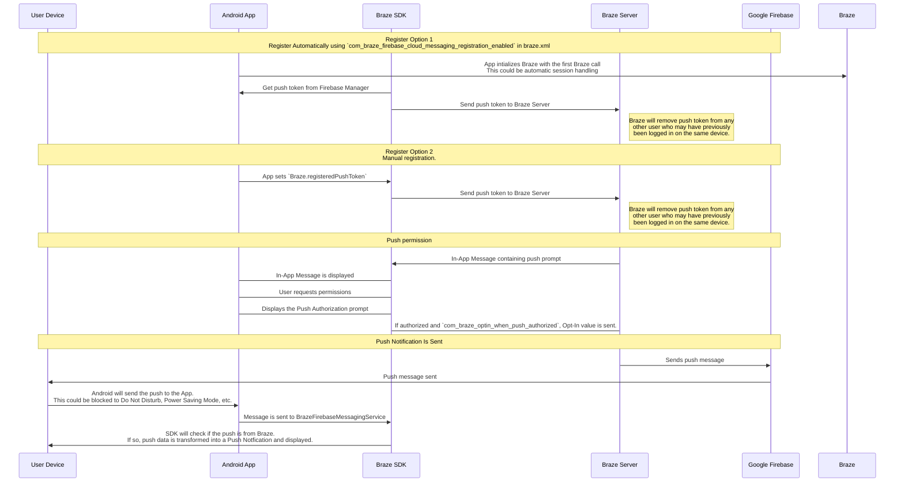

## Braze 푸시 워크플로 이해

Firebase 클라우드 메시징(FCM) 서비스는 Android 애플리케이션으로 전송되는 푸시 알림을 위한 Google의 인프라입니다. 다음은 사용자의 디바이스에서 푸시 알림을 활성화하는 방법과 Braze가 푸시 알림을 보내는 방법에 대한 간단한 구조입니다:




### 1단계: Google Cloud API 키 구성

앱을 개발할 때 Braze Android SDK에 Firebase 발신자 ID를 제공해야 합니다. 또한 서버 애플리케이션용 API 키를 Braze 대시보드에 제공해야 합니다. Braze는 이 API 키를 사용하여 사용자 기기로 메시지를 전송합니다. 또한 Google 개발자 콘솔에서 FCM 서비스가 활성화되어 있는지 확인해야 합니다. 


이 단계에서 흔히 하는 실수는 REST API 키 대신 앱 식별자 API 키를 사용하는 것입니다.


### 2단계: 디바이스가 FCM에 등록하고 Braze에 푸시 토큰을 제공합니다.

일반적인 통합에서는 Braze Android SDK가 FCM 기능을 위해 기기 등록을 처리합니다. 일반적으로 앱을 처음 열면 바로 이런 일이 발생합니다. 등록 후 Braze에 FCM 등록 ID가 제공되고 이 ID를 사용하여 해당 기기로만 메시지를 전송합니다. 해당 사용자의 등록 ID가 저장되며, 해당 사용자는 이전에 귀하의 앱에 푸시 토큰이 없었던 경우 '푸시 등록' 상태가 됩니다.

### 3단계: Braze 푸시 캠페인 시작

푸시 캠페인이 시작되면 Braze는 FCM에 메시지 전달을 요청합니다. Braze는 대시보드에 복사된 API 키를 사용하여 인증하고 제공된 푸시 토큰으로 푸시 알림을 보낼 수 있는지 확인합니다.

### 4단계: 유효하지 않은 토큰 제거하기

FCM에서 메시지를 보내려고 했던 푸시 토큰이 유효하지 않음을 알려주면 해당 토큰이 연결된 사용자 프로필에서 해당 토큰을 제거합니다. 사용자에게 다른 푸시 토큰이 없는 경우, 더 이상 **세그먼트** 페이지 아래에 "푸시 등록됨"으로 표시되지 않습니다.

FCM에 대한 자세한 내용은 [클라우드 메시징](https://firebase.google.com/docs/cloud-messaging/)을 참조하세요.

## 푸시 오류 로그 활용하기

Braze는 메시지 활동 로그 내에서 푸시 알림 오류를 제공합니다. 이 오류 로그는 캠페인이 예상대로 작동하지 않는 이유를 파악하는 데 매우 유용한 다양한 경고를 제공합니다. 오류 메시지를 클릭하면 특정 인시던트 문제를 해결하는 데 도움이 되는 관련 설명서로 리디렉션됩니다.


## 문제 해결 시나리오

### 푸시가 전송되지 않습니다.

다음과 같은 상황으로 인해 푸시 메시지가 전송되지 않을 수 있습니다:

- 자격 증명이 잘못된 Google Cloud Platform 프로젝트 ID(잘못된 발신자 ID)에 있습니다.
- 자격 증명의 권한 범위가 잘못되었습니다.
- 잘못된 Braze 워크스페이스에 잘못된 자격 증명을 업로드했습니다(발신자 ID가 잘못됨).

푸시 메시지를 보내지 못할 수 있는 다른 문제에 대해서는 [사용자 가이드를 참조하세요: 푸시 알림 문제 해결]({{site.baseurl}}/user_guide/message_building_by_channel/push/troubleshooting/).

### Braze 대시보드에 '푸시 등록' 사용자가 표시되지 않음(메시지 전송 전)

앱이 푸시 알림을 허용하도록 올바르게 구성되었는지 확인합니다. 확인해야 할 일반적인 실패 지점은 다음과 같습니다:

#### 발신자 ID가 잘못되었습니다.

`braze.xml` 파일에 올바른 FCM 발신자 ID가 포함되어 있는지 확인합니다. 발신자 ID가 잘못되면 대시보드의 메시지 활동 로그에 `MismatchSenderID` 오류가 보고됩니다.

#### 브레이즈 등록이 발생하지 않음

FCM 등록은 Braze 외부에서 처리되므로 등록 실패는 두 경우에서만 발생할 수 있습니다.

1. FCM에 등록하는 동안
2. FCM에서 생성된 푸시 토큰을 Braze에 전달할 때

중단점을 설정하거나 로깅을 통해 FCM에서 생성된 푸시 토큰이 Braze로 전송되는지 확인하는 것이 좋습니다. 토큰이 올바르게 생성되지 않거나 전혀 생성되지 않는 경우 [FCM 설명서](https://firebase.google.com/docs/cloud-messaging/android/client)를 참조하시기 바랍니다.

#### Google Play 서비스 없음

FCM 푸시가 작동하려면 기기에 Google Play 서비스가 있어야 합니다. 기기에 Google Play 서비스가 설치되어 있지 않은 경우 푸시 등록이 이루어지지 않습니다.

**참고:** Google API가 설치되지 않은 Android 에뮬레이터에는 Google Play 서비스가 설치되지 않습니다.

#### 장치가 인터넷에 연결되지 않음

디바이스의 인터넷 연결 상태가 양호하고 프록시를 통해 네트워크 트래픽을 전송하고 있지 않은지 확인하세요.

### 푸시 알림을 탭해도 앱이 열리지 않습니다.

`com_braze_handle_push_deep_links_automatically` 가 `true` 또는 `false` 로 설정되어 있는지 확인합니다. 푸시 알림을 탭할 때 Braze가 앱과 딥링크를 자동으로 열도록 설정하려면 `braze.xml`에서 `com_braze_handle_push_deep_links_automatically`를 `true`로 설정합니다.

`com_braze_handle_push_deep_links_automatically`가 기본값인 `false`로 설정된 경우, Braze 푸시 콜백을 사용하여 푸시 수신 및 열람 의도를 수신 대기하고 처리해야 합니다.

### 푸시 알림 반송

푸시 알림이 전달되지 않으면 [개발자 콘솔]({{site.baseurl}}/developer_guide/platforms/android/push_notifications/troubleshooting/#utilizing-the-push-error-logs)에서 푸시 알림이 반송되지 않았는지 확인합니다. 다음은 개발자 콘솔에 기록될 수 있는 일반적인 오류에 대한 설명입니다:

#### 오류: MismatchSenderID

`MismatchSenderID` 는 인증 실패를 나타냅니다. Firebase 발신자 ID와 FCM API 키가 올바른지 확인합니다.

#### 오류: InvalidRegistration

`InvalidRegistration`은 잘못된 푸시 토큰으로 인해 발생할 수 있습니다.

1. [Firebase 클라우드 메시징에서](https://firebase.google.com/docs/cloud-messaging/android/client#retrieve-the-current-registration-token) 유효한 푸시 토큰을 Braze에 전달해야 합니다.

#### 오류: 등록되지 않음

1. `NotRegistered`는 일반적으로 기기에서 앱이 삭제되었을 때 발생합니다. Braze는 내부적으로 `NotRegistered`를 사용하여 기기에서 앱이 제거되었음을 알립니다.

2. `NotRegistered`는 여러 번의 등록이 발생하고 두 번째 등록이 첫 번째 토큰을 무효화할 때도 발생할 수 있습니다.

### 푸시 알림이 전송되었지만 사용자의 디바이스에 표시되지 않음

이러한 문제가 발생하는 데에는 몇 가지 이유가 있습니다:

#### 애플리케이션이 강제 종료되었습니다.

시스템 설정을 통해 애플리케이션을 강제 종료하면 푸시 알림이 전송되지 않습니다. 앱을 다시 실행하면 기기에서 푸시 알림을 다시 받을 수 있습니다.

#### BrazeFirebaseMessagingService 등록되지 않음

푸시 알림이 표시되려면 BrazeFirebaseMessagingService가 `AndroidManifest.xml` 에 올바르게 등록되어 있어야 합니다:

```xml
<service android:name="com.braze.push.BrazeFirebaseMessagingService"
  android:exported="false">
  <intent-filter>
    <action android:name="com.google.firebase.MESSAGING_EVENT" />
  </intent-filter>
</service>
```

#### 방화벽이 푸시를 차단하고 있습니다.

Wi-Fi를 통해 푸시를 테스트하는 경우 방화벽이 FCM이 메시지를 수신하는 데 필요한 포트를 차단할 수 있습니다. `5228`, `5229`, `5230` 포트가 열려 있는지 확인합니다. 또한 FCM은 IP를 지정하지 않으므로 방화벽이 Google의 ASN(`15169`)에 나열된 IP 블록에 포함된 모든 IP 주소로 나가는 연결을 수락하도록 허용해야 합니다.

#### 커스텀 알림 팩토리에서 null 반환

[사용자 지정 알림 팩토리를]({{site.baseurl}}/developer_guide/platform_integration_guides/android/push_notifications/android/integration/standard_integration/#custom-displaying-notifications) 구현한 경우 `null` 을 반환하지 않는지 확인하세요. 이렇게 하면 알림이 표시되지 않습니다.

### 메시지 전송 후 '푸시 등록' 사용자가 더 이상 활성화되지 않음

이런 일이 발생하는 데에는 몇 가지 이유가 있습니다:

#### 애플리케이션이 제거되었습니다.

사용자가 애플리케이션을 제거했습니다. 이렇게 하면 FCM 푸시 토큰이 무효화됩니다.

#### 잘못된 파이어베이스 클라우드 메시징 서버 키

Braze 대시보드에 제공된 Firebase 클라우드 메시징 서버 키가 유효하지 않습니다. 제공된 발신자 ID는 앱의 `braze.xml` 파일에 참조된 발신자 ID와 일치해야 합니다. 서버 키와 발신자 ID는 Firebase 콘솔에서 찾을 수 있습니다.


### 푸시 클릭이 기록되지 않음

Braze 로그는 클릭을 자동으로 푸시하므로 이 시나리오는 비교적 드물게 발생합니다.

푸시 클릭이 기록되지 않는다면 푸시 클릭 데이터가 아직 서버로 플러시되지 않았을 가능성이 있습니다. Braze는 네트워크 연결 강도에 따라 플러시 빈도를 조절합니다. 네트워크 연결 상태가 양호하면 대부분의 경우 푸시 클릭 데이터는 1분 이내에 서버에 도달합니다.

### 딥 링크가 작동하지 않음

#### 딥링크 구성 확인

딥 링크는 [ADB로 테스트할](https://developer.android.com/training/app-indexing/deep-linking.html#testing-filters) 수 있습니다. 다음 명령어로 딥링크를 테스트하는 것이 좋습니다:

`adb shell am start -W -a android.intent.action.VIEW -d "THE_DEEP_LINK" THE_PACKAGE_NAME`

딥링크가 작동하지 않으면 딥링크가 잘못 구성된 것일 수 있습니다. 잘못 구성된 딥링크는 Braze 푸시를 통해 전송할 때 작동하지 않습니다.

#### 사용자 지정 처리 로직 확인

딥링크가 [ADB에서는 올바르게 작동하지만](https://developer.android.com/training/app-indexing/deep-linking.html#testing-filters) Braze 푸시에서는 작동하지 않는 경우, [사용자 지정 푸시 오픈 처리가]({{site.baseurl}}/developer_guide/platform_integration_guides/android/push_notifications/android/integration/standard_integration/#android-push-listener-callback) 구현되어 있는지 확인하세요. 그렇다면 커스텀 처리 코드가 수신 딥링크를 올바르게 처리하는지 확인합니다.

#### 백 스택 동작 비활성화

딥링크가 [ADB에서는 올바르게 작동하지만](https://developer.android.com/training/app-indexing/deep-linking.html#testing-filters) Braze 푸시에서는 작동하지 않는 경우 [백 스택을](https://developer.android.com/guide/components/activities/tasks-and-back-stack) 비활성화해 보세요. 이렇게 하려면 **braze.xml** 파일을 업데이트합니다:

```xml
<bool name="com_braze_push_deep_link_back_stack_activity_enabled">false</bool>
```
