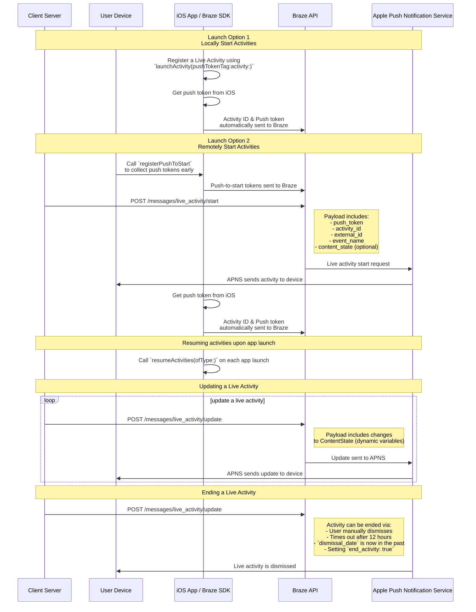

# Atividades Ao Vivo para Swift

> Aprenda como implementar Atividades Ao Vivo para o SDK Swift Braze. Atividades Ao Vivo são notificações persistentes e interativas que são exibidas diretamente na tela de bloqueio, permitindo que os usuários recebam atualizações dinâmicas em tempo real—sem desbloquear seu dispositivo.

## Como funciona?

{: style="max-width:40%;float:right;margin-left:15px;"}

As Live Activities apresentam uma combinação de informações estáticas e dinâmicas que você atualiza. Por exemplo, você pode criar uma Live Activity que fornece um rastreador de status para uma entrega. Essa Live Activity teria o nome da sua empresa como informação estática, bem como um "Time to delivery" dinâmico que seria atualizado à medida que o motorista de entrega se aproximasse do destino.

Como desenvolvedor, você pode usar o Braze para gerenciar seus ciclos de vida do Live Activity, fazer chamadas para a API REST do Braze para fazer atualizações do Live Activity e fazer com que todos os dispositivos inscritos recebam a atualização o mais rápido possível. E, como você está gerenciando as Live Activity por meio da Braze, pode usá-las em conjunto com seus outros canais de mensagens – notificações por push, mensagens no app, cartões de conteúdo – para promover a adoção.

## Diagrama de Sequência {#sequence-diagram}









## Implementação de uma atividade ao vivo

# Você também precisará completar o seguinte:

- Certifique-se de que seu projeto está direcionado para iOS 16.1 ou posterior.
- Adicione a `Push Notification` autorização em **Assinatura e Capacidades** no seu projeto Xcode.
- Certifique-se de que as chaves `.p8` são usadas para enviar notificações. Não há suporte para arquivos mais antigos, como `.p12` ou `.pem`.
- A partir da versão 8.2.0 do Braze Swift SDK, é possível [registrar remotamente uma Live Activity](#swift_step-2-start-the-activity). Para usar esse recurso, é necessário o iOS 17.2 ou posterior.


Embora as Live Activities e as notificações por push sejam semelhantes, suas permissões de sistema são separadas. Por padrão, todos os recursos do Live Activity estão ativados, mas os usuários podem desativar esse recurso por aplicativo.




### Etapa 1: Crie uma atividade {#create-an-activity}

Primeiro, certifique-se de ter seguido o procedimento [Exibindo dados ao vivo com Live Activities](https://developer.apple.com/documentation/activitykit/displaying-live-data-with-live-activities) na documentação da Apple para configurar o Live Activities em seu aplicativo iOS. Como parte dessa tarefa, inclua `NSSupportsLiveActivities` definido como `YES` em `Info.plist`.

Como a natureza exata da sua Live Activity será específica para o seu caso de negócios, você precisará configurar e inicializar os objetos [Activity](https://developer.apple.com/documentation/activitykit/activityattributes). É importante ressaltar que você definirá:
* `ActivityAttributes`: Esse protocolo define o conteúdo estático (imutável) e dinâmico (mutável) que aparecerá em sua Live Activity.
* `ActivityAttributes.ContentState`: Esse tipo define os dados dinâmicos que serão atualizados no decorrer da atividade.

Você também usará o SwiftUI para criar a apresentação da interface do usuário da tela de bloqueio e do Dynamic Island nos dispositivos compatíveis. 

Certifique-se de que você esteja familiarizado com os [pré-requisitos e as limitações](https://developer.apple.com/documentation/activitykit/displaying-live-data-with-live-activities#Understand-constraints) da Apple para o Live Activities, pois essas restrições são independentes do Braze.


Se você espera enviar pushs frequentes para a mesma atividade ao vivo, pode evitar ser limitado pelo limite de orçamento da Apple definindo `NSSupportsLiveActivitiesFrequentUpdates` como `YES` no arquivo `Info.plist`. Para saber mais, consulte a seção [`Determine the update frequency`](https://developer.apple.com/documentation/activitykit/updating-and-ending-your-live-activity-with-activitykit-push-notifications#Determine-the-update-frequency) na documentação do ActivityKit.


#### Exemplo

Vamos imaginar que queremos criar uma Live Activity para fornecer aos nossos usuários atualizações sobre a série Superb Owl, em que dois resgates de animais selvagens concorrentes recebem pontos pelas corujas que têm em sua residência. Neste exemplo, criamos uma struct chamada `SportsActivityAttributes`, mas você pode usar sua própria implementação de `ActivityAttributes`.

```swift
#if canImport(ActivityKit)
  import ActivityKit
#endif

@available(iOS 16.1, *)
struct SportsActivityAttributes: ActivityAttributes {
  public struct ContentState: Codable, Hashable {
    var teamOneScore: Int
    var teamTwoScore: Int
  }

  var gameName: String
  var gameNumber: String
}
```

### Etapa 2: Inicie a atividade {#start-the-activity}

Primeiro, escolha como deseja registrar sua atividade:

- **Remoto:** Use o método [`registerPushToStart`](<http://braze-inc.github.io/braze-swift-sdk/documentation/brazekit/braze/liveactivities-swift.class/registerpushtostart(fortype:name:)>) no início do ciclo de vida do usuário e antes que o token de push-to-start seja necessário, então inicie uma atividade usando o endpoint [`/messages/live_activity/start`]({{site.baseurl}}/api/endpoints/messaging/live_activity/start).
- **Local:** Crie uma instância de sua Live Activity e, em seguida, use o método [`launchActivity`](<https://braze-inc.github.io/braze-swift-sdk/documentation/brazekit/braze/liveactivities-swift.class/launchactivity(pushtokentag:activity:fileid:line:)>) para criar tokens push para serem gerenciados pelo Braze.




Para registrar remotamente uma Live Activity, é necessário o iOS 17.2 ou posterior.


#### Etapa 2.1: Adicione o BrazeKit à sua extensão de widget

Em seu projeto do Xcode, selecione o nome do aplicativo e, em seguida, **General** (Geral). Em **Frameworks and Libraries (Estruturas e bibliotecas**), confirme se o endereço `BrazeKit` está listado.


#### Etapa 2.2: Adicione o protocolo BrazeLiveActivityAttributes {#brazeActivityAttributes}

Na sua implementação `ActivityAttributes`, adicione conformidade ao protocolo `BrazeLiveActivityAttributes`, e então adicione a propriedade `brazeActivityId` ao seu modelo de atributos.


iOS mapeará a propriedade `brazeActivityId` para o campo correspondente no seu payload de push-to-start da Atividade Ao Vivo, então não deve ser renomeada ou atribuída a qualquer outro valor.


```swift
import BrazeKit

#if canImport(ActivityKit)
  import ActivityKit
#endif

@available(iOS 16.1, *)
// 1. Add the `BrazeLiveActivityAttributes` conformance to your `ActivityAttributes` struct.
struct SportsActivityAttributes: ActivityAttributes, BrazeLiveActivityAttributes {
  public struct ContentState: Codable, Hashable {
    var teamOneScore: Int
    var teamTwoScore: Int
  }

  var gameName: String
  var gameNumber: String

  // 2. Add the `String?` property to represent the activity ID.
  var brazeActivityId: String?
}
```

#### Etapa 2.3: Registro para push-to-start

Em seguida, registre o tipo de Live Activity, para que a Braze possa rastrear todos os tokens push-to-start e instâncias de Live Activity associadas a esse tipo.


O sistema operacional iOS gera tokens push-to-start somente durante a primeira instalação do aplicativo após a reinicialização do dispositivo. Para garantir que seus tokens sejam registrados de forma confiável, chame `registerPushToStart` no seu método `didFinishLaunchingWithOptions`.


###### Exemplo

No exemplo a seguir, a classe `LiveActivityManager` manipula objetos Live Activity. Em seguida, o método `registerPushToStart` registra `SportActivityAttributes`:

```swift
import BrazeKit

#if canImport(ActivityKit)
  import ActivityKit
#endif

class LiveActivityManager {

  @available(iOS 17.2, *)
  func registerActivityType() {
    // This method returns a Swift background task.
    // You may keep a reference to this task if you need to cancel it wherever appropriate, or ignore the return value if you wish.
    let pushToStartObserver: Task = Self.braze?.liveActivities.registerPushToStart(
      forType: Activity<SportsActivityAttributes>.self,
      name: "SportsActivityAttributes"
    )
  }

}
```

#### Etapa 2.4: Enviar uma notificação push-to-start

Enviar uma notificação push-to-start remota usando o endpoint [`/messages/live_activity/start`]({{site.baseurl}}/api/endpoints/messaging/live_activity/start).



Você pode usar o [framework do ActivityKit da Apple](https://developer.apple.com/documentation/activitykit) para obter um token de envio, que o SDK da Braze pode gerenciar para você. Isso permite que você atualize as Live Activities por meio da API do Braze, pois o Braze enviará o token de push para o serviço de notificação por push da Apple (APNs) no back-end.

1. Crie uma instância de sua implementação do Live Activity usando as APIs do ActivityKit da Apple.
2. Defina o parâmetro `pushType` como `.token`. 
3. Passe as atividades ao vivo `ActivitiesAttributes` e `ContentState` que você definiu. 
4. Registre sua atividade na instância da Braze, passando-a para [`launchActivity(pushTokenTag:activity:)`](https://braze-inc.github.io/braze-swift-sdk/documentation/brazekit/braze/liveactivities-swift.class). O parâmetro `pushTokenTag` é uma cadeia de caracteres personalizada que você define. Ele deve ser exclusivo para cada Live Activity que você criar.

Depois de registrar a atividade ao vivo, o SDK da Braze extrairá e observará as alterações nos tokens de envio.

#### Exemplo

Em nosso exemplo, criaremos uma classe chamada `LiveActivityManager` como uma interface para nossos objetos Live Activity. Em seguida, definiremos o endereço `pushTokenTag` como `"sports-game-2024-03-15"`.

```swift
import BrazeKit

#if canImport(ActivityKit)
  import ActivityKit
#endif

class LiveActivityManager {
  
  @available(iOS 16.2, *)
  func createActivity() {
    let activityAttributes = SportsActivityAttributes(gameName: "Superb Owl", gameNumber: "Game 1")
    let contentState = SportsActivityAttributes.ContentState(teamOneScore: "0", teamTwoScore: "0")
    let activityContent = ActivityContent(state: contentState, staleDate: nil)
    if let activity = try? Activity.request(attributes: activityAttributes,
                                            content: activityContent,
      // Setting your pushType as .token allows the Activity to generate push tokens for the server to watch.
                                            pushType: .token) {
      // Register your Live Activity with Braze using the pushTokenTag.
      // This method returns a Swift background task.
      // You may keep a reference to this task if you need to cancel it wherever appropriate, or ignore the return value if you wish.
      let liveActivityObserver: Task = AppDelegate.braze?.liveActivities.launchActivity(pushTokenTag: "sports-game-2024-03-15",
                                                                                        activity: activity)
    }
  }
  
}
```

O widget Live Activity exibiria esse conteúdo inicial para os usuários. 

{: style="max-width:40%;"}



### Etapa 3: Retomar o rastreamento de atividades {#resume-activity-tracking}

Para garantir que a Braze rastreie sua Live Activity na inicialização do aplicativo:

1. Abra seu arquivo `AppDelegate`.
2. Importe o módulo `ActivityKit` se ele estiver disponível.
3. Chame [`resumeActivities(ofType:)`](https://braze-inc.github.io/braze-swift-sdk/documentation/brazekit/braze/liveactivities-swift.class/resumeactivities(oftype:)) em `application(_:didFinishLaunchingWithOptions:)` para todos os tipos de `ActivityAttributes` que você registrou no seu aplicativo.

Isso permite que o Braze retome as tarefas para rastrear atualizações de tokens push para todas as Live Activities ativas. Observe que, se um usuário tiver explicitamente descartado a Atividade ao vivo em seu dispositivo, ela será considerada removida e o Braze não a rastreará mais.

###### Exemplo

```swift
import UIKit
import BrazeKit

#if canImport(ActivityKit)
  import ActivityKit
#endif

@main
class AppDelegate: UIResponder, UIApplicationDelegate {

  static var braze: Braze? = nil

  func application(
    _ application: UIApplication,
    didFinishLaunchingWithOptions launchOptions: [UIApplication.LaunchOptionsKey: Any]?
  ) -> Bool {
    
    if #available(iOS 16.1, *) {
      Self.braze?.liveActivities.resumeActivities(
        ofType: Activity<SportsActivityAttributes>.self
      )
    }

    return true
  }
}
```

### Etapa 4: Atualize a atividade {#update-the-activity}

{: style="max-width:40%;float:right;margin-left:15px;"}

O endpoint [`/messages/live_activity/update`]({{site.baseurl}}/api/endpoints/messaging/live_activity/update) permite que você atualize uma Live Activity por meio de notificações push passadas pela REST API da Braze. Use esse endpoint para atualizar sua Live Activity `ContentState`.

Ao atualizar `ContentState`, o widget Live Activity exibirá as novas informações. Veja como será a série do Superb Owl no final do primeiro tempo.

Consulte nosso artigo sobre [endpoints em`/messages/live_activity/update` ]({{site.baseurl}}/api/endpoints/messaging/live_activity/update) para obter detalhes completos.

### Etapa 5: Finalize a atividade {#end-the-activity}

Quando uma Live Activity está ativa, ela é exibida na tela de bloqueio do usuário e no Dynamic Island. Há algumas maneiras diferentes de uma Live Activity terminar e ser removida da interface do usuário. 

* **Descarte pelo usuário**: Um usuário pode descartar manualmente uma Live Activity.
* **Tempo limite**: Após um tempo padrão de 8 horas, o iOS removerá a Live Activity da Dynamic Island do usuário. Após um tempo padrão de 12 horas, o iOS removerá a Live Activity da tela de bloqueio do usuário. 
* **Data de demissão**: Você pode fornecer uma data e hora para que uma Live Activity seja removida da interface do usuário antes do tempo limite. Isso é definido no `ActivityUIDismissalPolicy` da atividade ou usando o parâmetro `dismissal_date` em solicitações para o endpoint `/messages/live_activity/update`.
* **Encerramento da atividade**: Você pode definir `end_activity` como `true` em uma solicitação para o endpoint `/messages/live_activity/update` para encerrar imediatamente uma Live Activity.

Consulte nosso artigo sobre [endpoints em`/messages/live_activity/update` ]({{site.baseurl}}/api/endpoints/messaging/live_activity/update) para obter detalhes completos.

## Perguntas Frequentes (FAQ) {#faq}

### Funcionalidade e suporte

#### Quais plataformas suportam o Live Activities?

Atualmente, as atividades ao vivo são um recurso específico do iOS. O artigo "Atividades ao vivo" aborda os [pré-requisitos]({{site.baseurl}}/developer_guide/platforms/swift/live_activities/#prerequisites) para o gerenciamento de atividades ao vivo por meio do SDK da Braze para Swift.

#### Os apps React Native são compatíveis com atividades ao vivo?

Sim, o React Native SDK 3.0.0+ oferece suporte a atividades ao vivo por meio do SDK da Braze para Swift. Ou seja, você precisa escrever código React Native iOS diretamente sobre o SDK da Braze para Swift. 

Não há uma API de conveniência JavaScript específica do React Native para atividades ao vivo porque os recursos de atividades ao vivo fornecidos pela Apple usam linguagens intraduzíveis em JavaScript (por exemplo, concorrência Swift, genéricos, SwiftUI).

#### O Braze oferece suporte a atividades ativas como uma campanha ou etapa do Canva?

Não, isso não é suportado no momento.

### Notificações por push e atividades ao vivo

#### O que acontece se uma notificação por push for enviada enquanto uma Live Activity estiver ativa? 

{: style="max-width:30%;float:right;margin-left:15px;"}

As Live Activities e as notificações por push ocupam espaço diferente na tela e não entram em conflito na tela do usuário.

#### Se as Live Activities utilizam a funcionalidade de envio de mensagens push, as notificações por push precisam ser ativadas para receber as Live Activities?

Embora as atividades ao vivo dependam de notificações por push para atualizações, elas são controladas por diferentes configurações de usuário. Um usuário pode aceitar atividades ao vivo, mas não as notificações por push, e vice-versa.

Os tokens de atualização do Live Activity expiram após oito horas.

#### As atividades ao vivo requerem push primers?

[Os push primers]({{site.baseurl}}/user_guide/message_building_by_channel/push/best_practices/push_primer_messages/) são uma prática recomendada para solicitar que os usuários aceitem notificações por push do seu app. No entanto, não há nenhum pedido de aceitação do sistema para atividades ao vivo. Por padrão, os usuários recebem a aceitação do Live Activities para um aplicativo individual quando o usuário instala esse app no iOS 16.1 ou posterior. Essa permissão pode ser ativada ou desativada nas configurações do dispositivo por aplicativo.

### Tópicos técnicos e solução de problemas

#### Como posso saber se o Live Activities tem erros?

Todos os erros das atividades ao vivo serão registrados no dashboard da Braze no [Registro de atividades de mensagem]({{site.baseurl}}/user_guide/administrative/app_settings/message_activity_log_tab/), onde é possível filtrar por "Erros de atividade ao vivo".

#### Depois de enviar uma notificação por push para iniciar, por que não recebi meu Live Activity?

Primeiro, verifique se sua carga útil inclui todos os campos obrigatórios descritos no [`messages/live_activity/start`]({{site.baseurl}}/api/endpoints/messaging/live_activity/start) endpoint. Os campos `activity_attributes` e `content_state` devem corresponder às propriedades definidas no código de seu projeto. Se tiver certeza de que a carga útil está correta, é possível que você esteja limitado de frequência pelos APNs. Esse limite é imposto pela Apple e não pela Braze.

Para verificar se a notificação por push chegou com sucesso ao dispositivo, mas não foi exibida devido aos limites de frequência, é possível depurar o projeto usando o app Console no Mac. Anexe o processo de gravação do dispositivo desejado e, em seguida, filtre os registros por `process:liveactivitiesd` na barra de pesquisa.

#### Depois de iniciar minha Atividade Ao Vivo com push-to-start, por que não está recebendo novas atualizações?

Verifique se você implementou corretamente as instruções descritas [acima](#swift_brazeActivityAttributes). Seu `ActivityAttributes` deve conter tanto a conformidade do protocolo `BrazeLiveActivityAttributes` quanto a propriedade `brazeActivityId`.

Após receber uma notificação de push-to-start de Atividade Ao Vivo, verifique se você pode ver uma solicitação de rede de saída para o endpoint `/push_token_tag` da sua URL Braze e se contém o ID da atividade correto no campo `"tag"`.

#### Estou recebendo uma resposta de acesso negado quando tento usar o endpoint `live_activity/update`. Por quê?

As chaves de API que você usa precisam receber as permissões corretas para acessar os diferentes endpoints da Braze API. Se estiver usando uma chave de API criada anteriormente, é possível que tenha se esquecido de atualizar as permissões. Leia nossa [visão geral da segurança da chave de API]({{site.baseurl}}/api/basics/#rest-api-key-security) para uma atualização.

#### O endpoint`messages/send` compartilha os limites de frequência com o endpoint`messages/live_activity/update`? 

Por padrão, o limite de frequência do endpoint`messages/live_activity/update` é de 250.000 solicitações por hora, por espaço de trabalho e em vários endpoints. Consulte os [limites de frequência da API]({{site.baseurl}}/api/api_limits/) para obter mais informações.
