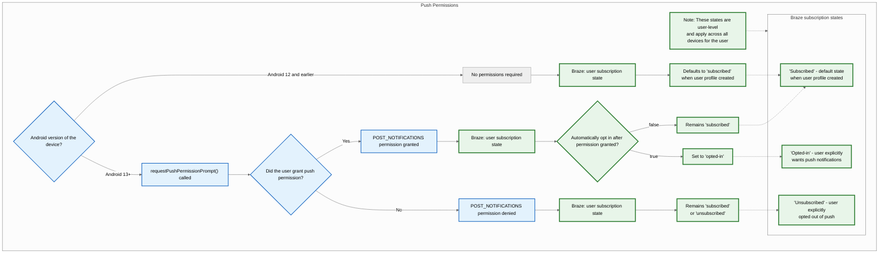
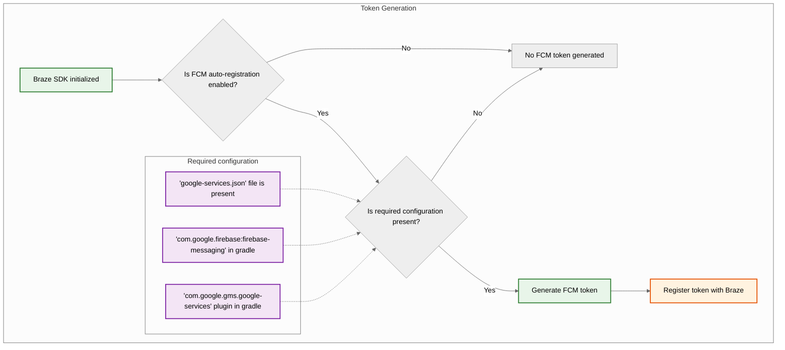
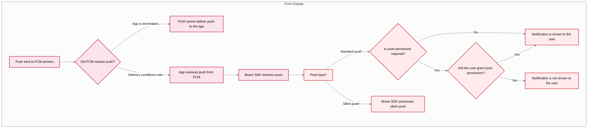



## Recursos integrados

Os seguintes recursos estão integrados ao SDK Android do Braze. Para usar quaisquer outros recursos de notificação por push, você precisará [configurar notificações por push](#android_setting-up-push-notifications) para seu app.

|Recurso|Descrição|
|-------|-----------|
|Stories por push|As Histórias de Push do Android estão integradas ao SDK Android do Braze por padrão. Para saber mais, veja [Histórias de Push]({{site.baseurl}}/user_guide/message_building_by_channel/push/advanced_push_options/push_stories/).|
|Primers Push|Campanhas de push primer incentivam seus usuários a ativar notificações por push em seu dispositivo para seu app. Isso pode ser feito sem personalização de SDK usando nosso [Push Primer sem código]({{site.baseurl}}/user_guide/message_building_by_channel/push/best_practices/push_primer_messages/).|
{: .reset-td-br-1 .reset-td-br-2 role="presentation"}

## Sobre o ciclo de vida da notificação por push {#push-notification-lifecycle}

O fluxograma a seguir mostra como o Braze lida com o ciclo de vida da notificação por push, como solicitações de permissão, geração de tokens e entrega de mensagens.















## Configurando notificações por push


Para conferir um app de exemplo usando FCM com o SDK Android do Braze, veja [Braze: App de amostra de push do Firebase](https://github.com/braze-inc/braze-android-sdk/tree/master/samples/firebase-push).


### Limites de taxa

A API do Firebase Cloud Messaging (FCM) tem um limite de frequência padrão de 600.000 solicitações por minuto. Se você atingir esse limite, o Braze tentará automaticamente outra vez em alguns minutos. Para solicitar um aumento, entre em contato com [o suporte do Firebase](https://firebase.google.com/support).

### Etapa 1: Adicione o Firebase ao seu projeto

Primeiro, adicione o Firebase ao seu projeto Android. Para obter instruções passo a passo, consulte o [guia de configuração do Firebase](https://firebase.google.com/docs/android/setup) do Google.

### Etapa 2: Adicione o Cloud Messaging às suas dependências

Em seguida, adicione a biblioteca do Cloud Messaging às dependências de seu projeto. Em seu projeto Android, abra `build.gradle` e, em seguida, adicione a seguinte linha ao bloco `dependencies`.

```gradle
implementation "google.firebase:firebase-messaging:+"
```

Suas dependências devem ser semelhantes às seguintes:

```gradle
dependencies {
  implementation project(':android-sdk-ui')
  implementation "com.google.firebase:firebase-messaging:+"
}
```

### Etapa 3: Ativar a API de envio de mensagens do Firebase Cloud

No Google Cloud, selecione o projeto que seu app Android está usando e ative a [API do Firebase Cloud Messaging](https://console.cloud.google.com/apis/library/fcm.googleapis.com).

{: style="max-width:80%;"}

### Etapa 4: Crie uma conta de serviço {#service-account}

Em seguida, crie uma nova conta de serviço, para que a Braze possa fazer chamadas de API autorizadas ao registrar tokens FCM. No Google Cloud, acesse **Contas de Serviço**, depois escolha seu projeto. Na página **Contas de serviço**, selecione **Criar conta de serviço**.


Insira um nome de conta de serviço, ID e descrição, em seguida selecione **Criar e continuar**.


No campo **Função**, localize e selecione **Firebase Cloud Messaging API Admin** na lista de funções. Para obter acesso mais restritivo, crie uma [função personalizada](https://cloud.google.com/iam/docs/creating-custom-roles) com a permissão `cloudmessaging.messages.create` e, em vez disso, escolha-a na lista. Quando terminar, selecione **Concluído**.


Selecione **Admin da _API_ do Firebase Cloud Messaging**, não **Admin do Firebase Cloud Messaging**.



### Etapa 5: Gere credenciais JSON {#json}

Em seguida, gere credenciais JSON para sua conta de serviço FCM. No Google Cloud IAM & Admin, acesse **Service Accounts**, depois escolha seu projeto. Localize a conta de serviço FCM [que você criou anteriormente](#android_service-account) e selecione <i class="fa-solid fa-ellipsis-vertical"></i> **Actions** > **Manage Keys**.


Selecione **Adicionar chave** > **Criar nova chave**.


Escolha **JSON**, depois selecione **Criar**. Se você criou sua conta de serviço usando um ID de projeto do Google Cloud diferente do ID de projeto do FCM, será necessário atualizar manualmente o valor atribuído ao `project_id` no seu arquivo JSON.

Lembre-se de onde baixou a chave - você precisará dela na próxima etapa.

{: style="max-width:65%;"}


As chaves privadas podem representar um risco de segurança se forem comprometidas. Armazene suas credenciais JSON em um local seguro por enquanto - você excluirá sua chave depois de fazer upload dela no Braze.


### Etapa 6: Faça upload de suas credenciais JSON na Braze

Em seguida, faça upload de suas credenciais JSON em seu dashboard da Braze. Na Braze, selecione <i class="fa-solid fa-gear"></i> **Configurações** > **Configurações do app**.


Nas **configurações de notificação por push** do seu app para Android, escolha **Firebase**, selecione **Upload JSON File** e faça upload das credenciais [geradas anteriormente](#android_json). Quando terminar, selecione **Salvar**.



As chaves privadas podem representar um risco de segurança se forem comprometidas. Agora que sua chave foi carregada na Braze, exclua o arquivo [gerado anteriormente](#android_json).


### Etapa 7: Configure o registro automático de tokens

Quando um de seus usuários aceita notificações por push, seu app precisa gerar um token FCM no dispositivo dele antes de poder enviar notificações por push. Com o SDK do Braze, é possível ativar o registro automático do token FCM para cada dispositivo do usuário nos arquivos de configuração do Braze do seu projeto.

Primeiro, acesse o Console Firebase, abra seu projeto e selecione <i class="fa-solid fa-gear"></i> **Settings** > **Project settings** (Configurações .> Configurações do projeto).


Selecione **Envio de mensagens na nuvem** e, em seguida, em **Firebase Cloud Messaging API (V1)**, copie o número no campo **Sender ID (ID do remetente** ).


Em seguida, abra seu projeto do Android Studio e use seu Firebase Sender ID para ativar o registro automático do token FCM em `braze.xml` ou `BrazeConfig`.



Para configurar o registro automático do token FCM, adicione as seguintes linhas ao arquivo `braze.xml`:

```xml
<bool translatable="false" name="com_braze_firebase_cloud_messaging_registration_enabled">true</bool>
<string translatable="false" name="com_braze_firebase_cloud_messaging_sender_id">FIREBASE_SENDER_ID</string>
```

Substitua `FIREBASE_SENDER_ID` pelo valor que você copiou das configurações do projeto Firebase. `braze.xml` deve ser semelhante ao seguinte:

```xml
<?xml version="1.0" encoding="utf-8"?>
<resources>
  <string translatable="false" name="com_braze_api_key">12345ABC-6789-DEFG-0123-HIJK456789LM</string>
  <bool translatable="false" name="com_braze_firebase_cloud_messaging_registration_enabled">true</bool>
<string translatable="false" name="com_braze_firebase_cloud_messaging_sender_id">603679405392</string>
</resources>
```



Para configurar o registro automático do token FCM, adicione as seguintes linhas a `BrazeConfig`:



```java
.setIsFirebaseCloudMessagingRegistrationEnabled(true)
.setFirebaseCloudMessagingSenderIdKey("FIREBASE_SENDER_ID")
```


```kotlin
.setIsFirebaseCloudMessagingRegistrationEnabled(true)
.setFirebaseCloudMessagingSenderIdKey("FIREBASE_SENDER_ID")
```



Substitua `FIREBASE_SENDER_ID` pelo valor que você copiou das configurações do projeto Firebase. `BrazeConfig` deve ser semelhante ao seguinte:



```java
BrazeConfig brazeConfig = new BrazeConfig.Builder()
  .setApiKey("12345ABC-6789-DEFG-0123-HIJK456789LM")
  .setCustomEndpoint("sdk.iad-01.braze.com")
  .setSessionTimeout(60)
  .setHandlePushDeepLinksAutomatically(true)
  .setGreatNetworkDataFlushInterval(10)
  .setIsFirebaseCloudMessagingRegistrationEnabled(true)
  .setFirebaseCloudMessagingSenderIdKey("603679405392")
  .build();
Braze.configure(this, brazeConfig);
```


```kotlin
val brazeConfig = BrazeConfig.Builder()
  .setApiKey("12345ABC-6789-DEFG-0123-HIJK456789LM")
  .setCustomEndpoint("sdk.iad-01.braze.com")
  .setSessionTimeout(60)
  .setHandlePushDeepLinksAutomatically(true)
  .setGreatNetworkDataFlushInterval(10)
  .setIsFirebaseCloudMessagingRegistrationEnabled(true)
  .setFirebaseCloudMessagingSenderIdKey("603679405392")
  .build()
Braze.configure(this, brazeConfig)
```




Se, em vez disso, você quiser registrar manualmente os tokens do FCM, poderá chamar [`Braze.setRegisteredPushToken()`](https://braze-inc.github.io/braze-android-sdk/kdoc/braze-android-sdk/com.braze/-braze/registered-push-token.html) dentro do método [`onCreate()`](https://developer.android.com/reference/android/app/Application.html#onCreate()) do aplicativo.




### Etapa 8: Remover solicitações automáticas em sua classe de aplicativo

Para evitar que a Braze dispare solicitações de rede desnecessárias sempre que você enviar notificações por push silenciosas, remova todas as solicitações de rede automáticas configuradas no método `onCreate()` de sua classe `Application`. Para saber mais, consulte [Android Developer Reference: Aplicativo](https://developer.android.com/reference/android/app/Application).

## Exibindo notificações

### Etapa 1: Registre o serviço de envio de mensagens do Braze Firebase

Você pode criar um novo, existente ou um Serviço de Mensagens do Firebase não-Braze. Escolha o que melhor atende às suas necessidades específicas.



A Braze oferece um serviço para lidar com recebimento de push e intenções de abertura. Nossa classe `BrazeFirebaseMessagingService` precisará ser registrada em seu site `AndroidManifest.xml`:

```xml
<service android:name="com.braze.push.BrazeFirebaseMessagingService"
  android:exported="false">
  <intent-filter>
    <action android:name="com.google.firebase.MESSAGING_EVENT" />
  </intent-filter>
</service>
```

Nosso código de notificação também usa o site `BrazeFirebaseMessagingService` para lidar com o rastreamento de ações de abertura e cliques. Esse serviço deve ser registrado no site `AndroidManifest.xml` para funcionar corretamente. Além disso, lembre-se de que o Braze prefixa as notificações de nosso sistema com uma chave exclusiva, de modo que só renderizamos as notificações enviadas de nossos sistemas. Você pode registrar serviços adicionais separadamente para processar as notificações enviadas por outros serviços da FCM. Veja [`AndroidManifest.xml`](https://github.com/braze-inc/braze-android-sdk/blob/master/samples/firebase-push/src/main/AndroidManifest.xml) no app de exemplo de push do Firebase.


Antes do Braze SDK 3.1.1, o `AppboyFcmReceiver` era usado para lidar com o push FCM. A classe `AppboyFcmReceiver` deve ser removida de seu manifesto e substituída pela integração anterior.




Se você já tiver um serviço de envio de mensagens do Firebase registrado, poderá passar objetos [`RemoteMessage`](https://firebase.google.com/docs/reference/android/com/google/firebase/messaging/RemoteMessage) para o Braze via [`BrazeFirebaseMessagingService.handleBrazeRemoteMessage()`](https://braze-inc.github.io/braze-android-sdk/kdoc/braze-android-sdk/com.braze.push/-braze-firebase-messaging-service/-companion/handle-braze-remote-message.html). Esse método só exibirá uma notificação se o objeto [`RemoteMessage`](https://firebase.google.com/docs/reference/android/com/google/firebase/messaging/RemoteMessage) for originário do Braze e, caso contrário, será ignorado com segurança.




```java
public class MyFirebaseMessagingService extends FirebaseMessagingService {
  @Override
  public void onMessageReceived(RemoteMessage remoteMessage) {
    super.onMessageReceived(remoteMessage);
    if (BrazeFirebaseMessagingService.handleBrazeRemoteMessage(this, remoteMessage)) {
      // This Remote Message originated from Braze and a push notification was displayed.
      // No further action is needed.
    } else {
      // This Remote Message did not originate from Braze.
      // No action was taken and you can safely pass this Remote Message to other handlers.
    }
  }
}
```




```kotlin
class MyFirebaseMessagingService : FirebaseMessagingService() {
  override fun onMessageReceived(remoteMessage: RemoteMessage?) {
    super.onMessageReceived(remoteMessage)
    if (BrazeFirebaseMessagingService.handleBrazeRemoteMessage(this, remoteMessage)) {
      // This Remote Message originated from Braze and a push notification was displayed.
      // No further action is needed.
    } else {
      // This Remote Message did not originate from Braze.
      // No action was taken and you can safely pass this Remote Message to other handlers.
    }
  }
}
```






Se você tiver outro Firebase Messaging Service que também gostaria de usar, especifique um Firebase Messaging Service de fallback para chamar se o aplicativo receber um push que não seja da Braze.

Em `braze.xml`, especifique:

```xml
<bool name="com_braze_fallback_firebase_cloud_messaging_service_enabled">true</bool>
<string name="com_braze_fallback_firebase_cloud_messaging_service_classpath">com.company.OurFirebaseMessagingService</string>
```

ou definido por meio da [configuração de tempo de execução:]({{site.baseurl}}/developer_guide/sdk_initalization/?sdktab=android)




```java
BrazeConfig brazeConfig = new BrazeConfig.Builder()
        .setFallbackFirebaseMessagingServiceEnabled(true)
        .setFallbackFirebaseMessagingServiceClasspath("com.company.OurFirebaseMessagingService")
        .build();
Braze.configure(this, brazeConfig);
```




```kotlin
val brazeConfig = BrazeConfig.Builder()
        .setFallbackFirebaseMessagingServiceEnabled(true)
        .setFallbackFirebaseMessagingServiceClasspath("com.company.OurFirebaseMessagingService")
        .build()
Braze.configure(this, brazeConfig)
```






### Etapa 2: Adequar os ícones pequenos às diretrizes de design

Para obter informações gerais sobre os ícones de notificação do Android, visite a [visão geral de Notificações](https://developer.android.com/guide/topics/ui/notifiers/notifications).

A partir do Android N, você deve atualizar ou remover pequenos ativos de ícones de notificação que envolvam cores. O sistema Android (não o SDK do Braze) ignora todos os canais não alfa e de transparência nos ícones de ação e no ícone pequeno de notificação. Em outras palavras, o Android converterá todas as partes do seu pequeno ícone de notificação em monocromático, exceto as regiões transparentes.

Para criar um ícone pequeno de notificação que seja exibido corretamente:
- Remova todas as cores da imagem, exceto o branco.
- Todas as outras regiões não brancas do ativo devem ser transparentes.


Um sintoma comum de um ativo inadequado é a renderização do pequeno ícone de notificação como um quadrado monocromático sólido. Isso se deve ao fato de o sistema Android não conseguir encontrar nenhuma região transparente no ativo do ícone pequeno de notificação.


Os ícones grandes e pequenos a seguir são exemplos de ícones projetados adequadamente:


### Etapa 3: Configurar ícones de notificação {#configure-icons}

#### Especificação de ícones em braze.xml

A Braze permite que você configure seus ícones de notificação especificando recursos desenháveis em `braze.xml`:

```xml
<drawable name="com_braze_push_small_notification_icon">REPLACE_WITH_YOUR_ICON</drawable>
<drawable name="com_braze_push_large_notification_icon">REPLACE_WITH_YOUR_ICON</drawable>
```

É necessário definir um pequeno ícone de notificação. **Se você não definir um, o Braze usará, por padrão, o ícone do aplicativo como o pequeno ícone de notificação, o que pode não parecer ideal.**

A definição de um ícone de notificação grande é opcional, mas recomendada.

#### Especificação da cor de destaque do ícone

A cor de destaque do ícone de notificação pode ser substituída em seu site `braze.xml`. Se a cor não for especificada, a cor padrão será o mesmo cinza que o Lollipop usa para as notificações do sistema.

```xml
<integer name="com_braze_default_notification_accent_color">0xFFf33e3e</integer>
```

Opcionalmente, você também pode usar uma referência de cor:

```xml
<color name="com_braze_default_notification_accent_color">@color/my_color_here</color>
```

### Etapa 4: Adicionar deep linking

#### Ativando a abertura automática de deep linking

Para permitir que a Braze abra automaticamente seu app e quaisquer deep links quando uma notificação por push for clicada, defina `com_braze_handle_push_deep_links_automatically` como `true` em seu `braze.xml`:

```xml
<bool name="com_braze_handle_push_deep_links_automatically">true</bool>
```

Esse sinalizador também pode ser definido por meio da [configuração do tempo de execução]({{site.baseurl}}/developer_guide/sdk_initalization/?sdktab=android):




```java
BrazeConfig brazeConfig = new BrazeConfig.Builder()
        .setHandlePushDeepLinksAutomatically(true)
        .build();
Braze.configure(this, brazeConfig);
```




```kotlin
val brazeConfig = BrazeConfig.Builder()
        .setHandlePushDeepLinksAutomatically(true)
        .build()
Braze.configure(this, brazeConfig)
```




Se quiser personalizar o tratamento de deep linkings, você precisará criar um retorno de chamada de push que escute as intenções de push recebidas e abertas da Braze. Para saber mais, veja [Usando um retorno de chamada para eventos de push]({{site.baseurl}}/developer_guide/push_notifications/customization#android_using-a-callback-for-push-events).

#### Criação de deep links personalizados

Siga as instruções encontradas na [documentação do desenvolvedor Android](http://developer.android.com/training/app-indexing/deep-linking.html) sobre deep linking se você ainda não adicionou deep links ao seu app. Para saber mais sobre o que são deep linkings, consulte nosso [artigo de perguntas frequentes]({{site.baseurl}}/user_guide/personalization_and_dynamic_content/deep_linking_to_in-app_content/#what-is-deep-linking).

#### Adicionar deep links

O dashboard do Braze oferece suporte à configuração de deep links ou URLs da Web em campanhas de notificações por push e canvas que serão abertos quando a notificação for clicada.


#### Personalização do comportamento da pilha traseira

O SDK do Android, por padrão, colocará a atividade principal do iniciador do seu app host na pilha traseira ao seguir push deep links. A Braze permite definir uma atividade personalizada para ser aberta na pilha traseira no lugar da atividade principal do iniciador ou desativar a pilha traseira completamente.

Por exemplo, para definir uma atividade chamada `YourMainActivity` como a atividade de back stack usando a [configuração de tempo de execução]({{site.baseurl}}/developer_guide/sdk_initalization/?sdktab=android):




```java
BrazeConfig brazeConfig = new BrazeConfig.Builder()
        .setPushDeepLinkBackStackActivityEnabled(true)
        .setPushDeepLinkBackStackActivityClass(YourMainActivity.class)
        .build();
Braze.configure(this, brazeConfig);
```




```kotlin
val brazeConfig = BrazeConfig.Builder()
        .setPushDeepLinkBackStackActivityEnabled(true)
        .setPushDeepLinkBackStackActivityClass(YourMainActivity.class)
        .build()
Braze.configure(this, brazeConfig)
```




Veja a configuração equivalente para seu `braze.xml`. Note que o nome da classe deve ser o mesmo retornado por `Class.forName()`.

```xml
<bool name="com_braze_push_deep_link_back_stack_activity_enabled">true</bool>
<string name="com_braze_push_deep_link_back_stack_activity_class_name">your.package.name.YourMainActivity</string>
```

### Etapa 5: Definir canais de notificação

O SDK do Braze para Android é compatível com os [canais de notificação do Android](https://developer.android.com/preview/features/notification-channels.html). Se uma notificação do Braze não contiver o ID de um canal de notificação ou se uma notificação do Braze contiver um ID de canal inválido, o Braze exibirá a notificação com o canal de notificação padrão definido no SDK. Os usuários do Braze usam os [canais de notificação do Android]({{site.baseurl}}/user_guide/message_building_by_channel/push/android/notification_channels/) na plataforma para agrupar notificações.

Para definir o nome do canal de notificação padrão do Braze voltado para o usuário, use [`BrazeConfig.setDefaultNotificationChannelName()`](https://braze-inc.github.io/braze-android-sdk/kdoc/braze-android-sdk/com.braze.configuration/-braze-config/-builder/set-default-notification-channel-name.html).

Para definir a descrição voltada para o usuário do canal de notificação padrão do Braze, use [`BrazeConfig.setDefaultNotificationChannelDescription()`](https://braze-inc.github.io/braze-android-sdk/kdoc/braze-android-sdk/com.braze.configuration/-braze-config/-builder/set-default-notification-channel-description.html).

Atualize todas as campanhas da API com o parâmetro de [objeto Android push]({{site.baseurl}}/api/objects_filters/messaging/android_object/) para incluir o campo `notification_channel`. Se esse campo não for especificado, o Braze enviará a carga útil da notificação com o ID do canal [fallback dashboard]({{site.baseurl}}/user_guide/message_building_by_channel/push/android/notification_channels/#dashboard-fallback-channel).

Além do canal de notificação padrão, a Braze não criará nenhum canal. Todos os outros canais devem ser definidos programaticamente pelo app host e, em seguida, inseridos no dashboard da Braze.

O nome e a descrição padrão do canal também podem ser configurados em `braze.xml`.

```xml
<string name="com_braze_default_notification_channel_name">Your channel name</string>
<string name="com_braze_default_notification_channel_description">Your channel description</string>
```

### Etapa 6: Teste a exibição de notificações e a análise de dados

#### Tela de teste

Nesse ponto, você poderá ver as notificações enviadas pelo Braze. Para testar isso, acesse a página **Campaigns (Campanhas** ) em seu dashboard do Braze e crie uma campanha **de notificação por push**. Escolha o **Android Push** e crie sua mensagem. Em seguida, clique no ícone do olho no criador para obter o remetente de teste. Digite o ID do usuário ou o endereço de e-mail do usuário atual e clique em **Send Test (Enviar teste**). Você deverá ver o push aparecer em seu dispositivo.


Para problemas relacionados ao push display, consulte nosso [guia de solução de problemas]({{site.baseurl}}/developer_guide/push_notifications/troubleshooting/?sdktab=android).

#### Análise de dados de teste

Nesse ponto, você também deve ter registro de análise de dados para aberturas de notificações por push. Ao clicar na notificação quando ela chegar, as **aberturas diretas** na página de resultados de sua campanha deverão aumentar em 1. Confira nosso artigo sobre [relatórios push]({{site.baseurl}}/user_guide/message_building_by_channel/push/push_reporting/) para obter informações detalhadas sobre a análise de dados push.

Para problemas relacionados à análise de dados por push, consulte nosso [guia de solução de problemas]({{site.baseurl}}/developer_guide/push_notifications/troubleshooting/?sdktab=android).

#### Testes a partir da linha de comando

Se quiser testar notificações por push e no aplicativo por meio da interface de linha de comando, você poderá enviar uma única notificação pelo terminal via cURL e a [API de envio de mensagens]({{site.baseurl}}/api/endpoints/messaging/). Você precisará substituir os seguintes campos pelos valores corretos para o seu caso de teste:

- `YOUR_API_KEY` (Acessar **Configurações** > **API Keys**.)
- `YOUR_EXTERNAL_USER_ID` (Procure um perfil na página **Buscar Usuários**.)
- `YOUR_KEY1` (opcional)
- `YOUR_VALUE1` (opcional)

```bash
curl -X POST -H "Content-Type: application/json" -H "Authorization: Bearer {YOUR_API_KEY}" -d '{
  "external_user_ids":["YOUR_EXTERNAL_USER_ID"],
  "messages": {
    "android_push": {
      "title":"Test push title",
      "alert":"Test push",
      "extra": {
        "YOUR_KEY1":"YOUR_VALUE1"
      }
    }  
  }
}' https://rest.iad-01.braze.com/messages/send
```

Este exemplo usa a instância `US-01`. Se você não estiver nessa instância, substitua o endpoint `US-01` pelo [seu endpoint]({{site.baseurl}}/api/basics/#endpoints).

## Notificações por push de conversa

{: style="float:right;max-width:35%;margin-left:15px;border: 0;"}

A [iniciativa de pessoas e conversas](https://developer.android.com/guide/topics/ui/conversations) existe há vários anos no Android e tem como objetivo destacar pessoas e conversas na superfície do sistema do smartphone. Esta prioridade é baseada no fato de que a comunicação e a interação com outras pessoas ainda são a área funcional mais valorizada e importante para a maioria dos usuários de Android em todas as faixas demográficas.

### Requisitos de uso

- Esse tipo de notificação requer o SDK da Braze para Android v15.0.0+ e dispositivos Android 11+. 
- Dispositivos ou SDKs sem suporte voltarão a usar uma notificação por push padrão.

Este recurso está disponível apenas na API REST da Braze. Consulte o [objeto push do Android]({{site.baseurl}}/api/objects_filters/messaging/android_object#android-conversation-push-object) para saber mais.

## Erros de cota excedida do FCM

Quando seu limite para o Firebase Cloud Messaging (FCM) é excedido, o Google retorna erros de "cota excedida". O limite padrão do FCM é de 600.000 solicitações por minuto. A Braze tenta reenviar de acordo com as melhores práticas recomendadas pelo Google. No entanto, um grande volume desses erros pode prolongar o tempo de envio por vários minutos. Para atenuar o possível impacto, a Braze enviará um alerta de que o limite de taxa está sendo excedido e informando quais as medidas que você pode tomar para evitar os erros.

Para verificar seu limite atual, acesse seu **Google Cloud Console** > **APIs e Serviços** > **API do Firebase Cloud Messaging** > **Limites e Cotas do Sistema**, ou visite a [página de Cotas da API do FCM](https://console.cloud.google.com/apis/api/fcm.googleapis.com/quotas).

### Melhores práticas

Recomendamos essas melhores práticas para manter esses volumes de erro baixos.

#### Solicitar um aumento de limite de taxa do FCM

Para solicitar um aumento de limite de taxa do FCM, você pode entrar em contato diretamente com [Suporte do Firebase](https://firebase.google.com/support) ou fazer o seguinte:

1. Acesse a [página de Cotas da API do FCM](https://console.cloud.google.com/apis/api/fcm.googleapis.com/quotas).
2. Localize a cota de **Solicitações enviadas por minuto**.
3. Selecione **Editar Cota**. 
4. Insira um novo valor e envie sua solicitação.

#### Solicitar limitação global de taxa via Braze

Para aplicar um limite em todo o espaço de trabalho para notificações por push do Android, entre em contato com [Suporte da Braze]({{site.baseurl}}/help/support#access-the-support-portal).