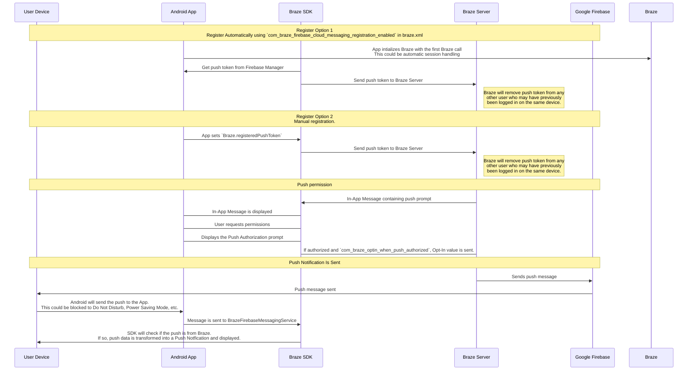

## Entendendo o fluxo de trabalho do Braze push

O serviço Firebase Cloud Messaging (FCM) é a infraestrutura do Google para notificações por push enviadas para aplicativos Android. Esta é a estrutura simplificada de como as notificações por push são ativadas para os dispositivos de seus usuários e como o Braze pode enviar notificações por push para eles:




### Etapa 1: Configuração de sua chave de API do Google Cloud

Ao desenvolver seu app, você precisará fornecer ao SDK da Braze para Android seu ID de remetente do Firebase. Além disso, você precisará fornecer uma chave de API para aplicativos de servidor no dashboard da Braze. O Braze usará essa chave de API para enviar mensagens para seus dispositivos. Também será necessário verificar se o serviço FCM está ativado no console do desenvolvedor do Google. 


Um erro comum durante essa etapa é usar a chave da API do identificador do app em vez da chave da API REST.


### Etapa 2: Os dispositivos se registram no FCM e fornecem tokens por push ao Braze

Em integrações típicas, o SDK da Braze para Android lidará com o registro de dispositivos para o recurso FCM. Isso geralmente acontece imediatamente após a abertura do app pela primeira vez. Após o registro, a Braze receberá uma ID de registro FCM, que é usada para enviar mensagens especificamente para esse dispositivo. Armazenaremos o ID de registro desse usuário, e ele se tornará "registrado por push" se anteriormente não tiver um token por push para nenhum dos seus apps.

### Etapa 3: Lançamento de uma campanha de push do Braze

Quando uma campanha de mensagens push for lançada, a Braze fará solicitações à FCM para entregar sua mensagem. O Braze usará a chave de API copiada no dashboard para autenticar e verificar se podemos enviar notificações por push para os tokens por push fornecidos.

### Etapa 4: Remoção de tokens inválidos

Se o FCM nos informar que qualquer um dos tokens por push para os quais estávamos tentando enviar uma mensagem é inválido, removeremos esses tokens dos perfis de usuário aos quais eles estavam associados. Se os usuários não tiverem outros tokens por push, eles não aparecerão mais como "Push Registered" na página **Segments (Segmentos** ).

Para obter mais detalhes sobre o FCM, acesse [Envio de mensagens para a nuvem](https://firebase.google.com/docs/cloud-messaging/).

## Utilização dos registros de erros do push

O Braze fornece notificações por push de erros no registro de atividades de mensagens. Esse registro de erros fornece uma variedade de avisos que podem ser muito úteis para identificar por que suas campanhas não estão funcionando como esperado. Ao clicar em uma mensagem de erro, o sistema redirecionará você para a documentação relevante que ajudará a solucionar um incidente específico.


## Cenários de solução de problemas

### O push não está enviando

Suas mensagens push podem não estar sendo enviadas devido às seguintes situações:

- Suas credenciais existem no ID de projeto errado do Google Cloud Platform (ID de remetente errado).
- Suas credenciais têm o escopo de permissão incorreto.
- Você fez upload de credenciais erradas para o espaço de trabalho errado da Braze (ID de remetente errado).

Para outros problemas que possam impedi-lo de enviar uma mensagem push, consulte o Guia do Usuário [: Solução de problemas de notificações por push]({{site.baseurl}}/user_guide/message_building_by_channel/push/troubleshooting/).

### Nenhum usuário "push registrado" é exibido no dashboard da Braze (antes do envio de mensagens)

Confirme se o seu app está configurado corretamente para permitir notificações por push. Os pontos de falha comuns a serem verificados incluem:

#### ID do remetente incorreto

Verifique se o ID do remetente FCM correto está incluído no arquivo `braze.xml`. Um ID de remetente incorreto levará a erros `MismatchSenderID` relatados no registro de atividade de mensagens do dashboard.

#### O registro do Braze não está ocorrendo

Como o registro da FCM é feito fora da Braze, a falha no registro só pode ocorrer em dois lugares:

1. Durante o registro na FCM
2. Ao passar o token por push gerado pelo FCM para o Braze

Recomendamos definir um ponto de interrupção ou registro para confirmar que o token por push gerado pelo FCM está sendo enviado ao Braze. Se um token não for gerado corretamente ou de forma alguma, recomendamos consultar a [documentação do FCM](https://firebase.google.com/docs/cloud-messaging/android/client).

#### O Google Play Services não está presente

Para que o push do FCM funcione, o Google Play Services deve estar presente no dispositivo. Se o Google Play Services não estiver em um dispositivo, o registro push não ocorrerá.

**Nota:** O Google Play Services não é instalado em emuladores Android sem as APIs do Google instaladas.

#### O dispositivo não está conectado à Internet

Verifique se o seu dispositivo tem boa conectividade com a Internet e se não está enviando tráfego de rede por meio de um proxy.

### Tocar em uma notificação por push não abre o app

Verifique se `com_braze_handle_push_deep_links_automatically` está definido como `true` ou `false`. Para ativar a Braze para abrir automaticamente o app e quaisquer deep links quando uma notificação por push for tocada, defina `com_braze_handle_push_deep_links_automatically` como `true` em seu arquivo `braze.xml`.

Se `com_braze_handle_push_deep_links_automatically` estiver definido como o padrão `false`, você precisará usar um retorno de chamada do Braze Push para ouvir e tratar as intenções recebidas e abertas de push.

### As notificações por push sofreram bounce

Se uma notificação por push não for entregue, verifique se não houve bounce no [console do desenvolvedor]({{site.baseurl}}/developer_guide/platforms/android/push_notifications/troubleshooting/#utilizing-the-push-error-logs). A seguir estão as descrições de erros comuns que podem ser registrados no console do desenvolvedor:

#### Erro: MismatchSenderID

`MismatchSenderID` indica uma falha de autenticação. Confirme se o ID do remetente do Firebase e a chave de API do FCM estão corretos.

#### Erro: Registro inválido

`InvalidRegistration` pode ser causado por um token por push malformado.

1. Certifique-se de passar um token por push válido para o Braze a partir do [envio de mensagens do Firebase Cloud](https://firebase.google.com/docs/cloud-messaging/android/client#retrieve-the-current-registration-token).

#### Erro: Não registrado

1. `NotRegistered` normalmente ocorre quando um app é excluído de um dispositivo. A Braze usa o site `NotRegistered` internamente para sinalizar que um app foi desinstalado de um dispositivo.

2. `NotRegistered` também pode ocorrer quando há vários registros e um segundo registro invalida o primeiro token.

### Notificações por push enviadas, mas não exibidas nos dispositivos dos usuários

Há alguns motivos pelos quais isso pode estar ocorrendo:

#### O aplicativo foi encerrado à força

Se você forçar o encerramento do aplicativo por meio das configurações do sistema, as notificações por push não serão enviadas. Ao iniciar o app novamente, seu dispositivo será reativado para receber notificações por push.

#### BrazeFirebaseMessagingService não registrado

O BrazeFirebaseMessagingService deve ser registrado corretamente em `AndroidManifest.xml` para que as notificações por push sejam exibidas:

```xml
<service android:name="com.braze.push.BrazeFirebaseMessagingService"
  android:exported="false">
  <intent-filter>
    <action android:name="com.google.firebase.MESSAGING_EVENT" />
  </intent-filter>
</service>
```

#### O firewall está bloqueando o push

Se estiver testando o push por Wi-Fi, seu firewall pode estar bloqueando as portas necessárias para que o FCM receba mensagens. Confirme se as portas `5228`, `5229` e `5230` estão abertas. Além disso, como o FCM não especifica seus IPs, você também deve permitir que seu firewall aceite conexões de saída para todos os endereços IP contidos nos blocos de IPs listados no ASN do Google de `15169`.

#### Fábrica de notificação personalizada que retorna nulo

Se você tiver implementado uma [fábrica de notificações personalizada]({{site.baseurl}}/developer_guide/platform_integration_guides/android/push_notifications/android/integration/standard_integration/#custom-displaying-notifications), certifique-se de que ela não esteja retornando `null`. Isso fará com que as notificações não sejam exibidas.

### Os usuários "Push registrados" não são mais ativados após o envio de mensagens

Há alguns motivos pelos quais isso pode estar acontecendo:

#### O aplicativo foi desinstalado

Os usuários desinstalaram o aplicativo. Isso invalidará seu token por push FCM.

#### Chave de servidor do Firebase Cloud Messaging inválida

A chave do servidor do Firebase Cloud Messaging fornecida no dashboard da Braze é inválida. A ID do remetente fornecida deve corresponder àquela referenciada no arquivo `braze.xml` do seu app. A chave do servidor e o ID do remetente podem ser encontrados aqui em seu console do Firebase:


### Cliques em push não registrados

O Braze registra os cliques push automaticamente, portanto, esse cenário deve ser comparativamente raro.

Se os cliques push não estiverem sendo registrados, é possível que os dados de cliques push ainda não tenham sido enviados aos nossos servidores. A Braze limita a frequência de suas descargas com base na força da conexão de rede. Com uma boa conexão de rede, os dados de cliques push devem chegar ao servidor em um minuto na maioria das circunstâncias.

### Os deep linkings não estão funcionando

#### Verificar a configuração do deep linking

Os deep linkings podem ser [testados com o ADB](https://developer.android.com/training/app-indexing/deep-linking.html#testing-filters). Recomendamos testar seu deep linking com o seguinte comando:

`adb shell am start -W -a android.intent.action.VIEW -d "THE_DEEP_LINK" THE_PACKAGE_NAME`

Se o deep linking não funcionar, ele pode estar mal configurado. Um deep linking mal configurado não funcionará quando enviado por meio do Braze push.

#### Verificar a lógica de manipulação personalizada

Se o deep linking [funcionar corretamente com o ADB](https://developer.android.com/training/app-indexing/deep-linking.html#testing-filters), mas não funcionar com o Braze push, verifique se foi implementado algum [tratamento personalizado de abertura de push]({{site.baseurl}}/developer_guide/platform_integration_guides/android/push_notifications/android/integration/standard_integration/#android-push-listener-callback). Se for o caso, verifique se o código de tratamento personalizado trata corretamente o deep linking de entrada.

#### Desativar o comportamento da pilha traseira

Se o deep linking [funcionar corretamente com o ADB](https://developer.android.com/training/app-indexing/deep-linking.html#testing-filters), mas não funcionar com o Braze push, tente desativar a [pilha traseira](https://developer.android.com/guide/components/activities/tasks-and-back-stack). Para fazer isso, atualize seu arquivo **braze.xml** para incluir:

```xml
<bool name="com_braze_push_deep_link_back_stack_activity_enabled">false</bool>
```
