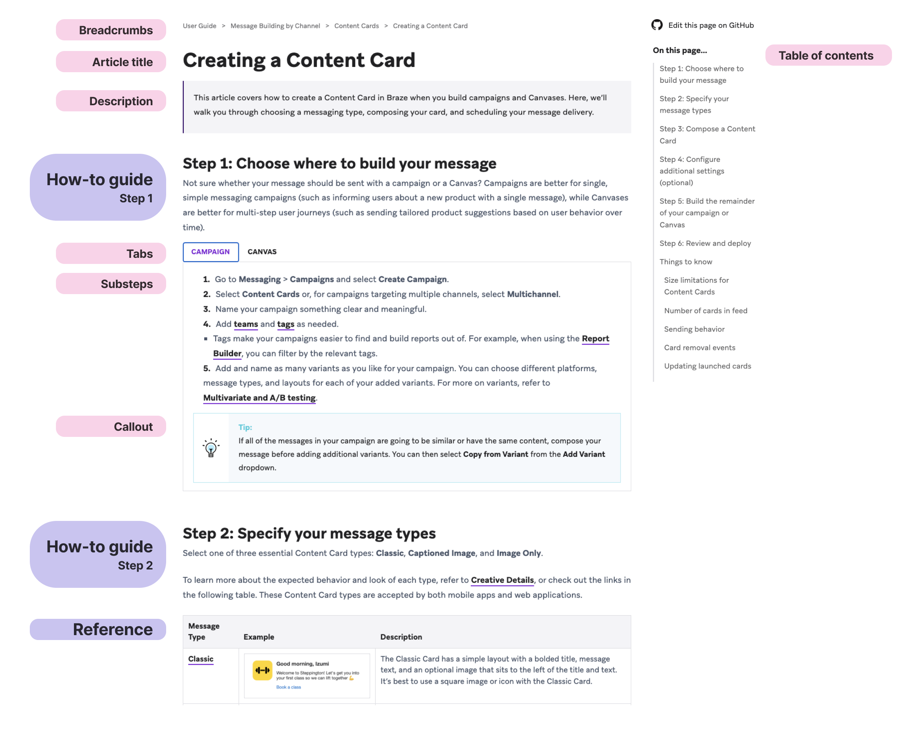

# Manage pages

> Learn how to create, modify, and remove pages on Braze Docs. To create or reorder a section instead, see [Sections](sections.md). For general information about pages, see [About content management](../content_management.md#pages).

*Included in the site build from [`_includes/contributing/prerequisites.md`](../../../_includes/contributing/prerequisites.md).*

## Creating a page

### Step 1: Create a new file

Open the relevant directory, then create a new Markdown file for your page.

```bash
PAGE_TITLE.md
```

Replace `PAGE_TITLE` with the title of your page, which should follow the [Braze Docs Style Guide](../style_guide.md). Use all lowercase characters, remove special characters, and replace spaces with underscores (`_`). Your filename should be similar to the following:

- **Page title:** Setting up your development environment for C++
- **File name:** `setting_up_your_development_environment_for_cpp.md`

*Included in the site build from [`_includes/contributing/alerts/tip_locating_a_file.md`](../../../_includes/contributing/alerts/tip_locating_a_file.md).*

### Step 2: Add a template

Copy and paste one of the following templates into your Markdown file, and then customize it. For more information, see [Templates](../content_types.md).

### Basic template

*Included in the site build from [`_includes/contributing/templates/basic.md`](../../../_includes/contributing/templates/basic.md).*

---

### Technology partner template

*Included in the site build from [`_includes/contributing/templates/technology_partner.md`](../../../_includes/contributing/templates/technology_partner.md).*



<sup>*The [Creating a Content Card](https://www.braze.com/docs/user_guide/message_building_by_channel/content_cards/create/) page uses the [how-to guide](../content_types.md#how-to-guides) and [reference](../content_types.md#references) templates.*</sup>

## Writing content

Other than the Braze-specific syntax covered in this section, all content be written using [standard Markdown syntax](https://www.markdownguide.org/basic-syntax/).

### Cross-referencing

To reference a page hosted outside Braze Docs, use standard Markdown syntax.


```markdown
[LINK_TEXT](FULL_URL)
```


To cross-reference a page hosted on Braze Docs, use the following Braze-specific syntax.


```markdown
[LINK_TEXT](https://www.braze.com/docs/SHORT_URL)
```


> **Note:**
> For a full walkthrough, see [Cross-referencing](cross_referencing.md).


### Adding images

To add images, place the image's PNG file inside the relevant location within `assets/img`, then use the following syntax.


```markdown

```


> **Note:**
> For a full walkthrough, see [Adding a new image](images.md).


