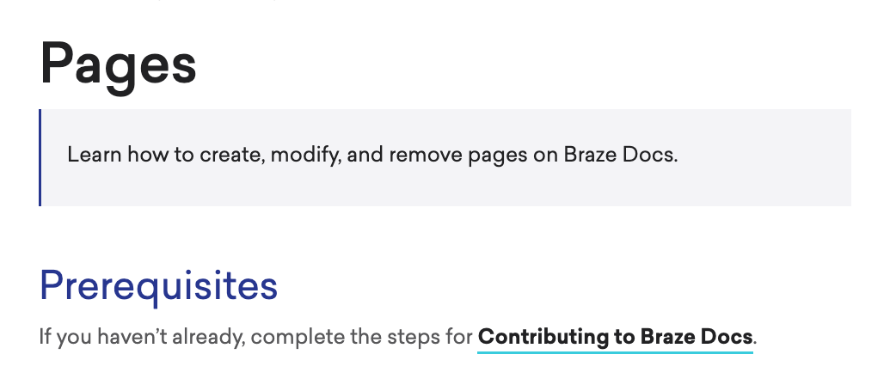

# Reusing content with includes

> Learn how to reuse content with includes across Braze Docs, so you can improve content consistency and reduce the time for content creation. For general information about content reuse, see [About content management](../content_management.md#content-reuse).

Content reuse in Jekyll is accomplished using includes. Includes are stored in the `_includes` directory as a regular Markdown file. Although, unlike the Markdown files in the `_docs` directory, these files don't need YAML front matter.

## Prerequisites

If you haven't already, review [Documentation feedback](https://www.braze.com/docs/feedback/) for how to reach the docs team. Full authoring guides for contributors with repository access live under `docs/contributing/` in the braze-docs repo.


## Creating an include

Create a new Markdown file with a `.md` extension in the `_includes` directory. While include files can be stored anywhere in this directory, it's best to keep related content together using subdirectories. Your file tree should like similar to the following:

```bash
braze-docs
└── _includes
    ├── alerts
    ├── archive
    └── contributing
        └── site_generator.md
```

Add content to your page, and be sure to follow the [Braze Docs Style Guide](../style_guide.md). If you plan on adding your include to a page that already has YAML front matter, do not add front matter to your include. Your content should be similar to the following:

```markdown
## Site generator 

Braze Docs is built using Jekyll, a popular static-site generator (SSG) that allows content files and design files to be stored in separate directories, such as `_docs` for content files and `assets` for design files. When the site is built, Jekyll intelligently merges each file and stores them as XML and HTML data in the `_site` directory. For more information, see [Jekyll Directory Structure](https://jekyllrb.com/docs/structure/).


As a contributor, you'll primarily work within the following directories.

| Directory                                                                     | Description                                                                                                                                                                                                                                                                                                                       |
|-------------------------------------------------------------------------------|-----------------------------------------------------------------------------------------------------------------------------------------------------------------------------------------------------------------------------------------------------------------------------------------------------------------------------------|
| [`_docs`](https://github.com/braze-inc/braze-docs/tree/develop/_docs)         | Contains all the written content for Braze Docs as text files written in Markdown. Text files are organized into directories and subdirectories mirroring the docs site, such as `_api` for the [API section](https://www.braze.com/docs/api/home) and `user_guide` for the [User Guide section](https://www.braze.com/docs/user_guide/introduction). |
| [`_includes`](https://github.com/braze-inc/braze-docs/tree/develop/_includes) | Contains text files (called "includes") that can be reused in any file within the `_docs` directory. Typically, includes are short, modular pieces of content that don't use standard formatting. The files stored in this location are important for [content reuse](#content-reuse).                                            |
| [`assets`](https://github.com/braze-inc/braze-docs/tree/develop/assets)       | Contains all the images for Braze Docs. Any text file in the `_docs` or `_includes` directory can link to this directory to display an image on its page.                                                                                                                                                                         |

```

> **Tip:**
> For a full walkthrough, see [Writing Content](pages.md#writing-content).


## Referencing an include

To reference an include, use the following syntax within the relevant Markdown file:

```plaintext

```

Replace `PATH_TO_INCLUDE` with the relative path from inside the `_includes` directory. For example, given the following file tree:

```bash
braze-docs
└── _includes
    ├── alerts
    ├── archive
    └── contributing
        └── templates
            └── basic.md
```

The reference would be similar to the following:

### example input

```markdown
# Pages

> Learn how to create, modify, and remove pages on Braze Docs.


```

---

### example output

