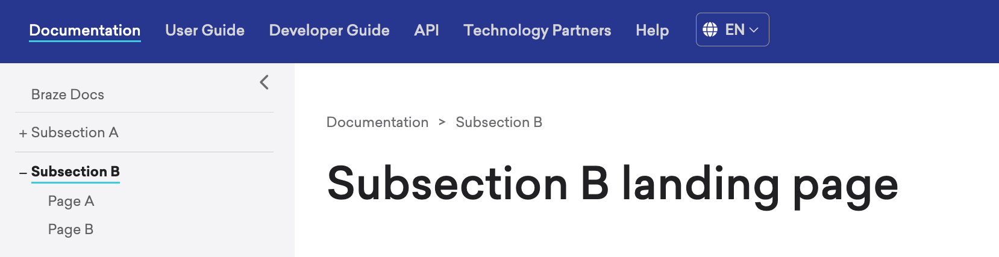
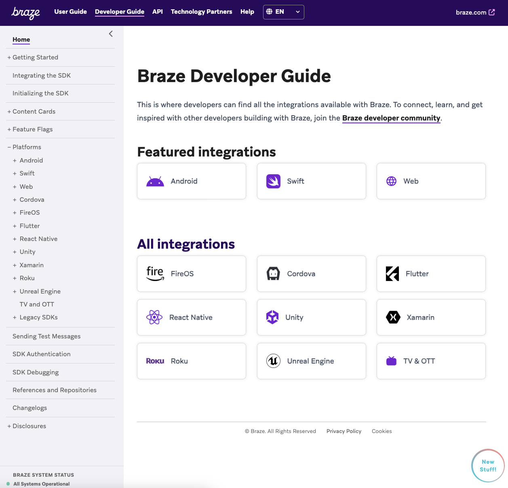

# Manage sections

> Learn how to create and order sections on Braze Docs. To create, modify, or delete an individual page instead, see [Pages](pages.md). For general information about sections, see [About content management](../content_management.md#sections).

<!--
## Prerequisites

If you haven't already, review [Documentation feedback](https://www.braze.com/docs/feedback/) for how to reach the docs team. Full authoring guides for contributors with repository access live under `docs/contributing/` in the braze-docs repo.
-->


## Creating a section

### Step 1: Create a directory and Markdown file

Open the relevant primary section or subsection, then create a directory and Markdown file for your new section.

```plaintext
braze-docs
└── _docs
    └── PRIMARY_SECTION 
        └── SUBSECTION 
            ├── NEW_DIRECTORY 
            └── NEW_FILE.md
```

Replace the following:

| Placeholder       | Description                                                                                                                                                                                                                                                 |
|-------------------|-------------------------------------------------------------------------------------------------------------------------------------------------------------------------------------------------------------------------------------------------------------|
| `PRIMARY_SECTION` | The name of the primary section your new content belongs to. For more information, see [Primary sections](../content_management.md#primary-sections).                                                                              |
| `SUBSECTION`      | If applicable, the name of the subsection your new content belongs to. For more information, see [Subsections](../content_management.md#subsections).                                                                              |
| `NEW_DIRECTORY`   | The name of your new section, which should follow the [Braze Docs Style Guide](../style_guide.md). Use all lowercase characters, remove special characters, and replace spaces with underscores (`_`). This name must match `NEW_FILE`.       |
| `NEW_FILE`        | The name of your new section, which should follow the [Braze Docs Style Guide](../style_guide.md). Use all lowercase characters, remove special characters, and replace spaces with underscores (`_`). This name must match `NEW_DIRECTORY`. |


Your directory structure should be similar to the following:

```plaintext
braze-docs
└── _docs
    └── _developer_guide 
        └── platform_wide 
            ├── getting_started 
            └── getting_started.md
```

### Step 2: Configure your section

When you create a new section, you can configure it with or without a landing page.

- **With landing page:** Use this method if your section needs a dedicated overview, such as a landing page for a "Getting started" section listing prerequisites and outlining the user journey.
- **Without landing page:** Use this method if your section does not need a dedicated overview. As stated in the [Braze Docs Style Guide](../style_guide.md), content should always be useful, so avoid adding a landing page if it offers little useful content.

### With landing page

Open your new Markdown file and add the following template. For more templates, see [Templates](../content_types.md).

```markdown
---
nav_title: NAV_TITLE
article_title: LANDING_PAGE_TITLE
description: SHORT_DESCRIPTION
---

# LANDING_PAGE_TITLE 

> SHORT_DESCRIPTION

## HEADING

CONTENT
```

Replace the following:

| Placeholder          | Description                                                                                                                                                                                                                                 |
|----------------------|---------------------------------------------------------------------------------------------------------------------------------------------------------------------------------------------------------------------------------------------|
| `NAV_TITLE`          | The title of your page as it will appear on the left-side navigation bar. In most cases, `nav_title` should match `article_title`, however to save space, you may use a shorter _but still similar_ title.                                  |
| `LANDING_PAGE_TITLE` | The title of your landing page. The `LANDING_PAGE_TITLE` value in the metadata is used for search engine results, while the `LANDING_PAGE_TITLE` value in Heading 1 is used for the title rendered on the page.                             |
| `SHORT_DESCRIPTION`  | A short, 1-2 sentence description of your page. The `SHORT_DESCRIPTION` value in YAML the metadata is used for search engine results, while the `SHORT_DESCRIPTION` value after Heading 1 is used for the description rendered on the page. |
| `HEADING`            | The title of your Heading 2 section.                                                                                                                                                                                                        |
| `CONTENT`            | The body paragraph for your Heading 2 section.                                                                                                                                                                                              |


> **Tip:**
> This template is only to get you started&#8212;add [additional metadata](../yaml_front_matter/metadata.md) and headings as needed.

---

### Without landing page

Open your subsection's Markdown file and add the following metadata to set your page's navigation title and disable the landing page.

```markdown
---
nav_title: NAV_TITLE
config_only: true
---
```

> **Tip:**
> This template is only to get you started&#8212;add [additional metadata](../yaml_front_matter/metadata.md) and headings as needed.


Replace `NAV_TITLE` with the title of your page as it will appear on the left-side navigation bar. Your page should be similar to the following:

```markdown
---
nav_title: Getting started
page_order: 2
noindex: true
config_only: true
---
```


### Step 3: Add additional pages

In your new directory, create a Markdown file for each page. To use the default page layout, use the template in [Step 2](sections.md#step-2-configure-your-section). Your directory structure should be similar to the following:

```plaintext
braze-docs
└── _docs
    └── _developer_guide 
        └── platform_wide 
            ├── getting_started 
            │    ├── integrating_the_sdk.md 
            │    └── setting_up_push_notifications.md
            └── getting_started.md
```

When you're finished adding content to each page, continue to [Ordering a section](#ordering-a-section).

> **Tip:**
> For a full walkthrough on adding content to your page, see [Pages](pages.md#writing-content).


## Ordering a section

To order a section, open one of the Markdown files in that section and search for the [`page_order`](../yaml_front_matter/metadata.md#page-order) key within its YAML front matter.

```markdown
---
page_order:
---
```

The `page_order` key represents a page's relative-order in a section on the left-side navigation bar and can be set to any non-negative number (such as `0`, `20`, or `5.5`). This means you'll need to know the `page_order` for each Markdown file in the current directory, but not any other directory (including subdirectories).

Set the `page_order` key for each Markdown file in the current directory to any non-negative number. In the following example, `page_order` is set to `2`.  

```markdown
---
nav_title: Subsection B
page_order: 2 
---

# Subsection B landing page
```

The output is similar to the following:



## Forcing auto-expand

When a landing page is selected, the section is auto-expanded in the navigation. However, you can force a section to always auto-expand even if its not selected.

For example, when you go to the [developer guide](https://www.braze.com/docs/developer_guide/), the **Platforms** section is always auto-expanded.

To force a section to auto-expand, open the `_config.yml` in your text editor and add the section's relative URL path to the `nav_expand_list`.

```yml
# List of pages(path) to auto expand
nav_expand_list:
  - "/developer_guide/platforms"
  - "/RELATIVE/URL/PATH/"
```

Replace `/RELATIVE/URL/PATH/` with URL path to your section with `braze.com/docs` removed. Your list should be similar to the following:

```yaml
# List of pages(path) to auto expand
nav_expand_list:
  - "/developer_guide/platforms"
  - "/contributing/content_management/"
```
