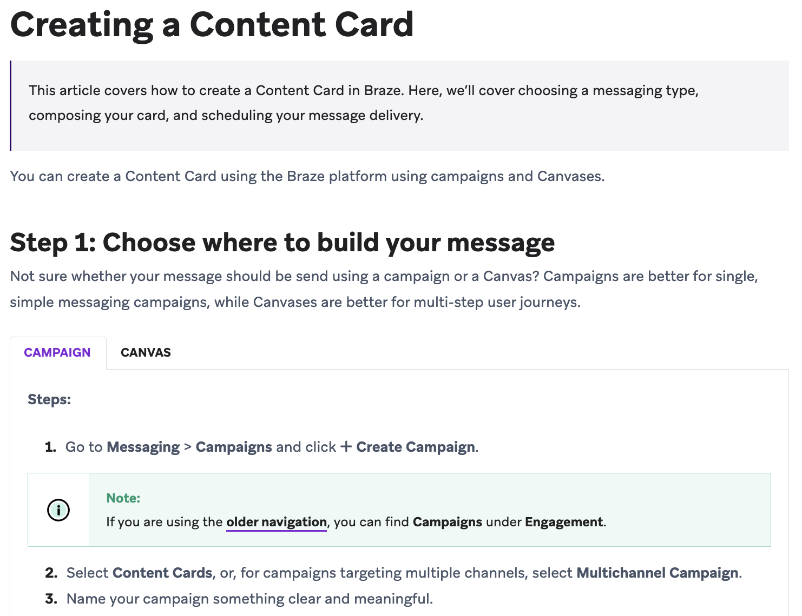
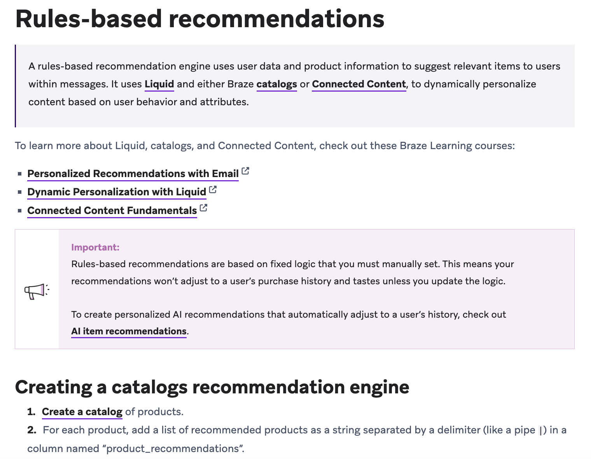
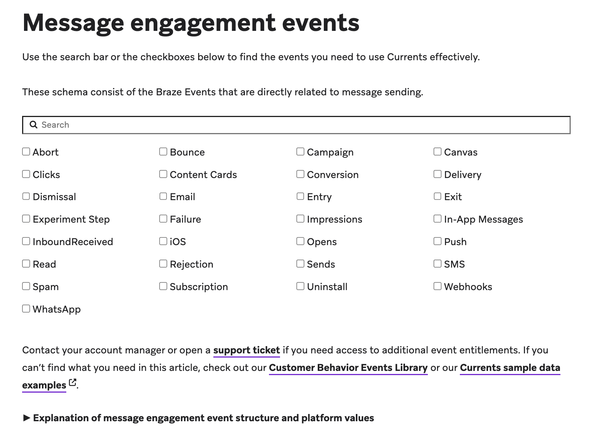
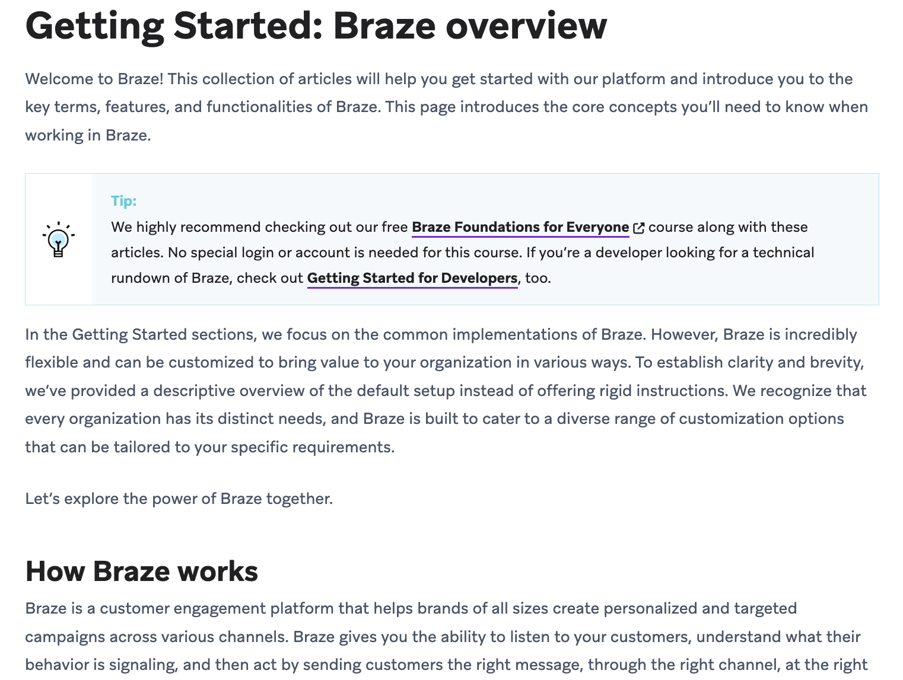

# Content types

> Braze Docs follows the [Diátaxis framework](https://diataxis.fr/), which organizes pages into one of four content types, each one meeting a different learning objective. While a single page on Braze Docs may contain multiple content types, each type should get a dedicated section on the page.

These are the content types you'll find on Braze Docs:

| Documentation type | Purpose |
| --- | --- |
| [How-to guides](#how-to-guides) | Help the user **apply knowledge**. |
| [Tutorials](#tutorials) | Help the user **acquire knowledge**. |
| [References](#references) | Provide the user with **technical knowledge**. |
| [Explanations](#explanations) | Broaden the user’s **contextual knowledge**. |
| [Release notes](#release-notes) | Inform the user about product updates. |

## Using templates

Each content type has a dedicated template you can use to create [pages](content_management/pages.md) or [sections](content_management/sections.md) on Braze Docs.

Read HTML comments like the following to learn more about each section in a template:

```markdown
<!-- Here's an HTML comment! -->
```

> [!IMPORTANT]
> You can keep these comments in your file while writing, but you'll need to remove them before publishing.


## Content types

### How-to guides

There are two kinds of how-tos: generic and technology partner. Only use the technology partner template when adding new content to [Technology Partners](https://www.braze.com/docs/partners/home).

### Generic

How-to guides are action-based, chronological steps that show users how to complete a specific task. For an example, see [Creating a Content Card](https://www.braze.com/docs/user_guide/message_building_by_channel/content_cards/create/).

File in GitHub: [`how_to_guide.md`](../../_includes/contributing/templates/how_to_guide.md)

---

### Technology partner

File in GitHub: [`technology_partner.md`](../../_includes/contributing/templates/technology_partner.md)


#### Guidelines

- Cover only what the user needs to know to take action. 
- Only cover the best or recommended way to complete the task. Do not document alternative methods.
- Only include [reference material](#references) that's vital to the end-user's goal, such as a list of options a user can select during a step.
- Link out to references that are longer than reasonable to include in the same article, such as [Segmentation filters](https://www.braze.com/docs/user_guide/engagement_tools/segments/segmentation_filters/).
- Avoid providing troubleshooting steps. Instead, you can include this information in a another section on this page or a separate article.

#### Header syntax

H2 headers (`##` in Markdown) should be action-oriented and reflect the general goal for this step. If there's any optional steps, prepend `(Optional)` to the header. For example:
```
## Creating a page

1. Open the relevant directory in `braze-docs`.
2. Create a new Markdown file for your page.
3. Use a filename that follows our [naming guidelines](#naming-guidelines).
4. (Optional) You can generate a preview by running `rake` in your terminal.
```
For long or complicated steps, use nested headers to group related steps. If there's any optional steps, append `(optional)` to the header. For example:
``````markdown
## Creating a page

### Step 1: Create a new file

Open the relevant directory, then create a new Markdown file for your page.

```plaintext
PAGE_TITLE.md
```

### Step 2: Add a template

Copy and paste one of the following templates into your Markdown file. For more information, see [Templates](content_types.md).

### Step 3: Generate a preview (optional)

To generate a preview, open your terminal and run the following command:

```bash
rake
```
``````
### Tutorials

There are two kinds of tutorials: use cases and generic. In most scenarios, you'll want to write a use case.

### Use cases

Use cases are a type of tutorial that provides a learning experience through practical, hands-on activities without overloading readers with background theory—unlike generic tutorials which may use hypothetical scenarios to illustrate some functionality. What makes use cases special is their ability to illustrate the _real-world value_ that Braze offers marketers.

File in GitHub: [`use_case.md`](../../_includes/contributing/templates/use_case.md)

#### Guidelines

- Create a hypothetical but real-world scenario using an imaginary brand
- Highlight the value that a feature brings to a different industry: eCommerce, finance, gaming, finance, and others.
- Show a practical example of how Braze is commonly used: add to cart, add to wishlist, saved song, created playlist, loyalty program, submitted feedback, and similar.
- Create a step-by-step activity for the user to roleplay
- Make it clear that the use case is a fictional scenario; users should not actually follow these steps with real data.

##### Header syntax

The title header should be prepended with `Use case:` and describe the way Braze is being used in the recipe. For example, "Use case: Abandoned cart." 

Each use of the words "Use case" in a header should have a description following it.

---

### Generic

Generic tutorials are learning-oriented practical lessons. They focus on what the user learns, such as becoming familiar with terminology, how things interact, how to use commands, and similar. For an example, see [Rules-based recommendations](https://www.braze.com/docs/user_guide/brazeai/recommendations/rules_based_recommendations/):

File in GitHub: [`tutorial.md`](../../_includes/contributing/templates/tutorial.md)

#### Guidelines

- Create a guided step-by-step activity or scenario for the user to follow or roleplay. 
- Assume that the user has little to no familiarity with the platforms, tools, or workflows used during the activity.

> [!TIP]
> Provide ready-made assets for the user to input that aren't the key focus of your tutorial. For example, you could provide photos, messaging, and Liquid coding for a tutorial that teaches users how to use a variety of features when creating a campaign.


#### Header syntax

The title header should be prepended with `Tutorial:` and generally describe what the user will do or create. For example, "Tutorial: Your first contribution".


### References

References are information-oriented content. They focus on providing the user with objective, authoritative, and technical knowledge. For an example, see [Message engagement events](https://www.braze.com/docs/user_guide/data/braze_currents/event_glossary/message_engagement_events/) (events glossary).

File in GitHub: [`reference.md`](../../_includes/contributing/templates/reference.md)

#### Guidelines

- Create technical descriptions or information that are necessary to complete a task.
- Organize the information alphabetically, categorically, or hierarchically.
- Put references in their respective articles unless they're longer than seems appropriate for a single article or will be referenced by multiple articles. 
    - If they're only referenced by a single how-to guide and long enough to disrupt the flow of the steps, you can [make them collapsible](https://www.braze.com/docs/hidden/styling_examples#collapsible-content).

##### Header syntax

Topmost should be nouns. For example, [Editor blocks](https://www.braze.com/docs/user_guide/message_building_by_channel/email/drag_and_drop/dnd_editor_blocks/) has the following names for its references:

### Explanations

Explanations are understanding-oriented content. They focus on improving the user’s conceptual understanding. For an example, see [Getting started: Braze overview](https://www.braze.com/docs/user_guide/getting_started/overview/).

### Explanation template

File in GitHub: [`explanation.md`](../../_includes/contributing/templates/explanation.md)


#### Guidelines

- Create textual or visual descriptions of concepts, such as how data travels between features, third-party partners, tools, and similar.
- Discuss how features and techniques can benefit users.
- Place explanations in the most relevant article. For example, a basic feature article might have an explanation called "How it works" that describes that feature's workflow. 
- Consider placing explanations that are too broad to fit into only one article onto a landing page for a general topic, such as [Campaigns](https://www.braze.com/docs/user_guide/engagement_tools/campaigns).

> [!TIP]
> Even though explanations aren't telling users what to do to achieve a specific outcome, you can broadly describe chronological steps to achieve a general goal (such as using A/B testing to improve your messaging). Don't go into the same detail you would for a [how-to guide](#how-to-guides) or [tutorial](#tutorials).


##### Header syntax

H1 headers (`#` in Markdown) are formatted as `About TOPIC_NAME`. If the explanation is a subsection on a page of a different content type, you can tweak the syntax as long as it implies **Explanation** rather than **How-to**. Here are some examples:

- `About TOPIC_NAME`
- `TOPIC_NAME overview`
- `How TOPIC works`
- `How TOPIC is handled`
- `What does Braze check?`

### Release notes

Release notes are a monthly compilation of product updates in Braze. Each update is placed under one of the following categories:

| Category               | Description                                                             |
|------------------------|-------------------------------------------------------------------------|
| Data flexibility       | Updates on improving data structuring, storage, and access.             |
| Unlocking creativity   | Features that enhance user creativity within the platform.              |
| Robust channels        | Updates on the reliability and scalability of communication channels.   |
| AI and ML automation   | Updates on AI and machine learning capabilities within the platform.                  |
| New Braze partnerships | Introduces new integrations with other platforms and services.          |
| SDK updates            | Lists new SDKs or updates, including breaking changes and new features. |


You can use this template to create release notes for Braze Docs. For an example, see [January 9, 2024 release](https://www.braze.com/docs/help/release_notes/2024/1_9_24/).

### Release note template

File in GitHub: [`release_notes.md`](../../_includes/contributing/templates/release_notes.md)


