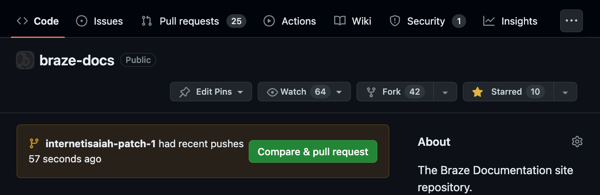
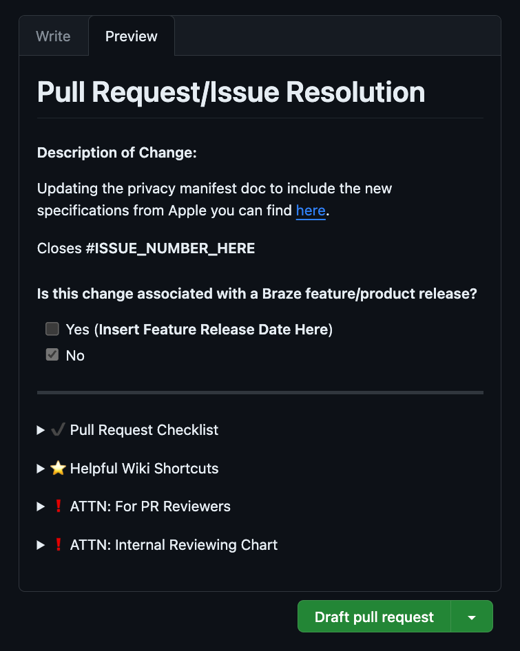
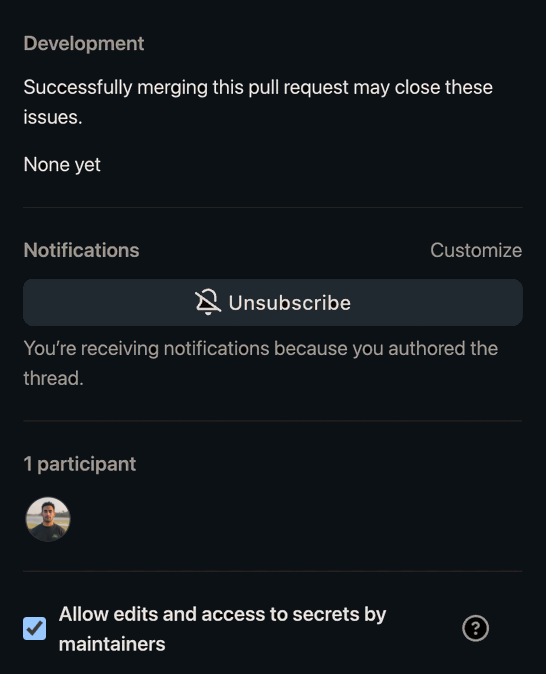
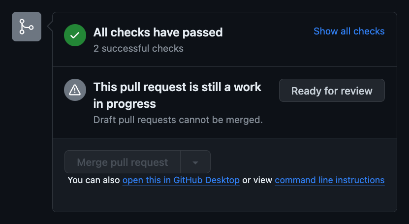
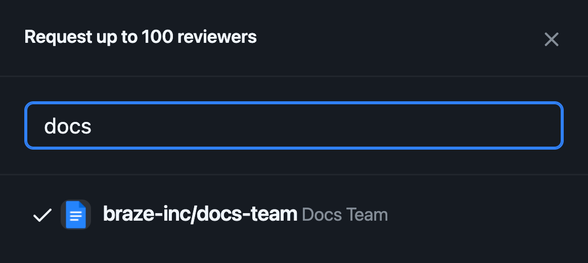

# Git and GitHub

> Learn how to use Git and GitHub, so you can contribute to Braze Docs.

> **Tip:**
> If you're new to Git or the command-line, start with our tutorial instead: [Your first contribution](your_first_contribution.md).


## Prerequisites

<!-- If you haven't already, review [Documentation feedback](https://www.braze.com/docs/feedback/) for how to reach the docs team. Full authoring guides for contributors with repository access live under `docs/contributing/` in the braze-docs repo. -->


## Getting the latest changes {#latest}

To update your local environment with the latest changes from the [Braze Docs repository](https://github.com/braze-inc/braze-docs), pull the `develop` branch.

```bash
git checkout develop
git pull
```

## Creating a branch {#create-branch}

To create a new branch, use Git's `checkout` command with the `-b` flag.

```bash
git checkout -b BRANCH_NAME
```

Replace `BRANCH_NAME` with a short, non-space-separated description of your branch's changes. Your output should be similar to the following:

```bash
$ git checkout -b fixing-typo-in-metadata
Switched to a new branch 'fixing-typo-in-metadata'
```

## Creating a pull request {#create-pr}

To create a pull request (PR) for the [branch you created previously](#create-branch), add your changes and stage a commit. Replace `COMMIT_MESSAGE` with a short sentence describing your changes.

```bash
git add --all
git commit -m "COMMIT_MESSAGE"
```

Your output should be similar to the following:

```bash
$ git commit -m "Fixing a typo in the recommended software doc
[fixing-typo-in-recommended-software 8b05e34] Fixing a typo in the metadata doc.
 1 file changed, 1 insertion(+), 1 deletion(-)
```

Push your changes to the Braze Docs repository. Replace `BRANCH_NAME` with the name of your branch.

```bash
git push -u origin BRANCH_NAME
```

The output is similar to the following:

```bash
$ git push -u origin fixing-typo-in-recommended-software
Enumerating objects: 14, done.
...
To github.com:braze-inc/braze-docs.git
 * [new branch]      fixing-typo-in-recommended-software -> fixing-typo-in-recommended-software
branch 'fixing-typo-in-recommended-software' set up to track 'origin/fixing-typo-in-recommended-software'.
```

Go to the [Braze Docs GitHub repository](https://github.com/braze-inc/braze-docs), then select **Compare & pull request**.



In the PR description, you'll see Markdown comments similar to the following. Use these comments to help fill out your PR.

```markdown
<!-- This is a Markdown comment. -->
```

When you're finished, select the pull request dropdown, then select **Draft pull request**.

## Allowing changes to pull requests {#allow-changes}

In GitHub, go to the [PR you previously created](#create-pr), then check **Allow edits and access to secrets from maintainers**. This will let the Braze Docs team make style or formatting changes to your content.

## Requesting a review {#request-review}

To request a PR review from a member of the Braze Docs team, go to the [PR you previously created](#create-pr) and select **Ready for review**.

Select **Reviewers**, then type `braze-inc/docs-team` and select the team name. Press <kbd>Esc</kbd> or click out of the dropdown to confirm your selection.

If the Braze Docs team requests additional changes after their review, you'll be notified per your [GitHub notification settings](https://docs.github.com/en/account-and-profile/managing-subscriptions-and-notifications-on-github/setting-up-notifications/configuring-notifications). If no changes are required, the team will approve and merge your changes.

Approved contributions will be deployed on the following Tuesday or Thursday.
