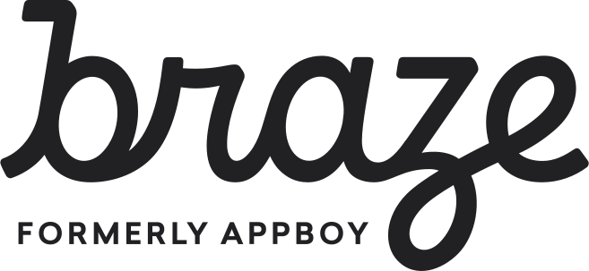
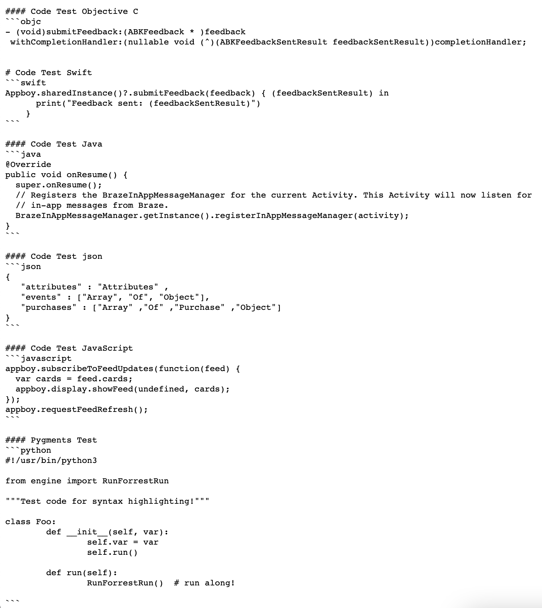

# Styling examples

This is how pages are styled on Braze Docs, including headers, tabs, codeblocks, and more.

## Header Test

### Styling

# H1 Banner
H1 Text

Lorem ipsum dolor sit amet, consectetur adipiscing elit. Sed nec tortor at lectus tempus tempor. Suspendisse tellus diam, finibus eu dictum non, varius et ipsum.

## H2 Banner
H2 Text

Lorem ipsum dolor sit amet, consectetur adipiscing elit. Sed nec tortor at lectus tempus tempor. Suspendisse tellus diam, finibus eu dictum non, varius et ipsum.

### H3 Banner
H3 Text

Lorem ipsum dolor sit amet, consectetur adipiscing elit. Sed nec tortor at lectus tempus tempor. Suspendisse tellus diam, finibus eu dictum non, varius et ipsum.

#### H4 Banner
H4 Text

Lorem ipsum dolor sit amet, consectetur adipiscing elit. Sed nec tortor at lectus tempus tempor. Suspendisse tellus diam, finibus eu dictum non, varius et ipsum.

##### H5 Banner
H5 Text

Lorem ipsum dolor sit amet, consectetur adipiscing elit. Sed nec tortor at lectus tempus tempor. Suspendisse tellus diam, finibus eu dictum non, varius et ipsum.

###### H6 Banner
H6 Text

Lorem ipsum dolor sit amet, consectetur adipiscing elit. Sed nec tortor at lectus tempus tempor. Suspendisse tellus diam, finibus eu dictum non, varius et ipsum.

---

### Markdown

```
# H1 Banner

## H2 Banner

### H3 Banner

#### H4 Banner

##### H5 Banner

###### H6 Banner
```


## Custom Header Anchor

To add an anchor to a heading, add the following code to the end of the line that the heading is on. Replace `anchor-text` with the anchor for this heading. Use lowercase letters and put hyphens between words.

```
# Heading Text {#anchor-text}
```

You can link to headings with custom anchors by creating a standard link with a number sign `#` followed by the custom anchor.
```
Here is my [link](#anchor-text)
```
## Font Test

### Styling

Normal Text

*Emphasize Text*

**Bold**

_**Bold Emphasize**_

~~Strikethrough~~

---

### Markdown

```
Normal Text

*Emphasize Text*

**Bold**

_**Bold Emphasize**_

~~Strikethrough~~
```


## Quote Test

### Styling

> Quoted Text

#### Inline Quote
Lorem ipsum dolor ``sit amet, consectetur adipiscing elit``. Sed nec tortor at lectus tempus tempor.

#### Quote Chunk
```
Lorem ipsum dolor sit amet, consectetur adipiscing elit. Sed nec tortor at lectus tempus tempor.
```

---

### Markdown

```
> Quoted Text

Lorem ipsum dolor ``sit amet, consectetur adipiscing elit``. Sed nec tortor at lectus tempus tempor.

``` Lorem ipsum dolor sit amet, consectetur adipiscing elit. Sed nec tortor at lectus tempus tempor. ```
```


## Table Test

### Styling

| Instance | Dashboard URL                                                         | REST Endpoint                   |
| -------- | --------------------------------------------------------------------- | ------------------------------- |
| US-01    | `https://dashboard.braze.com` or<br> `https://dashboard-01.braze.com` | `https://rest.iad-01.braze.com` |
| US-02    | `https://dashboard-02.braze.com`                                      | `https://rest.iad-02.braze.com` |
| US-03    | `https://dashboard-03.braze.com`                                      | `https://rest.iad-03.braze.com` |
| US-04    | `https://dashboard-04.braze.com`                                      | `https://rest.iad-04.braze.com` |
| US-05    | `https://dashboard-05.braze.com`                                      | `https://rest.iad-05.braze.com` |
| US-06    | `https://dashboard-06.braze.com`                                      | `https://rest.iad-06.braze.com` |
| US-07    | `https://dashboard-07.braze.com`                                      | `https://rest.iad-07.braze.com` |
| US-08    | `https://dashboard-08.braze.com`                                      | `https://rest.iad-08.braze.com` |
| EU-01    | `https://dashboard.braze.eu` or<br> `https://dashboard-01.braze.eu`   | `https://rest.fra-01.braze.eu`  |
| AU-01    | `https://dashboard.au-01.braze.com/`                                  | `https://rest.au-01.braze.com` |


---

### Markdown

```
| Instance | Dashboard URL                                                         | REST Endpoint                   |
|----------|-----------------------------------------------------------------------|---------------------------------|
| US-01    | `https://dashboard.braze.com` or<br> `https://dashboard-01.braze.com` | `https://rest.iad-01.braze.com` |
| US-02    | `https://dashboard-02.braze.com`                                      | `https://rest.iad-02.braze.com` |
| US-03    | `https://dashboard-03.braze.com`                                      | `https://rest.iad-03.braze.com` |
| US-04    | `https://dashboard-04.braze.com`                                      | `https://rest.iad-04.braze.com` |
| US-05    | `https://dashboard-05.braze.com`                                      | `https://rest.iad-05.braze.com` |
| US-06    | `https://dashboard-06.braze.com`                                      | `https://rest.iad-06.braze.com` |
| US-07    | `https://dashboard-07.braze.com`                                      | `https://rest.iad-07.braze.com` |
| US-08    | `https://dashboard-08.braze.com`                                      | `https://rest.iad-08.braze.com` |
| EU-01    | `https://dashboard.braze.eu` or<br> `https://dashboard-01.braze.eu`   | `https://rest.fra-01.braze.eu`  |
| EU-02    | `https://dashboard-02.braze.eu`                                       | `https://rest.fra-02.braze.eu`  |
| AU-01    | `https://dashboard.au-01.braze.com/`                                  | `https://rest.au-01.braze.com` |

```


#### Resetting Table word-break by column

To reset the table word-break by column, use the following syntax:

```markdown

```

Replace `NUM` with the corresponding column number, up to a maximum of 4 columns. If you have less than 4 columns, remove extra `.reset-td-br-NUM` placeholders. Your table should be similar to the following:

```markdown
| Event Name                                                       | Feed Type              | Description                                                  | Custom Attributes                                                             |
| ---------------------------------------------------------------- | ---------------------- | ------------------------------------------------------------ | ----------------------------------------------------------------------------- |
| UNBROKENWORDTHATISVERYLONGUNBROKENWORDTHATISVERYLONG             | Unbound Feed           | An email was successfully delivered to a User's mail server. | `campaign_id`, `canvas_step_id`, `canvas_id`, `canvas_variation_id`           |
| `UNBROKENHIGHLIGHTTHATISVERYLONGUNBROKENHIGHLIGHTTHATISVERYLONG` | Unbound Feed           | User opened an email.                                        | `campaign_id`, `canvas_step_id`, `canvas_id`, `canvas_variation_id`           |
| In-App Message Impression                                        | Platform-specific Feed | User viewed an In-App Message.                               | `app_id`, `campaign_id`, `canvas_step_id`, `canvas_id`, `canvas_variation_id` |


```
### Before

| Event Name                                                       | Feed Type              | Description                                                  | Custom Attributes                                                             |
| ---------------------------------------------------------------- | ---------------------- | ------------------------------------------------------------ | ----------------------------------------------------------------------------- |
| UNBROKENWORDTHATISVERYLONGUNBROKENWORDTHATISVERYLONG             | Unbound Feed           | An email was successfully delivered to a User's mail server. | `campaign_id`, `canvas_step_id`, `canvas_id`, `canvas_variation_id`           |
| `UNBROKENHIGHLIGHTTHATISVERYLONGUNBROKENHIGHLIGHTTHATISVERYLONG` | Unbound Feed           | User opened an email.                                        | `campaign_id`, `canvas_step_id`, `canvas_id`, `canvas_variation_id`           |
| In-App-Message-Impression                                        | Platform-specific Feed | User viewed an In-App Message.                               | `app_id`, `campaign_id`, `canvas_step_id`, `canvas_id`, `canvas_variation_id` |

---

### After

| Event Name                                                       | Feed Type              | Description                                                  | Custom Attributes                                                             |
| ---------------------------------------------------------------- | ---------------------- | ------------------------------------------------------------ | ----------------------------------------------------------------------------- |
| UNBROKENWORDTHATISVERYLONGUNBROKENWORDTHATISVERYLONG             | Unbound Feed           | An email was successfully delivered to a User's mail server. | `campaign_id`, `canvas_step_id`, `canvas_id`, `canvas_variation_id`           |
| `UNBROKENHIGHLIGHTTHATISVERYLONGUNBROKENHIGHLIGHTTHATISVERYLONG` | Unbound Feed           | User opened an email.                                        | `campaign_id`, `canvas_step_id`, `canvas_id`, `canvas_variation_id`           |
| In-App-Message-Impression                                        | Platform-specific Feed | User viewed an In-App Message.                               | `app_id`, `campaign_id`, `canvas_step_id`, `canvas_id`, `canvas_variation_id` |


## Link Test
### Styling

Link here: [Braze.com](https://www.braze.com)---

### Markdown

```
[Braze.com](https://www.braze.com)
```


## Image Test
### Styling

Image: #### Linked Image Test

Linked image: [](https://www.braze.com)

#### Image Styling

#### Anchoring Images

<br><br><br><br><br>

---

### Markdown

```
[](https://www.braze.com)

```


## Gallery Test
### Styling


https://www.braze.com/docs/assets/img_archive/EBTH_Email.png?bf892368baf287cba5ab9a6e3b09431d <br> This is a [link](https://www.braze.com).
https://www.braze.com/docs/assets/img_archive/iHeartRadio_Email.png?ecd2c8fe148939b7de957fe85cd6317e <br> This is another `comment`.
https://www.braze.com/docs/assets/img_archive/Saucey_Email.png?b9768937a1cc12d4c08e55a52e700d68 <br> This is yet another **comment**.
https://www.braze.com/docs/assets/img/schellman_iso27001_seal_grey_CMYK_300dpi_jpg.png?1b1fb9dbb80b0332c62512dcf9c83258 <br> **IMAGE TITLE** <br> This is a test to see if it will line break.
https://www.braze.com/docs/assets/img/SOC2.png?6338040be8e98c4c9abe1f35b3e43e3a <br> This is a regular comment.


---

### Markdown
```

https://www.braze.com/docs/assets/img_archive/EBTH_Email.png?bf892368baf287cba5ab9a6e3b09431d  <br> This is a [link](https://www.braze.com).
https://www.braze.com/docs/assets/img_archive/iHeartRadio_Email.png?ecd2c8fe148939b7de957fe85cd6317e  <br> This is another `comment`.
https://www.braze.com/docs/assets/img_archive/Saucey_Email.png?b9768937a1cc12d4c08e55a52e700d68  <br> This is yet another **comment**.
https://www.braze.com/docs/assets/img/schellman_iso27001_seal_grey_CMYK_300dpi_jpg.png?1b1fb9dbb80b0332c62512dcf9c83258 <br> **IMAGE TITLE** <br> This is a test to see if it will line break.
https://www.braze.com/docs/assets/img/SOC2.png?6338040be8e98c4c9abe1f35b3e43e3a  <br> This is a regular comment.

```
## Interactive Image Test
### Styling

<div class="iactiveImg" data-ii="6967"></div><script src="https://interactive-img.com/js/include.js"></script>

---

### Markdown

```
<div class="iactiveImg" data-ii="6967"></div><script src="https://interactive-img.com/js/include.js"></script>
```


<!--- Leaving formatting here just in case it's important...
<div style="position: relative; padding-bottom: 83%; padding-top: 0; height: 0;"><iframe style="position: absolute; top: 0; left: 0; width: 100%; height: 100%; border-width:0px; max-width:100%; overflow-y:auto;" width="100%" height="100%" src="https://interactive-img.com/view?id=6967&iframe=true"></iframe></div>
-->

## Code Snippet Test

### Styling

#### Code Test Objective C
```objc
- (void)submitFeedback:(ABKFeedback * )feedback
 withCompletionHandler:(nullable void (^)(ABKFeedbackSentResult feedbackSentResult))completionHandler;
```

#### Code Test Swift
```swift
Appboy.sharedInstance()?.submitFeedback(feedback) { (feedbackSentResult) in
      print("Feedback sent: (feedbackSentResult)")
    }
```

#### Code Test Java
```java
@Override
public void onResume() {
  super.onResume();
  // Registers the BrazeInAppMessageManager for the current Activity. This Activity will now listen for
  // in-app messages from Braze.
  BrazeInAppMessageManager.getInstance().registerInAppMessageManager(activity);
}
```

#### Code Test json
```json
{
   "attributes" : "Attributes" ,
   "events" : ["Array", "Of", "Object"],
   "purchases" : ["Array" ,"Of" ,"Purchase" ,"Object"]
}
```

#### Code Test JavaScript
```javascript
braze.subscribeToFeedUpdates(function(feed) {
  var cards = feed.cards;
  braze.showFeed(undefined, cards);
});
braze.requestFeedRefresh();
```

#### Pygments Test
```python
#!/usr/bin/python3

from engine import RunForrestRun

"""Test code for syntax highlighting!"""

class Foo:
	def __init__(self, var):
		self.var = var
		self.run()

	def run(self):
		RunForrestRun()  # run along!

```

---

### Markdown




## Alert Test

### Styling

> **Tip:**
> This is a tip


> **Note:**
> This is a note


> **Important:**
> This is a important alert


> **Warning:**
> This is a warning


This is an update

---

### Markdown
```
> **Tip:**
> This is a tip


> **Note:**
> This is a note


> **Important:**
> This is a important alert


> **Warning:**
> This is a warning



This is a update

```
## Embedded Video Test
### Styling

#### Embedded Video/YouTube
Defaults to YouTube embedded.


#### Embedded Video/Wistia
Embeds a Wistia video.


#### Embedded Video Right Align


Lorem ipsum dolor sit amet, consectetur adipiscing elit. Sed nec tortor at lectus tempus tempor. Suspendisse tellus diam, finibus eu dictum non, varius et ipsum. Lorem ipsum dolor sit amet, consectetur adipiscing elit. Sed nec tortor at lectus tempus tempor. Suspendisse tellus diam, finibus eu dictum non, varius et ipsum. Lorem ipsum dolor sit amet, consectetur adipiscing elit. Sed nec tortor at lectus tempus tempor. Suspendisse tellus diam, finibus eu dictum non, varius et ipsum.

#### Embedded Video Left Align


Lorem ipsum dolor sit amet, consectetur adipiscing elit. Sed nec tortor at lectus tempus tempor. Suspendisse tellus diam, finibus eu dictum non, varius et ipsum. Lorem ipsum dolor sit amet, consectetur adipiscing elit. Sed nec tortor at lectus tempus tempor. Suspendisse tellus diam, finibus eu dictum non, varius et ipsum. Lorem ipsum dolor sit amet, consectetur adipiscing elit. Sed nec tortor at lectus tempus tempor. Suspendisse tellus diam, finibus eu dictum non, varius et ipsum.
<br /><br />

#### Loom Example
* use `source="loom"`


---

### Markdown

You'll need the YouTube ID to embed a YouTube video. It appears after `v=` in the URL. For example, `https://www.youtube.com/watch?v=VR1qn1OBP7k` has an ID of `VR1qn1OBP7k`.
```html

```
To align right or left, and limit the maximum width to 50% use the `align` parameter = `left` or `right`:
```html



```
Loom Example:
```html

```
#### Featured Video Layout with Status Placement for Higher Resolution

To use the featured video layout which places a static video on the left side for higher resolution display, add a `video_id` and a `video_type` (such as `youtube`) to the YAML header for the page. By default, `video_source` is set to `youtube`.
```yaml
layout: featured_video
video_id: [video_id]
video_source: youtube
```
## List Test
### Styling

#### Bullet

- List 1
  - Sub List 1
- List 2
  - Sub List 2a
    - Sub Sub List 2
- List 3

#### Numbered

1. List 1
   - Sub List 1
2. List 2
3. List 3
   - Sub List 3a
   - Sub List 3b
     - Sub Sub List 3
4. List 4
    1. Sub list 4a
        1. Sub Sub List 4
    2. Sub list 4b
        1. sub sub list 4

---

### Markdown

```
#### Bullet

- List 1
  - Sub List 1
- List 2
  - Sub List 2a
    - Sub Sub List 2
- List 3

#### Numbered

1. List 1
   - Sub List 1
2. List 2
3. List 3
   - Sub List 3a
   - Sub List 3b
     - Sub Sub List 3
4. List 4
    1. Sub list 4a
        1. Sub Sub List 4
    2. Sub list 4b
        1. sub sub list 4
```


## Collapsible Content Test {#collapsible-content}
### Styling


#### Look! A Hidden Code Block!

```python
print("hello world!")
```


---

### Markdown
```liquid

...

```
## Tab Test

#### Custom Tabs

### OBJECTIVE-C

Add the following line of code to your `AppDelegate.m` file:

```objc
#import "Appboy-iOS-SDK/AppboyKit.h"#import <AppboyTVOSKit/AppboyKit.h>
```

Within your `AppDelegate.m` file, add the following snippet within your `application:didFinishLaunchingWithOptions` method:

```objc
[Appboy startWithApiKey:@"YOUR-API-KEY"
         inApplication:application
     withLaunchOptions:launchOptions];
```

---

### Swift

If you are integrating the Braze SDK with CocoaPods or Carthage, add the following line of code to your `AppDelegate.swift` file:

```swift
#import Appboy_iOS_SDK#import AppboyTVOSKit
```

For more information about using Objective-C code in Swift projects, see the [Apple Developer Docs][apple_initial_setup_19].

In `AppDelegate.swift`, add following snippet to your `application(application: UIApplication, didFinishLaunchingWithOptions launchOptions: [NSObject: AnyObject]?) -> Bool`:

```swift
Appboy.start(withApiKey: "YOUR-API-KEY", in:application, withLaunchOptions:launchOptions)
```


#### Usage
Enclose **tabs** in a `` and ``
Enclose individual **tab** with the Liquid code and name of the tab `` and ``
> **Important:**
> Note number of tabs on the page should be consistent, otherwise tab content might be hidden.
>  For example, if one set of tabs has `C++`,`C-Sharp` and `JS`, and another set of tabs has `C-Sharp` and `JS`,
> then when somebody clicks on `C++`, the other section will show nothing. See the following local tabs option for a workaround.
```liquid
### Objective-C

Content of objective-c

---

### Swift

Content of swift


```
#### Local Tabs
For self-contained tabs, such as tabs that only change the tab content for the specific section, then use the local parameter in the parent tabs block.
```liquid

...

```
#### Subtabs
For tabs within tabs, `subtabs` and `subtab` can be used. Default setting is `local`.
For global `subtabs`, use the `global` option: ``

### Tab 1

tab content 1


Subtab 1a content


Subtab 2a content



---

### Tab 2

tab content 2


Subtab 1a content


Subtab 2a content




##### Markdown
```
### Tab 1

tab content 1


Subtab 1a content


Subtab 2a content



---

### Tab 2

tab content 2


Subtab 1a content


Subtab 2a content




```
[1]: ../../assets/img_archive/code_snippet.png
