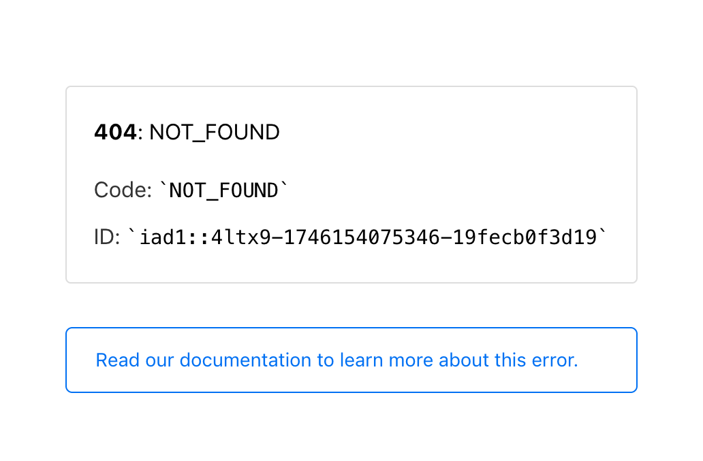
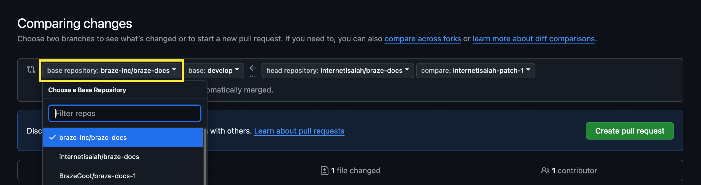
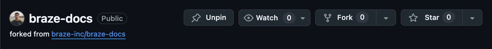
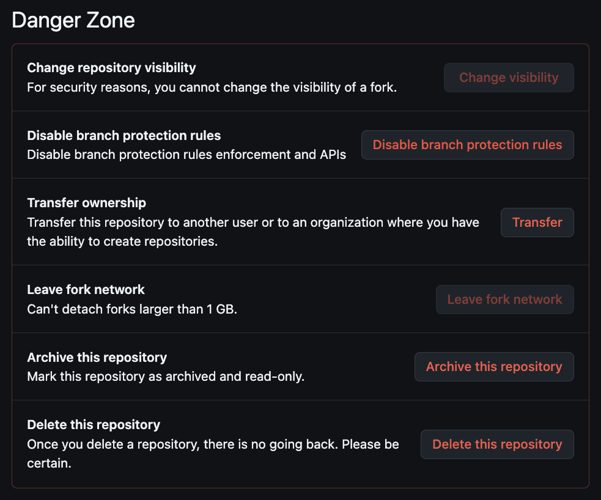
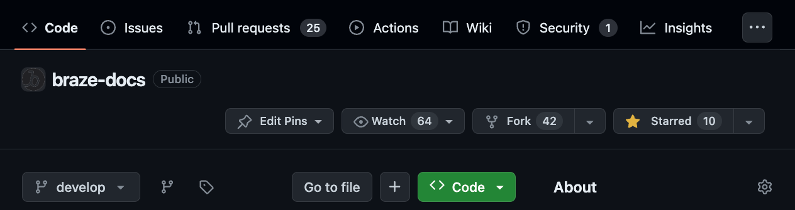
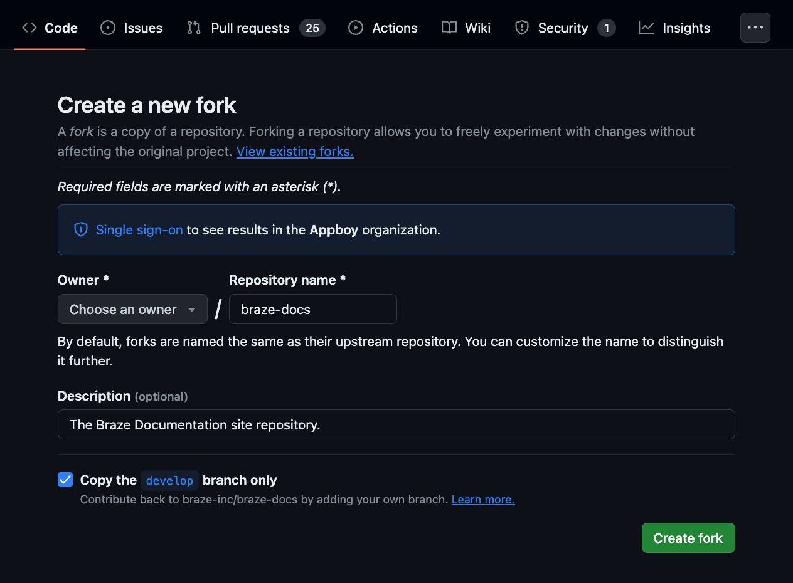

# Troubleshooting

> If you're having trouble contributing to Braze Docs, review these common issues first. If the issue you're experiencing isn't listed, [let us know](https://github.com/braze-inc/braze-docs/issues/new?assignees=&labels=issue&projects=&template=report_an_issue.md&title=) so we can add it here.

## Redirect isn't working

If a [redirect you set up](https://github.com/braze-inc/braze-docs/blob/develop/docs/contributing/content_management/redirecting_urls.md) in the global redirect file (`assets/js/broken_redirect_list.js`) isn't working, double-check your URL string for any uppercase characters. If you find any, convert them to lowercase (even if the corresponding filename in the `_docs` directory contains uppercase characters).

**Before (incorrect — uppercase in URL string):**

```javascript
validurls['/docs/hidden/WIP_Partnerships/WIP_Guidelines'] = '/docs/feedback/';
```

**After (correct — lowercase URL string):**

```javascript
validurls['/docs/hidden/wip_partnerships/wip_guidelines'] = '/docs/feedback/';
```

## Preview deployment returns a 404

If your [GitHub preview deployment](generating_a_preview.md) builds successfully but returns a 404 response, there may be an issue with an image or Liquid tag in your Markdown file.



To fix this issue, review each image and Liquid tag in your file.

### Image references

Verify that each image reference follows our [image reference syntax](content_management/images.md). For example:

````markdown

````

Each image reference must use the exact path and filename for that image. For example:

```bash
braze-docs
└── assets
    └── img
        └── contributing 
            └── github_homepage.png
```

### Opening and closing tags

Check that there is no mismatch between your opening and closing tags. For example, `` `` `` tags need the same number of opening and closing tags:

```plaintext
                # Opening tag for tab group.
         # Opening tag for tab one.
Content for tab one.
              # Closing tag for tab one.

         # Opening tag for tab two.
Content for tab two.
              # Closing tag for tab two.
             # Closing tag for tab group.
```

> **Tip:**
> For more Liquid tag examples, see [Styling examples](styling_examples.md).

### Raw tags

If you are documenting actual Liquid code in your Markdown file, ensure each code block is surrounded in [Liquid raw tags](https://shopify.dev/docs/api/liquid/tags/raw).

In `_docs` and other Jekyll-built pages, wrap example Liquid in `` … `` so the build does not evaluate it. For HTML-encoded examples used on the live docs site, see the source of this page in Git history or `_includes` patterns.

## Cross-reference link returns a 404

If a [cross-reference link](content_management/cross_referencing.md) on your page (such as `[Braze Developer Guide](https://www.braze.com/docs/developer_guide/home)` with a mistaken path) returns a 404 page, check the URL for the following string.

```plaintext
%7B%7Bsite.baseurl%7D%7D
```

A URL containing this string will be similar to the following:

```plaintext
https://www.braze.com/docs/user_guide/personalization_and_dynamic_content/connected_content/%7B%7Bsite.baseurl%7D%7D/user_guide/administrative/app_settings/message_activity_log_tab
```

If you find this string in the URL, one or more of your cross-reference links are surrounded in [Liquid raw tags](https://shopify.dev/docs/api/liquid/tags/raw).

### Liquid raw tag

<code>
&#123;% raw %} &#123;% endraw %}
</code>


Move these tags so that they're only surrounding the Liquid content you want to display as raw.

### before

<code>
&#123;% raw %} Learn how to use Liquid's <code>&#123;&#123; page_title }} tag. For more information, see [Liquid tags](&#123;&#123;site.baseurl}}/contributing/liquid/). &#123;% endraw %}
</code>

---

### after

<code>
Learn how to use Liquid's &#123;% raw %} &#123;&#123; page_title }} &#123;% endraw %} tag. For more information, see [Liquid tags](&#123;&#123;site.baseurl}}/contributing/liquid/).
</code>


## Conflict: Destination is shared by multiple files

If `rake` throws the following warning, this means that two or more files are sharing the same [`permalink` YAML value](yaml_front_matter/metadata.md#permalink).

```bash
Conflict: The following destination is shared by multiple files.
                    The written file may end up with unexpected contents.
                    /Users/USERNAME/braze-docs/_site/api_usage/index.html
                     - /Users/USERNAME/braze-docs/_docs/_developer_guide/platforms/android.md
                     - /Users/USERNAME/braze-docs/_docs/_developer_guide/platforms/firos.md
```

> **Note:**
> Although the warning appears after running `rake`, it's actually generated by Jekyll, our static-site generator. For more information, refer to [Jekyll GitHub: Issue #8522](https://github.com/jekyll/jekyll/issues/8522).


To fix this, change the `permalink` value of one of the files, so they're no longer set to the same URL. For example:

### Before

In `_docs/_developer_guide/platforms/android.md`:
```markdown
---
nav_title: Android
permalink: /docs/developer_guide/best_sdk
---

# The Android Braze SDK

> Get started with the Braze Android SDK!
```

In `_docs/_developer_guide/platforms/fireos.md`:
```markdown
---
nav_title: FireOS
permalink: /docs/developer_guide/best_sdk
---

# The FireOS Braze SDK

> Get started with the Braze Android SDK!
```

---

### After

In `_docs/_developer_guide/platforms/android.md`:
```markdown
---
nav_title: Android
permalink: /docs/developer_guide/best_sdk
---

# The Android Braze SDK

> Get started with the Braze Android SDK!
```

In `_docs/_developer_guide/platforms/fireos.md`:
```markdown
---
nav_title: FireOS
permalink: /docs/developer_guide/second_best_sdk
---

# The FireOS Braze SDK

> Get started with the Braze Android SDK!
```


## Can't choose `braze-inc/braze-docs` as a base repository {#missing-base-repository}

If `braze-inc/braze-docs` is missing from the list of available base branches when [making a change in GitHub](your_first_contribution.md#step-2-make-a-change), there may be an issue with the origin of your forked repository.



### Step 1: Verify the fork's origin

Go to [your forked repository](README.md#step-3-fork-the-repository) and verify it was forked from `braze-inc/braze-docs`. If it isn't, you'll need to delete this fork and create a new one.



### Step 2: Delete the old fork

> **Warning:**
> Deleted forks cannot be restored. Be sure to back up the work that's only accessible through your old fork.


In your old fork, go to **Settings** > **General**. Under **Danger Zone**, select **Delete this repository** and follow the on-screen instructions.



### Step 3: Create a new fork

Go back to the official [Braze Docs GitHub repository](https://github.com/braze-inc/braze-docs), then select **Fork** to create a new fork.



Keep the default settings, then select **Create fork**. Now you'll be able to choose `braze-inc/braze-docs` as the base repository when [making changes in GitHub](your_first_contribution.md#step-2-make-a-change).

