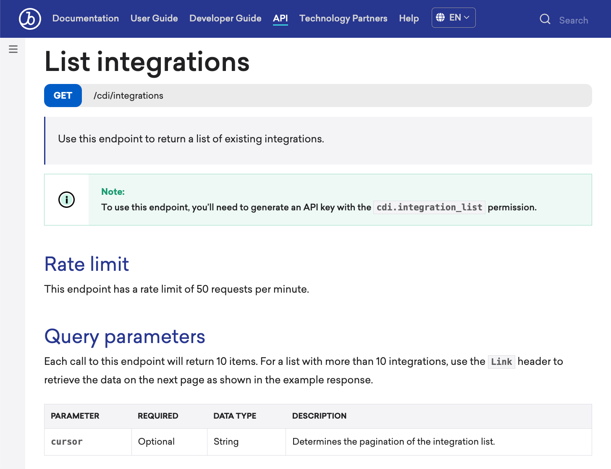
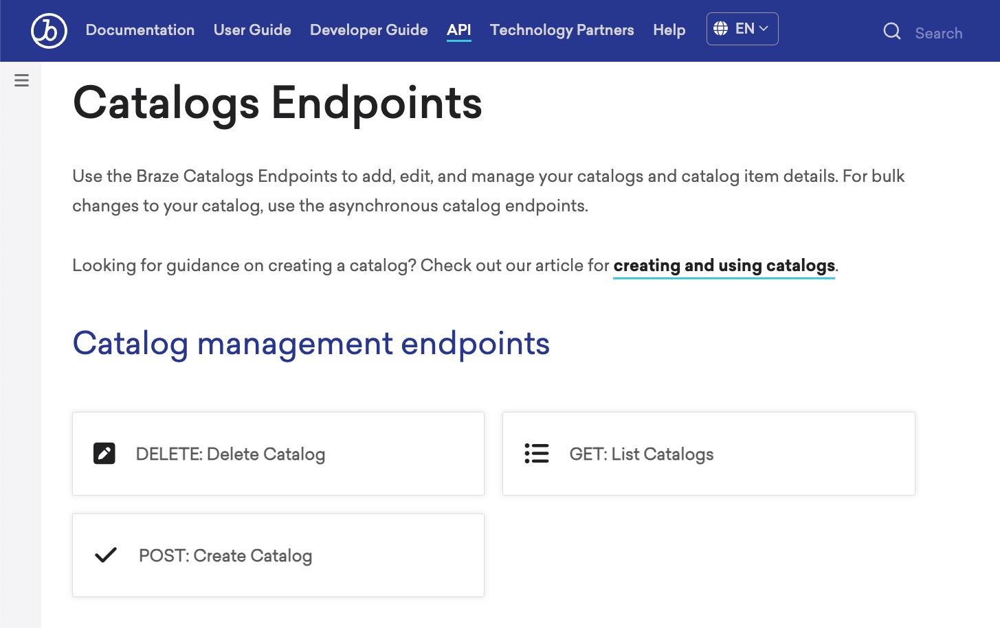
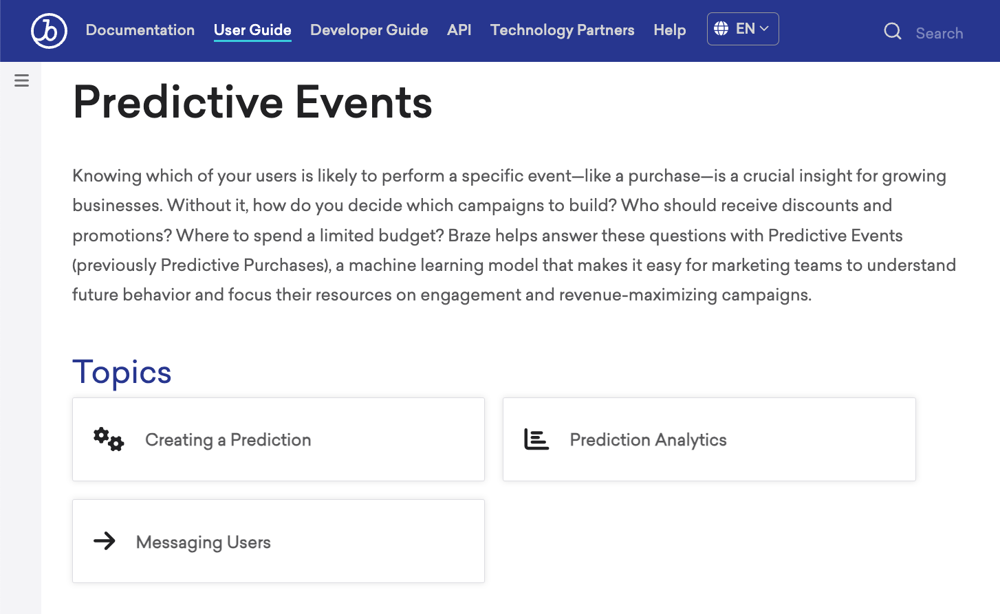
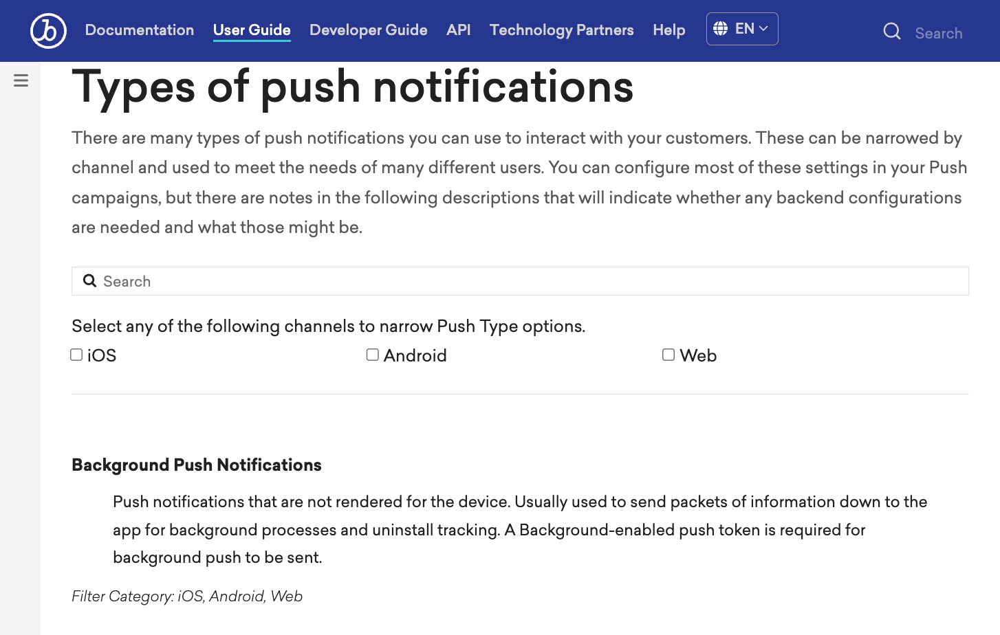
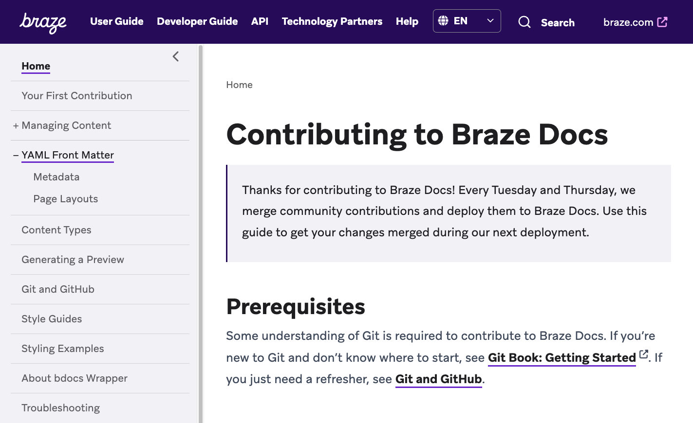

#  Page layouts

> These are the page layouts that can be assigned to the [`page_layout`](metadata.md#page-layout) key in a page's YAML front matter. Most `page_layout` keys will visually modify the page&#8212;however, some only modify how the page functions. For more general information, see [About content management](../content_management.md#layouts).

## Applying a layout

To apply a layout to your page, add the following line to your YAML front matter, then replace `PAGE_LAYOUT_VALUE` with one of the keys found on this page.

```markdown
---
page_layout: PAGE_LAYOUT_VALUE
---
```

## Visual layouts

### `api_page`

The `api_page` layout is used to apply the API page format. In the following example, this format is applied to the [List integrations](https://www.braze.com/docs/api/endpoints/cdi/get_integration_list/) page.

```markdown
---
layout: api_page
---
```

### example output




### `dev_guide`

The `dev_guide` layout is used to apply the developer guide format. In the following example, this format is applied to the [Catalogs Endpoints](https://www.braze.com/docs/api/endpoints/catalogs) page.

```markdown
---
layout: dev_guide
---
```

### example output




### `featured`

The `featured` layout is used to apply the featured page format. In the following example, this format is applied to the [Predictive Events](https://www.braze.com/docs/user_guide/brazeai/predictive_events/) page.

```markdown
---
layout: featured
---
```

### example output




### `glossary_page`

The `glossary_page` layout is used to apply the glossary page format. In the following example, this format is applied to the [Types of push notifications](https://www.braze.com/docs/user_guide/message_building_by_channel/push/types) page.

```markdown
---
layout: glossary_page
---
```

### example output




> **Tip:**
> In certain layouts, a value like `"guide_top_text:"` might benefit from having Markdown formatting. You can use Markdown formatting for certain YAML values. To do so, add `>` as the YAML value, and indent the text afterwards. For example:<br><br>
> <code>
> guide_top_text: ><br>
> &nbsp;&nbsp;&nbsp;&nbsp;# This is example Markdown formatting
> </code>


## Other layouts

### `blank_config`

Use the `blank_config` layout with [`config_only: true`](metadata.md#navigation-only) to prevent a page's content from displaying when its selected from the left-side navigation. This is helpful when you don't plan on adding content to a [subsection's](../content_management.md#subsections) landing page.

```markdown
---
layout: blank_config
config_only: true
---
```

### example output




### `redirect`

The `redirect` layout is used to redirect an existing page from its current URL to a different URL of your choice.

> **Warning:**
> Do not use this method if you also plan on moving the file, renaming the file, or renaming any of its parent directories. Instead, [create a redirect in the `broken_redirect_list.js` file](../content_management/redirecting_urls.md#redirecting-a-heading).


```markdown
---
layout: redirect
redirect_to: NEW_URL
---
```

Replace `NEW_URL` with the URL you want to redirect to with `https://www.braze.com/` removed from the URL string.

In the following example, `docs/contributing/content_management/images.md` is a conceptual sample of a redirect front matter block (paths on the live site use `_docs/`).

```markdown
nav_title: Images
article_title: Managing Images
description: "Learn how to add, modify, and remove images on Braze Docs."
page_order: 1

layout: redirect
redirect_to: /docs/feedback/
```
